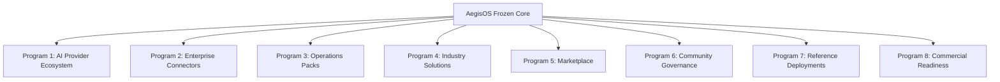

# AegisOS Platform Evolution Roadmap

## Vision
AegisOS is the definitive enterprise-grade, local-first Autonomic AI Workstation Operating System — enabling organizations to run AI inference, agent orchestration, and system administration with full data sovereignty, zero-trust cryptographic security, and automated self-healing.

---

## Version 1 Architecture Status

> [!IMPORTANT]
> **Architecture Baseline: FROZEN (Stable at Version 1.0 GA / GA 1.2)**
> 
> AegisOS has reached full architectural completion. In accordance with the AegisOS Engineering Constitution, all core runtime layers, state engines, kernels, registries, and control planes are frozen. No new foundational primitives will be added to the platform core. Future development is focused entirely on ecosystem enablement, enterprise connectors, deployment profiles, and integrations.

---

## Delivered Core Capabilities (Version 1.0 - 1.2)

### 1. Autonomic OS Foundation (v1.0.0)
- **7-Layer Stack Architecture**: Strict architectural separation from Hardware (Layer 0) to Executive Plane (Layer 6).
- **Stateful Saga Workflow Engine**: Database-backed execution graph runner (`WorkflowService.ts`) with step checkpoints and rollbacks.
- **Unified Event Bus**: Schema-driven event boundaries and background queues.
- **Local MCP Host Client**: Dynamic Model Context Protocol (`@modelcontextprotocol/sdk`) stdio integration.

### 2. Security Hardening & Observability (v1.1.0)
- **Worker Thread VM Sandboxing**: Memory and CPU capped Node `worker_threads` sandboxing (`ExtensionRuntimeService.ts`).
- **Zero-Trust Access Control**: HttpOnly JWT sessions, fine-grained RBAC, and rate-limiting gateway protection.
- **OpenTelemetry Pipeline**: Unified Prometheus, Grafana, Loki, and OpenTelemetry logging fabric.

### 3. Autonomic Control & Mobile C2 (v1.2.0)
- **Executive Control Plane (ECP)**: Safety firewalls for prompt/response sanitization and grounding scorecards.
- **System Digital Twin & Convergence Engine**: Canonical state graph (`GraphKernel`) auto-reconciling runtime state drift.
- **Mobile C2 Cockpit**: Flutter app supporting remote approvals, WebSocket telemetry, and ECDSA cryptographic command signing.

### 4. Enterprise Identity & Hybrid Cloud Spillover (v1.2.1)
- **SAML 2.0 Enterprise Single Sign-On**: Integrated `SamlProvider.ts` bridging Azure Entra ID / Okta with local RBAC.
- **VRAM-Aware Cloud Spillover**: `CloudSpilloverRouter.ts` offloading high-burst inference to Azure OpenAI when local VRAM is saturated.

---

## AegisOS v2 — Ecosystem & Adoption Programs [DELIVERED Baseline - v1.2.1]

All ecosystem programs operate strictly within the frozen Version 1 Architecture baseline.

### Program 1 — AI Provider Ecosystem
- **Local Runtimes**: Ollama (`localhost:11434`), LiteLLM Router (`localhost:4000`), vLLM, llama.cpp.
- **Hybrid Cloud Providers**: Azure OpenAI Service, Anthropic Claude, Google Gemini, OpenRouter.
- **Dynamic VRAM Router**: `CloudSpilloverRouter.ts` balancing local GPU compute with cloud endpoints.

### Program 2 — Enterprise Connectors
- **Code & CI/CD**: GitHub, GitLab, Azure DevOps.
- **Knowledge & Collaboration**: Microsoft 365 (SharePoint/OneDrive), Google Workspace, Confluence, Jira.
- **ITSM & Chatops**: ServiceNow, Slack, Microsoft Teams.

### Program 3 — Operations Packs
- **Security & Compliance**: Standardized compliance templates, encryption policies, and security baselines.
- **SRE Playbooks**: Disaster recovery scripts, backup policy schedules, and capacity alerts.

### Program 4 — Industry Solutions
- **Core Domains**: Software Engineering, Product Management, System Administration.
- **Regulated Domains**: Healthcare, Financial Services, Defense, Government.

### Program 5 — Marketplace
- **Trust & Verification**: Cryptographic package signing, developer certification workflows, and dependency resolvers.
- **Discovery**: Semantic search, compatibility checklists, and automated package update agents.

### Program 6 — Community Governance
- **Processes**: Structured RFC workflows, ADR templates, and maintainer handbooks.
- **Standards**: Contribution checklists, testing compliance matrices, and plugin certification rules.

### Program 7 — Reference Deployments
- **Individual**: Developer Edition (Workstation setup), Knowledge Worker Edition.
- **Distributed & Team**: Team Edition, Enterprise Edition, Multi-Node Kubernetes Profile.
- **Air-Gapped & Edge**: Air-Gapped Station Profile, Edge/IoT Profile.

### Program 8 — Commercial Readiness
- **Lifecycle Policies**: Long-Term Support (LTS) policies, SemVer enforcement, and upgrade guarantees.
- **Assurance**: Compatibility matrices, enterprise licensing templates, and release audit gates.

---

## Active & Upcoming Roadmap Horizons

### NOW Horizon (Current Engineering Focus)
1. **Real-Time Hardware Telemetry Event Bus**: ✅ Delivered — Piped Layer 0 CUDA telemetry directly into `CloudSpilloverRouter.ts` for predictive VRAM velocity spillover thresholds.
2. **SAML Group Claim Role Parsing**: ✅ Delivered — `GroupClaimRoleMapper.ts` operationalized for zero-touch RBAC mapping from Azure Entra ID / IdP group claims.
3. **Autonomic Self-Healing Daemon**: ✅ Delivered — Background runtime probe (`AutonomicSelfHealingDaemon.ts`) and REST control API (`/api/v1/system/autonomic-heal`).
4. **Legacy Code Cleanup**: Purging custom vector database (Raja RAG) remnants in favor of standard PgVector / MCP endpoints.

### NEXT Horizon (Upcoming Milestone)
1. **Conversa Multi-Agent Debate Topology**: Parallel consensus voting steps within `WorkflowService.ts` execution graphs.
2. **Enterprise M365 & Google Workspace MCP Pack**: Native MCP stdio tools for corporate cloud drives.

### LATER & FUTURE Horizon (Long Term)
1. **Marketplace Cryptographic Package Signing**: End-to-end package verification before extension loading.
2. **Autonomous Host Self-Refactoring Loops**: Verified, sandbox-tested local script refactoring loops.
