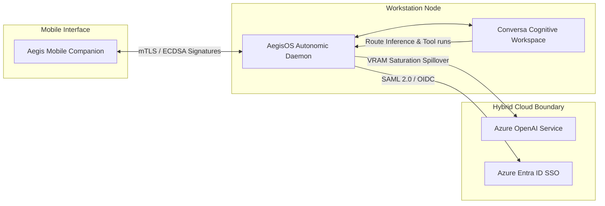

# AegisOS & Conversa Ecosystem State Reference

This document provides a high-level overview of the interconnected state of the AegisOS and Conversa ecosystem.

---

## 1. Ecosystem Overview

The ecosystem is designed to deliver a secure, local-first, autonomic workspace utilizing three integrated platforms:

* **[AegisOS](file:///d:/1_Projects/OpenClawOllamaLiteLLM_Transparency/docs/Platform_Handbook.md)**: The autonomic, 7-layered workstation operating system.
* **[Conversa](file:///d:/1_Projects/OpenClawOllamaLiteLLM_Transparency/conversa_repo/README.md)**: The enterprise cognitive meeting and living workspace platform running on top of AegisOS.
* **[Aegis Mobile Companion](file:///d:/1_Projects/OpenClawOllamaLiteLLM_Transparency/aegis_mobile/README.md)**: A biometrically-gated mobile dashboard paired over Tailscale, allowing operators to monitor workstation metrics and cryptographically authorize command approvals.

---

## 2. Integrated Architecture Plane Map

Both platforms align with a strict 7-layer architecture stack frozen under the [Engineering Constitution](file:///d:/1_Projects/OpenClawOllamaLiteLLM_Transparency/docs/ENGINEERING_CONSTITUTION.md). Here is the cross-cutting state:

| Layer | AegisOS Station Component | Conversa Workspace Component | Target Status |
| :--- | :--- | :--- | :--- |
| **Layer 6: Executive / Console** | Next.js SRE Console & [aegis_mobile](file:///d:/1_Projects/OpenClawOllamaLiteLLM_Transparency/aegis_mobile/) shell hooks | Spatial Next.js Shell, Command Surface, Mobile Workspace layout | 🟢 Implemented (GA 1.2 active) |
| **Layer 5: Control / Policy** | [PlatformOperationsControlPlane](file:///d:/1_Projects/OpenClawOllamaLiteLLM_Transparency/src/platform/control-plane/PlatformOperationsControlPlane.ts), [SelfHealingFramework](file:///d:/1_Projects/OpenClawOllamaLiteLLM_Transparency/src/platform/control-plane/SelfHealingFramework.ts), and [SamlProvider](file:///d:/1_Projects/OpenClawOllamaLiteLLM_Transparency/src/platform/auth/providers/SamlProvider.ts) | Capability-Aware Routers, speaker claim validators, consensus generators | 🟢 Implemented (GA 1.2 active) |
| **Layer 4: Orchestration** | [WorkflowService](file:///d:/1_Projects/OpenClawOllamaLiteLLM_Transparency/src/services/workflow.service.ts), Saga checkpoint queues, Command & Control (C2) signatures | Managed Meeting Agency Crew, Event blackboards, Hono/Convex API handlers | 🟢 Implemented (GA 1.2 active) |
| **Layer 3: Capability** | Model Context Protocol (MCP) Host, [ExtensionRuntimeService](file:///d:/1_Projects/OpenClawOllamaLiteLLM_Transparency/src/platform/extension/ExtensionRuntimeService.ts), [LocalCapabilityProvider](file:///d:/1_Projects/OpenClawOllamaLiteLLM_Transparency/src/platform/capability/providers/LocalCapabilityProvider.ts) | Linkup Web Grounding, Semantic Publisher, Format-specific serializers | 🟢 Implemented (Sandboxing active) |
| **Layer 2: Runtime** | [OllamaProvider](file:///d:/1_Projects/OpenClawOllamaLiteLLM_Transparency/src/infrastructure/providers/skeletons.ts), [LiteLLMProvider](file:///d:/1_Projects/OpenClawOllamaLiteLLM_Transparency/src/infrastructure/providers/skeletons.ts), and [CloudSpilloverRouter](file:///d:/1_Projects/OpenClawOllamaLiteLLM_Transparency/src/infrastructure/providers/cloud-spillover-router.ts) | Local LLM inference swappers, audio-to-text diarization pipelines | 🟢 Implemented (Direct fetch active) |
| **Layer 1: Infrastructure** | PostgreSQL/SQLite schemas via Prisma client, Tailscale mesh tunnels | Drift encrypted DB, SQLCipher, Convex local instances | 🟢 Implemented (Production active) |
| **Layer 0: Hardware** | CUDA compute engine, GPU VRAM monitoring telemetry | CUDA hardware, physical device key storages | 🟢 Implemented (Host tools active) |
