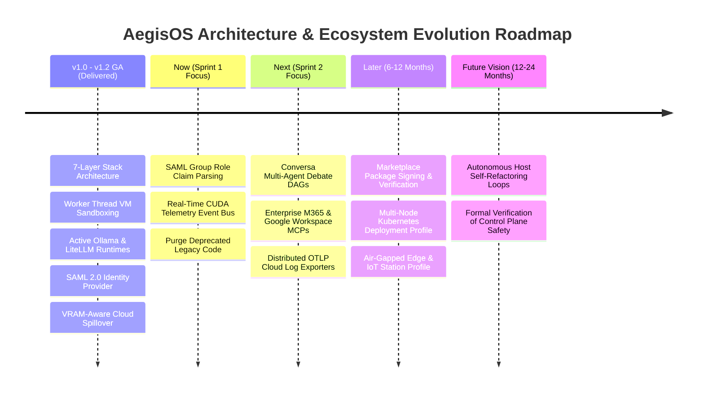

# AegisOS Engineering Knowledge Base (EKB)
## 06_ROADMAP.md — Living Product & Technical Roadmap Specification

---

### 1. Living Roadmap Baseline & Horizon Planning

---

### 2. Delivered Baseline Milestones (GA 1.0 - GA 1.2)

| Version | Milestone Focus | Primary Deliverables | Status |
| :--- | :--- | :--- | :---: |
| **v1.0.0** | Autonomic OS Foundation | 7-layer stack, Saga workflow engine (`WorkflowService.ts`), unified event bus, SQLite/Prisma schemas. | 🟢 Delivered |
| **v1.1.0** | Security & Observability Hardening | Node `worker_threads` VM sandbox (`ExtensionRuntimeService.ts`), OTel trace logging, rate-limiting, SOC2 controls. | 🟢 Delivered |
| **v1.2.0** | Mobile C2 Cockpit & Digital Twin | Aegis Mobile Flutter app, ECDSA cryptographic approval signing, System Digital Twin (`ConvergenceEngine.ts`). | 🟢 Delivered |
| **v1.2.1** | Enterprise Identity & Hybrid Cloud Spillover | SAML 2.0 enterprise identity (`SamlProvider.ts`), dynamic VRAM cloud spillover (`CloudSpilloverRouter.ts`). | 🟢 Delivered |

---

### 3. NOW Horizon (Immediate Engineering Sprint Focus)

#### Initiative N1: Real-Time Hardware Telemetry Event Bus Integration
* **Problem**: `CloudSpilloverRouter.ts` currently relies on static model size estimates, risking GPU memory saturation during concurrent agent bursts.
* **Customer Outcome**: Precision failover: host GPU runs up to 95% capacity; cloud spillover activates dynamically only when physical VRAM is exhausted.
* **Business Outcome**: Maximum return on local GPU hardware investment with zero system freezing.
* **Priority**: MUST HAVE
* **Dependencies**: Layer 0 CUDA telemetry event bus emitter (`src/platform/health/`).
* **Estimated Effort**: 2 Person-Weeks (Low) | **Confidence**: High (95%)
* **Risk**: Low (Isolated to router threshold evaluation).
* **Strategic Alignment**: Core Autonomic OS Governance & Resource Efficiency.
* **Success Metrics**: 0 CUDA Out-Of-Memory (OOM) crashes across 1,000 stress-test inference cycles.
* **Acceptance Criteria**: Router subscribes to real-time `nvidia-smi` event bus and dynamically updates failover decisions.

#### Initiative N2: SAML Group Claim Role Parsing & Zero-Touch RBAC
* **Problem**: Enterprise IT admins must manually assign local AegisOS RBAC permissions to users after their initial SAML login.
* **Customer Outcome**: Zero-touch user onboarding: Entra ID security groups (e.g. `Aegis-SRE-Admins`) automatically map to station roles upon login.
* **Business Outcome**: Reduced IT administrative overhead, effortless CISO compliance.
* **Priority**: SHOULD HAVE
* **Dependencies**: `SamlProvider.ts` (Delivered).
* **Estimated Effort**: 1.5 Person-Weeks (Low) | **Confidence**: High (90%)
* **Risk**: Low (Purely authentication claims mapping).
* **Strategic Alignment**: Enterprise Identity & Access Governance.
* **Success Metrics**: 100% automated role mapping for federated SAML logins.
* **Acceptance Criteria**: Group claims in SAML assertion XML are parsed and mapped to Prisma `Role` records.

---

### 4. NEXT Horizon (Upcoming Quarterly Milestone)

#### Initiative NX1: Conversa Multi-Agent Debate & Consensus Topology
* **Problem**: Single-agent linear execution graphs can produce unverified or biased outputs on complex multi-variable tasks.
* **Customer Outcome**: High-accuracy results: specialized agents (e.g., Coder + Security Auditor) debate and reach consensus before logging to the Saga.
* **Business Outcome**: Verifiable AI accuracy for high-stakes legal, financial, and architectural workflows.
* **Priority**: SHOULD HAVE
* **Dependencies**: `WorkflowService.ts`, Conversa Workspace Integration.
* **Estimated Effort**: 4 Person-Weeks (Medium) | **Confidence**: High (85%)
* **Risk**: Medium (Requires consensus scoring algorithms).
* **Strategic Alignment**: Multi-Agent Orchestration & Cognitive Trust.
* **Success Metrics**: >95% consensus agreement score on multi-agent validation runs.

#### Initiative NX2: Enterprise M365 & Google Workspace MCP Pack
* **Problem**: Knowledge workers must manually copy enterprise files into local station directories for agent processing.
* **Customer Outcome**: Direct access to enterprise documents in SharePoint, OneDrive, and Google Drive via standard MCP tools.
* **Business Outcome**: Accelerated user adoption across non-technical enterprise business units.
* **Priority**: SHOULD HAVE
* **Dependencies**: Dynamic MCP Host Client (`src/platform/mcp/`).
* **Estimated Effort**: 3 Person-Weeks (Medium) | **Confidence**: High (90%)
* **Risk**: Low (Standard `@modelcontextprotocol/sdk` stdio integration).
* **Strategic Alignment**: Ecosystem Program 2 — Enterprise Connectors.

---

### 5. LATER Horizon (Medium Term 6-12 Months)

#### Initiative L1: AegisOS Marketplace Cryptographic Signing & Trust Verification
* **Problem**: Unverified 3rd-party MCP tools and extension packs could introduce malicious code into enterprise workstations.
* **Customer Outcome**: Enterprise-grade extension safety: all Marketplace packages are cryptographically signed and verified before loading.
* **Business Outcome**: Unlocks commercial marketplace monetization without exposing enterprise customers to supply-chain attacks.
* **Priority**: SHOULD HAVE
* **Dependencies**: Extension VM Sandbox, ECDSA Signer.

#### Initiative L2: Multi-Node Kubernetes & Distributed Mesh Deployment Profile
* **Problem**: Single-workstation hardware limits massive parallel batch processing workloads.
* **Customer Outcome**: Horizontal scaling across local workstation clusters or private Kubernetes pods.
* **Business Outcome**: Entry into large enterprise data center compute environments.
* **Priority**: COULD HAVE
* **Dependencies**: Tailscale Mesh Interop, Helm charts.

---

### 6. FUTURE VISION Horizon (Long Term 12-24 Months)

* **Autonomous Host Self-Refactoring Loops**: Agents perform verified, sandbox-tested refactoring of local automation scripts with automated rollback on test failure.
* **Formal Verification of Control Plane Safety**: Mathematical proofs verifying that no execution path in Layer 5 can bypass Layer 5 policy firewalls.

---

### 7. Retirement & Consolidation Ledger

| Entity to Retire / Simplify | Replacement Entity | Expected Outcome & Timeline |
| :--- | :--- | :--- |
| **Custom Vector Database (Raja RAG)** | Standard PgVector / MCP Search | Complete removal of custom vector indexing code to reduce TCO. (Sprint 1) |
| **Legacy Mock LLM Skeletons** | Active Provider Clients | Purging mock fallback code in `skeletons.ts`. (Sprint 1) |
| **Static Spillover Threshold Rules** | Real-Time Hardware Telemetry Event Bus | Retiring static size check in `CloudSpilloverRouter.ts`. (Sprint 1) |
