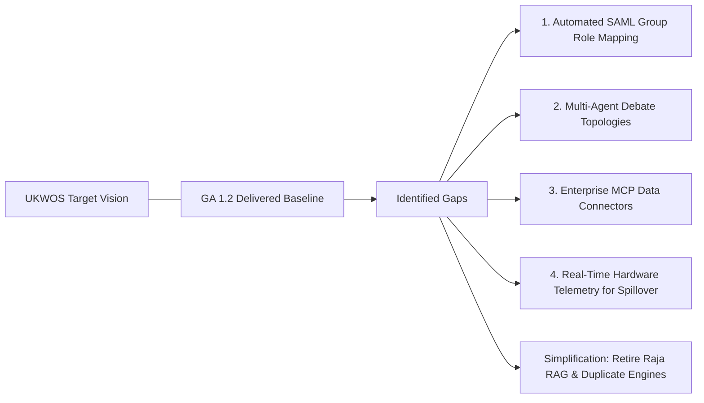

# AegisOS Engineering Knowledge Base (EKB)
## 15_STRATEGIC_GAP_ANALYSIS.md — Strategic Gap Analysis Specification

---

### 1. Purpose & Scope
This strategic gap analysis compares AegisOS's current **GA 1.2 baseline** against the long-term vision of the **Universal Knowledge Work Operating System (UKWOS)**. It evaluates functional gaps across Identity, Multi-Agent Orchestration, Data Integration, Hardware Telemetry, and Operational Governance, highlighting over-engineered components that must be simplified or retired.

---

### 2. Comprehensive Strategic Gap Matrix

| Domain | Current GA 1.2 State | Desired Future State (UKWOS Vision) | Identified Gap | Severity / Risk | Strategic Action |
| :--- | :--- | :--- | :--- | :---: | :--- |
| **Enterprise Identity** | Baseline SAML 2.0 active via `SamlProvider.ts`. | Automatic SAML Group claim to local sqlite RBAC mapping & SCIM user de-provisioning. | Lacks automated group-to-role assignment; manual RBAC mapping required. | Medium Business Risk | Implement automated SAML group claim role parser in `SamlProvider.ts`. |
| **Multi-Agent Orchestration** | Rigid DAG execution via stateful `WorkflowService.ts`. | Dynamic multi-agent "Debate" and consensus topologies before Saga logging. | Lack of parallel consensus/debate loops; single-agent linear steps only. | High Product Risk | Upgrade `WorkflowService` to support consensus debate steps (Program 4). |
| **Enterprise Data Integration** | Local file system and basic git MCP stdio tools. | Native MCP connectors for M365 (SharePoint/OneDrive) and Google Workspace. | End users must manually copy corporate files into local station directories. | High Adoption Risk | Deploy Enterprise Connectors Pack (Program 2). |
| **Hardware Telemetry for Spillover** | `CloudSpilloverRouter.ts` active; uses static model size estimation. | Real-time `nvidia-smi` event bus polling for exact free VRAM failover thresholds. | Static thresholds can cause premature spillover or unexpected OOM crashes. | Medium Technical Risk | Wire Layer 0 hardware telemetry event bus directly into spillover router. |
| **Vector Search & RAG Architecture** | Custom vector indexing attempt (Raja RAG) alongside standard SQLite/PgVector. | Standardized PgVector / SQLite vector search & standard MCP search endpoints. | Bespoke vector database (Raja RAG) creates unnecessary maintenance bloat. | High Maintenance Debt | **SIMPLIFY**: Deprecate custom vector database; rely strictly on PgVector / MCP. |

---

### 3. Risk & Opportunity Assessment

#### 3.1 Technical Risks
* **VRAM Telemetry Lag**: If local hardware telemetry updates are delayed, bursty multi-agent executions might trigger local CUDA Out-Of-Memory (OOM) faults before cloud spillover activates.
* **Deprecation Residuals**: Unused legacy code artifacts (such as older workflow abstractions) must be strictly purged to prevent developer confusion.

#### 3.2 Strategic & Business Opportunities
1. **Air-Gapped Sovereign Enterprise Deployments**: Capitalize on rising enterprise demand for local-first AI solutions in defense, healthcare, and finance where public cloud LLM usage is prohibited.
2. **Standardized Ecosystem Extensions**: Expand the AegisOS Marketplace (Program 5) by publishing verified MCP tool packs, allowing 3rd-party developers to monetize enterprise agent tools without altering the frozen core kernel.

---

### 4. Over-Engineered & Redundant Capabilities (Simplification Targets)

1. **Custom Vector Database Engine (Raja RAG)**:
   * *Analysis*: Reinventing vector indexers in TypeScript adds maintenance overhead without delivering strategic differentiation.
   * *Recommendation*: Retire custom vector indexing logic. Use standard PgVector, SQLite vector extensions, or standard MCP search services.
2. **Legacy Duplicate Workflow Runtimes (`WorkflowRuntime.ts`)**:
   * *Analysis*: Duplicate runtime engine created architectural ambiguity.
   * *Recommendation*: Fully deleted in GA 1.0; enforce strict architectural linters to block any future un-sandboxed workflow runtimes outside `WorkflowService.ts`.
