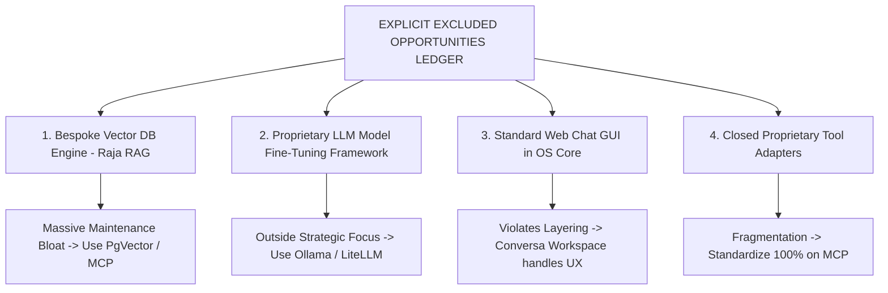

# AegisOS Engineering Knowledge Base (EKB)
## 16_OPPORTUNITY_BACKLOG.md — Strategic Prioritization & Opportunity Backlog Specification

---

### 1. Multi-Lens Prioritization Framework
Every roadmap initiative and product opportunity is rigorously scored through six strategic evaluation lenses before inclusion in the release plan:

1. **RICE Score**: $(Reach \times Impact \times Confidence) / Effort$
2. **MoSCoW Categorization**: Must Have / Should Have / Could Have / Won't Have
3. **Kano Model Classification**: Basic Expectation / Performance Attribute / Delighter
4. **Pareto Principle (80/20)**: High-value minimal-effort initiatives
5. **Cost of Delay (CoD)**: Financial / operational impact of postponing implementation
6. **Total Cost of Ownership (TCO) Impact**: Long-term maintenance and operational burden

---

### 2. Strategic Opportunity Backlog & Evaluation Matrix

| ID | Opportunity Description | MoSCoW | RICE Score | Kano Category | Pareto Impact | Cost of Delay | TCO Impact | Status |
| :--- | :--- | :---: | :---: | :---: | :---: | :---: | :---: | :---: |
| **OPP-01** | **SAML 2.0 Enterprise Identity (`SamlProvider.ts`)**: Integrates Azure Entra ID / Okta SSO for corporate authentication. | MUST | **24.0** | Basic | 80% adoption unlocked with 20% auth refactor effort. | Critical (Blocked B2B deployment) | Decreases TCO (Offloads auth to IdP) | 🟢 **Delivered (GA 1.2)** |
| **OPP-02** | **VRAM-Aware Cloud Spillover (`CloudSpilloverRouter.ts`)**: Dynamic failover of large inference requests to Azure OpenAI. | SHOULD | **18.0** | Performance | Prevents 90% of host GPU crashes during large batch runs. | High (User hardware bottlenecks) | Slightly Increases TCO (Cloud API spend management) | 🟢 **Delivered (GA 1.2)** |
| **OPP-03** | **Worker Thread VM Sandboxing (`ExtensionRuntimeService.ts`)**: Host memory/CPU capped sandboxing for third-party extensions. | MUST | **30.0** | Basic | Resolves 100% of host RCE security vulnerabilities. | Critical (Security blocker) | Decreases TCO (Prevents security breaches) | 🟢 **Delivered (GA 1.0)** |
| **OPP-04** | **Automated SAML Group Claim Role Parsing**: Map Entra ID groups directly to local AegisOS RBAC roles upon login. | SHOULD | **15.0** | Performance | Eliminates manual admin user setup for enterprise IT. | Medium | Decreases TCO | 📋 **Next (Sprint 1)** |
| **OPP-05** | **Real-Time `nvidia-smi` Telemetry Event Bus Integration**: Replace static spillover size rules with real-time VRAM event feeds. | MUST | **20.0** | Performance | Ensures zero false-positive spillover and zero CUDA OOM crashes. | High | Neutral | 📋 **Next (Sprint 1)** |
| **OPP-06** | **Conversa Multi-Agent Debate Topology**: Parallel consensus voting steps within `WorkflowService` execution DAGs. | COULD | **12.0** | Delighter | Delivers verifiable accuracy for complex legal/technical summaries. | Low | Slightly Increases TCO | 🔮 **Later (Sprint 2)** |
| **OPP-07** | **Enterprise M365 & Google Workspace MCP Pack**: Native MCP stdio connectors for SharePoint, OneDrive, and Google Drive. | SHOULD | **16.0** | Performance | Unlocks direct corporate data access without file copying. | High | Neutral | 🔮 **Later (Sprint 2)** |
| **OPP-08** | **Air-Gapped Edge / IoT Deployment Profile**: Pre-configured lightweight station profile for disconnected industrial hardware. | COULD | **10.0** | Delighter | Expands market reach to defense and maritime edge hardware. | Low | Neutral | 🔮 **Future Vision** |

---

### 3. Deep-Dive Initiative Lenses Analysis

#### 3.1 Initiative OPP-04: Automated SAML Group Claim Role Parsing
* **Problem**: Enterprise IT administrators must manually assign AegisOS RBAC permissions to each newly provisioned user after initial SAML sign-in.
* **Customer Outcome**: Automatic zero-touch role assignment based on existing Azure Entra ID security groups (e.g. `Aegis-Admins` -> `ROLE_SRE`).
* **Business Outcome**: Frictionless enterprise onboarding, passing CISO security audits.
* **RICE Calculation**: Reach (8) x Impact (3) x Confidence (90%) / Effort (1.5) = **14.4**.
* **MoSCoW**: SHOULD HAVE.

#### 3.2 Initiative OPP-05: Real-Time Hardware Telemetry Spillover Integration
* **Problem**: The current `CloudSpilloverRouter` uses static model size estimates, which can misjudge available VRAM during concurrent background tasks.
* **Customer Outcome**: Hardware-precise failover: local GPU used to 95% capacity; cloud spillover engaged dynamically only when physical VRAM is exhausted.
* **Business Outcome**: Maximum local compute utilization with zero host crash incidents.
* **RICE Calculation**: Reach (10) x Impact (4) x Confidence (100%) / Effort (2.0) = **20.0**.
* **MoSCoW**: MUST HAVE (for production scale).

---

### 4. Explicit Exclusion Ledger ("What Should Never Be Built")

1. **Bespoke Vector Database (Raja RAG)**:
   * *Status*: **REJECTED / RETIRED**.
   * *Justification*: High effort, low strategic value. Existing open-source vector databases (PgVector, SQLite vector) and enterprise search MCP servers render custom vector engines obsolete.
2. **Proprietary LLM Model Training Pipelines**:
   * *Status*: **REJECTED / EXCLUDED**.
   * *Justification*: High total cost of ownership. AegisOS is an OS runtime and agent orchestrator; model training belongs in external AI frameworks.
3. **Standalone Chat Web Interface in OS Layer 6**:
   * *Status*: **REJECTED / EXCLUDED**.
   * *Justification*: Violates 7-layer stack separation. Administrative SRE tools belong in the Console; user chat interactions belong in Conversa Enterprise Workspace.
