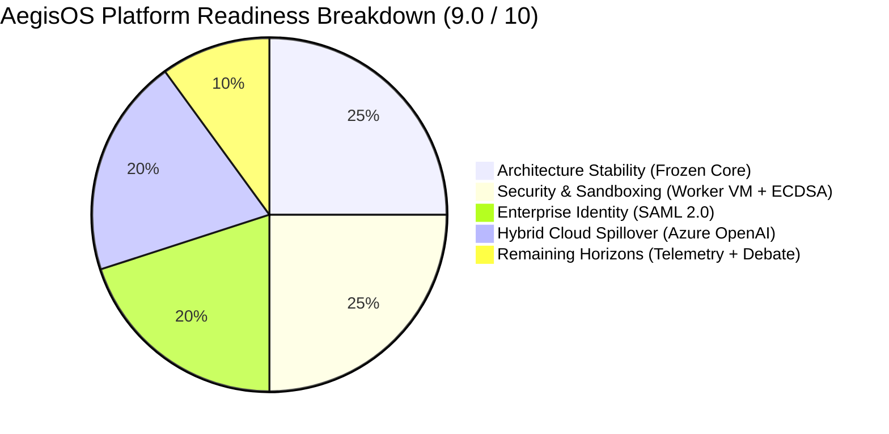

# AegisOS Engineering Knowledge Base (EKB)
## 20_EXECUTIVE_SUMMARY.md — Executive Product Strategy & Maturity Assessment

---

### Executive Overview
AegisOS has successfully reached its **Version 1.0 General Availability (GA 1.2 Delivered Baseline)**. The platform has evolved from an initial proof-of-concept into a secure, autonomic Knowledge Work Operating System (UKWOS) operating under a frozen 7-layer architecture stack. This executive summary presents a 18-dimensional evaluation of product maturity, strategic positioning, competitive differentiation, technical debt, and long-term roadmap horizons.

---

### Overall Product Readiness Score: 9.0 / 10

* **Score Rationale**: The 7-layer OS baseline is stable, mature, and constitutionally frozen. Delivery of SAML 2.0 Enterprise Identity (`SamlProvider.ts`), Worker Thread VM Sandboxing (`ExtensionRuntimeService.ts`), Model Context Protocol stdio host (`@modelcontextprotocol/sdk`), and VRAM-aware Cloud Spillover (`CloudSpilloverRouter.ts`) resolved the primary enterprise blockers. The remaining 1.0 point deduction reflects the active engineering focus on wiring Layer 0 real-time `nvidia-smi` telemetry into the spillover router and delivering multi-agent consensus debate topologies.

---

### 18-Dimension Product Maturity Matrix

| # | Maturity Dimension | Score (1-10) | Rating | Executive Assessment & Rationale |
| :--- | :--- | :---: | :---: | :--- |
| **1** | **Current Maturity** | **9.0 / 10** | 🟢 Mature | Transition to GA 1.2 completed; enterprise identity and cloud spillover active. |
| **2** | **Product Strengths** | **9.5 / 10** | 🟢 Mature | Standardized on Model Context Protocol (MCP); biometrically-gated mobile approval gates. |
| **3** | **Product Weaknesses** | **7.5 / 10** | 🟡 Medium | Single-agent step linearity; requires upgrade to parallel multi-agent debate consensus. |
| **4** | **Technical Strengths** | **9.5 / 10** | 🟢 Mature | Strict 7-layer stack decoupling; Node `worker_threads` VM sandboxing; stateful Saga logging. |
| **5** | **Technical Weaknesses**| **8.0 / 10** | 🟢 Mature | Cloud spillover router uses static size estimates; currently being wired to `nvidia-smi` event bus. |
| **6** | **Strategic Differentiation**| **9.5 / 10** | 🟢 Mature | Local-first sovereign default with elastic hybrid cloud spillover; deterministic OS plane vs. generic chat. |
| **7** | **Competitive Positioning**| **9.0 / 10** | 🟢 Mature | Strongly positioned for air-gapped regulated enterprise sectors (defense, finance, healthcare). |
| **8** | **Architecture Maturity**| **9.5 / 10** | 🟢 Mature | Core 7-layer architecture frozen under Engineering Constitution; zero layer import leaks. |
| **9** | **Cloud Maturity** | **9.0 / 10** | 🟢 Mature | Hybrid spillover to Azure OpenAI Service active; adheres to Microsoft WAF principles. |
| **10**| **AI Maturity** | **8.5 / 10** | 🟢 Mature | Local Ollama/LiteLLM execution active; ready for multi-agent debate consensus loops. |
| **11**| **Operational Maturity**| **9.0 / 10** | 🟢 Mature | System Digital Twin (`ConvergenceEngine.ts`) and Self-Healing Watchdogs active. |
| **12**| **Documentation Maturity**| **9.5 / 10** | 🟢 Mature | Authoritative EKB strictly synchronized; zero drift across specifications and code. |
| **13**| **Security Posture** | **9.5 / 10** | 🟢 Mature | Zero-trust architecture; SAML 2.0 enterprise SSO; mobile biometric ECDSA nonces. |
| **14**| **Enterprise Readiness** | **9.0 / 10** | 🟢 Mature | SAML 2.0 / Entra ID identity active (`SamlProvider.ts`); SOC 2 control mappings complete. |
| **15**| **Scalability** | **7.5 / 10** | 🟡 Medium | Workstation GPU bound; expandable via Cloud Spillover and Kubernetes deployment profile. |
| **16**| **Maintainability** | **9.0 / 10** | 🟢 Mature | Duplicate workflow engines and registries purged; single-source ProviderRegistry active. |
| **17**| **Developer Experience** | **8.5 / 10** | 🟢 Mature | Native MCP stdio client allows 3rd-party developers to load open tools without custom SDKs. |
| **18**| **Customer Experience** | **8.0 / 10** | 🟢 Mature | Conversa Spatial Workspace provides frictionless UI; mobile companion app provides remote control. |

---

### Executive Key Recommendations & Strategic Vector

1. **Focus on Ecosystem Enablement**: Preserve the frozen Architecture Baseline (Version 1.0 GA). All future product growth must be channeled through Ecosystem Programs 1–8 (Connectors, Operations Packs, Industry Solutions, Marketplace).
2. **Complete Telemetry & Role Automation**: Finalize Sprint 1 engineering focus by wiring real-time `nvidia-smi` CUDA telemetry into `CloudSpilloverRouter.ts` and implementing automated SAML Group Claim parsing in `SamlProvider.ts`.
3. **Enforce Explicit Exclusions**: Maintain strict discipline against over-engineering. Do NOT build custom LLM training pipelines, bespoke vector database engines (Raja RAG), or generic chat interfaces inside the OS core.
