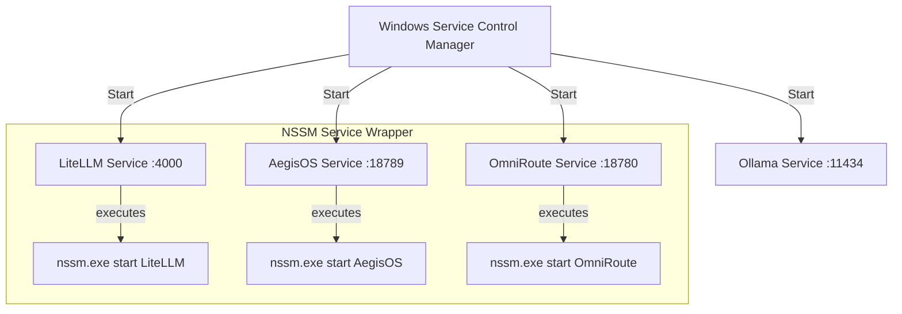
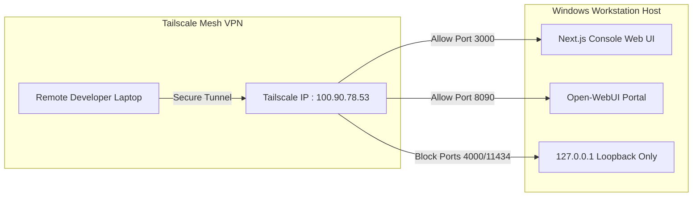

# Administrator Guide

This guide documents host requirements, system installation profiles, DPAPI-secured credential storage, Windows Service configurations, and Tailscale mesh network architecture.

---

## 1. System Requirements & Host Configuration

The AI Workstation platform requires high-performance hardware to run local inference models and contextual agents concurrently.

| Parameter | Minimum Requirement | Recommended Specification |
| :--- | :--- | :--- |
| **Processor** | Intel Core i7 / AMD Ryzen 7 (8 Cores) | Intel Core i9 / AMD Ryzen 9 9950X3D (16+ Cores) |
| **Memory** | 32 GB DDR5 RAM | 64 GB - 128 GB DDR5 RAM |
| **GPU Accelerator** | NVIDIA RTX 4070 (12 GB VRAM) | NVIDIA RTX 5080 (16 GB GDDR7 VRAM) or RTX 4090 (24 GB) |
| **CUDA Runtime** | CUDA Toolkit 12.1+ | CUDA Toolkit 12.6+ / 13+ |
| **Storage** | 1 TB NVMe SSD (PCIe Gen 4) | 2+ TB NVMe SSD (PCIe Gen 5, Read Speed > 7000 MB/s) |
| **Operating System** | Windows 11 Pro / Enterprise | Windows 11 Enterprise (Build 22H2+) |

---

## 2. Deployment Profiles

The platform supports four deployment profiles selectable during the interactive bootstrap sequence (`Bootstrap.ps1`):

1.  **`development`**: Configures local stubs and mocks for external APIs. Synchronizes small inference models (e.g., Qwen 1.5B/3B, Llama-3-8B). Installs to drive `C:` by default.
2.  **`personal`**: Standard configuration with direct integrations for OpenAI/LiteLLM. Fetches general coding models and registers SQLite metadata stores.
3.  **`enterprise`**: Full enterprise configuration. Configures direct LAN ingress access, deploys heavy reasoning models (e.g., Codestral, Llama-3-70B), registers PostgreSQL database backends, and enables Tailscale security bindings.
4.  **`offline`**: Air-gapped installation mode. Skips remote model synchronization and package registry checks, relying entirely on pre-downloaded local GGUF models.

---

## 3. Secure Configuration & DPAPI

To protect sensitive keys (such as `GITHUB_TOKEN` and `TELEGRAM_BOT_TOKEN`), the platform prohibits clear-text secrets in configuration files.

### DPAPI Credentials Encryption Workflow

When secrets are entered during bootstrapping, the platform utilizes the Windows Data Protection API (DPAPI) with a `LocalMachine` machine-scope key to encrypt them.

```mermaid
flowchart TD
    A[User enters raw token] --> B{Profile selected?}
    B -->|development / personal| C[Store clear-text environment variable]
    B -->|enterprise| D[Call Protect-PlatformSecret cmdlet]
    D --> E[Windows DPAPI encrypts with Machine-Scope key]
    E --> F[Write encrypted payload to AegisOS_secrets.enc]
    F --> G[Secrets stored securely at rest]
end
```

### Decryption and Recovery
- **Local Decryption:** Processes run by local system accounts query DPAPI to decrypt variables dynamically at startup.
- **Host Migration:** Since DPAPI uses the host's physical key, migrating `AegisOS_secrets.enc` to another machine will break decryption. In this case, the `Restore.ps1` script will detect the failure, prompt for re-entry, and encrypt the keys using the new host's physical key.

---

## 4. Windows Service Registration (SCM)

All server gateways are registered as background Windows Services using the Non-Sucking Service Manager (NSSM) wrapper to ensure automated boot execution and self-healing.



### Service Directory Configurations

Services are registered with the following parameters under SCM:

*   **Ollama Service**:
    *   **Startup Type**: Automatic
    *   **Account**: `LocalSystem`
    *   **Environment**: `OLLAMA_HOST=0.0.0.0`, `OLLAMA_MODELS=$PlatformRoot\models`
*   **LiteLLM Service**:
    *   **Exec Path**: `$PlatformRoot\apps\litellm\litellm.exe`
    *   **Parameters**: `--config $PlatformRoot\configs\litellm_config.yaml --port 4000`
*   **AegisOS Service**:
    *   **Exec Path**: `node.exe`
    *   **Parameters**: `$PlatformRoot\apps\aegisos\dist\index.js --port 18789`
*   **OmniRoute Service**:
    *   **Exec Path**: `node.exe`
    *   **Parameters**: `$PlatformRoot\apps\omniroute\dist\index.js --port 18780`

### SCM Registry Parameters
All service settings are mapped to the Registry under:
`HKLM\SYSTEM\CurrentControlSet\Services\<ServiceName>\Parameters`

---

## 5. Tailscale Mesh VPN Integration

To support secure remote access, the platform binds Web Consoles and API endpoints to Tailscale mesh interfaces instead of public-facing network interfaces.



### Tailscale Access Control Policies (ACLs)

To secure the workstation, configure the following ACL rules in the Tailscale admin console:

```json
{
  "groups": {
    "group:ai-developers": ["rjkumar@gmail.com"]
  },
  "hosts": {
    "workstation-host": "100.90.78.53"
  },
  "acls": [
    {
      "action": "accept",
      "src": ["group:ai-developers"],
      "dst": ["workstation-host:3000", "workstation-host:8090"]
    },
    {
      "action": "accept",
      "src": ["workstation-host"],
      "dst": ["*:*"]
    }
  ]
}
```

This configuration ensures:
1.  **Console UI Access (Port 3000)** is restricted to authenticated developers.
2.  **Open-WebUI (Port 8090)** is accessible for prompt executions.
3.  **Core Gateway loopbacks (Port 4000, 11434, 18789)** remain completely isolated from network interfaces, preventing external connections from bypassing security.
