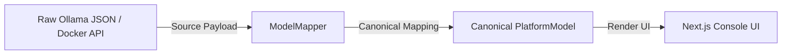
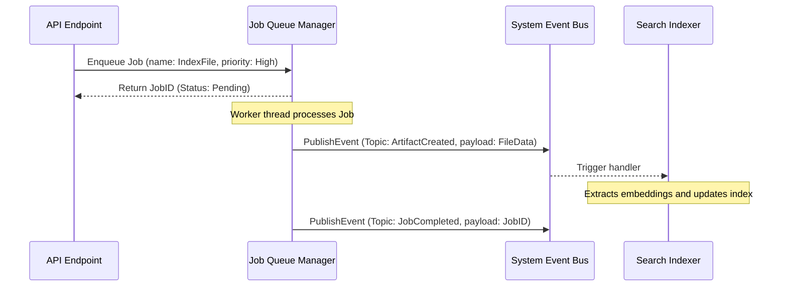

# Architecture Handbook

This document serves as the authoritative architectural blueprint for the AI Workstation platform.

## 1. System Topology

The workstation is deployed as a local-first, privacy-preserving AI runtime. The following diagram illustrates the structural flow from client interactions to hardware execution kernels:

```mermaid
graph TD
    Client[Open-WebUI Client / Antigravity IDE] -->|HTTP REST / WebSocket| OpenClaw[OpenClaw AI Gateway :18789]
    OpenClaw -->|Prompt Proxy| LiteLLM[LiteLLM Routing Proxy :4000]
    LiteLLM -->|Least-Busy Balance| Ollama[Ollama Inference Engine :11434]
    Ollama -->|CUDA Kernels| GPU[NVIDIA RTX 5080 GPU 16GB GDDR7]
    OpenClaw <───> MCP[7 Local MCP Context Servers]
    
    subgraph Context Layer [MCP Context Servers]
        MCP --> FS[filesystem]
        MCP --> GIT[git]
        MCP --> GH[github]
        MCP --> SQL[sqlite]
        MCP --> FETCH[fetch]
        MCP --> PUP[puppeteer]
        MCP --> RAG[raja-knowledge-repository]
    end
```

### Network Boundaries and Access Control
1. **Loopback Only**: OpenClaw, LiteLLM, and OmniRoute gateways bind exclusively to `127.0.0.1` to prevent unauthorized local LAN ingress.
2. **Local Area Exposure**: Ollama binds to `0.0.0.0` allowing local auxiliary laptops to share GPU inference passes.
3. **VPN Integration**: Tailscale Mesh VPN enables secure remote logins and administrative console views.

---

## 2. Infrastructure Adapter Framework

The system utilizes an Adapter Framework under `src/infrastructure/` that decouples client-facing API components from vendor-specific CLI or API libraries:



### Key Interfaces
- **`IModelProviderAdapter`**: Manages querying and pulling models.
- **`IArtifactProvider`**: Extracts metadata and content from registered files.
- **`IStorageProvider`**: Decouples binary reads and writes (supports `file://` and cloud `gcs://` providers).

---

## 3. Background Job Queue & Event Bus

For intensive processes (like bulk file indexing or model ingestion), tasks are executed asynchronously:



---

## 4. Storage Partitioning

All workstation assets resolve relative to a parameterized base folder `$PlatformRoot` (e.g., `D:\AIPlatform`):

| Path | Purpose | Portability Strategy |
|---|---|---|
| `/apps/` | Engine binaries (ollama, pgbouncer, redis) | Standardized relative offsets |
| `/configs/` | XML/YAML configs (litellm, openclaw) | Generated dynamically by Configure.ps1 |
| `/databases/` | pgsql, sqlite, mongodb storage | Relative container volume mapping |
| `/secrets/` | DPAPI encrypted system credentials | Dynamic re-prompting on machine shift |
| `/logs/` | Rotated stdout/stderr logs | Parameterized output targets |
| `/models/` | GGUF model weights | Pointed to by `OLLAMA_MODELS` env variable |
