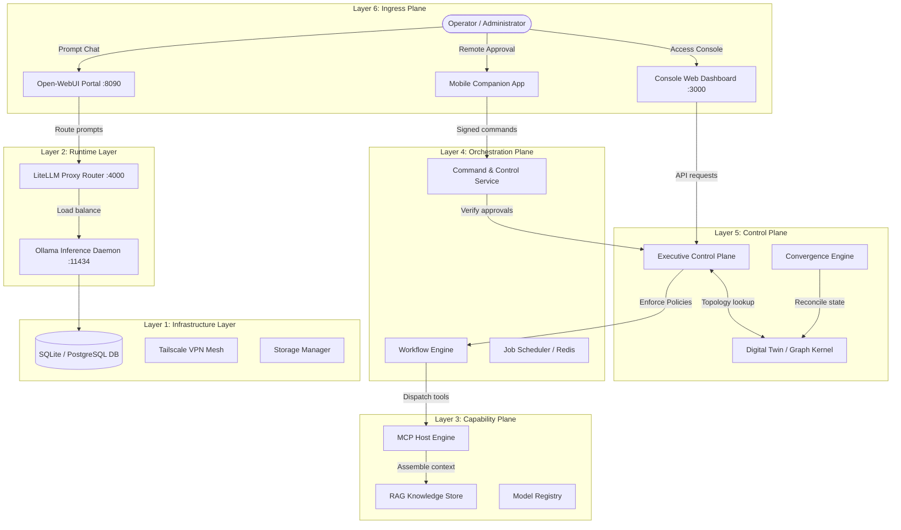
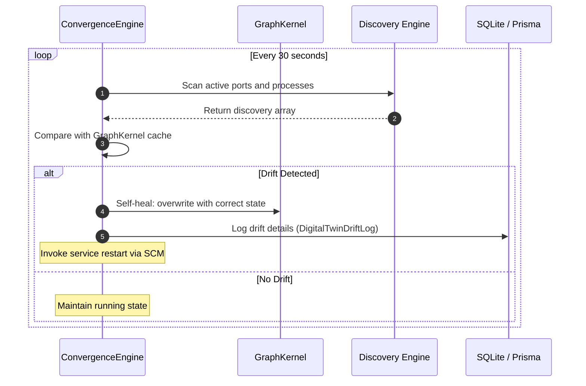
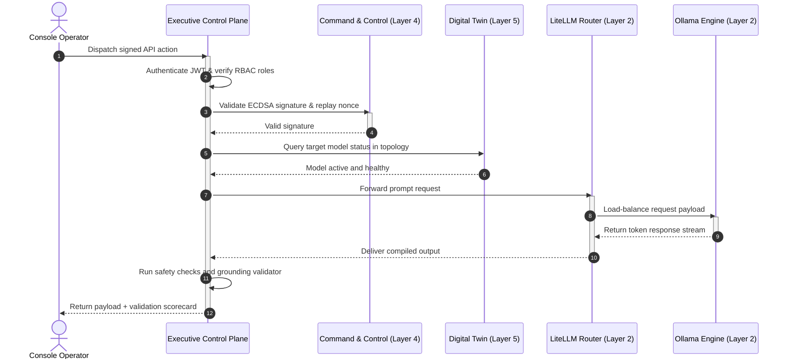

# Architecture Handbook

| Metadata | Value |
|---|---|
| **Document ID** | AH-2026-001 |
| **Version** | 1.2.0 (Active) |
| **Last Synced** | 2026-07-20 05:40:00 |
| **Classification** | Public — Enterprise & Platform Architecture |
| **Authority** | Platform Governance Board |

This handbook serves as the canonical architectural blueprint for the AegisOS Autonomic AI Workstation Operating System. It outlines the system topology, layered plane decompositions, data flows, and verification architectures.

---

## 1. Global System Topology

AegisOS operates as a secure, local-first workstation ecosystem where data sovereignty is guaranteed by executing model inference, context generation, and state auditing on localhost loopback interfaces.

---

## 2. Hierarchical 7-Layer Stack Decomposition

AegisOS implements a strict hierarchical 7-layered model (defined in [ADR-009](file:///d:/1_Projects/OpenClawOllamaLiteLLM_Transparency/adr/ADR-009-Autonomic-Operating-System-Architecture.md)) where higher planes consume lower plane interfaces, and lower planes are barred from importing or depending on higher planes.

### Layer 6: Executive Plane
Coordinates client interfaces, user ingress routes, and administrative controls.
- **Console Web App (Next.js)**: Administrative dashboard for monitoring, configuration overrides, and logs.
- **Mobile Companion App (Flutter)**: Remote C2 monitoring and Human-in-the-Loop (HITL) signing keys.
- **Open-WebUI**: Stateless conversational interface for model prompt execution.

### Layer 5: Control Plane
Enforces policy registries, security rules, and real-time validation guardrails.
- **Executive Control Plane (ECP)**: Stateless interceptors checking ingress prompts and responses against safety firewalls.
- **Digital Twin (Graph Kernel)**: Canonical state graph (`GraphKernel`) representing the virtualized workstation layout.
- **Convergence Engine**: Background loop that detects drift and synchronizes discovery logs.

### Layer 4: Orchestration Plane
Manages stateful execution processes, workflows, and task schedules.
- **Workflow Engine**: Executes YAML-defined multi-agent pipelines with ACID saga checkpoints.
- **Command & Control (C2) Service**: Validates remote cryptographic signatures and executes rollback procedures.
- **Background Jobs**: Priority queue worker threads (Redis-backed) handling data-intensive tasks.

### Layer 3: Capability Plane
Registers capabilities, tools, and local context providers.
- **Model Context Protocol (MCP) Host**: Sandboxed JSON-RPC broker dispatching files, git operations, and browser tasks.
- **Raja Knowledge Repository**: RAG query engine indexing codebase maps and local documentation.
- **Capability Registry**: Auto-discovered capability descriptors.

### Layer 2: Runtime Layer
Manages containerized and native service processes.
- **LiteLLM Routing Proxy**: Load balancer and failover router.
- **Ollama Engine**: Weight manager scheduling models on the GPU.
- **Redis Cache**: Caching layer for session state and jobs.

### Layer 1: Infrastructure Layer
Handles filesystem access, network mesh routing, and persistence.
- **Relational Databases**: Relational storage (SQLite/PostgreSQL) via Prisma.
- **Tailscale Mesh VPN**: Cryptographically secure developer ingress.
- **NSSM Wrappers**: Windows service managers enforcing automated process restarts.

### Layer 0: Hardware Layer
Exposes physical GPU resources and CUDA compute kernels.
- **CUDA Toolkit**: Directs high-performance matrix multiplications to hardware cores.
- **GPU VRAM Allocator**: Monitors allocation thresholds.

---

## 3. Core Architectural Subsystems

### 3.1 Executive Control Plane (ECP)
The ECP ([PlatformOperationsControlPlane.ts](file:///d:/1_Projects/OpenClawOllamaLiteLLM_Transparency/src/platform/control-plane/PlatformOperationsControlPlane.ts)) enforces system-wide policies:
1. **Prompt Sanitization**: Redacts PII variables and blocks prompt injections.
2. **Rate Limiting**: Throttles incoming requests based on user token registries.
3. **Grounding Verification**: Ensures model outputs conform to reference context rules, scoring accuracy.
4. **Validation Scorecard**: Generates an execution quality report for every transaction.

### 3.2 Digital Twin & Convergence Engine
The Digital Twin subsystem maintains an in-memory graph matching active services:
- **GraphKernel ([GraphKernel.ts](file:///d:/1_Projects/OpenClawOllamaLiteLLM_Transparency/src/platform/control-plane/digital-twin/core/GraphKernel.ts))**: The underlying topology graph of nodes (resources, processes, capabilities) and edges (dependencies, relationships).
- **ConvergenceEngine ([ConvergenceEngine.ts](file:///d:/1_Projects/OpenClawOllamaLiteLLM_Transparency/src/platform/control-plane/digital-twin/synchronization/ConvergenceEngine.ts))**: Subscribes to events, periodically polls discovery engines, and synchronizes state.
- **Self-Healing Framework**: If the Convergence Engine detects that a service is offline (drift), it invokes NSSM restart handlers.
- **Drift Logging**: Logs mismatches in `DigitalTwinDriftLog` read models.

### 3.3 Autonomic Platform Qualification Framework (PQF)
The PQF ([orchestrator.ts](file:///d:/1_Projects/OpenClawOllamaLiteLLM_Transparency/src/platform/qualification/orchestrator/orchestrator.ts)) qualifies release candidates:
- **Validation Orchestrators**: Run automated benchmarks, chaos tests, scalability checks, and long-duration stability tests.
- **Evidence Graph ([evidence-graph.ts](file:///d:/1_Projects/OpenClawOllamaLiteLLM_Transparency/src/platform/certification/evidence-graph.ts))**: Content-addressed nodes linked by SHA-256 parent hashes, forming a Merkle-like integrity tree.
- **PMI Engine ([pmi-engine.ts](file:///d:/1_Projects/OpenClawOllamaLiteLLM_Transparency/src/platform/qualification/maturity/pmi-engine.ts))**: Calculates the Platform Maturity Index across 11 domains (architecture, security, extensibility, performance, etc.).
- **Release Manifest Signing**: The `ReleaseSigner` signs the release manifest with an HMAC-SHA256 signature, linking to the Merkle root hash of the evidence graph.

---

## 4. Operational Data Flow (Inference Lifecycle)

The sequence diagram below tracks the lifecycle of an administrative API transaction:

