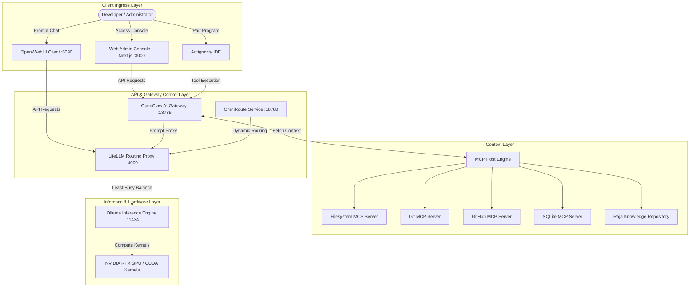
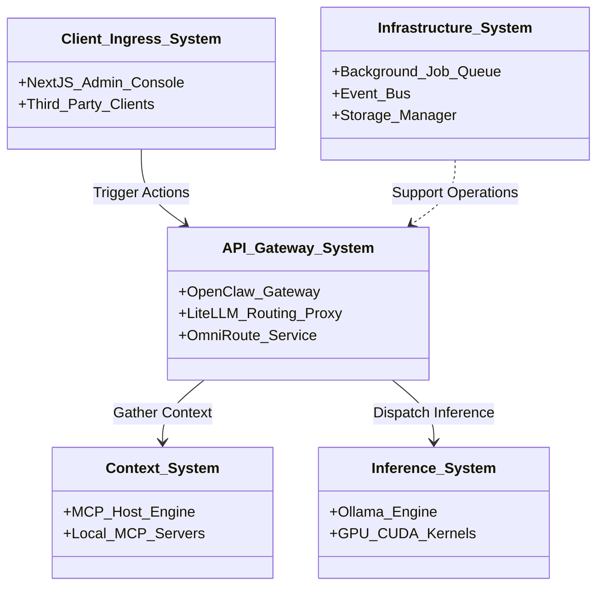
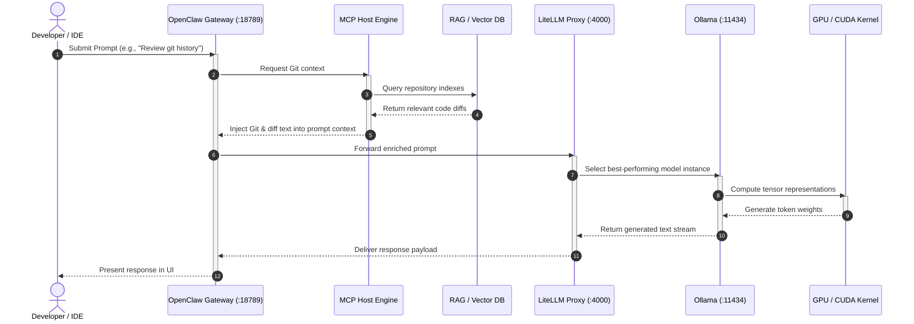
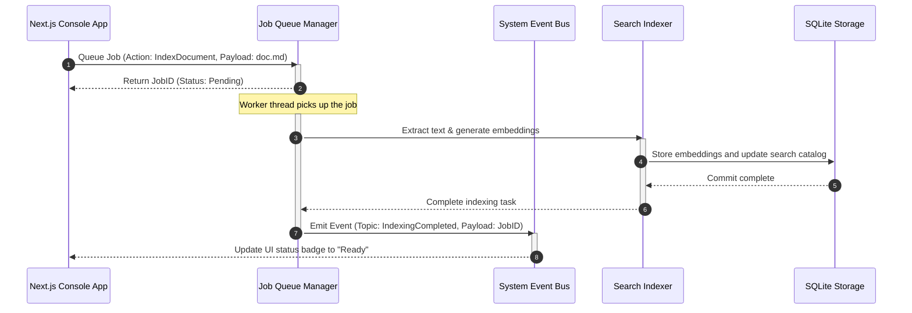
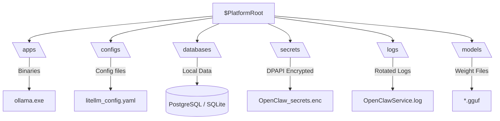

# Architecture Handbook

This document serves as the authoritative architectural blueprint for the local-first, privacy-preserving AI Workstation platform. It outlines the global system topology, decomposes the platform into systems, sub-systems, components, and sub-components, and provides detailed data-flow visualizations using Mermaid.

---

## 1. Global System Topology

The workstation is deployed as a secure, local-first ecosystem where data privacy is guaranteed by resolving inference, routing, and context generation on localhost loopback interfaces.

---

## 2. Layered Architectural Decomposition

The platform is organized into five core systems, each composed of dedicated sub-systems, components, and sub-components.

### System 1: Client Ingress Layer
Responsible for user interaction, administrative actions, and developer integrations.

*   **Sub-system 1.1: Web Administration Console (Next.js 16 App)**
    *   **Component 1.1.1: Dashboard UI Modules:** Modular frontend components (metrics cards, activity streams, service status controls) built using React.
    *   **Component 1.1.2: State Stores (Zustand):** Managed React state (e.g., [appStore](file:///d:/1_Projects/OpenClawOllamaLiteLLM_Transparency/src/store/appStore.ts) and [authStore](file:///d:/1_Projects/OpenClawOllamaLiteLLM_Transparency/src/store/authStore.ts)) storing environment profiles, loaded models, and active background tasks.
*   **Sub-system 1.2: Integrated Development Environments (IDEs)**
    *   **Component 1.2.1: IDE SCM Adapter:** Bridges local editor context with the Git/GitHub MCP server tools.
*   **Sub-system 1.3: Web Client Chat Interfaces**
    *   **Component 1.3.1: Open-WebUI:** Provides a user-friendly conversational interface to interact with model templates.

---

### System 2: API & Gateway Control Layer
Responsible for routing prompt requests, injecting local system context, and load-balancing inference payloads.

*   **Sub-system 2.1: OpenClaw AI Gateway (Port 18789)**
    *   **Component 2.1.1: Proxy Server & Middleware:** Manages incoming HTTP/WebSocket connections, handling authentication, request parsing, and rate limiting.
    *   **Component 2.1.2: Context Adapter Orchestrator:** Intercepts incoming prompts and queries the Model Context Protocol (MCP) servers to retrieve local code, files, or documentation.
*   **Sub-system 2.2: LiteLLM Routing Proxy (Port 4000)**
    *   **Component 2.2.1: Load Balancer:** Automatically routes prompt payloads across active Ollama ports or API endpoints based on model availability.
    *   **Component 2.2.2: Routing Database (SQLite/PostgreSQL):** Tracks request usage, error rates, and response latency.
*   **Sub-system 2.3: OmniRoute Smart Router**
    *   **Component 2.3.1: Dispatcher:** Dynamically switches prompt requests between lightweight local models and larger reasoning models based on prompt complexity.

---

### System 3: Context & Extension Layer (MCP)
Allows local LLMs to safely interact with the host system and external data assets in a secure, audited sandbox.

*   **Sub-system 3.1: Model Context Protocol (MCP) Host**
    *   **Component 3.1.1: JSON-RPC Protocol Router:** Manages execution logs and handles communications between client extensions and local tool servers.
*   **Sub-system 3.2: Local Tool Servers**
    *   **Component 3.2.1: Filesystem MCP:** Exposes restricted read/write operations on authorized workspace subfolders.
    *   **Component 3.2.2: Git/GitHub MCP:** Enables listing branches, comparing diffs, generating commits, and creating pull requests from the IDE.
    *   **Component 3.2.3: SQLite/Fetch/Puppeteer MCP:** Executes SQL statements locally, fetches web pages, and interacts with dynamic browser screens.
    *   **Component 3.2.4: Raja Knowledge Repository (RAG):** Connects to vector storage containing platform documents, codebase maps, and historical runbooks.

---

### System 4: Infrastructure & Storage Layer
Provides the platform-wide services required for background execution, logging, and data persistence.

*   **Sub-system 4.1: Background Job Queue**
    *   **Component 4.1.1: Queue Manager ([job-queue.ts](file:///d:/1_Projects/OpenClawOllamaLiteLLM_Transparency/src/infrastructure/jobs/job-queue.ts)):** Manages scheduling, prioritization, and locking of long-running operations.
    *   **Component 4.1.2: Thread Workers:** Ephemeral processes that execute data-intensive tasks (such as document indexing or database backups).
*   **Sub-system 4.2: Event Bus System**
    *   **Component 4.2.1: Event Broker ([event-bus.ts](file:///d:/1_Projects/OpenClawOllamaLiteLLM_Transparency/src/infrastructure/events/event-bus.ts)):** Distributes events using a publish-subscribe pattern, enabling decoupled modules to react to system changes.
*   **Sub-system 4.3: Storage Engine**
    *   **Component 4.3.1: Database Engine (PostgreSQL/SQLite):** Manages metadata, user credentials, and telemetry configurations.
    *   **Component 4.3.2: File Storage Manager:** Handles file uploads and parses absolute paths relative to `$PlatformRoot`.

---

### System 5: Inference Execution Layer
Performs GGUF model load operations, memory scheduling, and hardware-accelerated token generation.

*   **Sub-system 5.1: Ollama Inference Engine (Port 11434)**
    *   **Component 5.1.1: Model Weight Registry:** Stores GGUF parameters and system prompts.
    *   **Component 5.1.2: Memory Allocator:** Schedules model weights between CPU RAM and GPU VRAM.
*   **Sub-system 5.2: Hardware Acceleration Kernel**
    *   **Component 5.2.1: CUDA Toolkit Runner:** Directs high-performance matrix multiplications to NVIDIA CUDA cores.

---

## 3. Comprehensive Sequence Diagrams

### 3.1 Lifecycle of a Context-Enriched Inference Request

The sequence below illustrates how the platform intercept, enriches, and executes an AI prompt.

---

### 3.2 Background Job Ingestion Flow

The following diagram tracks the asynchronous indexing of a new document file.

---

## 4. Storage Partitioning & Directory Architecture

To guarantee platform portability, all files and storage databases are located relative to a parameterized platform root directory (`$PlatformRoot`), typically configured during installation to `D:\AIPlatform` or `C:\AIPlatform`.

### Directory Specifications

1.  **`/apps/`**: Stores executable binaries for services (e.g., `ollama.exe`, `pgbouncer.exe`). Using standardized locations ensures the platform does not depend on host environment variables.
2.  **`/configs/`**: Contains configuration files (YAML, JSON, XML) generated by [Configure.ps1](file:///d:/1_Projects/OpenClawOllamaLiteLLM_Transparency/automation/Configure.ps1).
3.  **`/databases/`**: Houses persistent data stores for local configurations and indexed vector embeddings.
4.  **`/secrets/`**: Stores host-encrypted credentials using Windows DPAPI. Decryption is restricted to processes running on the same host machine.
5.  **`/logs/`**: Consolidates shifted stdout and stderr output streams, managed by NSSM log-rotation rules.
6.  **`/models/`**: Stores downloaded LLM model weights. Pointed to dynamically via the `OLLAMA_MODELS` environment variable.
