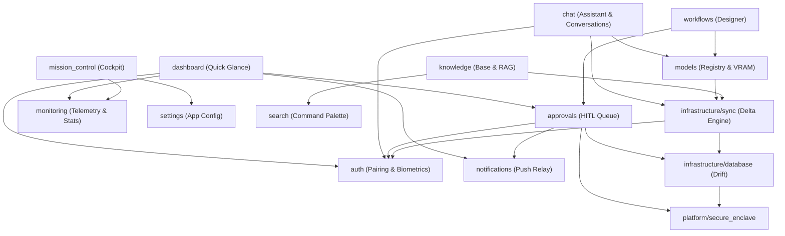
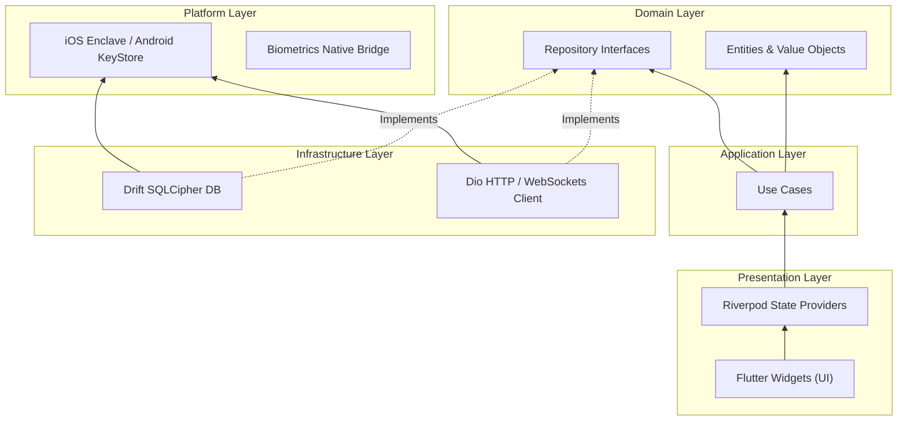
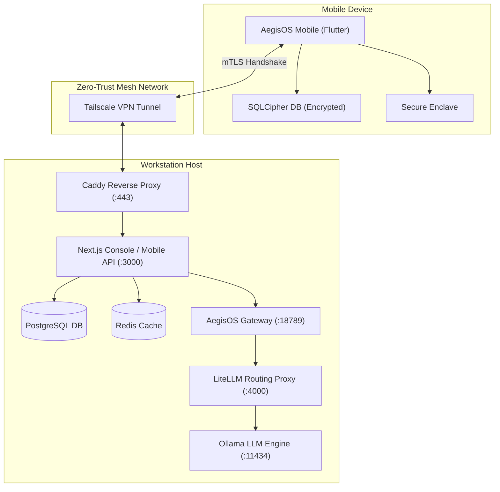

# AegisOS Dependency Map
**Architectural, Infrastructure, Feature & Cross-Team Dependency Diagrams**

This document maps out the system dependencies to guide scheduling and parallelization efforts, ensuring that critical-path items are identified and unblocked.

---

## 1. Feature Module Dependency Graph
This diagram captures how the 21 feature modules in the mobile app depend on one another. The core platform dependencies (`core/`, `domain/`, `platform/`) sit at the base, and features depend on abstract interfaces.

---

## 2. Technical Layer Dependency Graph
The Clean Architecture enforces strict unidirectional dependencies. Outer layers can depend on inner layers, but inner layers (Domain) have zero knowledge of outer layers.

---

## 3. Infrastructure & Deployment Topology
This diagram highlights the networking paths and service dependencies between the mobile client and the local workstation host.

---

## 4. Cross-Team Integration Handoffs
To enable parallel execution without blocking, the program defines three interface boundaries:
1. **API Contracts**: The Next.js API paths (`/api/v2/mobile/`) must be mocked in `develop` first. This allows the mobile team to code without waiting for backend logic completion.
2. **Push Payloads**: The JSON schema for E2EE push notifications must be finalized so that both backend notification workers and mobile receivers can be developed concurrently.
3. **Database Schema**: The Drift local model and the SQLite workstation schema must sync delta structures.
