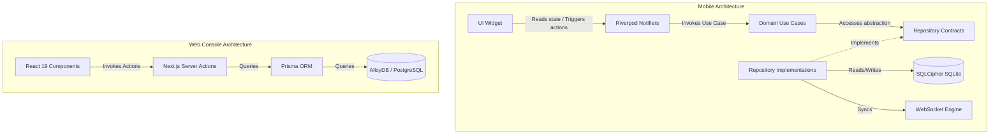
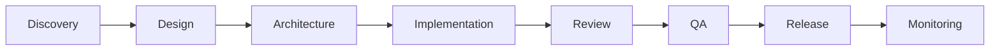

# AegisOS Engineering Playbook
**Document ID:** AEG-GOV-PLAY-001  
**Version:** 1.0.0  
**Classification:** Enterprise Standard  
**Target Audience:** Core Maintainers, Contributors, QA, SRE, and AI Coding Assistants

---

## Table of Contents
1. [Engineering Handbook](#1-engineering-handbook)
2. [Git Strategy](#2-git-strategy)
3. [Code Review Playbook](#3-code-review-playbook)
4. [Testing Handbook](#4-testing-handbook)
5. [Feature Development Lifecycle](#5-feature-development-lifecycle)
6. [Definition of Ready (DoR)](#6-definition-of-ready-dor)
7. [Definition of Done (DoD)](#7-definition-of-done-dod)
8. [Logging Standards](#8-logging-standards)
9. [Error Handling Standards](#9-error-handling-standards)
10. [Performance Budgets](#10-performance-budgets)
11. [Accessibility Standards](#11-accessibility-standards)
12. [Security Checklist](#12-security-checklist)
13. [ADR Template](#13-adr-template)
14. [RFC Process](#14-rfc-process)
15. [Documentation Standards](#15-documentation-standards)
16. [AI Coding Rules](#16-ai-coding-rules)

---

## 1. Engineering Handbook

### Development Philosophy
AegisOS engineering is built upon the paradigm of **Shift-Left Quality and Security**. We treat quality and security not as post-development audits, but as active engineering metrics that are automated and executed within the local workspace.
- **Zero-Trust Engineering**: Assume all boundaries (network, IPC, input fields, host platforms) are compromised. Validate everywhere.
- **Offline-First & Local-First**: The mobile command center must operate fully with zero network availability, utilizing local SQLCipher databases and syncing reactively when connectivity is restored.
- **Maintainable Simplicity (YAGNI)**: Never build speculative abstractions. Implement the most minimal, robust solution that passes the test suite.

### Architecture Principles
AegisOS enforces a strict separation of concerns across a modular monorepo.
- **Console Web App (Next.js 16 / TypeScript 5 / React 19)**:
  - **Unidirectional Data Flow**: Data flows from Database/API -> Next.js Server Components -> Client Components. Action flows from Client Components -> Server Actions/API -> Database.
  - **Layered Boundaries**: Presentation Components may only read from Hooks or Services. Services interface with database repositories. Infrastructure details must never leak into UI components.
- **Mobile Client (Flutter / Dart)**:
  - **Clean Architecture**: Domain (Entities & Use Cases) -> Application (Riverpod Notifiers & Controllers) -> Presentation (UI Widgets). Domain layer is strictly pure Dart and has no external dependencies.
  - **Decoupled State**: Riverpod `AsyncNotifier` controls all state. Business logic must be unit-testable without executing the Flutter widget tree.



### Coding Philosophy
- **Strict Typing**: Type safety is mandatory. The `any` type is strictly forbidden. Use `unknown` or `never` for type narrowing.
- **Immutability by Default**: All structures, entities, and states must be immutable. Use `freezed` in Dart and `readonly`/`const` in TypeScript.
- **Pure Functions**: Write deterministic, testable functions with no side effects. Side effects must be isolated to Infrastructure Adapters.

### Quality Expectations
- **Zero Warnings Policy**: Code must compile with zero compilation warnings, zero TypeScript errors (`tsc --noEmit`), and zero Dart analysis warnings (`flutter analyze`).
- **Static Analysis Compliance**: Lint configurations (ESLint, `analysis_options.yaml`) are treated as build blockers. Bypassing lint rules via comments (`// eslint-disable-next-line`, `// ignore`) requires an ADR or Tech Lead sign-off.

### Review Standards
- **Double Approvals**: All production-bound pull requests require at least two senior peer approvals.
- **Automated Verification**: Before a human reviews the code, the CI pipeline must pass formatting, linting, unit tests, secret scans, and dependency vulnerability audits.

### Decision Framework
Architectural modifications follow a structured progression:
1. **Identify**: Code smell, performance bottleneck, or new technical capability.
2. **Consult**: Peer review via informal RFC or Slack discussion.
3. **Decide**: Generate an Architectural Decision Record (ADR) if the decision changes architecture boundaries, adds core packages, or modifies database schemas.
4. **Approve**: Standard review and merge of ADR prior to code implementation.

---

## 2. Git Strategy

### Branching Model
AegisOS employs a modified **Trunk-Based Development** model to ensure code parity and frequent delivery.

```
       [main] ──────────────────────────────────────────────────────────►
          │                                 ▲                 ▲
          └───► [feature/AEG-101-auth] ─────┘ (Squash & Merge) │
                                                              │
       [release/v1.0.0] ──────────────────────────────────────┴────────►
          │
          └───► [hotfix/v1.0.1-leak] ─────────────────────────┐
                                                              ▼
                                                        [v1.0.1 Tag]
```

- **Feature Branches**: Formatted as `feature/<issue-id>-<short-description>` or `bugfix/<issue-id>-<short-description>`. Feature branches must be short-lived (merged within 48 hours).
- **Default Branch (`main`)**: The default branch must always be in a deployable state. Direct pushes to `main` are blocked.

### Release Branches
- **Creation**: Formatted as `release/v<Major>.<Minor>.<Patch>`. Created when a release candidate (RC) is ready for staging verification.
- **Harden Phase**: Only cherry-picked bug fixes are allowed on release branches. No new features.
- **Merge Back**: Once finalized and tagged, the release branch is merged back into `main` to ensure any stability fixes are preserved.

### Hotfix Branches
- **Creation**: Formatted as `hotfix/v<Major>.<Minor>.<Patch>`. Branched directly from the release tag in production.
- **Lifecycle**: Must be merged into both `main` and the active release branch immediately upon testing and validation.

### Versioning
AegisOS strictly adheres to **Semantic Versioning 2.0.0**:
- **MAJOR**: Incompatible API changes, architecture restructuring, or schema migrations without backward compatibility.
- **MINOR**: Backward-compatible functionality additions (e.g., new feature modules, UI screens).
- **PATCH**: Backward-compatible bug fixes, security remediation, and performance tuning.

### Conventional Commits
All commit messages must comply with the Conventional Commits specification:
```
<type>(<scope>): <description>

[optional body]

[optional footer(s)]
```
- **Allowed Types**:
  - `feat`: A new user-facing capability.
  - `fix`: A bug resolution.
  - `docs`: Documentation edits only.
  - `style`: Code formatting changes (no logic changes).
  - `refactor`: Code restructuring without changing behavior.
  - `perf`: Performance tuning.
  - `test`: Adding or correcting tests.
  - `chore`: Maintenance, dependencies updates, configuration changes.
  - `security`: Security patching.

### Merge Strategy
- **Squash and Merge**: Feature branches must be squashed and merged into `main` to keep the branch history linear, atomic, and clear.
- **Rebase**: Developers must rebase their feature branch against `main` prior to final merge to resolve conflicts locally.

### Pull Request Workflow
1. **Initiate**: Push branch and open a PR using the repository's template.
2. **Automated Verification**: GitHub Actions triggers local test suites, linters, static analysis, and security checks.
3. **Peer Review**: At least two reviewers review, comment, and sign off.
4. **Merge**: Once green and approved, the author (or maintainer) executes the squash and merge.

---

## 3. Code Review Playbook

### Mandatory Checklist
Every reviewer must verify these 6 gates before approving a PR:
- [ ] **Type Correctness**: No explicit or implicit `any` types. Full TypeScript/Dart compiler compliance.
- [ ] **Test Coverage**: PR includes unit, widget, or integration tests covering new and updated logic.
- [ ] **Lint and Format**: Zero style discrepancies.
- [ ] **Backward Compatibility**: API and schema changes do not break legacy clients or running servers.
- [ ] **Zero Secrets**: No keys, tokens, local development URLs, or PII exposed in the diff.
- [ ] **Documentation**: Readme, APIs, and inline docstrings are updated.

### Security Review
- **Input Sanitization**: Validate all inputs using Zod (Next.js) or custom input formatters (Flutter).
- **Safe Database Access**: Ensure all database queries utilize parameterized interfaces (Prisma bindings or SQLCipher variable bindings). No string concatenation in SQL queries.
- **Authentication/Authorization**: Ensure API routes verify session validity and user scopes before execution.

### Performance Review
- **Memory Management**: Verify proper lifecycle management. In Next.js, prevent memory leaks in server-side intervals. In Flutter, verify that Riverpod providers use `.autoDispose` and custom controllers call `dispose()`.
- **Database Query Analysis**: Prevent N+1 query patterns. Ensure appropriate indexing on query filters.
- **Widget Jank**: Avoid rebuilding large lists. In Flutter, verify the use of `ListView.builder` with `itemExtent` and use `const` constructors where possible.

### Accessibility Review
- **Web UI**: Ensure correct HTML5 semantics (`<main>`, `<section>`, `<nav>`), appropriate `aria-*` tags, and full keyboard focus rings.
- **Mobile UI**: Wrap interactive graphics in `Semantics` widgets. Ensure font scale adjustment compatibility without clipping.

### Architecture Review
- **Dependency Isolation**: presentation layer must not bypass use cases to directly touch repositories. Server Actions must not import client-side utilities.
- **Circular Check**: No circular imports. Utilize dependency injection through constructor injection (Flutter/Prisma).

### Testing Review
- **Assertive Testing**: Verify that tests assert specific, meaningful outcomes rather than just calling the function.
- **Mock Integrity**: Mocks must resemble real-world boundaries. Avoid mocking native runtime behaviors.

---

## 4. Testing Handbook

AegisOS mandates a multi-tier testing framework. Developers must follow this structure.

```
       ▲  ┌───────────────────────────┐
       │  │    Integration Tests      │  (Web: Playwright | Mobile: Integration Driver)
       │  ├───────────────────────────┤
       │  │      Golden Tests         │  (Mobile Visual Regressions: golden_toolkit)
       │  ├───────────────────────────┤
       │  │   Widget & Component      │  (React Testing Library | Flutter Widget Tests)
       │  ├───────────────────────────┤
       │  │      Unit Tests           │  (Next.js: Vitest | Flutter: Dart Test)
  Size └──┴───────────────────────────┘
```

### Unit Testing
- **JS/TS**: Evaluated using **Vitest**. Place unit tests in the same directory as the target module using `.test.ts` extension.
- **Dart/Flutter**: Evaluated using `flutter_test`. Place in the `/test/` root directory mirroring the lib structure.

### Widget Testing
- **Flutter**: Ensure each custom widget has at least one widget test verifying component interaction (e.g., tap events, state changes, correct text outputs).
- **Web Components**: Evaluated using React Testing Library inside Vitest.

### Golden Testing
- **Flutter**: Visual regression testing using `golden_toolkit`. Every custom reusable layout component and critical screen (e.g., dashboard, logs viewer) must have goldens verifying appearance across three screen dimensions: 320x480, 375x667, and 414x736.

### Integration Testing
- **Web**: Automated using **Playwright**. Validates full E2E pathways including user login, workspace setup, and diagnostic view.
- **Mobile**: Automated using `integration_test` executing inside emulator environments, verifying the SQLite Sync loop and offline status propagation.

### Contract Testing
- **Tool**: OpenAPI specification verification.
- **Requirement**: API modifications must update the `openapi.yaml` configuration. The Next.js API router and Flutter REST adapters must validate mock payloads against the canonical schema.

### Performance Testing
- **Web**: Lighthouse auditing integrated into the CI pipeline. Performance metrics must stay above 90.
- **Mobile**: Performance benchmarks executed via `flutter driver` to record frame rate, memory footprint, and CPU utilization.

### Security Testing
- **Static Scans**: Gitleaks and Trivy executed inside CI on every commit.
- **Dependency Scan**: `npm audit` and `snyk` executed weekly to identify dependency vulnerabilities.

### Regression Testing
- Prior to release branch promotion, the full automation test suite runs inside a staging clone environment. Zero failures tolerated.

### Mutation Testing
- **Next.js**: Stryker Mutator executed on core services (e.g., authentication flow, billing engine). Mutation Score must exceed 70%.

### Coverage Targets
- **Minimum CI Gate**: **60%** code coverage across all modified lines in the pull request.
- **Recommended Threshold**: **80%** coverage for core business logic, utility methods, and domain use cases.

---

## 5. Feature Development Lifecycle

AegisOS employs a 9-phase product development lifecycle designed to minimize engineering waste.



### 1. Discovery
- **Input**: Product idea, user feedback, or architecture debt.
- **Output**: Product Requirements Document (PRD) detailing user stories, goals, constraints, and business value.

### 2. Design
- **Input**: PRD.
- **Output**: Figma/UI wireframes, data flow designs, and API contracts.

### 3. Architecture
- **Input**: Design documents.
- **Output**: Written Architectural Decision Record (ADR) or Request for Comments (RFC) if changes alter system interfaces, schema models, or state engines.

### 4. Implementation
- **Input**: Approved ADR/RFC.
- **Output**: Feature-flagged source code, localized unit tests, and API endpoints.

### 5. Review
- **Input**: Feature branch PR.
- **Output**: Dual senior review sign-off and green light from the CI quality gate.

### 6. QA
- **Input**: Staging deployment build.
- **Output**: E2E validation, accessibility analysis, performance auditing, and golden verification.

### 7. Release
- **Input**: QA-certified build.
- **Output**: Canary deployment to production (10% -> 50% -> 100%), feature flag toggle to target users.

### 8. Monitoring
- **Input**: Production release.
- **Output**: Real-time evaluation of Sentry crashlytics, Prometheus metrics, and OpenTelemetry spans.

### 9. Retrospective
- **Input**: Feature performance metrics.
- **Output**: Team analysis of delivery challenges, performance drift, and process modifications.

---

## 6. Definition of Ready (DoR)

Before any backlog item is moved to "In Progress", it must meet the following criteria:

- [ ] **Clear Requirements**: User Story contains clear functional requirements written in standard business terminology.
- [ ] **Acceptance Criteria**: Defined using Gherkin Syntax (`Given / When / Then` scenarios).
- [ ] **Dependencies Mapped**: Upstream blockages, third-party integrations, and API contract dependencies are documented.
- [ ] **Architectural Blueprint**: Schema models, API specifications, and component wireframes are defined.
- [ ] **Security Review**: Data classification defined (e.g., Public, Internal, Confidential). Cryptographic requirements documented if storing sensitive details.
- [ ] **Testing Strategy**: Explicit testing requirements (e.g., "Requires Golden Test for Mobile Dashboard") are outlined.

---

## 7. Definition of Done (DoD)

A backlog item is only marked as "Completed" when it passes the following definition:

- [ ] **Tests Written & Passed**: Unit, widget, and E2E tests pass successfully. Target test coverage requirements are achieved.
- [ ] **Documentation Updated**: Readme files, API specs, and inline code annotations are updated.
- [ ] **ADRs Merged**: Any structural decisions made during implementation are committed as numbered ADRs.
- [ ] **Observability Instrumented**: Structured logs, OpenTelemetry spans, and metrics dashboard components are implemented.
- [ ] **Security Audited**: Branch passes Gitleaks, Snyk, and OWASP MASVS/Top 10 checks.
- [ ] **Performance Budget Met**: Verified startup, screen transition, API latency, and frame rate budgets are maintained.
- [ ] **Accessibility Compliance**: Passes WCAG AA checks, screen reader reads correctly, and keyboard focus flows logically.

---

## 8. Logging Standards

### What to Log
- **System Life Cycle Events**: Application boot, database connection success/failure, background job start/end.
- **API Boundary Transitions**: HTTP/WebSocket incoming requests, response HTTP status codes, payload sizes, and transit durations.
- **Data Persistence Events**: Schema migrations, database backup completions, sync queue failures.
- **Security Events**: Login success, login failure (with non-specific reason), token refresh, administrative action triggers, permission checks.

### What NEVER to Log
- **Credentials**: Raw passwords, hashes, recovery pins, biometric signatures.
- **Session Tokens**: JWT tokens, OAuth tokens, cookie strings, CSRF tokens.
- **PII**: Full names, physical addresses, email addresses, phone numbers, payment details.
- **Infrastructure Secrets**: API keys, database credentials, AWS/GCP service account keys, DPAPI keys.
- **Local Environment details**: Absolute file paths in production logs, local network details, internal hostnames.

### Correlation IDs & Trace IDs
- **Trace ID**: A globally unique identifier (`UUIDv4`) generated at the point of origin (e.g., Flutter app startup, Web client load) and passed through HTTP headers (`X-Trace-ID`) and WebSocket payloads.
- **Correlation ID**: Generated at the start of a business transaction (e.g., user requesting model reload) to track interrelated micro-operations across internal background threads and services.
- **Format**:
```json
{
  "timestamp": "2026-07-13T20:42:20Z",
  "level": "INFO",
  "service": "aegis-mobile",
  "traceId": "9b1deb4d-3b7d-4bad-9bdd-2b0d7b3dcb6d",
  "correlationId": "1a2b3c4d-5e6f-7g8h-9i0j-k1l2m3n4o5p6",
  "message": "SQLite sync operation started",
  "payload": {
    "syncQueueSize": 12,
    "host": "https://api.aegisos.internal"
  }
}
```

### Audit Events
- Critical administrative operations must log to a secure SQLCipher database file `audit_log` with payloads cryptographically signed using the device's hardware key (Secure Enclave/Keystore).
- Audit events must never be rotated or modified.

### PII Redaction
All logs must pass through a redaction pipeline. Raw data formatting must mask matching fields:
```dart
// Dart Redaction Pattern
final piiPatterns = {
  RegExp(r'\b[A-Za-z0-9._%+-]+@[A-Za-z0-9.-]+\.[A-Za-z]{2,}\b'): '[REDACTED_EMAIL]',
  RegExp(r'(\+?\d{1,3}[-.\s]?)?\(?\d{3}\)?[-.\s]?\d{3}[-.\s]?\d{4}\b'): '[REDACTED_PHONE]',
  RegExp(r'(jwt|token|password|secret|auth)\s*[:=]\s*[^\s,;"]+'): r'$1: [REDACTED_SECURE]'
};
```

---

## 9. Error Handling Standards

### Exceptions
Raw Exceptions (`Error`, `Exception`, `RuntimeException`) must never leak directly into the user interface or write raw stack traces to production storage.
- **TypeScript**: Define custom errors extending a base `AegisError` structure:
```typescript
export class AegisError extends Error {
  constructor(
    public readonly code: string,
    public override readonly message: string,
    public readonly status: number = 500,
    public readonly context?: Record<string, unknown>
  ) {
    super(message);
    Object.setPrototypeOf(this, new.target.prototype);
  }
}
```
- **Dart/Flutter**: Implement functional error wrappers utilizing the `Either<Failure, Success>` pattern. Represent domain errors using sealed hierarchies:
```dart
sealed class Failure {
  final String message;
  final String errorCode;
  const Failure(this.message, this.errorCode);
}

class NetworkFailure extends Failure {
  const NetworkFailure(String message, String errorCode) : super(message, errorCode);
}
```

### Recovery
- **Zone Boundaries**: Wrap critical executors in isolated error zones (e.g., `runZonedGuarded` in Dart) to prevent unhandled VM thread terminations.
- **Graceful Degradation**: If secondary services fail (e.g., telemetry reporting), log the failure at warning level and continue executing primary features.

### Retry
- **Mechanism**: Implement exponential backoff with random jitter to prevent "thundering herd" issues.
- **Configuration**:
  - `Base Interval`: 1000ms
  - `Backoff Factor`: 2.0
  - `Maximum Attempts`: 3
  - `Jitter`: +/- 15%

### Fallback
- **Network Outages**: Switch endpoints dynamically if the primary host is unreachable.
- **Storage Outages**: If writing to the primary cache directory fails due to workspace storage restrictions, switch to ephemeral memory caches.

### Offline Behavior
- **Write Queue**: Sync queue writes details to a local write-ahead log (WAL) on the SQLCipher DB.
- **State Preservation**: The application interface displays a "Pending Sync" tag for changed details.
- **Reactive Sync**: Connectivity listener initiates synchronization once network signals match state rules.

---

## 10. Performance Budgets

Every change must comply with the system performance budgets.

| Metric | Target (Web Console) | Target (Mobile Client) | Measurement Tool |
|--------|----------------------|------------------------|------------------|
| **Startup time** | FCP < 1.2s, TTI < 1.8s | Warm start < 1.5s, Cold < 2.5s | Lighthouse / Android Vitals |
| **Screen Load** | LCP < 1.5s | Transition time < 150ms | React Profiler / Flutter Driver |
| **API Latency** | p95 < 200ms, p99 < 500ms | p95 < 300ms, p99 < 800ms | OpenTelemetry spans |
| **Memory Limit** | Node heap < 512MB | RAM < 150MB, Peaks < 250MB | Chrome DevTools / Memory Profiler |
| **Battery Impact**| No background cycles | Background CPU usage < 1% | Battery Historian |
| **Frame Render** | N/A | >95% frames at 60fps / 120fps | Flutter performance overlay |
| **Network Payload**| Gzipped bundle < 200KB | JSON sync packets < 50KB | Chrome Network Tab / Wireshark |

---

## 11. Accessibility Standards

AegisOS is built to support all users. Compliance with WCAG 2.2 AA standards is mandatory.

### WCAG Checkpoints
- **Visuals**: Text must maintain a minimum contrast ratio of 4.5:1 for body and 3:0 for large fonts.
- **Inputs**: All form fields must include explicit labels. Do not use placeholders as the sole identifier.
- **Navigation**: All components must be accessible via keyboard navigation alone.

### Keyboard Navigation
- Ensure visible focus rings around active links, inputs, and buttons.
- Do not trap keyboard focus. The user must be able to navigate into and out of all controls using `Tab` and `Shift+Tab`.
- Interactive elements must be triggered by both `Enter` and `Space` keys.

### Voice & Screen Readers
- **HTML**: Semantic headers `<h1>` through `<h6>` must match the page structure. Use ARIA landmarks (`<main>`, `<nav>`, `<aside>`) to structure the page.
- **Flutter**: Use the `Semantics` widget to supply custom descriptions, labels, and interaction hints for custom widgets. Ensure screen readers can read table headers and grid items logically.

### Contrast
- Use design system tokens to ensure contrast compliance.
- Support a high-contrast dark mode switch directly in the profile settings.

### Localization
- Hardcoded user-facing strings are blocked by the build system.
- **Next.js**: Use JSON catalog resource files managed in `/locales/`.
- **Flutter**: Use Dart localization files (`.arb`) resolved through the Flutter generator.

---

## 12. Security Checklist

Security is the primary directive of AegisOS. All changes are evaluated against the threat model.

### OWASP MASVS compliance (Mobile App)
- **MASVS-STORAGE**: All sensitive data must reside in SQLite databases encrypted with SQLCipher using a key derived via PBKDF2 from biometric storage.
- **MASVS-NETWORK**: Enforce mTLS for all mobile API calls. Implement custom SSL Pinning.
- **MASVS-PLATFORM**: Store app keys in the Android Keystore / iOS Keychain. Ensure biometrics validation cannot be bypassed via code tampering.
- **MASVS-CODE**: Wipe memory buffers holding decrypted keys immediately after processing.

### OWASP Top 10 compliance (Web App)
- **A01: Broken Access Control**: Verify user tokens and scopes in every server action and API router path.
- **A03: Injection**: Use parameterized SQL strings. Escape output variables to prevent XSS.
- **A05: Security Misconfiguration**: Keep default passwords disabled. Set HTTPS security headers (HSTS, CSP, X-Frame-Options).

### Dependency Review
- Third-party packages must be scanned using `npm audit` or `snyk` before merge.
- Avoid using packages with single-developer maintenance or lack of updates for more than 12 months.

### Secrets Protection
- Secrets must never reside in source repository files.
- Use `.env.local` for development environments. Use encrypted secrets managers (Vault / GCP Secret Manager) in production environments.

### Threat Model (STRIDE)
For each architectural change, document potential threats:
- **Spoofing**: Secure tokens via HTTPOnly cookies / secure Keychain storage.
- **Tampering**: Sign local database files, use HTTPS integrity validations.
- **Repudiation**: Generate cryptographically signed audit logs for actions.
- **Information Disclosure**: Mask logs, encrypt database files.
- **Denial of Service**: Implement API rate limits.
- **Elevation of Privilege**: Implement role checks on every single execution vector.

---

## 13. ADR Template

All architectural decisions must be documented using the following markdown format:

```markdown
# ADR-[Number]: [Short Description]

- **Status**: [Proposed | Accepted | Rejected | Deprecated | Superseded by ADR-XXX]
- **Date**: [YYYY-MM-DD]
- **Author**: [Name / Team]
- **Deciders**: [List of decision makers]

## 1. Context and Problem Statement
Define the architectural challenge. What constraints, business priorities, or technical requirements dictate a decision?

## 2. Decision Drivers
- [Driver 1, e.g., Network Latency]
- [Driver 2, e.g., Team velocity]

## 3. Considered Options
- **Option 1**: [Short description]
- **Option 2**: [Short description]

## 4. Decision Outcome
Chosen Option: **Option X**, because [Rationale].

### Consequences
- **Positive**: [What gets better?]
- **Negative**: [What trade-offs or technical debt do we accept?]

## 5. Compliance and Verification
How will we verify implementation compliance? (e.g., lint rules, automated checks).
```

---

## 14. RFC Process

For major additions, feature changes, or breaking API deprecations, developers must publish a Request for Comments (RFC).

```
[Draft RFC] ──► [Review Phase (1-2 Weeks)] ──► [Decision: Approved/Rejected] ──► [ADR/Code]
```

### RFC Lifecycle
1. **Draft**: Create the proposal detailing the API specifications, UI designs, and deployment strategy.
2. **Review**: Publish to the team channel. The review window is open for 7 business days.
3. **Resolve**: Address comments. The proposal requires technical lead approval.
4. **Close**: If approved, move to the backlog. If rejected, archive the proposal.

### Breaking Changes and Deprecations
If a change breaks backward compatibility:
- **Step 1: Deprecate**: Maintain the old API behavior but log a deprecation warning.
- **Step 2: Add New**: Introduce the new API endpoint alongside the old one.
- **Step 3: Migrate**: Migrate all clients to use the new endpoint.
- **Step 4: Remove**: Remove the deprecated API endpoint in the next major version release.

---

## 15. Documentation Standards

### Markdown Structure
- All documentation files (`.md`) must begin with a single H1 header.
- Maintain a clean heading hierarchy (H1 -> H2 -> H3). Do not skip heading levels.
- File references must use standard markdown links with absolute file paths inside the workspace.

### Diagrams
- All architectural relationships, system states, and data flows must be visualised using **Mermaid** blocks inside Markdown.
- Use explicit labels and avoid using HTML tags inside Mermaid labels to prevent rendering issues.

### API Documentation
- APIs must be defined using OpenAPI v3 specifications inside `openapi.yaml`.
- Web controllers and services must be annotated using JSDoc.
- Dart files must use Dartdoc annotations (`///`).

---

## 16. AI Coding Rules

Any AI coding assistant operating within the AegisOS repository must strictly comply with these rules. Bypassing these rules will trigger automated PR rejection.

### Rule 1: No Code Duplication
- **Check Before Writing**: Search the repository using grep tools before implementing utility helper functions, UI layouts, or sync controllers.
- **Action**: Utilize existing code or refactor existing logic to be reusable. Do not copy and paste logic blocks.

### Rule 2: Strict Architectural Boundaries
- **No Layer Bypasses**: The presentation layer must not communicate directly with the database or call repository adapters. UI widgets must route all data retrieval and commands through use cases and state notifiers.
- **Next.js Boundaries**: Client components must not import server action utilities directly unless annotated for runtime execution.

### Rule 3: Zero-Bypass Testing Rule
- **No Untested Code**: If you write, modify, or refactor a function, service, class, or UI widget, you **MUST** create or update corresponding unit, widget, or integration tests.
- **No Mocking Internal Logic**: Test logic behaviors using their public interfaces. Do not mock internal implementation details.

### Rule 4: No Hardcoded Configurations
- **Environment Driven**: Do not hardcode connection strings, target URLs, timeouts, retry parameters, or file paths.
- **Action**: Bind configurations to environment variables (Next.js) or runtime configurations (Flutter/Dart).

### Rule 5: Keep Documentation Synchronized
- **ADR & Documentation Integrity**: If your code modification alters database schemas, updates API routes, or changes state management components, you must generate or update the corresponding ADR or API reference files.
- **Master Index Integration**: Maintain the master registry links whenever new documentation assets are introduced.
