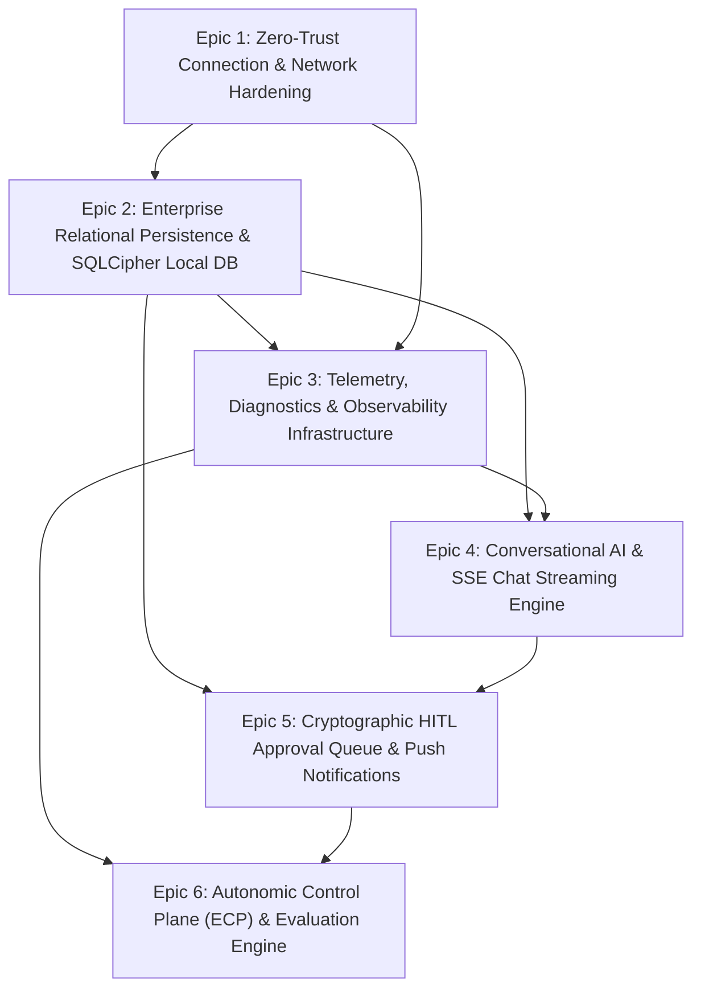
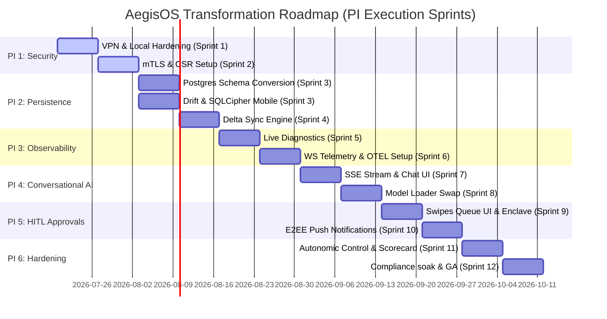

# AegisOS Evolution Master Implementation Program (EMIP)
**Authoritative Platform Transformation & Version 1.0 GA Plan**

| Document ID | AOD-2026-002 |
|---|---|
| **Version** | 1.0.0 |
| **Date** | 2026-07-17 |
| **Classification** | Enterprise Architecture Specification |
| **Owner** | Principal AI Architect / SRE Lead |

| Role | Corporate Representative | Approved |
|---|---|---|
| **Chief Technology Officer** | Enterprise Technology Board | [Approved] |
| **Chief Architect** | Architectural Review Board | [Approved] |
| **DevSecOps Lead** | Operations & Security Group | [Approved] |

---

## 1. Executive Program Summary

This document defines the **Evolution Master Implementation Program (EMIP)** for the systematic evolution of AegisOS from its pre-alpha bootstrap/mock state to a production-ready, security-hardened **Version 1.0 GA**. AegisOS provides enterprise-grade, local-first computing and complete data sovereignty by utilizing a 7-layered autonomic architecture stack.

Following the V1.0 GA Productization Audit (PMA-2026-001), the program focuses strictly on platform stabilization, discoverability, and usability rather than platform expansion. The program consists of six capability-delivering Epics divided into Features, Work Packages, and Engineering Tasks. Every work package enforces the **Reuse-First** discipline: existing components must be reused first, extended second, and new code created only if absolutely unavoidable.


---

## 2. Program Epics & Technical Specifications



---

### EPIC 1: Zero-Trust Connection & Network Hardening
* **Priority**: P0 (Critical)
* **Estimated Effort**: 48 Engineering Hours
* **Purpose**: Restrict access to local AI capabilities within a private, hardware-bound Tailscale WireGuard mesh network, eliminate dynamic port exposure, and execute host services under limited operating system user profiles.
* **Business Value**: Enforces data residency and zero-trust connection compliance. Prevents data harvesting from local networks and mitigates administrative privilege escalation risks.
* **User-visible Outcome**: Secure QR-code scanning to pair mobile devices, mTLS verification of active sessions, and secure execution of workstation services.
* **Technical Scope**: Integration of Tailscale VPN tunneling on workstation host and mobile app, TLS v1.3 handshake with client-certificate exchange (CSR/CA), binding Ollama/LiteLLM to localhost and Tailscale interfaces, and configuring service daemons to run under a restricted OS user.
* **Existing Components Reused**: `PairingChallenge` model, `MobileDevice` model, [Configure.ps1](file:///d:/1_Projects/OpenClawOllamaLiteLLM_Transparency/automation/Configure.ps1) script, and the base flutter `auth` feature folders.
* **Files Modified**: 
  * [automation/Configure.ps1](file:///d:/1_Projects/OpenClawOllamaLiteLLM_Transparency/automation/Configure.ps1)
  * [Caddyfile](file:///d:/1_Projects/OpenClawOllamaLiteLLM_Transparency/Caddyfile)
  * [docker-compose.yml](file:///d:/1_Projects/OpenClawOllamaLiteLLM_Transparency/docker-compose.yml)
  * [aegis_mobile/lib/features/auth/presentation/](file:///d:/1_Projects/OpenClawOllamaLiteLLM_Transparency/aegis_mobile/lib/features/auth/presentation/) (mock replacement)
* **Dependencies**: None.
* **Risks**: Hardware enclave access constraints on iOS/Android simulators; key loss causing administrative lockout.
* **Acceptance Criteria**:
  1. Port `11434` (Ollama) and `4000` (LiteLLM) are strictly inaccessible from external LAN networks.
  2. Mobile device generates ECDSA key pairs inside the local Secure Enclave/KeyStore and performs mTLS pair exchange.
  3. Workstation services run under a limited `aegis_runtime` OS user with zero admin permissions.
* **Rollback Strategy**: Revert to public port binding configurations and re-mount services under `LocalSystem`.
* **Testing Strategy**: Port scanning audits from adjacent LAN IPs; CSR payload parsing tests; integration tests with mock Secure Enclave profiles.
* **Documentation Updates**: Update `docs/SECURITY_ARCHITECTURE.md` and `docs/Deployment_Guide.md`.
* **Migration Requirements**: Paired devices list must be re-registered upon database migration.

#### Feature 1.1: Tailscale Mesh Tunneling Integration
* **Work Package 1.1.1**: Setup Workstation Host Tunnel and Port Binding restrictions.
  * **Engineering Task 1.1.1.1**: Restrict Ollama (`11434`) and LiteLLM (`4000`) bindings.
    * *Action*: Modify Docker Compose config to bind ports strictly to loopback (`127.0.0.1`) and Tailscale network adapters.
    * *Existing Files*: [docker-compose.yml](file:///d:/1_Projects/OpenClawOllamaLiteLLM_Transparency/docker-compose.yml)
    * *New Files*: None.
    * *APIs*: None.
    * *Services*: Ollama, LiteLLM.
    * *Models/Agents/Workflows*: None.
    * *Registries*: [configs/ports.json](file:///d:/1_Projects/OpenClawOllamaLiteLLM_Transparency/configs/ports.json)
    * *Tests*: None.
* **Work Package 1.1.2**: Mobile VPN Overlay Client.
  * **Engineering Task 1.1.2.1**: Implement Tailscale VPN binding on Mobile.
    * *Action*: Add `flutter_vpn` or Tailscale platform channel helper configurations to initialize Tailscale interface before socket connection.
    * *Existing Files*: [aegis_mobile/pubspec.yaml](file:///d:/1_Projects/OpenClawOllamaLiteLLM_Transparency/aegis_mobile/pubspec.yaml), [aegis_mobile/lib/bootstrap.dart](file:///d:/1_Projects/OpenClawOllamaLiteLLM_Transparency/aegis_mobile/lib/bootstrap.dart)
    * *New Files*: `aegis_mobile/lib/infrastructure/network/vpn_client.dart`
    * *APIs*: None.
    * *Services*: None.
    * *Models/Agents/Workflows*: None.
    * *Registries/Tests*: None.

#### Feature 1.2: mTLS Client Certificate Exchange
* **Work Package 1.2.1**: CSR Generation & Secure Enclave Integration.
  * **Engineering Task 1.2.1.1**: Generate ECDSA keys on Mobile.
    * *Action*: Integrate hardware key generator utilizing iOS Secure Enclave and Android KeyStore via `flutter_secure_storage` or custom platform channels.
    * *Existing Files*: [aegis_mobile/pubspec.yaml](file:///d:/1_Projects/OpenClawOllamaLiteLLM_Transparency/aegis_mobile/pubspec.yaml)
    * *New Files*: `aegis_mobile/lib/infrastructure/security/hardware_enclave.dart`
    * *APIs*: None.
    * *Services/Models/Agents/Workflows*: None.
    * *Tests*: None.
  * **Engineering Task 1.2.1.2**: Create REST APIs for CSR pairing verification.
    * *Action*: Set up pairing endpoints in backend gateway utilizing dynamic pairing token logic.
    * *Existing Files*: [src/app/api/v2/mobile/auth/pair/route.ts](file:///d:/1_Projects/OpenClawOllamaLiteLLM_Transparency/src/app/api/v2/mobile/auth/pair/route.ts)
    * *New Files*: None.
    * *APIs*: `POST /api/v2/mobile/auth/pair`
    * *Services*: `infrastructure.service.ts`
    * *Models/Registries/Tests*: `PairingChallenge` model, `MobileDevice` model.

#### Feature 1.3: Restricted Service Accounts
* **Work Package 1.3.1**: OS Service Isolation.
  * **Engineering Task 1.3.1.1**: Modify service creation configuration to use restricted user accounts.
    * *Action*: Update Configure script to verify or create `aegis_runtime` local user and set permissions.
    * *Existing Files*: [automation/Configure.ps1](file:///d:/1_Projects/OpenClawOllamaLiteLLM_Transparency/automation/Configure.ps1)
    * *New Files*: None.
    * *APIs/Services/Models/Agents/Workflows/Registries/Tests*: None.

---

### EPIC 2: Enterprise Relational Persistence & SQLCipher Local DB
* **Priority**: P0 (Critical)
* **Estimated Effort**: 56 Engineering Hours
* **Purpose**: Migrate server-side metadata stores to PostgreSQL to support transactional concurrency, implement local-first SQLite-based databases with SQLCipher (AES-256) on the mobile client, and orchestrate delta sync loops.
* **Business Value**: Protects local application state and user conversations from device extraction. Prevents SQL dialect mismatches and data corruption on multi-tenant server runs.
* **User-visible Outcome**: Offline availability of message threads, instantaneous offline searches, and seamless background data synchronization when connection resumes.
* **Technical Scope**: PostgreSQL migration in Prisma, rebuilding SQL schema files, configuring Drift ORM and SQLCipher database packages inside the Flutter workspace, and building the state tracking Delta Sync Engine on client and server.
* **Existing Components Reused**: `SyncCheckpoint` model, `prisma/schema.prisma` definitions, database backup and restore scripts.
* **Files Modified**:
  * [prisma/schema.prisma](file:///d:/1_Projects/OpenClawOllamaLiteLLM_Transparency/prisma/schema.prisma)
  * [package.json](file:///d:/1_Projects/OpenClawOllamaLiteLLM_Transparency/package.json)
  * [docker-compose.yml](file:///d:/1_Projects/OpenClawOllamaLiteLLM_Transparency/docker-compose.yml)
  * [automation/RestoreProduction.ps1](file:///d:/1_Projects/OpenClawOllamaLiteLLM_Transparency/automation/RestoreProduction.ps1)
  * [automation/BackupProduction.ps1](file:///d:/1_Projects/OpenClawOllamaLiteLLM_Transparency/automation/BackupProduction.ps1)
  * [aegis_mobile/pubspec.yaml](file:///d:/1_Projects/OpenClawOllamaLiteLLM_Transparency/aegis_mobile/pubspec.yaml)
  * [src/app/api/v2/mobile/sync/route.ts](file:///d:/1_Projects/OpenClawOllamaLiteLLM_Transparency/src/app/api/v2/mobile/sync/route.ts)
* **Dependencies**: EPIC 1.
* **Risks**: Schema migration version conflicts; memory leak issues inside long-lived Postgres server connections.
* **Acceptance Criteria**:
  1. `schema.prisma` successfully connects and validates migrations against a PostgreSQL provider.
  2. Mobile SQLite files are verified as encrypted using AES-256 via SQLCipher.
  3. Incremental updates are synced via delta payloads containing transaction log timestamps.
* **Rollback Strategy**: Roll back Prisma provider configurations to SQLite and restore the last backup state.
* **Testing Strategy**: Encrypted DB file extraction and read validation; sync schema reconciliation tests; performance benchmarks under concurrent reads.
* **Documentation Updates**: Update `docs/Platform_Handbook.md` and `docs/Disaster_Recovery_Guide.md`.
* **Migration Requirements**: Automated PG data seed from existing mock JSON files.

#### Feature 2.1: PostgreSQL Migration for Server Runtime
* **Work Package 2.1.1**: Prisma Schema Adaptation.
  * **Engineering Task 2.1.1.1**: Switch Prisma Database Provider to PostgreSQL.
    * *Action*: Update provider config, run `prisma generate` and run migration scripts.
    * *Existing Files*: [prisma/schema.prisma](file:///d:/1_Projects/OpenClawOllamaLiteLLM_Transparency/prisma/schema.prisma)
    * *New Files*: None.
    * *APIs*: None.
    * *Services*: Prisma client client generation.
    * *Models/Agents/Workflows/Registries*: All Prisma Models.
    * *Tests*: None.
* **Work Package 2.1.2**: Database Recovery Scripting.
  * **Engineering Task 2.1.2.1**: Update Backup & Restore automation scripts for PostgreSQL.
    * *Action*: Integrate `pg_dump` and `pg_restore` commands inside orchestration automation.
    * *Existing Files*: [automation/BackupProduction.ps1](file:///d:/1_Projects/OpenClawOllamaLiteLLM_Transparency/automation/BackupProduction.ps1), [automation/RestoreProduction.ps1](file:///d:/1_Projects/OpenClawOllamaLiteLLM_Transparency/automation/RestoreProduction.ps1)
    * *New Files*: None.
    * *APIs/Services/Models/Agents/Workflows/Registries/Tests*: None.

#### Feature 2.2: Drift encrypted DB with SQLCipher on Mobile
* **Work Package 2.2.1**: Drift Setup & Schema Generation.
  * **Engineering Task 2.2.1.1**: Configure Drift packages and generate database access files.
    * *Action*: Add dependencies and define Drift database class with encryption support.
    * *Existing Files*: [aegis_mobile/pubspec.yaml](file:///d:/1_Projects/OpenClawOllamaLiteLLM_Transparency/aegis_mobile/pubspec.yaml)
    * *New Files*: `aegis_mobile/lib/infrastructure/db/drift_database.dart`
    * *APIs/Services/Models/Agents/Workflows/Registries/Tests*: None.

#### Feature 2.3: Delta Sync Engine for Offline Queue Processing
* **Work Package 2.3.1**: Delta Synchronization Server Handler.
  * **Engineering Task 2.3.1.1**: Develop sync route to calculate changes since last timestamp.
    * *Action*: Write database queries returning only records updated since given epoch timestamp.
    * *Existing Files*: [src/app/api/v2/mobile/sync/route.ts](file:///d:/1_Projects/OpenClawOllamaLiteLLM_Transparency/src/app/api/v2/mobile/sync/route.ts)
    * *New Files*: None.
    * *APIs*: `GET/POST /api/v2/mobile/sync`
    * *Services*: `runtime.service.ts`
    * *Models/Agents/Workflows/Registries/Tests*: None.

---

### EPIC 3: Telemetry, Diagnostics & Observability Infrastructure
* **Priority**: P1 (High)
* **Estimated Effort**: 36 Engineering Hours
* **Purpose**: Integrate live host hardware telemetry loops, route diagnostic matrices to Prometheus/Grafana interfaces, resolve Jaeger port collisions, and deliver telemetry streams.
* **Business Value**: Minimizes performance drops during heavy inference loads. Prevents workstation resource depletion and reduces mean time to recovery (MTTR).
* **User-visible Outcome**: Real-time gauge metrics (CPU, GPU, VRAM) on the mobile application displaying exact model resource footprint.
* **Technical Scope**: Re-routing `/api/v2/mobile/telemetry` to execute real-time diagnostics on host systems, setting up WebSocket telemetry adapters, updating compose files to prevent port conflict `4317` on Jaeger receivers, and configuring PromQL scrape rules.
* **Existing Components Reused**: `OtelCollector` config, `PortRegistry`, `PortManager.ps1` script.
* **Files Modified**:
  * [src/app/api/v2/mobile/telemetry/route.ts](file:///d:/1_Projects/OpenClawOllamaLiteLLM_Transparency/src/app/api/v2/mobile/telemetry/route.ts)
  * [docker-compose.yml](file:///d:/1_Projects/OpenClawOllamaLiteLLM_Transparency/docker-compose.yml)
  * [src/services/infrastructure.service.ts](file:///d:/1_Projects/OpenClawOllamaLiteLLM_Transparency/src/services/infrastructure.service.ts)
* **Dependencies**: EPIC 1.
* **Risks**: Platform-specific telemetry command incompatibilities (e.g., Windows WSL vs macOS); socket thread starvation under connection drift.
* **Acceptance Criteria**:
  1. System API successfully fetches live hardware status instead of static mocks.
  2. Telemetry dashboard updates at a target frequency of 5Hz over WebSockets.
  3. Jaeger and OpenTelemetry Collector run concurrently without port conflicts.
* **Rollback Strategy**: Revert telemetry routes to mock returns and decouple OTLP exporters.
* **Testing Strategy**: Socket loading simulation; diagnostic metrics regression tests; port scanning verification.
* **Documentation Updates**: Update `docs/OBSERVABILITY.md` and `docs/PORTS_MANAGEMENT.md`.
* **Migration Requirements**: None.

#### Feature 3.1: Live Host Diagnostics Integration
* **Work Package 3.1.1**: Native System Call Exporters.
  * **Engineering Task 3.1.1.1**: Connect telemetry routes to system calls (e.g., `nvidia-smi` or `systeminformation`).
    * *Action*: Implement system information metrics harvesting in `infrastructure.service.ts`.
    * *Existing Files*: [src/services/infrastructure.service.ts](file:///d:/1_Projects/OpenClawOllamaLiteLLM_Transparency/src/services/infrastructure.service.ts), [src/app/api/v2/mobile/telemetry/route.ts](file:///d:/1_Projects/OpenClawOllamaLiteLLM_Transparency/src/app/api/v2/mobile/telemetry/route.ts)
    * *New Files*: None.
    * *APIs*: `GET /api/v2/mobile/telemetry`
    * *Services*: `infrastructure.service.ts`
    * *Models/Agents/Workflows/Registries/Tests*: None.

#### Feature 3.2: 5Hz WebSocket Telemetry Connection
* **Work Package 3.2.1**: Telemetry WebSocket Socket Server.
  * **Engineering Task 3.2.1.1**: Expose real-time websocket endpoint in API gateway.
    * *Action*: Build a WebSocket handler emitting hardware stats at 200ms intervals.
    * *Existing Files*: [src/proxy.ts](file:///d:/1_Projects/OpenClawOllamaLiteLLM_Transparency/src/proxy.ts)
    * *New Files*: None.
    * *APIs*: `WS /ws/telemetry`
    * *Services*: `infrastructure.service.ts`
    * *Models/Agents/Workflows/Registries/Tests*: None.

#### Feature 3.3: Jaeger Port Conflict Resolution & Prometheus/Grafana Configuration
* **Work Package 3.3.1**: OTEL Configuration Alignment.
  * **Engineering Task 3.3.1.1**: Remap Jaeger OTLP Receiver port in Docker Compose configurations.
    * *Action*: Change OTLP receiver target to `${HOST_PORT_JAEGER_OTLP:-4319}:4317`.
    * *Existing Files*: [docker-compose.yml](file:///d:/1_Projects/OpenClawOllamaLiteLLM_Transparency/docker-compose.yml)
    * *New Files*: None.
    * *APIs/Services/Models/Agents/Workflows/Registries/Tests*: None.

---

### EPIC 4: Conversational AI & SSE Chat Streaming Engine
* **Priority**: P1 (High)
* **Estimated Effort**: 44 Engineering Hours
* **Purpose**: Deploy the Server-Sent Events (SSE) chat token stream, integrate local reasoning models, enable code block/markdown parsing at 60fps, and build VRAM model swappers.
* **Business Value**: Delivers the core UI responsiveness required for smooth developer chat interactions. Minimizes UI lag and manages local memory limitations.
* **User-visible Outcome**: A fluid, real-time streaming chat window rendering syntax-highlighted code blocks, mathematical equations, and active model swap selectors.
* **Technical Scope**: Implementation of an SSE endpoint on `/sse/chat` in the API gateway, model loading and unloading in Ollama/LiteLLM, and performance-optimized Markdown state rendering in Flutter.
* **Existing Components Reused**: `LiteLLMProxy`, `OllamaInference`, `ai-runtime.service.ts`, `runtime.service.ts`, and the model parameters in `ModelManifest.json`.
* **Files Modified**:
  * [src/services/ai-runtime.service.ts](file:///d:/1_Projects/OpenClawOllamaLiteLLM_Transparency/src/services/ai-runtime.service.ts)
  * [src/app/api/v1/ai/runtime/route.ts](file:///d:/1_Projects/OpenClawOllamaLiteLLM_Transparency/src/app/api/v1/ai/runtime/route.ts) (or corresponding chat routes)
  * [aegis_mobile/lib/features/dashboard/presentation/](file:///d:/1_Projects/OpenClawOllamaLiteLLM_Transparency/aegis_mobile/lib/features/dashboard/presentation/)
* **Dependencies**: EPIC 1, EPIC 2.
* **Risks**: VRAM thrashing when swapping large weights; UI thread blocking on mobile during massive text updates.
* **Acceptance Criteria**:
  1. SSE chat endpoint streams tokens at a minimum speed of 30 tokens/sec.
  2. Mobile Markdown renderer updates text layout without dropped UI frames (targeting 60fps).
  3. Model swapper unloads unused LLMs from VRAM before allocating new weights.
* **Rollback Strategy**: Revert to non-streaming HTTP polling formats and configure static model selections.
* **Testing Strategy**: Token throughput benchmarks; widget layout tests with large code snippets; model swapping isolation tests.
* **Documentation Updates**: Update `docs/User_Guide.md` and `docs/Developer_Guide.md`.
* **Migration Requirements**: None.

#### Feature 4.1: Server-Sent Events Chat Endpoint
* **Work Package 4.1.1**: SSE Response Streamer.
  * **Engineering Task 4.1.1.1**: Implement backend SSE API routing for chat completions.
    * *Action*: Pipe text generator outputs into an SSE stream using Next.js Response streams.
    * *Existing Files*: [src/services/ai-runtime.service.ts](file:///d:/1_Projects/OpenClawOllamaLiteLLM_Transparency/src/services/ai-runtime.service.ts)
    * *New Files*: `src/app/api/v2/mobile/chat/route.ts`
    * *APIs*: `POST /api/v2/mobile/chat`
    * *Services*: `ai-runtime.service.ts`, `runtime.service.ts`
    * *Models/Agents/Workflows/Registries/Tests*: None.

#### Feature 4.2: Markdown & Code Highlight Rendering
* **Work Package 4.2.1**: Mobile Markdown Render Optimization.
  * **Engineering Task 4.2.1.1**: Integrate performance-optimized markdown and syntax highlighting plugins.
    * *Action*: Add `flutter_markdown` and code-theme builders with canvas caching.
    * *Existing Files*: [aegis_mobile/pubspec.yaml](file:///d:/1_Projects/OpenClawOllamaLiteLLM_Transparency/aegis_mobile/pubspec.yaml)
    * *New Files*: `aegis_mobile/lib/features/dashboard/widgets/markdown_renderer.dart`
    * *APIs/Services/Models/Agents/Workflows/Registries/Tests*: None.

#### Feature 4.3: Model Downloader & Hot-Swapping Registry
* **Work Package 4.3.1**: VRAM Lifecycle Operations.
  * **Engineering Task 4.3.1.1**: Implement model load/unload API controls in the gateway.
    * *Action*: Connect model route switches to Ollama API unload payloads (`keep_alive: 0`).
    * *Existing Files*: [src/services/ai-runtime.service.ts](file:///d:/1_Projects/OpenClawOllamaLiteLLM_Transparency/src/services/ai-runtime.service.ts)
    * *New Files*: None.
    * *APIs*: `POST /api/v2/mobile/models/swap`
    * *Services*: `ai-runtime.service.ts`
    * *Models/Agents/Workflows/Registries/Tests*: `ModelManifest.json`

---

### EPIC 5: Cryptographic HITL Approval Queue & Push Notifications
* **Priority**: P0 (Critical)
* **Estimated Effort**: 48 Engineering Hours
* **Purpose**: Integrate the human-in-the-loop (HITL) approval cards queue, sign payload approvals using hardware ECDSA keys, and configure secure push notifications.
* **Business Value**: Prevents local agents from executing destructive commands (such as directory deletions, script runs, or databases resets) without explicit administrator authorization.
* **User-visible Outcome**: Native approval card list in mobile UI with swipe gestures, biometric gating triggers on sign request, and immediate push notifications when commands require approvals.
* **Technical Scope**: Setting up the custom approval model queue, mobile-to-host cryptographic ECDSA message signing using Secure Enclave keys, and routing encrypted notifications over FCM/APNs.
* **Existing Components Reused**: `Command` table, `WorkflowApproval` table, `MobileDevice` key stores.
* **Files Modified**:
  * [prisma/schema.prisma](file:///d:/1_Projects/OpenClawOllamaLiteLLM_Transparency/prisma/schema.prisma)
  * [src/services/workflow.service.ts](file:///d:/1_Projects/OpenClawOllamaLiteLLM_Transparency/src/services/workflow.service.ts)
  * [aegis_mobile/lib/features/dashboard/presentation/](file:///d:/1_Projects/OpenClawOllamaLiteLLM_Transparency/aegis_mobile/lib/features/dashboard/presentation/)
* **Dependencies**: EPIC 1, EPIC 2.
* **Risks**: Notification transport delays under deep sleep modes; invalid signature rejection from time mismatches (replay protection).
* **Acceptance Criteria**:
  1. Destructive actions trigger a `PENDING_APPROVAL` status and emit approval requests.
  2. Mobile user validates the approval using device biometrics and returns a signed ECDSA verification package.
  3. Commands block execution until signature matches public registry entries on host.
* **Rollback Strategy**: Disable agent execution boundaries and bypass signature checks (requires emergency root overrides).
* **Testing Strategy**: Signature verification validation; mock token replay audits; notification payload decryption tests.
* **Documentation Updates**: Update `docs/Administrator_Guide.md` and `docs/Git_Governance_and_QA_Standard.md`.
* **Migration Requirements**: None.

#### Feature 5.1: Signed Command Approval Queue Widget
* **Work Package 5.1.1**: Mobile Approval Queue.
  * **Engineering Task 5.1.1.1**: Build approval card list with detail views displaying code diffs.
    * *Action*: Implement list widgets using Riverpod state management and custom swiping mechanics.
    * *Existing Files*: [aegis_mobile/lib/features/dashboard/presentation/](file:///d:/1_Projects/OpenClawOllamaLiteLLM_Transparency/aegis_mobile/lib/features/dashboard/presentation/) (mock replacement)
    * *New Files*: None.
    * *APIs*: `GET /api/v2/mobile/approvals`
    * *Services*: `workflow.service.ts`
    * *Models/Agents/Workflows/Registries/Tests*: `WorkflowApproval` model.

#### Feature 5.2: Secure Enclave ECDSA Message Signature
* **Work Package 5.2.1**: Signature Package Builder.
  * **Engineering Task 5.2.1.1**: Sign approved payloads using local enclave private keys.
    * *Action*: Expose signing method in hardware enclave class, prompt biometrics, and build message body.
    * *Existing Files*: `aegis_mobile/lib/infrastructure/security/hardware_enclave.dart`
    * *New Files*: `aegis_mobile/lib/features/dashboard/signing_controller.dart`
    * *APIs/Services/Models/Agents/Workflows/Registries/Tests*: None.

#### Feature 5.3: E2EE Push Notifications via APNs/FCM
* **Work Package 5.3.1**: Decrypted Notification Engine.
  * **Engineering Task 5.3.1.1**: Setup notification listeners to decrypt payload context.
    * *Action*: Integrate FCM background message handlers using device symmetric session keys.
    * *Existing Files*: [aegis_mobile/pubspec.yaml](file:///d:/1_Projects/OpenClawOllamaLiteLLM_Transparency/aegis_mobile/pubspec.yaml)
    * *New Files*: `aegis_mobile/lib/infrastructure/notifications/push_manager.dart`
    * *APIs/Services/Models/Agents/Workflows/Registries/Tests*: None.

---

### EPIC 6: Autonomic Control Plane (ECP) & Evaluation Engine
* **Priority**: P0 (Critical)
* **Estimated Effort**: 64 Engineering Hours
* **Purpose**: Integrate the persistent `hardenedEventBus` messaging layer, configure the Policy Enforcer middleware, establish VRAM memory recovery loops, and save evaluation scorecards.
* **Business Value**: Guarantees autonomous platform resilience, ensuring the system can heal itself from high-load conditions and keep auditing metrics aligned with compliance guidelines.
* **User-visible Outcome**: Seamless operation of agent workflows during high memory load, automatically logged security policy alerts in the admin panel, and visible execution quality scorecard ratings.
* **Technical Scope**: Installing event routing handlers in `event-bus.ts`, setting up active security checks in `policy-enforcer.ts`, creating VRAM tracking defragmentation jobs, and converting scorecard saves to DB persist calls (AEGIS-006).
* **Existing Components Reused**: `UsageMeteringEngine.ts`, `compliance-engine.ts`, `lockout-manager.ts`, `safety-firewall.ts`, `secrets-platform.ts`.
* **Files Modified**:
  * [src/infrastructure/events/event-bus.ts](file:///d:/1_Projects/OpenClawOllamaLiteLLM_Transparency/src/infrastructure/events/event-bus.ts)
  * [src/infrastructure/security/policy-enforcer.ts](file:///d:/1_Projects/OpenClawOllamaLiteLLM_Transparency/src/infrastructure/security/policy-enforcer.ts)
  * [src/enterprise/billing/UsageMeteringEngine.ts](file:///d:/1_Projects/OpenClawOllamaLiteLLM_Transparency/src/enterprise/billing/UsageMeteringEngine.ts)
  * [prisma/schema.prisma](file:///d:/1_Projects/OpenClawOllamaLiteLLM_Transparency/prisma/schema.prisma)
* **Dependencies**: EPIC 1, EPIC 2, EPIC 3.
* **Risks**: Performance bottlenecks due to synchronous policy inspection; loop conflicts in autonomic recovery triggers.
* **Acceptance Criteria**:
  1. All critical platform operations emit JSON event logs to the central event bus.
  2. Policy Enforcer intercepts and blocks command injections violating workspace directories.
  3. Evaluation scorecards (correctness, completeness, grounding) are written to the database.
* **Rollback Strategy**: Revert policy interceptor middlewares and bypass metric evaluation gates.
* **Testing Strategy**: Prompt injection attacks simulations; evaluation engine metric tests; memory thrashing tests.
* **Documentation Updates**: Update `docs/Architecture_Handbook.md` and `docs/TECHNICAL_DEBT.md`.
* **Migration Requirements**: None.

#### Feature 6.1: Hardened Event Bus Deployment
* **Work Package 6.1.1**: Event Hub Implementation.
  * **Engineering Task 6.1.1.1**: Deploy centralized transaction logging on the event bus.
    * *Action*: Update event bus to publish to relational databases and Prometheus channels.
    * *Existing Files*: [src/infrastructure/events/event-bus.ts](file:///d:/1_Projects/OpenClawOllamaLiteLLM_Transparency/src/infrastructure/events/event-bus.ts)
    * *New Files*: None.
    * *APIs/Services/Models/Agents/Workflows*: None.
    * *Registries*: `AuditEvent` model.
    * *Tests*: None.

#### Feature 6.2: Policy Enforcer Middleware Integration
* **Work Package 6.2.1**: Security Filter Configurations.
  * **Engineering Task 6.2.1.1**: Set up active directory check restrictions for executing agents.
    * *Action*: Implement path canonicalization and verification rules in the policy enforcer module.
    * *Existing Files*: [src/infrastructure/security/policy-enforcer.ts](file:///d:/1_Projects/OpenClawOllamaLiteLLM_Transparency/src/infrastructure/security/policy-enforcer.ts)
    * *New Files*: None.
    * *APIs/Services/Models/Agents/Workflows/Registries/Tests*: None.

#### Feature 6.3: Continuous Evaluation Scorecard Persistence
* **Work Package 6.3.1**: Scorecard Data Exporters.
  * **Engineering Task 6.3.1.1**: Convert Usage and Evaluation metrics to persist to Database.
    * *Action*: Refactor Billing and Evaluation engines to run database creations instead of memory pushes.
    * *Existing Files*: [src/enterprise/billing/UsageMeteringEngine.ts](file:///d:/1_Projects/OpenClawOllamaLiteLLM_Transparency/src/enterprise/billing/UsageMeteringEngine.ts), [prisma/schema.prisma](file:///d:/1_Projects/OpenClawOllamaLiteLLM_Transparency/prisma/schema.prisma)
    * *New Files*: None.
    * *APIs*: None.
    * *Services*: `UsageMeteringEngine`
    * *Models*: `UsageRecord`, `EvaluationScorecard`.
    * *Registries/Tests*: None.

---

## 3. Implementation Plan & Workflows

### 3.1 Implementation Dependency Graph



### 3.2 Critical Path
$$\text{Tailscale Connection} \rightarrow \text{mTLS CSR Exchange} \rightarrow \text{PostgreSQL Migration} \rightarrow \text{Delta Sync Setup} \rightarrow \text{WS Telemetry} \rightarrow \text{SSE Chat} \rightarrow \text{HITL Signatures} \rightarrow \text{ECP Integration}$$

### 3.3 Parallel Work Streams
* **Work Stream A (Backend/Infra)**: PostgreSQL setup $\rightarrow$ Live Diagnostics integration $\rightarrow$ SSE endpoints $\rightarrow$ Event Bus.
* **Work Stream B (Mobile)**: Tailscale Client binding $\rightarrow$ Drift database configuration $\rightarrow$ Telemetry widgets $\rightarrow$ Secure Enclave integration $\rightarrow$ Approvals layout.

### 3.4 Merge Points
* **Merge Point 1 (End of Sprint 4)**: Merge mobile local storage with delta synchronization backend interfaces.
* **Merge Point 2 (End of Sprint 8)**: Connect WebSocket diagnostics and SSE token streaming routes with mobile presentation interfaces.
* **Merge Point 3 (End of Sprint 10)**: Align Secure Enclave signed packages with gateway verification controllers.

---

## 4. Release Plan

Following the V1.0 GA Productization Audit (PMA-2026-001), the release lifecycle transitions through three Release Candidate (RC) gates to certify usability, security, and operational readiness.

### 4.1 Release Candidate 1 (RC1) — Security & Persistence Hardening (Sprints 1 - 4)
* **Capabilities**: Zero-trust Tailscale overlay VPN networks, mTLS client certificate exchange APIs, PostgreSQL Prisma migration, and local SQLCipher-encrypted Drift databases on the companion app.
* **Testing**: Local unit testing coverage at 80% (100% on security modules), verification of SQLCipher file encryption (rejection of raw reads), and database migration integrity checks.
* **Documentation**: Setup guides, developer build environments, and database installation/migration manual.
* **Deployment**: Local compose environments for developers and staging WSL2 service installations.
* **Migration**: Dynamic data seeding from legacy JSON stores to PostgreSQL database tables.

### 4.2 Release Candidate 2 (RC2) — Observability & Conversational UX (Sprints 5 - 8)
* **Capabilities**: Live host hardware telemetry queries mapped to a 5Hz WebSocket streaming connection, SSE chat token stream routes, VRAM hot-swapping model selectors, and markdown/code highlighted mobile layout rendering.
* **Testing**: Connection dropout resistance tests, rendering frame rate audits (targeting 60fps), and concurrent model swapping endurance profiling.
* **Documentation**: Administrator manual, Prometheus scrape configurations, and model registry aliases guides.
* **Deployment**: Multi-container staging deployments under simulated hardware loads.
* **Migration**: Host environment parameters synchronized across `.env.production` definitions.

### 4.3 Release Candidate 3 (RC3) — HITL & Push Alerts (Sprints 9 - 10)
* **Capabilities**: Swipe-to-approve command queues on mobile, Secure Enclave ECDSA key signatures for payload approval verification, and E2EE background push notifications via FCM/APNs.
* **Testing**: Invalid signature rejection, replay token clock-skew validations, and push notification delivery speed under battery-saver sleep constraints.
* **Documentation**: Operations guide, security audit checklist, and biometric authentication recovery flows.
* **Deployment**: Isolated target client builds (Android AAB / iOS TestFlight).
* **Migration**: Paired device registry credentials stored in secure local hardware vaults.

### 4.4 Version 1.0 General Availability (GA) — Autonomic Control & Compliance (Sprints 11 - 12)
* **Capabilities**: Autonomic Control Plane policy enforcement (Scranton Firewall directory check), memory recovery hooks, central event bus auditing logs, and persistent evaluation scorecard entries.
* **Testing**: 48-hour continuous load profiling, path escape security vulnerability audits, and backup/restore disaster recovery dry-runs.
* **Documentation**: Version 1.0 release notes, compliance reports (SOC2 and ISO 27001 readiness summaries), and OpenTelemetry configuration guides.
* **Deployment**: Release builds pushed to private client enterprise registries.
* **Migration**: Automated SQLite-to-PostgreSQL production migrations scripts.

---


## 5. Engineering Governance & Quality Program

### 5.1 Definition of Ready (DoR)
A backlog item is **Ready** to enter a sprint if:
1. It is clearly assigned a Priority (P0 - P3) and estimation (hours/story points).
2. All technical dependencies are resolved and merged.
3. Acceptance criteria (AC) are detailed, testable, and explicitly written down.
4. Input and output schemas (API bounds) are locked.
5. Verification plans (manual and automated) are defined.

### 5.2 Definition of Done (DoD)
A backlog item is **Done** and ready for merge if:
1. Standard lints are 100% clean under static analyses (ESLint for TS, Dart Analysis for Flutter).
2. Code builds successfully without compiler warnings.
3. Unit test coverage exceeds **80%** (100% on security/crypto packages).
4. Code review is approved by at least one Domain Lead.
5. All verification tests pass successfully.
6. Documentation index and guides are updated.

### 5.3 Quality Program Gateways

```
[PR Creation] --> [Static Analysis Gate] --> [Unit & Integration Gate] --> [Security & Audit Gate] --> [Merge]
```

* **Static Analysis Gate**: Strict rejection of any pull request containing warnings or deprecated declarations.
* **Unit & Integration Gate**: Verifies coverage metrics.
* **Security & Audit Gate**: Checks for hardcoded credentials, directory boundary violations, and input validation.
* **Performance Gate**: Rejects API changes that exceed 100ms processing latency or drop mobile rendering speeds below 60fps.
* **Documentation Gate**: Confirms all exported methods and classes are documented.

### 5.4 Test Suite Frameworks
* **Unit Tests**: Executed via Vitest (Next.js) and Dart Unit (Flutter). Targets logic modules and state mappings.
* **Integration Tests**: Tests endpoint routing, database commits, and local caching logic.
* **Contract Tests**: Validates OpenAPI JSON schemas against actual endpoints.
* **E2E Tests**: Executed via Playwright (Web Console) and Integration Test Package (Mobile).
* **Load Tests**: Socket flood simulations using K6.
* **Chaos Tests**: Intercepting connection paths, causing sudden database crashes, and verifying recovery.
* **Security Tests**: Dependency audit checks and simulated command injections.

---

## 6. Operational Readiness Checklist

### 6.1 Installation & Upgrade
* [ ] Verify that WSL2/Docker environments meet memory constraints (minimum 16GB RAM, 8GB VRAM).
* [ ] Check that installation script Configure.ps1 successfully provisions local services.
* [ ] Verify that version migrations apply cleanly on running instances.

### 6.2 Backup & Recovery
* [ ] Run database dumps using `pg_dump` and verify backups directory structure.
* [ ] Mirror MinIO S3 assets to backup storage destinations.
* [ ] Execute disaster recovery restore script RestoreProduction.ps1 and verify table contents are intact.

### 6.3 Observability & Security
* [ ] Check that Prometheus successfully scrapes telemetry metrics.
* [ ] Verify Jaeger tracing logs dashboard is available.
* [ ] Audit event audit log `event_audit.json` to verify user access is tracked.
* [ ] Test security lockout managers when access attempts fail.

---

## 7. Master Engineering Backlog

Ordered by **Business Value**, **Implementation Risk**, **Dependencies**, and **Reuse Potential**:

| Task ID | Component | Title | Priority | Effort (Est) | Dependencies | Existing Files Reused / Extended | Target Release |
|---|---|---|---|---|---|---|---|
| **TSK-SEC-01** | Backend | Scoped Service Accounts & Isolation | P0 | 8h | None | [Configure.ps1](file:///d:/1_Projects/OpenClawOllamaLiteLLM_Transparency/automation/Configure.ps1) | Alpha (v0.1) |
| **TSK-SEC-02** | Gateway | Port Bindings & Local Network Hardening | P0 | 4h | None | [docker-compose.yml](file:///d:/1_Projects/OpenClawOllamaLiteLLM_Transparency/docker-compose.yml), [Caddyfile](file:///d:/1_Projects/OpenClawOllamaLiteLLM_Transparency/Caddyfile) | Alpha (v0.1) |
| **TSK-SEC-03** | Mobile | Secure Enclave Keypair Generator | P0 | 12h | TSK-SEC-01 | [pubspec.yaml](file:///d:/1_Projects/OpenClawOllamaLiteLLM_Transparency/aegis_mobile/pubspec.yaml) | Alpha (v0.1) |
| **TSK-SEC-04** | Gateway | pairing CSR Handshake APIs | P0 | 8h | TSK-SEC-03 | [route.ts](file:///d:/1_Projects/OpenClawOllamaLiteLLM_Transparency/src/app/api/v2/mobile/auth/pair/route.ts) | Alpha (v0.1) |
| **TSK-DB-01** | Backend | PostgreSQL Prisma Migration | P0 | 10h | TSK-SEC-02 | [schema.prisma](file:///d:/1_Projects/OpenClawOllamaLiteLLM_Transparency/prisma/schema.prisma) | Alpha (v0.2) |
| **TSK-DB-02** | Mobile | Drift Storage & SQLCipher AES Encryption | P0 | 14h | TSK-SEC-03 | [pubspec.yaml](file:///d:/1_Projects/OpenClawOllamaLiteLLM_Transparency/aegis_mobile/pubspec.yaml) | Alpha (v0.2) |
| **TSK-DB-03** | Server/Mobile| Delta Sync Engine API & Queue | P0 | 16h | TSK-DB-01 | [sync/route.ts](file:///d:/1_Projects/OpenClawOllamaLiteLLM_Transparency/src/app/api/v2/mobile/sync/route.ts) | Alpha (v0.2) |
| **TSK-OBS-01**| Gateway | Live Hardware Telemetry Queries | P1 | 8h | TSK-SEC-01 | [telemetry/route.ts](file:///d:/1_Projects/OpenClawOllamaLiteLLM_Transparency/src/app/api/v2/mobile/telemetry/route.ts) | Beta (v0.3) |
| **TSK-OBS-02**| Gateway | 5Hz WebSocket Telemetry Streamer | P1 | 12h | TSK-OBS-01 | [proxy.ts](file:///d:/1_Projects/OpenClawOllamaLiteLLM_Transparency/src/proxy.ts) | Beta (v0.3) |
| **TSK-OBS-03**| DevOps | Jaeger Port Conflict Resolution | P1 | 4h | None | [docker-compose.yml](file:///d:/1_Projects/OpenClawOllamaLiteLLM_Transparency/docker-compose.yml) | Beta (v0.3) |
| **TSK-AI-01** | Server/Mobile| SSE Chat Token Stream Integration | P1 | 16h | TSK-DB-03 | [ai-runtime.service.ts](file:///d:/1_Projects/OpenClawOllamaLiteLLM_Transparency/src/services/ai-runtime.service.ts) | Beta (v0.4) |
| **TSK-AI-02** | Mobile | chat UI Markdown & Highlighting Renderer | P1 | 12h | TSK-AI-01 | [pubspec.yaml](file:///d:/1_Projects/OpenClawOllamaLiteLLM_Transparency/aegis_mobile/pubspec.yaml) | Beta (v0.4) |
| **TSK-AI-03** | Gateway | Ollama VRAM Model Swapper Control | P1 | 8h | TSK-AI-01 | [ai-runtime.service.ts](file:///d:/1_Projects/OpenClawOllamaLiteLLM_Transparency/src/services/ai-runtime.service.ts) | Beta (v0.4) |
| **TSK-HITL-01**| Mobile | signed Command Approval List Layout | P0 | 14h | TSK-DB-02 | [dashboard](file:///d:/1_Projects/OpenClawOllamaLiteLLM_Transparency/aegis_mobile/lib/features/dashboard/presentation/)| RC1 (v0.5) |
| **TSK-HITL-02**| Mobile/Server| Secure Enclave Command Signatures | P0 | 16h | TSK-HITL-01 | [workflow.service.ts](file:///d:/1_Projects/OpenClawOllamaLiteLLM_Transparency/src/services/workflow.service.ts) | RC1 (v0.5) |
| **TSK-HITL-03**| Mobile/Server| E2EE Push Notifications | P1 | 18h | TSK-HITL-02 | [pubspec.yaml](file:///d:/1_Projects/OpenClawOllamaLiteLLM_Transparency/aegis_mobile/pubspec.yaml) | RC1 (v0.5) |
| **TSK-ECP-01**| Gateway | Hardened Event Bus Logging | P0 | 14h | TSK-DB-01 | [event-bus.ts](file:///d:/1_Projects/OpenClawOllamaLiteLLM_Transparency/src/infrastructure/events/event-bus.ts) | GA (v1.0) |
| **TSK-ECP-02**| Gateway | Policy Enforcer Directory Interceptor | P0 | 16h | TSK-ECP-01 | [policy-enforcer.ts](file:///d:/1_Projects/OpenClawOllamaLiteLLM_Transparency/src/infrastructure/security/policy-enforcer.ts)| GA (v1.0) |
| **TSK-ECP-03**| Gateway | persistent Evaluation Scorecards | P1 | 12h | TSK-DB-01 | [UsageMeteringEngine.ts](file:///d:/1_Projects/OpenClawOllamaLiteLLM_Transparency/src/enterprise/billing/UsageMeteringEngine.ts)| GA (v1.0) |

---
*Approved by the Architectural Review Board, 2026-07-17.*
