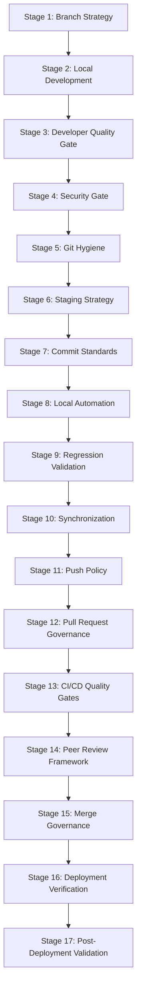
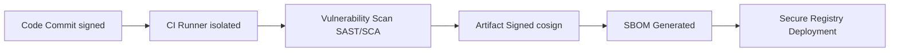
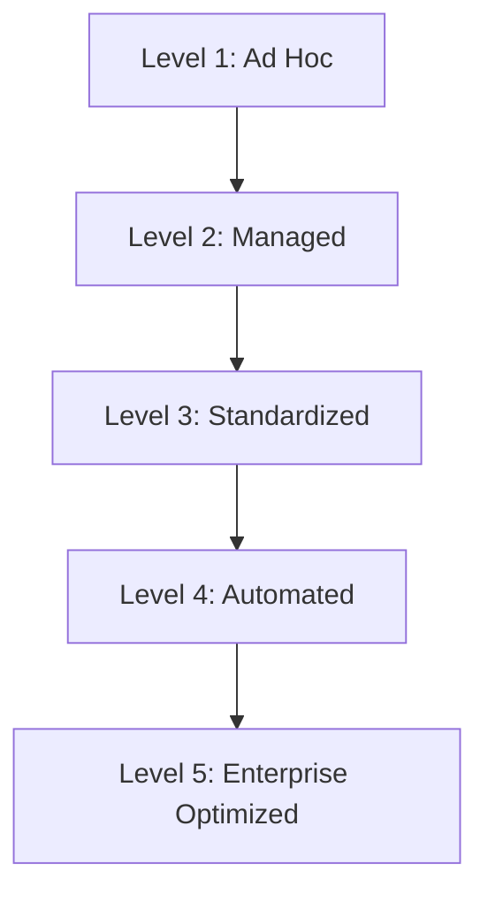

# Git Governance and Quality Assurance Standard

**Document ID:** SEC-GOV-GIT-001  
**Version:** 1.0.0  
**Classification:** Public / Enterprise Standard  
**Target Audience:** Engineering, DevSecOps, Platform, and QA Teams  

---

## 1. Executive Summary

In modern enterprise software engineering, code changes represent both the primary mechanism of business value delivery and the primary vector for operational risk, security vulnerabilities, and compliance drift. Moving away from the paradigm where `git commit` and `git push` are viewed as mere development milestones, this standard establishes a rigorous, automated, and auditable framework where every Git interaction acts as a **quality gate**.

The philosophy of this standard is clear:
> **"Commit and Push are not development milestones—they are quality gates."**

This document defines a progressive, multi-layered quality gate architecture. By shifting verification left (to the developer's workstation) and coupling it with ironclad central policies (CI/CD gates, cryptographic verification, branch protection, and automated supply chain checks), we guarantee that every change reaching the default branch is:
- **Technically Correct:** Validated through comprehensive linting, testing, and compilation.
- **Secure:** Analyzed for secrets, vulnerabilities, license compliance, and secure configurations.
- **Reproducible & Auditable:** Supported by immutable provenance, signed artifacts, and clean commit logs.
- **Reversible:** Structured to allow instantaneous rollback or feature-flag deactivation.
- **Deployment-Ready:** Fully verified against operational, performance, and API backward-compatibility baselines.

---

## 2. Guiding Principles

This standard is anchored on twelve core principles. Each principle serves a specific business and engineering function:

1. **Git as the Single Source of Truth:** Every configuration, piece of infrastructure (IaC), application code, and governance policy must reside in Git. If it is not in Git, it does not exist in the environment. This ensures auditability and rapid environment recovery.
2. **Small Atomic Changes:** Commits must represent the smallest logically complete unit of work. This reduces code review complexity, localizes potential bug injection points, and simplifies reversibility (reverts).
3. **Commit Quality Over Commit Frequency:** A clean, legible history is preferred over a noisy stream of checkpoint commits. Commits must be deliberate, signed, and expressive.
4. **Continuous Validation:** Code must be verified at every stage of the lifecycle: locally before commit, locally before push, centrally during CI, and post-merge in staging/production.
5. **Defense in Depth:** No single quality gate is assumed to be perfect. Security scans, tests, and formatting checks run at the developer workstation and are strictly re-verified in isolated CI environments.
6. **Shift-Left Security:** Discovering a secret leak or vulnerability in production is an expensive failure. Security verification begins in the local editor and pre-commit phase.
7. **Infrastructure and Environment Parity:** Discrepancies between local development, staging, and production environments hide bugs. Parity must be maintained through containerization and declarative environment setups.
8. **Automation Before Manual Effort:** Manual checks do not scale and are error-prone. If a policy can be written as code (e.g., formatting, linting, secret checks), it must be enforced automatically.
9. **Least Privilege:** Write access to default branches and release systems must be strictly limited. Merging is restricted to automated mechanisms after verifying multi-peer approval.
10. **Immutable Audit Trails:** Git history must be cryptographically signed. Once a commit is merged, its path from developer workstation to release artifact must be traceable via signed commits and SLSA-compliant provenance.
11. **Reproducible Builds:** The identical source commit must produce the identical binary artifact regardless of when or where it is built. This prevents "works on my machine" issues and supply-chain tampering.
12. **Continuous Releasability:** The default branch (`main` or `master`) must always be in a deployable state. Broken builds or regressions on the default branch represent a blocker to organizational agility.

---

## 3. End-to-End Git Workflow

The lifecycle of a code change consists of 17 distinct operational stages, tracking a developer's idea from local development to running in production.



### Stage 1 — Branch Strategy
We enforce a structured branching model that supports isolated work and prevents default branch degradation.
- **Trunk-Based Development Focus:** Short-lived feature branches (lifespan < 2 days) are strongly preferred. Long-lived branches encourage configuration drift and painful merge conflicts.
- **Branch Naming Conventions:** Branches must be named using structured prefixes:
  - `feature/<issue-id>-<short-description>`: For functional improvements (e.g., `feature/PROJ-102-auth-routing`).
  - `bugfix/<issue-id>-<short-description>`: For standard bug resolutions (e.g., `bugfix/PROJ-205-fix-jwt-parse`).
  - `hotfix/<issue-id>-<short-description>`: For critical production issues branched off release tags (e.g., `hotfix/PROJ-301-mem-leak`).
  - `release/v<major>.<minor>.<patch>`: For hardening release candidates.
- **Issue Linkage:** All branch names must explicitly reference a valid issue identifier from the project management system (e.g., Jira, GitHub Issues) to enable automated tracking.

### Stage 2 — Local Development
Local development must prioritize clean execution and backwards compatibility:
- **Incremental Development:** Write code in logical, functional increments.
- **Feature Toggles:** Introduce large changes behind feature flags so code can be safely merged to the default branch without affecting active users.
- **Backward Compatibility:** All changes to APIs, database schemas, or RPC signatures must be backwards-compatible (using two-phase rollouts: write-new, update-reads, deprecate-old).
- **Dependency Discipline:** Do not add third-party dependencies unless strictly necessary. Evaluate licenses, vulnerability history, and maintainer activity first.
- **Environment Consistency:** Use local runtime managers (e.g., `nvm` for Node, `pyenv` for Python) and containerized dependencies (e.g., Docker Compose for databases) to ensure the local environment mirrors staging and production.

### Stage 3 — Developer Quality Gate
Prior to initiating a commit, the developer must verify the following attributes of the codebase:
- **Compilation:** The project must compile successfully without warnings.
- **Formatting & Linting:** Code must be formatted (e.g., using Prettier, Black) and linted (e.g., using ESLint, Pylint) according to repository-specific rules.
- **Type Checking:** Compile-time type checks must pass cleanly (e.g., TypeScript compiler checking).
- **Testing Suite:** Local unit and integration tests must achieve the defined coverage thresholds. Optional mutation testing (e.g., Stryker) should be run to verify test suite quality.
- **Accessibility (a11y):** Web UI layouts must pass local accessibility evaluations (e.g., Axe-core checks).
- **Performance Sanity:** Local benchmarks must confirm no regressions in CPU/memory profiles.
- **Documentation:** Inline documentation, docstrings, and architectural markdown must be updated.
- **Configuration & Schema Validation:** Configuration files (JSON, YAML) and database migration scripts must pass structural schema validations.
- **Internationalization & Localization (i18n/l10n):** Hardcoded user-facing strings are prohibited; all text must use translation catalogs.
- **Logging & Observability:** Logs must follow structured JSON formatting. Avoid log pollution and ensure error paths have clear error codes.
- **Idempotency:** Operational scripts and handlers must be safe to execute multiple times.

### Stage 4 — Security Gate
Security must be shifted to the developer's desktop:
- **Secret Detection & Credential Scanning:** Scan changes for leaked API keys, private keys, and passwords (using tools like `gitleaks` or `trufflehog` as examples).
- **Dependency & Container Scanning:** Check manifest files (`package.json`, `requirements.txt`) and Dockerfiles for known CVEs.
- **Software Bill of Materials (SBOM):** Compile package catalogs to track dependencies.
- **Infrastructure as Code (IaC) Scanning:** Evaluate Terraform, Kubernetes manifests, or CloudFormation templates for misconfigurations (e.g., using `trivy` or `checkov` as examples).
- **Compliance & License Review:** Confirm that no dependencies introduce licenses incompatible with project distribution terms (e.g., GPL in proprietary projects).
- **OWASP Top 10 & CWE Review:** Verify code against security weaknesses (e.g., SQL injection, XSS, insecure deserialization).
- **Supply Chain Integrity:** Ensure all external artifact registries use HTTPS and secure checksum pins. Maintain SLSA (Software Supply Chain Levels for Software Artifacts) compliance guidelines.

### Stage 5 — Git Hygiene
Before committing, the developer must review the Git workspace:
- **Workspace Auditing:** Inspect the output of:
  ```bash
  git status
  git diff
  git diff --staged
  ```
- **Validation Checklist:** Check for:
  - Unintended or temporary files (`.DS_Store`, local log files, `.env.local`).
  - Automatically generated code or build targets (`dist/`, `.next/`, `node_modules/`).
  - Accidental inclusion of large binary assets.
  - Unexpected line-ending conversions (ensure consistent LF/CRLF via `.gitattributes`).
  - Whitespace-only edits or editor formatting overrides in unrelated files.
  - Sensitive files containing credentials or PII.

### Stage 6 — Staging Strategy
We discourage bulk staging (`git add .` or `git add -A`) in favor of selective staging:
- **Interactive Staging:** Use `git add -p` to review and selectively stage hunks of code. This ensures that only relevant changes are staged, keeping commits atomic.
- **Logical Grouping:** Separate refactoring changes from functional changes by staging and committing them in distinct steps.

### Stage 7 — Commit Standards
We enforce the **Conventional Commits** specification (v1.0.0) combined with cryptographic signatures.
- **Format:** `<type>(<scope>): <description>` followed by a detailed body and footer.
- **Allowed Types:** `feat`, `fix`, `docs`, `style`, `refactor`, `perf`, `test`, `build`, `ci`, `chore`, `revert`.
- **Cryptographic Signing:** Every commit must be signed using GPG, SSH, or S/MIME keys (`git commit -S`) to verify author identity.
- **Example of an Excellent Commit Message:**
  ```text
  feat(auth): integrate DPAPI token encryption for local workstations

  - Utilize Windows DPAPI machine-scope encryption to protect GITHUB_API_TOKEN at rest.
  - Fall back to standard environment variables if not running on Windows.
  - Resolve memory leakage inside the encryption helper callback.

  Closes PROJ-102
  Signed-off-by: Jane Doe <jane.doe@enterprise.com>
  ```
- **Example of a Poor Commit Message:**
  ```text
  fix stuff

  changed some security files to make it work, also fixed lint errors.
  ```

### Stage 8 — Local Automation
Automate the local developer checks using Git hooks:
- **Pre-commit Hooks:** Run formatting checks, light linters, and secret scans.
- **Commit-msg Hooks:** Validate the commit message structure against Conventional Commit rules.
- **Pre-push Hooks:** Run the full local test suite before code leaves the workstation.

### Stage 9 — Regression Validation
Ensure the branch undergoes regression checks:
- **Smoke Testing:** Execute key system operations to verify basic application health.
- **Critical Workflow Verification:** Walk through primary user scenarios (e.g., login, payment, API routing).
- **API & Database Verification:** Confirm that database schemas match the codebase and API routes return valid payloads.
- **Cross-environment Verification:** Verify compatibility across targeted browsers and client devices.

### Stage 10 — Synchronization
Keep local feature branches aligned with the remote default branch to minimize merge issues:
- **Rebase Over Merge:** Use `git fetch origin` followed by `git rebase origin/main` to maintain a linear history.
- **Conflict Resolution:** Resolve conflicts locally, compile the project, and rerun the test suite before proceeding.

### Stage 11 — Push Policy
- **Authorized Pushes:** Pushes are only allowed to personal or feature branches.
- **Prohibited Pushes:** Direct pushes to the default branch (`main` or `master`) and release branches are strictly disabled via repository branch protection rules.
- **Force-Push Restrictions:** Force-pushing (`git push --force`) is disabled on protected branches. It is allowed on personal feature branches (`git push --force-with-lease`) to update PRs after rebasing.

### Stage 12 — Pull Request Governance
A Pull Request (PR) must act as a complete description of the proposed change. Every PR must use a template containing:
- **Purpose & Scope:** Business and technical goals.
- **Architecture & Design:** Summary of key technical decisions.
- **Testing Evidence:** Logs, test outputs, or manual validation notes.
- **Migration & Rollback Plan:** Detailed instructions on how to safely deploy and revert the change if it fails.
- **Dependencies:** Any database migrations, environment variables, or external services required.

### Stage 13 — CI/CD Quality Gates
Our CI/CD pipeline enforces automated quality gates in isolated runners:
- **Build & Package:** Compile code and package assets.
- **Automated Verification:** Execute the full test matrix (unit, integration, contract, and E2E tests).
- **Security & Compliance:** Run SAST scanners, dependency scanners, container vulnerability scans, and IaC reviews.
- **Artifact Signing & Provenance:** Generate SBOMs and sign build artifacts using cryptographic keys (e.g., Cosign, Sigstore).
- **Threshold Enforcement:** Fail the build if code coverage falls below the repository standard (default: 80%) or if any high-severity security vulnerabilities are identified.

### Stage 14 — Peer Review Framework
Peer reviews must be constructive, detailed, and objective:
- **Required Approvals:** A minimum of two independent engineers (including at least one code owner) must approve the PR.
- **Reviewer Scope:** Reviewers must evaluate correctness, readability, security, architectural alignment, performance impact, and backward compatibility.

### Stage 15 — Merge Governance
Once approved, PRs must be merged using the repository's configured strategy:
- **Squash and Merge:** Merges all commits from a feature branch into a single clean commit on the default branch. Best for small feature branches to keep the `main` history clean.
- **Rebase and Merge:** Re-applies feature branch commits onto the default branch. Preserves full commit history, suitable for structured multi-commit features.
- **Merge Commit:** Creates a merge node. Prohibited in repositories enforcing linear history.
- **Linear History Rule:** The default branch must enforce a linear history to ensure clear rollback paths.

### Stage 16 — Deployment Verification
- **Canary & Blue-Green Deployments:** Route a fraction of traffic to the new version to monitor for errors.
- **Health Checks & Telemetry:** Continuously monitor HTTP statuses, memory use, CPU utilization, and application error logs.
- **SLO & SLI Monitoring:** Rollback immediately if service level indicators (latency, error rate) exceed predefined budgets.

### Stage 17 — Post-Deployment Validation
- **Production Smoke Tests:** Run safe, non-destructive validation queries against the production environment.
- **Incident & Rollback Audits:** Maintain runbooks for rapid rollbacks. If a rollback is triggered, a postmortem must be conducted to update upstream quality gates.

---

## 4. Enterprise Validation Framework

The validation framework defines the specific testing and verification standards required at each stage of delivery.

| Validation Type | Scope | Target Environment | Focus Areas |
| :--- | :--- | :--- | :--- |
| **Unit Testing** | Individual classes/functions | Local & CI | Algorithmic correctness, edge cases, error handlers. |
| **Integration Testing** | Component interaction, database schemas | Local, CI & Staging | Mocked external APIs, database CRUD operations, local disk I/O. |
| **Contract Testing** | API schema matching | CI & Staging | REST, gRPC, and message queue consumer/producer compatibility. |
| **End-to-End (E2E)** | Full user flow validation | Staging | Browser simulation, third-party sandboxes, multi-service workflows. |
| **Performance Testing** | System limits, concurrency, latency | Staging | Stress testing, memory leaks under load, DB connection pools. |
| **Static Analysis (SAST)** | Source code analysis | Local & CI | Code quality, code smells, duplicate code, insecure API usage. |
| **Dynamic Analysis (DAST)**| Runtime security analysis | Staging | SQL injection paths, cross-site scripting (XSS), TLS config issues. |

---

## 5. Security and Supply Chain Controls

To protect the software supply chain (aligned with NIST SP 800-218 and SLSA standards), the following security practices are mandatory:



### Cryptographic Signatures
All developers must generate a cryptographically secure key (GPG, SSH, or S/MIME) and register it with the git hosting provider. Commits without signatures will be blocked by default branch push rules.
To configure git signature globally:
```bash
# Configure SSH signing key
git config --global gpg.format ssh
git config --global user.signingkey /path/to/id_ed25519.pub
git config --global commit.gpgsign true
```

### Software Bill of Materials (SBOM) & Provenance
Every build pipeline must export an SBOM in a standard format (e.g., CycloneDX or SPDX) containing:
1. All direct and transitive dependencies with their exact versions.
2. Cryptographic hashes of every imported library.
3. Build metadata (CI environment variables, runner details).

### SLSA Level 3 Compliance Checklist
- **Artifacts must be built in an ephemeral, isolated environment:** CI runners must be generated on-demand and destroyed after execution.
- **Build inputs must be immutable:** Dependencies must be pinned to exact hashes rather than version ranges.
- **Generation of signed provenance:** The build runner must output signed proof of how the artifact was built.

---

## 6. CI/CD Governance

CI/CD pipelines represent the final automated barrier preventing buggy or insecure code from reaching production.

### Pipeline Quality Gates

```text
[ Developer Branch ]
         │
         ▼
 ┌───────────────┐
 │   CI Build    │ ── (Fail if compile fails)
 └───────────────┘
         │
         ▼
 ┌───────────────┐
 │  Lint/Format  │ ── (Fail if style drift / warnings found)
 └───────────────┘
         │
         ▼
 ┌───────────────┐
 │  Unit Tests   │ ── (Fail if coverage < 80% / test fails)
 └───────────────┘
         │
         ▼
 ┌───────────────┐
 │ Security Gate │ ── (Fail if HIGH/CRITICAL vulnerability found)
 └───────────────┘
         │
         ▼
 ┌───────────────┐
 │ Artifact Sign │ ── (Generate SBOM, sign binary)
 └───────────────┘
         │
         ▼
[ Release Candidate Artifact ]
```

### CI/CD Policy Rules
- **No Bypass Policy:** Nobody (including repository administrators) can bypass CI checks to merge into protected branches.
- **Decoupled Secrets:** CI jobs must fetch secrets dynamically from an enterprise secrets manager (e.g., HashiCorp Vault, GCP Secret Manager) rather than storing them in CI variables.
- **Coverage Regression:** A PR that reduces the overall repository test coverage by more than 1% must be blocked, even if it meets the absolute coverage minimum.

---

## 7. Review and Merge Policies

### The Peer Review SLA
- **Response Time:** Reviewers should review assigned PRs within 24 hours of submission.
- **Constructive Feedback:** Code reviews must focus on readability and correctness. Suggestions should include clear rationale or code examples.

### Merge Strategies Comparison

| Strategy | Git Command | Advantages | Trade-offs | Best Use Case |
| :--- | :--- | :--- | :--- | :--- |
| **Squash & Merge** | `git merge --squash` | Keeps default branch history linear, clean, and easy to revert. | Hides the intermediate commits of the feature branch. | Short-lived feature branches, refactors, documentation updates. |
| **Rebase & Merge** | `git rebase` then merge | Keeps detailed commit steps while enforcing a linear history. | Requires developers to resolve conflicts on every intermediate commit. | Complex features built using clean, structured multi-commit history. |
| **Merge Commit** | `git merge --no-ff` | Preserves the exact grouping and relationship of the branch work. | Creates messy branch trees, makes reverts complex. | Monorepos, release-to-production branches. |

---

## 8. Operational Checklists

### Developer Checklist
- [ ] Code is formatted and linted locally.
- [ ] Project compiles without warning logs.
- [ ] Unit and integration tests pass locally.
- [ ] `git status` shows no temporary or generated files.
- [ ] Commits are structured according to Conventional Commits.
- [ ] Commit is signed (`git commit -S`).
- [ ] PR contains description, scope, and rollback strategy.

### Reviewer Checklist
- [ ] Change is technically correct and satisfies functional requirements.
- [ ] APIs and data schemas maintain backward compatibility.
- [ ] No secrets, credentials, or PII are exposed in the code.
- [ ] Design is maintainable and adheres to project architecture.
- [ ] Adequate unit/integration tests are provided.

### Release Engineer Checklist
- [ ] All CI/CD status checks are green.
- [ ] The release version file and CHANGELOG are updated.
- [ ] Artifact signature and SBOM have been successfully generated.
- [ ] Rolling deployment, canary, or blue-green plans are verified.
- [ ] Backout/rollback procedures are ready and tested.

### DevSecOps Checklist
- [ ] Static security analysis (SAST) shows zero unresolved high/critical alerts.
- [ ] Software Composition Analysis (SCA) confirms no dependency CVEs.
- [ ] Licenses of all new packages are approved.
- [ ] Runtime security configuration (DAST, TLS, headers) is verified.
- [ ] IAM access controls and permissions match the least-privilege policy.

### Platform Team Checklist
- [ ] CI/CD runners have ephemeral, isolated environments.
- [ ] Infrastructure-as-Code changes are linted and scanned.
- [ ] Logging, monitoring, and tracing services are verified in staging.
- [ ] Deployment environment thresholds and alerts are set.
- [ ] Automated rollbacks are configured on SLO breach.

---

## 9. Enterprise Quality Gate Matrix

| Stage | Validation | Required | Automated | Owner | Blocking | Evidence |
| :--- | :--- | :--- | :--- | :--- | :--- | :--- |
| **Stage 1** | Branch Naming & Issue Linkage | Yes | Yes (Server-side Hook) | Developer | Yes | Git branch prefix, Ticket ID |
| **Stage 2** | Code Standards & Environment | Yes | No | Developer | No | Manual Peer Review |
| **Stage 3** | Compilation & Formatting | Yes | Yes (Pre-commit / CI) | Developer | Yes | Formatter/Linter report |
| **Stage 3** | Unit Testing & Coverage | Yes | Yes (CI) | Developer | Yes | Jest/Pytest/JUnit Coverage report |
| **Stage 4** | Secret Scanning | Yes | Yes (Pre-commit / CI) | DevSecOps | Yes | Gitleaks/TruffleHog log |
| **Stage 4** | Dependency Vulnerabilities | Yes | Yes (CI) | DevSecOps | Yes | SCA report (Trivy/Snyk) |
| **Stage 4** | License Compliance | Yes | Yes (CI) | DevSecOps | Yes | License scan output |
| **Stage 5** | Workspace Hygiene | Yes | No | Developer | No | `git status` check |
| **Stage 7** | Commit Structure & Signature | Yes | Yes (CI / Git Hook) | Developer | Yes | signed-off, conventional lint |
| **Stage 9** | Regression Validation | Yes | Yes (CI / CD) | QA Team | Yes | Integration/E2E test suite report |
| **Stage 11** | Push Permission check | Yes | Yes (Hosting Provider) | Platform | Yes | IAM / Branch Protections |
| **Stage 12** | Pull Request Template | Yes | Yes (Hosting Provider) | Developer | Yes | Completed PR Checklist |
| **Stage 13** | Artifact Signature & SBOM | Yes | Yes (CI) | Release Eng | Yes | Cosign payload, SBOM file |
| **Stage 14** | Peer Review Approvals | Yes | Yes (Hosting Provider) | Reviewers | Yes | Approved PR reviews (2 minimum) |
| **Stage 16** | Canary Deployment Health | Yes | Yes (CD) | Platform | Yes | Datadog/Prometheus Metrics logs |
| **Stage 17** | Production Smoke Tests | Yes | Yes (CD) | QA / Ops | Yes | Smoke test execution log |

---

## 10. Git Maturity Model

Engineering organizations must assess and continuously improve their Git governance workflows.



### Level 1 — Ad Hoc
- **Characteristics:** Developers commit directly to the default branch. No branch naming rules, no pull requests, no automated tests.
- **Capabilities:** Rapid prototyping.
- **Risks:** High risk of production downtime, regression bugs, and lost source code. Security vulnerabilities and credentials are frequently leaked.
- **Next Steps:** Introduce a Git hosting server (GitHub/GitLab), disable direct commits to the default branch, and require Pull Requests.

### Level 2 — Managed
- **Characteristics:** Branches are isolated. Pull Requests are required, but reviews are brief and informal. Basic unit testing exists.
- **Capabilities:** Work separation and peer feedback.
- **Risks:** Build regressions on default branch. Inconsistent coding standards and lack of security scanning.
- **Next Steps:** Set up a CI pipeline that runs compilation, linting, and unit tests on every PR.

### Level 3 — Standardized
- **Characteristics:** CI pipelines run automatically and block merges on compilation or test failures. Formatting rules are enforced. Branch protections prevent merging without reviews.
- **Capabilities:** Basic quality control. Redundant work is reduced.
- **Risks:** Vulnerable third-party dependencies are introduced. Sensitive keys may be committed to feature branches.
- **Next Steps:** Implement pre-commit hooks for secret detection and integrate Software Composition Analysis (SCA) in CI.

### Level 4 — Automated
- **Characteristics:** Security gates (SAST, SCA, license compliance) are integrated into CI. Git history enforces Conventional Commits. Database migrations are automated.
- **Capabilities:** Highly reliable builds, high developer confidence, and transparent history.
- **Risks:** Manual release processes introduce errors. Artifact provenance is vulnerable to manipulation.
- **Next Steps:** Introduce artifact signing, SBOM generation, and automate deployment validation (canary, blue-green).

### Level 5 — Enterprise Optimized
- **Characteristics:** Zero manual governance. Policy-as-Code checks enforce least-privilege access, artifact signatures, and SBOM verification. Deployment pipelines use automated SLO rollbacks. Full SLSA Level 3 compliance is maintained.
- **Capabilities:** Highly audit-ready, continuous secure delivery, and instant error recovery.
- **Risks:** High complexity in CI/CD pipeline code. Minor tooling issues can block hotfixes.
- **Next Steps:** Implement automated compliance reporting and continuously optimize build speed.

---

## 11. Anti-Patterns

Avoid these common repository anti-patterns.

### Large Commits
- **What it is:** Committing hundreds of changed lines across multiple components in one Git commit.
- **Why it's harmful:** Makes code reviews difficult, hides bugs, and prevents clean reverts.
- **Prevention:** Stage code in logical increments (`git add -p`). Break down user stories into sub-tasks.

### Mixed Concerns in a Single PR
- **What it is:** Combining refactoring, cosmetic changes, and new features in the same Pull Request.
- **Why it's harmful:** Reviewers lose focus on critical changes, increasing approval times.
- **Prevention:** Submit refactoring PRs separately from feature PRs.

### Force Pushing to Shared Branches
- **What it is:** Using `git push --force` on shared, long-lived, or default branches.
- **Why it's harmful:** Overwrites commits from other developers, causing workspace sync issues and potential code loss.
- **Prevention:** Enable branch protections. Use `git push --force-with-lease` only on isolated, personal feature branches.

### Secrets in Git
- **What it is:** Committing API keys, SSH keys, passwords, or configuration secrets to a Git repository.
- **Why it's harmful:** Anyone with repository access can extract the credentials. Git history is permanent; deleting the file in a new commit does not remove it from history.
- **Prevention:** Use pre-commit secret scanners. Inject credentials at runtime using secret managers.

### Skipping Tests & Ignoring Linters
- **What it is:** Using flags like `--no-verify` or `git commit -n` to skip hooks.
- **Why it's harmful:** Allows broken formats, failing tests, and vulnerabilities to enter the repository, offloading verification to central CI or production.
- **Prevention:** Run pre-commit hooks automatically and block non-compliant commits in CI.

---

## 12. Best Practices

To achieve optimal Git governance, engineering teams must implement these executive-level recommendations:
1. **Automate Early and Everywhere:** Run formatting, linting, and secret checks inside the local IDE and pre-commit phase, not just in CI.
2. **Require Branch Protection:** Block direct commits to the default branch. Enforce status checks (compilation, tests, security scans) and require at least two peer approvals.
3. **Commit Atomically:** Keep commits small, focused on a single concern, and properly signed.
4. **Practice Continuous Integration:** Merge feature branches back to the default branch frequently (daily if possible) to prevent integration drift.
5. **Secure the Supply Chain:** Generate SBOMs, sign final artifacts, and enforce strict dependency pinning.
6. **Maintain Linear History:** Enforce squash-and-merge or rebase-and-merge strategies to maintain a clean history.
7. **Ensure System Parity:** Keep development, staging, and production environments aligned via containerization.

---

## 13. Governance Principles

We define eight engineering laws that govern our software delivery lifecycle:

- **Every commit must be independently understandable:** A developer reading the commit message and diff must understand *why* the change was made without needing external context.
- **Every merge must be independently releasable:** The default branch must always be deployable. Merging a change implies it is ready for production.
- **Every deployment must be independently reversible:** Deployments must support zero-downtime rollbacks, either through instant container rollback or feature-flag deactivation.
- **Every change must be independently auditable:** Artifact signatures, SBOM records, and commit histories must provide a complete, tamper-proof record of code provenance.
- **Automation should enforce policy whenever practical:** Do not rely on developers remembering guidelines. Use hooks and CI gates to enforce rules.
- **Security validation is continuous, not a final checkpoint:** Security analysis must run during local development, CI pipelines, and deployment monitoring.
- **Repository history is a permanent engineering record:** The Git log is a valuable asset for debugging, onboarding, and auditing. Keep it clean and readable.
- **Quality gates should prevent defects earlier than they detect them:** Design local validation hooks to prevent issues from ever leaving the developer's computer.

---

## 14. Conclusion

Implementing this Git Governance and Quality Assurance Standard transforms Git from a simple version control system into a robust quality management engine. By automating tests, security scans, formatting checks, and supply chain integrity steps, engineering organizations protect their production environments, build trust with compliance auditors, and ensure continuous developer velocity. 

Every engineer is expected to adhere to these rules, configuring local Git hooks and following established commit conventions. Adherence is monitored automatically by repository platform configurations.
