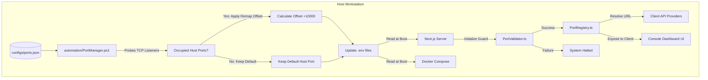

# Dynamic Port Management & Resolution System

This document details the architecture, configuration, and workflows of the dynamic Port Management System implemented across the AegisOS ecosystem.

---

## 1. System Architecture

The port management system ensures that AegisOS can run reliably on any host workstation by resolving active listener conflicts at runtime. It decouples **Host-side bindings** from **Container-internal networking**, allowing host-level port shifts (e.g., remapping PostgreSQL to `15432` if `5432` is occupied) while maintaining consistent inter-container links.



---

## 2. Port Registry Configuration (`ports.json`)

The primary source of truth for all service ports is [ports.json](file:///d:/1_Projects/OpenClawOllamaLiteLLM_Transparency/configs/ports.json). It defines the default host ports, internal container ports, protocol schemes, and dependencies.

### Registered Services

| Service Name | Default Host Port | Internal Container Port | Protocol | Purpose |
| -------------- | ------------------- | ------------------------- | ---------- | --------- |
| `console` | `3000` | `3000` | `http` | Next.js Dashboard UI |
| `telemetry` | `3001` | `3001` | `http` | WebSocket telemetry server |
| `grafana` | `3002` | `3000` | `http` | Observability dashboards |
| `litellm` | `4000` | `4000` | `http` | AI Routing Proxy / Gateway |
| `postgres` | `5432` | `5432` | `tcp` | Relational Database |
| `redis` | `6379` | `6379` | `tcp` | Caching / Rate Limiting |
| `openclaw` | `8000` | `8000` | `http` | Orchestrator Console |
| `caddy` | `8443` | `8443` | `https` | External HTTPS Gateway |
| `minio` | `9000` | `9000` | `http` | S3 Object Storage API |
| `minio_console` | `9001` | `9001` | `http` | MinIO Storage Console |
| `ollama` | `11434` | `11434` | `http` | Local inference engine |
| `aegisos` | `18789` | `18789` | `http` | AegisOS core gateway |
| `omniroute` | `20128` | `20128` | `http` | ELO arena ranking engine |
| `mongodb` | `27017` | `27017` | `tcp` | Conversation history DB |

---

## 3. Host Conflict Resolution (`PortManager.ps1`)

Before starting containerized stacks or SCM services, the automation controller invokes [PortManager.ps1](file:///d:/1_Projects/OpenClawOllamaLiteLLM_Transparency/automation/PortManager.ps1).

### Conflict Detection & Offset Algorithm

1. The script reads the default registry from `ports.json`.
2. It probes the active TCP network listeners on the host.
3. If a default port is occupied (e.g., host has native PostgreSQL running on `5432` or Redis on `6379`):
   - It calculates a remapped port by adding an offset of `10000` (e.g., `5432` &rarr; `15432`).
   - If the remapped port is also occupied, it increments the port number until an open socket is found.
4. It writes these overrides back to the environment configuration files (`.env`, `.env.local`, `.env.production`) as `HOST_PORT_<SERVICE>` and exposes `NEXT_PUBLIC_` base URLs for frontend mapping.

---

## 4. Application Integration

### Runtime Resolution (`PortRegistry.ts`)

The Next.js backend leverages [PortRegistry.ts](file:///d:/1_Projects/OpenClawOllamaLiteLLM_Transparency/src/platform/ports/PortRegistry.ts) to resolve dynamic URLs at runtime. It checks environment variables first, falling back to registry defaults:

- `PortRegistry.getHostPort("ollama")` returns the active host port.
- `PortRegistry.getServiceUrl("litellm")` compiles the fully qualified local base URL.

### Client-Side Environment Propagation

To ensure client-side code interacts with the correct ports, `PortManager.ps1` propagates `NEXT_PUBLIC_` variables. The frontend pages (`dashboard/page.tsx` and `settings/page.tsx`) parse these URLs dynamically:

```typescript
const ollamaPort = (() => {
  try {
    return parseInt(new URL(process.env.NEXT_PUBLIC_OLLAMA_URL || "http://127.0.0.1:11434").port) || 11434;
  } catch {
    return 11434;
  }
})();
```

---

## 5. Startup Validation Guard (`PortValidator.ts`)

To prevent runtime failures and maintain strict security, [PortValidator.ts](file:///d:/1_Projects/OpenClawOllamaLiteLLM_Transparency/src/platform/ports/PortValidator.ts) runs on Next.js startup (`instrumentation.ts`).

The validator performs the following checks:

- **Duplicate Assignments**: Ensures no two services are mapped to the same host port.
- **Bound Check**: Confirms port numbers are within valid boundaries (`1` to `65535`).

If any validation rule fails, the guard prints a diagnostic table and throws a fatal exception, halting the Platform Kernel boot sequence.

---

## 6. End-to-End Hardening

The port manager and registry system is fully covered by automated testing:

- **Unit Testing**: [PortRegistry.test.ts](file:///d:/1_Projects/OpenClawOllamaLiteLLM_Transparency/tests/unit/platform/ports/PortRegistry.test.ts) validates basic lookups and environment variable overrides.
- **E2E Integration Testing**: [PortManagementE2E.test.ts](file:///d:/1_Projects/OpenClawOllamaLiteLLM_Transparency/tests/unit/platform/ports/PortManagementE2E.test.ts) simulates complete conflict cascades, env file generation, and asserts that the startup guard halts execution on collisions or out-of-range bounds.
