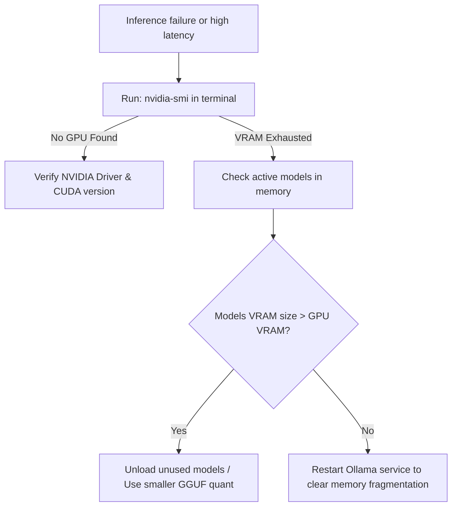
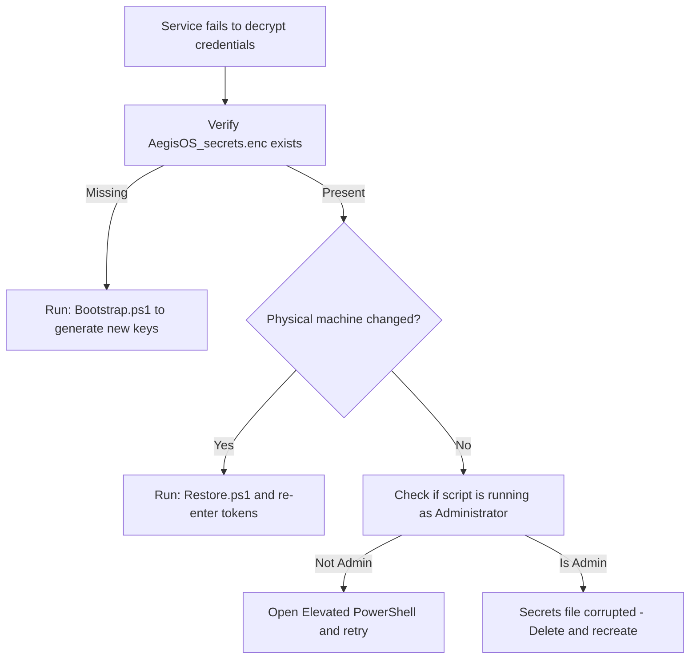
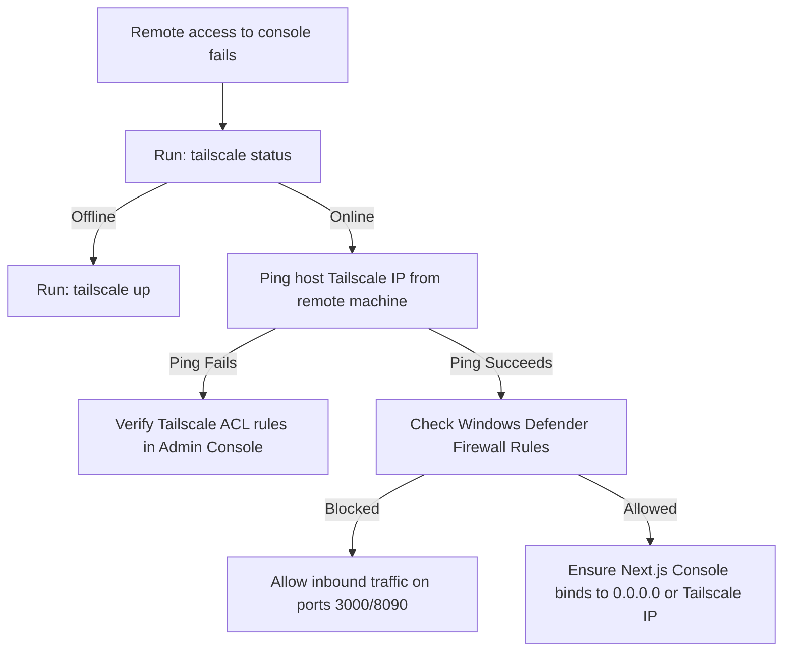

# Troubleshooting Guide

This guide provides structured diagnostic procedures and troubleshooting flowcharts to resolve issues with platform services, GPU acceleration, secure credentials, and Tailscale mesh networking.

---

## 1. Service Startup & SCM Diagnostics

When one or more platform services (Ollama, LiteLLM, AegisOS, OmniRoute) fail to start or halt unexpectedly, follow this diagnostic path:

### Service Startup Failure Diagnostic Flow

```mermaid
flowchart TD
    Start[Service fails to start] --> CheckSCM[Run: Get-Service in PowerShell]
    CheckSCM -->|Stopped| StartService[Run: Start-Service]
    StartService -->{Starts successfully?}
    
    StartService -->|No| CheckLogs[Check service logs in logs folder]
    CheckLogs --> CheckPortConflict{Check for port conflicts: netstat -ano}
    CheckPortConflict -->|Port in Use| KillProcess[Identify and kill process using port]
    CheckPortConflict -->|Port Free| CheckConfig[Verify configuration syntax: JSON/YAML]
    
    CheckConfig -->|Syntax Error| FixConfig[Correct config file syntax]
    CheckConfig -->|Valid Config| CheckPerms[Verify SCM Account privileges: LocalSystem]
```

### Common Service Errors & Resolutions
- **Port Conflict (Error: EADDRINUSE):**
  - **Issue:** Another process is listening on the service's configured port (e.g. port `11434` for Ollama, `4000` for LiteLLM, or `18789` for AegisOS).
  - **Resolution:** Identify the conflicting process and terminate it:
    ```powershell
    # Find process ID using port 11434
    Get-NetTCPConnection -LocalPort 11434 | Select-Object OwningProcess
    # Kill the process
    Stop-Process -Id <PID> -Force
    ```
- **NSSM Execution Failure (Error: "Paused or Stopped"):**
  - **Issue:** The executable target path is incorrect or missing.
  - **Resolution:** Verify service parameters in the registry:
    `HKLM\SYSTEM\CurrentControlSet\Services\<ServiceName>\Parameters`

---

## 2. GPU & CUDA Acceleration Diagnostics

If model inference falls back to CPU execution or crashes during generation, verify your GPU configuration.

### CUDA / GPU Memory Out-of-Memory Diagnostic Flow



### Resolving GPU Memory Limitations
1.  **VRAM Exhaustion (OOM):**
    - Running multiple large models concurrently (e.g., Llama-3-70B and Codestral) can exceed your GPU VRAM (e.g., 16 GB).
    - **Resolution:** Use quantized models (e.g., Q4_K_M quants) or unload models from memory before starting new sessions:
      ```bash
      # Force Ollama to unload models
      curl http://127.0.0.1:11434/api/generate -d '{"model": "qwen2.5-coder:7b", "keep_alive": 0}'
      ```
2.  **Missing CUDA Acceleration:**
    - If Ollama runs slowly on CPU, ensure the CUDA toolkit version matches the installed NVIDIA graphics driver. Run `nvidia-smi` to verify.

---

## 3. Secure Token & DPAPI Diagnostics

Decryption errors occur when the secure configuration is corrupted or migrated to a different machine.

### DPAPI Secrets Recovery Flow



### Steps to Reset Credentials
If the secrets payload is corrupted:
1.  Navigate to the secrets directory: `$PlatformRoot\secrets\`
2.  Delete the file `AegisOS_secrets.enc`.
3.  Open an elevated PowerShell session and execute `.\Bootstrap.ps1` to re-enter and securely encrypt your credentials.

---

## 4. Tailscale & Mesh VPN Diagnostics

When remote developers cannot access the Next.js Web Console or API endpoints over the Tailscale network:

### Tailscale Access Failure Diagnostic Flow



### Resolving Firewall Blocks
Ensure that Windows Defender Firewall allows ingress traffic on Tailscale network adapters:
```powershell
# Allow inbound TCP port 3000 (Next Console) on Tailscale adapter profile
New-NetFirewallRule -DisplayName "Allow Next.js Console Ingress" -Direction Inbound -LocalPort 3000 -Protocol TCP -Action Allow -Profile Public
```
