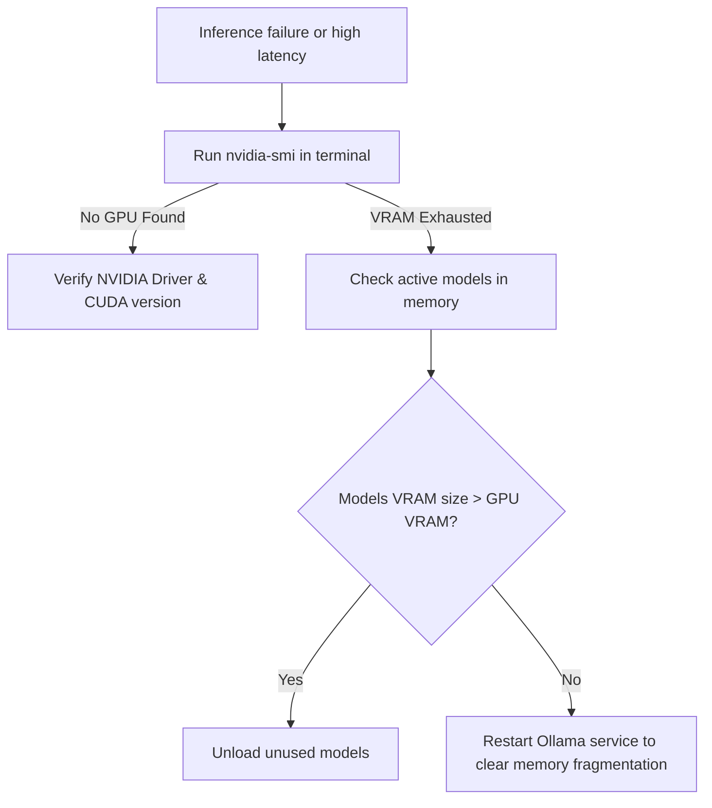

# Troubleshooting Guide

| Metadata | Value |
|---|---|
| **Document ID** | TG-2026-001 |
| **Version** | 1.2.0 (Active) |
| **Last Synced** | 2026-07-20 05:40:00 |
| **Classification** | Public — Diagnostic Runbook |
| **Authority** | Platform Support Board |

This guide provides diagnostic procedures to resolve issues with platform services, GPU VRAM exhaustion, DPAPI credentials, and Digital Twin state drift.

---

## 1. Service Startup & SCM Diagnostics

When services fail to initialize, check the SCM registry parameters.

### Service Startup Failure Diagnostic Flow

```mermaid
flowchart TD
    Start[Service fails to start] --> CheckSCM[Run Get-Service in PowerShell]
    CheckSCM -->|Stopped| StartService[Run Start-Service]
    StartService -->{Starts successfully?}
    
    StartService -->|No| CheckLogs[Check service logs in logs folder]
    CheckLogs --> CheckPortConflict{Check for port conflicts: netstat}
    CheckPortConflict -->|Port in Use| KillProcess[Identify and kill process using port]
    CheckPortConflict -->|Port Free| CheckConfig[Verify configuration JSON/YAML]
    
    CheckConfig -->|Syntax Error| FixConfig[Correct config file syntax]
    CheckConfig -->|Valid Config| CheckPerms[Verify SCM account privileges]
```

### Port Conflicts (EADDRINUSE)
AegisOS Gateway uses port `18789`, LiteLLM uses `4000`, and Ollama uses `11434`. Identify the process holding the port:
```powershell
# Get the process ID using the port
Get-NetTCPConnection -LocalPort 18789 -ErrorAction SilentlyContinue | Select-Object OwningProcess
# Kill the process holding port 18789
Stop-Process -Id <PID> -Force
```

---

## 2. Digital Twin State Drift & Self-Healing

The Convergence Engine checks system states against the physical environment every 30 seconds.

### Resolving Drift Alarms
If the console displays state mismatch alerts or logs entries in `DigitalTwinDriftLog`:
1. Check the drift details in the database:
   ```bash
   sqlite3 D:\AIPlatform\databases\dev.db "SELECT driftDetails, reconciledAt FROM DigitalTwinDriftLog ORDER BY timestamp DESC LIMIT 5;"
   ```
2. The Self-Healing framework automatically triggers SCM restarts for stopped services. If self-healing fails, check if the service executables are missing or if the service user lacks local file privileges.
3. Manually trigger a full state reconciliation via the Console API or PowerShell:
   ```powershell
   Invoke-RestMethod -Uri "http://localhost:3000/api/v1/control-plane/reconcile" -Method Post
   ```

---

## 3. GPU VRAM Exhaustion & Latency

If models run slowly or exit with memory allocation errors, GPU VRAM may be exhausted.

### CUDA memory allocation failure (OOM)



### Unloading Models from GPU
If multiple large models remain loaded, force Ollama to release the active context:
```bash
curl http://127.0.0.1:11434/api/generate -d "{\"model\": \"deepseek-r1:32b\", \"keep_alive\": 0}"
```

---

## 4. ECP Safety Firewall & Prompt Injection Blocks

The Executive Control Plane (ECP) at Layer 5 intercepts incoming prompts to protect the system.

### Troubleshooting Blocked Prompts
1. **PII Redaction**: ECP blocks or redacts variables matching patterns for credit cards, SSNs, or API keys. Verify if your prompt inputs contain test keys that look like secrets.
2. **Hallucination Flags**: If the grounding score falls below `0.80`, ECP marks the request with a warning scorecard. Re-index the RAG search directory to resolve stale context:
   ```powershell
   # Trigger re-indexing job
   Invoke-RestMethod -Uri "http://localhost:3000/api/v1/knowledge/reindex" -Method Post
   ```
3. **Security Guardrail Overrides**: System administrators can view security incidents under the Console's Security Audit tab. Overrides can be executed via elevated credentials signed by the C2 Mobile Companion.
