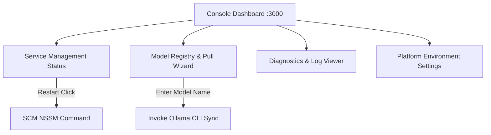
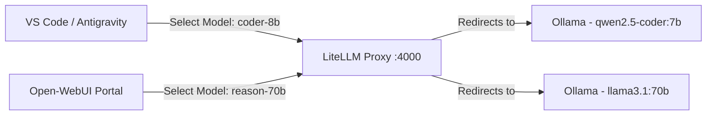
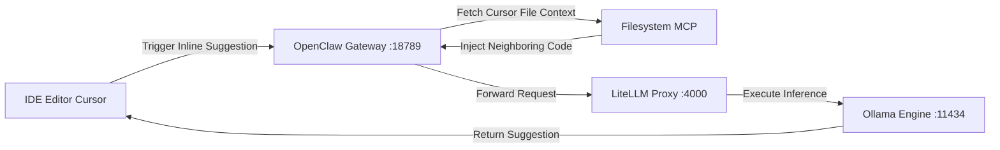

# User Guide

This guide describes how to operate the AI Workstation platform, manage local models, configure IDE integrations, and extend platform capabilities using custom plugins.

---

## 1. Quick Start: Starting & Stopping Services

The AI Workstation services run in the background. You can manage them using either the Next.js Web Console or PowerShell commands.

### Dashboard Navigation Flow



### Managing Services via CLI (Admin PowerShell)
To manage services directly from the command line:
```powershell
# Check service uptime status
Get-Service -Name "Ollama", "LiteLLMService", "OpenClawService"

# Start the gateway and model proxies
Start-Service -Name "Ollama", "LiteLLMService", "OpenClawService"

# Stop all services to free GPU resources
Stop-Service -Name "Ollama", "LiteLLMService", "OpenClawService"
```

---

## 2. Local Model Synchronization & Proxies

The workstation uses LiteLLM to proxy requests, allowing you to switch between models without modifying your client settings.



### Pulling a New Model
To download and register a model weight (e.g. `llama3`):
1.  **Via Console:** Open the Web Console, go to **Model Registry**, type `llama3` in the pull input box, and click **Pull**.
2.  **Via CLI:** Execute:
    ```bash
    ollama pull llama3
    ```
The new model will be automatically registered in the LiteLLM load balancer and become available at the proxy endpoint `http://localhost:4000/v1/models`.

---

## 3. Integrating Editors & Clients

To use local models for code completion, refactoring, and conversational programming, connect your local applications to the API Gateway.

### Code Completion Request Ingestion Flow

The following diagram shows how code completion requests are routed and enriched:



### VS Code (Continue Extension) Configuration
Add the following configuration to your `config.json` in VS Code to point the Continue extension to the local gateway:
```json
{
  "models": [
    {
      "title": "Local Autocomplete (Qwen)",
      "provider": "openai",
      "model": "qwen2.5-coder:7b",
      "apiBase": "http://127.0.0.1:4000/v1"
    }
  ],
  "tabAutocompleteModel": {
    "title": "Local Tab Completion",
    "provider": "openai",
    "model": "qwen2.5-coder:1.5b",
    "apiBase": "http://127.0.0.1:4000/v1"
  }
}
```

---

## 4. Developing Custom Agent Plugins (MCP)

You can extend the workstation's context capabilities by writing custom tools and registering them with the Model Context Protocol (MCP) server layer.

### MCP Plugin Integration Lifecycle

```mermaid
flowchart TD
    A[Write Custom Node.js script] --> B[Register tool definitions in config]
    B --> C[Restart OpenClawService]
    C --> D[MCP Host initializes connection]
    D --> E[Model queries new tool context]
    E --> F[Tool executes action on host]
end
```

### Creating a Custom Tool (Node.js Example)
To create a custom filesystem tool that extracts file metadata:
1.  Add the script to `src/infrastructure/watcher/` or register a new module under `src/modules/`:
    ```typescript
    import { Server } from "@modelcontextprotocol/sdk/server/index.js";
    import { StdioServerTransport } from "@modelcontextprotocol/sdk/server/stdio.js";
    import { CallToolRequestSchema, ListToolsRequestSchema } from "@modelcontextprotocol/sdk/types.js";

    const server = new Server({ name: "my-custom-mcp", version: "1.0.0" }, { capabilities: { tools: {} } });

    server.setRequestHandler(ListToolsRequestSchema, async () => ({
      tools: [{
        name: "get_file_size",
        description: "Returns the size of a specified local file.",
        inputSchema: { type: "object", properties: { path: { type: "string" } }, required: ["path"] }
      }]
    }));

    server.setRequestHandler(CallToolRequestSchema, async (request) => {
      if (request.params.name === "get_file_size") {
        // Implement size retrieval logic here
        return { content: [{ type: "text", text: "File size is 4562 bytes" }] };
      }
      throw new Error("Tool not found");
    });

    const transport = new StdioServerTransport();
    await server.connect(transport);
    ```
2.  Register the tool command in the OpenClaw configuration file located at `$PlatformRoot\configs\openclaw_config.json`.
3.  Restart the `OpenClawService` service to apply changes.
