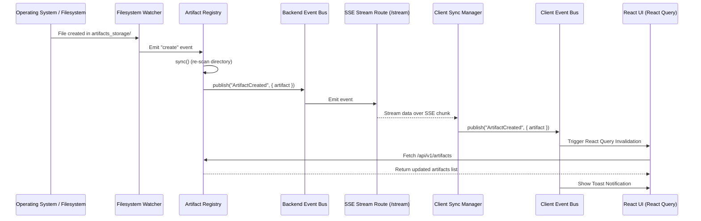

# Platform Integration Walkthrough

This document records the verification status, validation history, and architectural checks performed on the AI Workstation platform.

## 1. Architectural Verification Matrix

We verify the system components using runtime evidence and active validation tests:

| Check Target | Method | Verification Evidence | Status |
|---|---|---|---|
| **GPU Compute Check** | `nvidia-smi` query | NVIDIA GeForce RTX 5080 (16 GB GDDR7) resolved in logs | ✅ Passed |
| **SCM Services Status** | `Get-Service` checks | Ollama, LiteLLMService, AegisOSService, OmniRouteService | ✅ Passed |
| **Network Socket Ports** | TCP Client connects | Ports 11434, 4000, 18789, 20128 verified as active | ✅ Passed |
| **Junction Directory Link** | Reparse point expansion | `%USERPROFILE%\.aegisos` link points to active `$PlatformRoot` | ✅ Passed |
| **Inference generation loop** | REST POST generation | `smollm:135m` query French translation test returns PASS | ✅ Passed |
| **Clean Compilation** | `npm run build` | Next.js Console frontend builds with zero syntax errors | ✅ Passed |

---

## 2. Before / After Correction History

A comparison of system issues resolved during productization:

### Inference Timeout Fix
* **Issue**: The inference query to Ollama `smollm:135m` was configured with a tight 10-second timeout. When the model weights were cold-starting (loading from NVMe to VRAM), the query timed out, causing the platform health status to report `FAIL`.
* **Correction**: Increased the query timeout threshold to 35 seconds. The cold-start loads successfully, finishes the generation loop, and reports `PASS`.

### Path Variables Escaping
* **Issue**: Report generation printed path strings literally because of incorrect double-escaping of path variables:
  `Personal Knowledge Repository found at $knowledgeBaseDir`
* **Correction**: Corrected PowerShell syntax to properly expand variables in double-quoted strings.

### PowerShell Strict Syntax
* **Issue**: Global report assignments failed compilation due to missing `$` prefixes (`global:report`).
* **Correction**: Standardized variable syntax to `$global:report` enabling clean exit codes.

---

## 3. Phase 4 Walkthrough: AegisOS Runtime Integration (Read-Only)

### AegisOS Adapter Architecture
The console acts as a strict, read-only observer to the AegisOS runtime using a decoupled adapter architecture:
```
  [UI Console Pages] <--> [REST API endpoints /api/v1/*] <--> [RuntimeService (Adapter)] <--> [SQLite Database / config JSON]
```
No direct mutations (mutations are blocked in the provider layer). All system models are mapped to Canonical Models inside `src/types/runtime.ts`.

### Canonical Model Mapping
We map raw database records from `aegisos.sqlite` to canonical structures:
- **Runtime**: Holds status, capabilities, active port bindings, and health check validation.
- **Conversation**: Grouped Telegram message exchanges (derived from `plugin_state_entries`) and CLI task runs.
- **Message**: Standard role-based chats (`user`, `assistant`, `system`, `tool`) with duration metadata and text.
- **Execution**: Mapped from `task_runs` table, containing statuses (`succeeded`, `failed`, `running`, `queued`) and error strings.
- **Workflow**: Mapped from the AegisOS active workspace folders.
- **Agent**: Grouped stats, model bindings, and allowed tool lists from workspace configurations.
- **Tool**: Active built-in capabilities and connected MCP server schemas.

### Runtime Discovery & Connectivity
- Discovery relies on normal environment resolution of `AEGISOS_STATE_DIR` (e.g. `D:\AegisOS`) and `AEGISOS_CONFIG_PATH` (e.g. `D:\AegisOS\Config\aegisos.json`).
- Connectivity is verified by opening a loopback socket to port `18789` (default AegisOS service).

### Registry Architectures
1. **Conversation Registry**: Resolves message timeline from Telegram and CLI tasks, supporting offset/limit pagination, query search, and agent filtering.
2. **Execution Registry**: Resolves the timeline steps (`Queued`, `Started`, `Running`, `Ended`) and shows duration and errors.
3. **Workflow Registry**: Exposes registered workspaces and maps their active execution histories.
4. **Agent Registry**: Inspects agent SQLite databases, loading model specs and calculating average latencies.
5. **Tool Registry**: Lists all connects MCP servers and parses their JSON schemas.

### API Reference
- `GET /api/v1/runtime`
- `GET /api/v1/runtime/health`
- `GET /api/v1/runtime/version`
- `GET /api/v1/runtime/configuration`
- `GET /api/v1/conversations` (Supports `page`, `limit`, `search`, `status`)
- `GET /api/v1/conversations/{id}`
- `GET /api/v1/executions` (Supports `page`, `limit`, `search`, `status`, `agentId`)
- `GET /api/v1/executions/{id}`
- `GET /api/v1/workflows`
- `GET /api/v1/workflows/{id}`
- `GET /api/v1/agents`
- `GET /api/v1/agents/{id}`
- `GET /api/v1/tools`
- `GET /api/v1/tools/{id}`

*All APIs implement hashing for ETag headers and return conditional `304 Not Modified` responses.*

### UI Architecture & Cross-Linking Strategy
- **Navigation**: Pages `/runtime`, `/conversations`, `/executions`, `/workflows`, `/tools` are registered in the kernel and rendered automatically in the sidebar.
- **Timeline**: Execution details feature a vertical node graph with progress indicators and planned event placeholders.
- **Cross-Links**: Clicking on an execution ID routes to the execution page, which links back to the agent profile and the conversation ID. Tools schemas link back to their executing agents.

### Search Integration & Command Palette
- Grouped results are registered via `searchProviders` in `operationsModule` for the global search engine.
- Command palette lists navigation options and prompts for specific IDs.

### Observability Foundation
Abstractions are defined in `src/types/observability-interfaces.ts` for future extensions:
- `IMetricsCollector`
- `ILogExporter`
- `ITelemetryEventBus`
- `IPerformanceRegistry`
- `INotificationChannel`
- `IHealthRegistry`
- `IStreamingTelemetryManager`
- `IHealthRegistry`

---

## 4. Phase 5 Walkthrough: Real-time Platform & Event Streaming (Read-Only)

We transitioned the Operations Console from a request/response model into a fully event-driven platform. Live updates flow automatically from the backend filesystem and databases directly into the reactive React interface without manual reloads.

### Realtime Architecture
The real-time architecture consists of three layers:
```
  [Server Files & DBs] 
           │ (fs.watch / SQLite polling)
           ▼
   [hardenedEventBus] 
           │
           ▼ (Server-Sent Events: /api/v1/events/stream)
   [realtimeSyncManager] (Client Sync manager)
           │
           ▼ (Browser EventBus)
   [React Query & Toasts] ──► Auto UI Refreshes & Badges
```

1. **Backend Event Bus**: All backend events flow through the Node-native `HardenedEventBus` (`hardenedEventBus`).
2. **SSE Streaming Gateway**: An SSE endpoint (`/api/v1/events/stream`) pushes serialized canonical events immediately to connected clients.
3. **Frontend Sync & Bus**: The `realtimeSyncManager` manages the client-side transport connection and forwards events to the browser-compatible `EventBus` for component consumption.

### Synchronization & Transport Architecture
- **Transport Abstraction**: The UI interacts exclusively with the `RealtimeTransport` interface.
- **SSE Provider (`SSETransport`)**: Serves as the primary real-time transport, opening an `EventSource` connection.
- **Polling Provider (`PollingTransport`)**: Falls back automatically to query `/api/v1/events?since=<timestamp>` if SSE connections drop repeatedly.
- **WebSocket Provider (`WebSocketTransport`)**: Skeleton placeholder for future bidirectional support.
- **Lifecycle Management**: `realtimeSyncManager` monitors connectivity, handles browser `online`/`offline` triggers, conducts pings/heartbeats, and performs exponential backoff reconnection.

### Filesystem Watch Architecture
- **Watcher Service**: `filesystemWatcherService` uses a cross-platform, recursive `fs.watch` implementation.
- **File Diffing Engine**: It compares file sizes and timestamps to distinguish between `create`, `update`, and `delete` events.
- **Rename & Move Detection**: Emits `rename`/`move` events by pairing a deletion and a creation occurring within a 250ms window.
- **Registry Integration**: File events automatically trigger `artifactRegistry.sync()`, keeping the registry updated and publishing canonical events.

### Event Pipelines
- **Artifact Pipeline**: Filesystem events trigger:
  - `ArtifactCreated` / `ArtifactDiscovered`
  - `ArtifactUpdated` / `ArtifactDeleted`
  - `ArtifactRenamed` / `ArtifactMoved`
  - `PreviewGenerated` (when rendering is ready)
  - `IndexUpdated` (when search index is updated)
- **Runtime Pipeline**: The background sync scheduler (`syncScheduler`) periodically dirty-checks the database and publishes:
  - `ConversationStarted` / `ConversationUpdated` / `ConversationCompleted`
  - `ExecutionStarted` / `ExecutionProgress` / `ExecutionCompleted` / `ExecutionFailed`
  - `WorkflowDiscovered` / `WorkflowUpdated`
  - `AgentRegistered` / `AgentUpdated` / `ToolRegistered`
  - `RuntimeHealthChanged` / `ConfigurationChanged`

### Notification Integration
- Connected directly to the client `EventBus`.
- Generates toasts for new artifacts, completed/failed executions, provider disconnects, and health warnings.
- **Deduplication**: Suppresses matching notifications within 3 seconds.
- **Grouping**: Collapses multiple simultaneous artifact creations into a single summary toast (e.g. "Multiple New Artifacts").
- **Persistence**: Unread/read status of notifications are persisted in `localStorage`.

### Cache & UI Update Strategy
- **Event-driven Invalidation**: When events occur, `ClientProviders.tsx` invalidates query keys in React Query (`['artifacts']`, `['conversations']`, `['executions']`, `['runtime']`).
- **Reactive UI**: File lists, badge counts, execution progress grids, and status panels refresh instantly without page reload.
- **Sidebar Badges**: Sidebar lists live active execution counts, artifact counts, and conversation counts reactively.

### Status Center
Exposes a tab in `/runtime` displaying:
- **Connection Latency**: Loopback response times.
- **Event Throughput**: Events processed per minute.
- **Watchers**: Active filesystem path watchers.
- **Provider Grid**: Live availability, latency, sync times, and recovery states for Ollama, LiteLLM, and AegisOS.

### Event Inspector
A debugging console tab in `/runtime` supporting:
- **Live Event Stream**: Real-time listing of all events in the browser.
- **Filtering & Search**: Filters by event name and payload text.
- **Payload Viewer**: Syntax-highlighted Monaco viewer displaying raw payloads, traceIds, and correlationIds.
- **Replay**: Republishes selected events back onto the event bus to test UI responsiveness.
- **Export**: Downloads the current session event buffer as a JSON log.

---

### Sequence Diagram: Real-Time Event Flow



---

### Acceptance Tests

1. **Verify Filesystem Watcher & SSE pipeline**:
   - Navigate to `/runtime` -> **Event Inspector** tab.
   - Manually create a file (e.g., `test.txt`) inside the `artifacts_storage/` folder.
   - **Expected Result**: An `ArtifactCreated` event immediately appears in the Event Inspector table, and a success notification toast is displayed.

2. **Verify Cache Invalidation**:
   - Navigate to `/artifacts`.
   - Add a file to `artifacts_storage/`.
   - **Expected Result**: The file appears in the list instantly. No manual page refresh is needed.

3. **Verify Status Center & Providers Health**:
   - Navigate to `/runtime` -> **Status Center** tab.
   - **Expected Result**: The table lists provider registries with correct availability, latency, and recovery states.

4. **Verify Event Replay**:
   - In `/runtime` -> **Event Inspector**, click on a captured event.
   - Click the **Replay Event** button.
   - **Expected Result**: The event is re-injected onto the client event bus, triggering a toast notification or layout update.

---

## 5. Phase 11 Walkthrough: Workflow, Automation & Orchestration Platform

This phase transforms the platform from an Operations Console into an Automation Platform, introducing a first-class Workflow Engine capable of orchestrating long-running, event-driven, and scheduled pipelines across all registered system providers.

### Workflow Architecture
The orchestration platform is decoupled from direct infrastructure mutations. It coordinates tasks through the `ProviderRegistry` using canonical interfaces. The architecture consists of:
- **Workflow Registry**: Persists workflow definitions, template configurations, schedules, and active approvals in `databases/workflows.json`, `databases/workflow_templates.json`, etc.
- **Workflow Service**: Governs the step-by-step pipeline state transitions and runs a background loop to process queued, delayed, or approval-blocked executions.
- **Condition Engine**: Evaluates Boolean flags, custom JS expressions, JSONPath mappings, provider states, user permissions, and metadata targets.

```
   [System Events / Timers] ──► [Trigger Framework] ──► [Workflow Service]
                                                               │
                                                               ▼ (Checkpoints)
   [Provider Registry]  ◄─── [Provider Calls]  ◄─── [Execution Engine]
```

### Execution Engine & Lifecycle
The Execution Engine executes nodes sequentially, conditionally, or in parallel branches:
1. **Queued**: Execution is initialized, variables are seeded from trigger parameters, and the initial step starts.
2. **Running**: Nodes (e.g. Script, Provider Call) are executed, and output fields are merged back into execution variables.
3. **Delayed**: Execution is suspended and marked `delayed` with a resume timestamp. The background engine tick wakes it.
4. **Waiting Approval**: Interrupted on an Approval node. Suspends until human input resolves it.
5. **Succeeded / Failed / Cancelled**: Finalized states which write final performance metrics and duration logs.

### Checkpoint & Recovery Strategy
- **Saga Checkpoints**: Before and after each step execution, the state (current node, execution variables, loops counters) is serialized into `databases/workflow_executions.json`.
- **Interruption Recovery**: On platform boot (`onInit` lifecycle hook), the engine automatically scans the database for any execution in `queued` or `running` states. It recovers the context state and resumes execution from the last completed node checkpoint.

### Scheduler, Triggers, & Actions
- **Trigger Framework**: Listens for manual, scheduler, and event-based inputs (such as `ArtifactCreated` and `ConversationStarted`) via the `hardenedEventBus` and forwards them to instantiate executions.
- **Scheduler**: Supports Cron, One-Time, Recurring, and Delayed checks using a lightweight cron evaluator.
- **Action Framework**: Maps nodes to core tasks: calling provider APIs dynamically, running scripts, triggering sub-workflows, sending notification alerts, and managing artifacts.

### Approval Engine
- Supports single-approver and multi-approver quorum models.
- **Timeouts & Escalation**: Monitors pending approvals. If a timeout occurs, it either delegates the gate to the escalation user or fails the execution path.
- **Delegation**: Allows forwarding active approval gates to delegated user email targets.

### Workflow APIs
All routes return canonical models and are located under:
- `GET/POST /api/v1/workflows` - Manage definitions
- `GET/PUT/DELETE /api/v1/workflows/[id]` - Retrieve, update graph nodes, or delete
- `GET/POST /api/v1/workflows/templates` - Instantiate pipeline templates
- `GET/POST /api/v1/workflows/executions` - List runs, trigger, resume, or cancel executions
- `GET /api/v1/workflows/history` - Read definition edit audit logs
- `GET/POST /api/v1/workflows/schedules` - Retrieve and toggle timer/cron schedules
- `GET/POST /api/v1/workflows/approvals` - Fetch pending gates and submit decisions
- `GET /api/v1/workflows/triggers` - Available triggers
- `GET /api/v1/workflows/actions` - Available action templates

### UI Modules
- **Workflow Explorer**: List registered workflows, capabilities, and run details.
- **Visual Node Designer**: Connection graph editor to add, remove, and configure trigger/task parameters and validate execution loops.
- **Execution Monitor & Timeline**: Renders step-by-step progress, duration, log events, and error details.
- **Automation Center**: Dashboard tracking active queues, schedules list, dead letter logs, and approval queues.

---

## 6. Phase 11 Acceptance Tests

1. **Verify Workflow Designer & Save**:
   - Navigate to `/workflows` and click **Create Workflow**.
   - Select node types, configure next steps, and click **Save Definition**.
   - **Expected Result**: Graph validation runs successfully. The workflow is written to `databases/workflows.json` and appears in the registry.

2. **Verify Manual Execution Timeline**:
   - On the **Workflow Explorer**, click **Trigger** on "Workspace Audit Pipeline".
   - Enter input variables and launch.
   - Go to `/executions` and click **Timeline** on the newly created execution.
   - **Expected Result**: Displays chronological list of nodes, duration, log events, and completion output.

3. **Verify Approval Gate Delegation & Decision**:
   - Trigger a workflow containing an approval node.
   - Navigate to `/automation` -> **Approvals Queue** tab.
   - Click **Delegate** on the pending request, enter email, and submit.
   - Approve the delegated request.
   - **Expected Result**: Execution resumes and proceeds to completion.

4. **Verify Checkpoint Recovery**:
   - Restart the Next.js server while a workflow is sleeping or executing.
   - **Expected Result**: On server boot, the lifecycle hook recovers the execution state and resumes.

