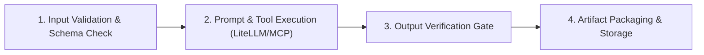

# AegisOS Official Mission Pack Specifications
## Declarative Specifications & Schemas for Domain Mission Packs

> **Status**: APPROVED & OPERATIONAL  
> **Target Version**: AegisOS Ecosystem 1.0  
> **Scope**: 8 Official Mission Packs  

---

## 1. Mission Pack Specification Standard

An **Official Mission Pack** is a standardized, version-controlled bundle containing declarative mission definitions, execution pipelines, prompt templates, verification contracts, and UI widgets.

```json
{
  "$schema": "https://aegisos.dev/schemas/v1/mission-pack.schema.json",
  "id": "com.aegisos.pack.swe",
  "name": "Software Engineering Pack",
  "version": "1.0.0",
  "publisher": "AegisOS Official Workgroups",
  "description": "Comprehensive mission pack for code generation, refactoring, code review, and unit testing.",
  "missions": [
    "swe.feature_implementation",
    "swe.code_review",
    "swe.unit_test_generation",
    "swe.refactoring_audit"
  ],
  "dependencies": {
    "platform": "^1.0.0",
    "sdk": "^1.0.0"
  }
}
```

---

## 2. Specification of 8 Official Mission Packs

### 2.1 Software Engineering Pack (`com.aegisos.pack.swe`)
- **Purpose**: Autonomous code generation, refactoring, unit testing, and pull request audits.
- **Included Missions**:
  1. `swe.feature_implementation`: Converts feature specs into tested code.
  2. `swe.code_review`: Performs static & style analysis against clean code standards.
  3. `swe.unit_test_generation`: Generates unit tests achieving high coverage.
  4. `swe.refactoring_audit`: Identifies code smell & Ponytail over-engineering.
- **Verification Gate**: 100% compilation pass rate, zero lint regressions.

### 2.2 Product Management Pack (`com.aegisos.pack.pm`)
- **Purpose**: PRD synthesis, user story decomposition, and friction log analysis.
- **Included Missions**:
  1. `pm.prd_generation`: Synthesizes raw requirements into standard PRDs.
  2. `pm.story_decomposition`: Decomposes epics into executable developer tasks.
  3. `pm.friction_analysis`: Analyzes user friction telemetry and maps backlog priorities.
- **Verification Gate**: Acceptance criteria presence validation on all generated stories.

### 2.3 Architecture Review Pack (`com.aegisos.pack.arch`)
- **Purpose**: ADR generation, system boundary verification, and dependency mapping.
- **Included Missions**:
  1. `arch.adr_creation`: Generates standard Architecture Decision Records (ADRs).
  2. `arch.dependency_audit`: Scans project graph for coupling and circular dependencies.
  3. `arch.threat_modeling`: Identifies security boundaries and potential injection risks.
- **Verification Gate**: ADR template compliance check.

### 2.4 Enterprise Operations Pack (`com.aegisos.pack.ops`)
- **Purpose**: System telemetry monitoring, incident RCA generation, and SLA auditing.
- **Included Missions**:
  1. `ops.rca_generation`: Analyzes system logs and builds Root Cause Analysis reports.
  2. `ops.sla_audit`: Evaluates uptime, latency, and error budgets.
  3. `ops.runbook_execution`: Executes diagnostic runbooks for operational anomalies.
- **Verification Gate**: Multi-metric correlation check across Prometheus & log events.

### 2.5 Research Pack (`com.aegisos.pack.research`)
- **Purpose**: Deep literature search, RAG synthesis, and claim verification.
- **Included Missions**:
  1. `research.paper_synthesis`: Summarizes academic PDFs into key findings.
  2. `research.claim_verification`: Cross-references claims against local vector knowledge base.
  3. `research.report_generation`: Assembles literature reviews with Markdown formatting.
- **Verification Gate**: Citation accuracy index check > 95%.

### 2.6 Personal Productivity Pack (`com.aegisos.pack.productivity`)
- **Purpose**: Daily task organization, meeting summarization, and local memory lookup.
- **Included Missions**:
  1. `productivity.daily_briefing`: Generates morning action items based on active projects.
  2. `productivity.meeting_summary`: Summarizes transcript notes into action items.
  3. `productivity.memory_indexing`: Indexes personal notes into private vector database.
- **Verification Gate**: Local-first privacy audit (0 external outbound calls).

### 2.7 Security Assessment Pack (`com.aegisos.pack.security`)
- **Purpose**: OWASP vulnerability scanning, secret detection, and permissions audit.
- **Included Missions**:
  1. `security.vulnerability_scan`: Scans codebase for OWASP Top 10 risks.
  2. `security.secret_detection`: Detects accidentally committed credentials or API keys.
  3. `security.rbac_audit`: Verifies JWT and role-based access rules.
- **Verification Gate**: Zero false negative rate on committed credentials check.

### 2.8 Infrastructure Operations Pack (`com.aegisos.pack.infra`)
- **Purpose**: Docker/Kubernetes config validation, IaC auditing, and disaster recovery testing.
- **Included Missions**:
  1. `infra.k8s_validation`: Validates Helm values and K8s manifests.
  2. `infra.docker_audit`: Scans Dockerfile for multi-stage build efficiency and non-root user execution.
  3. `infra.dr_checklist`: Verifies database backup scripts and restore readiness.
- **Verification Gate**: Container security scan pass.

---

## 3. Mission Pack Execution Pipeline & Verification Contract

Every mission within a pack executes through a standard 4-step pipeline:


