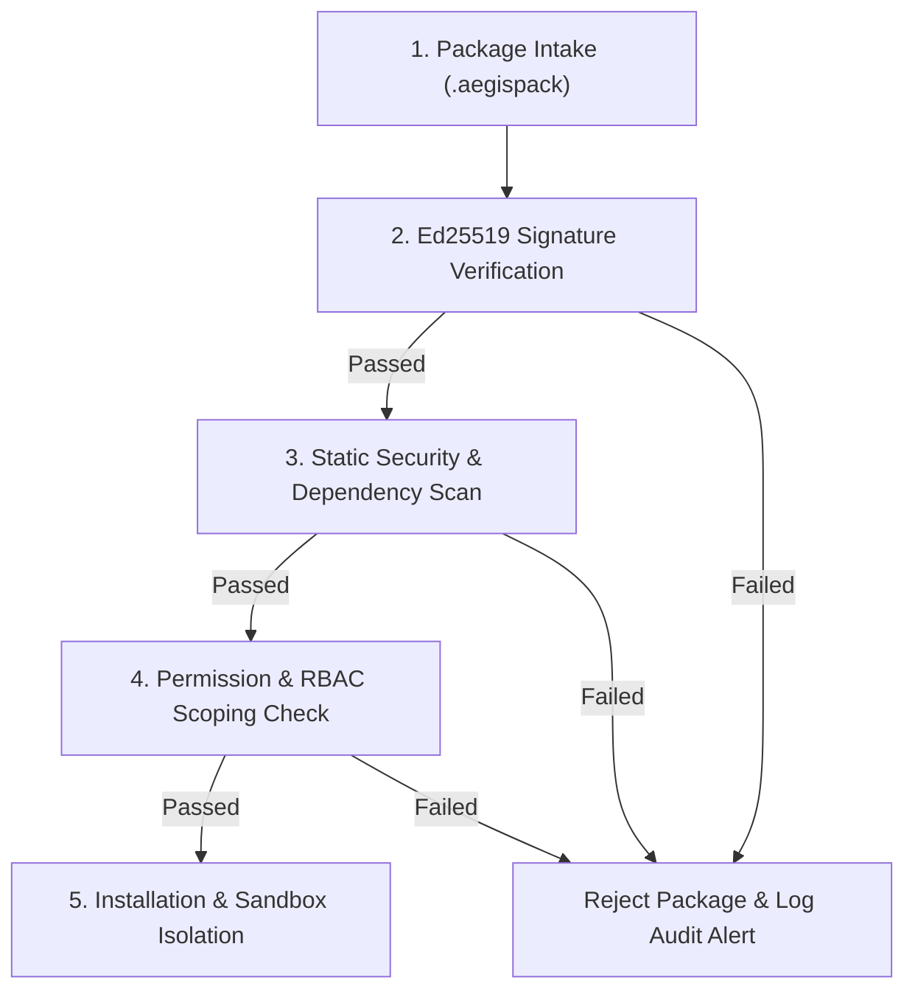

# AegisOS Marketplace Architecture
## Architectural Design for the 5-Tiered AegisOS Marketplace System

> **Status**: APPROVED & OPERATIONAL  
> **Target Version**: AegisOS Ecosystem 1.0  
> **Scope**: Capability, Mission, Template, Prompt, and Extension Marketplaces  

---

## 1. Overview & Architectural Principles

The **AegisOS Marketplace System** enables safe discovery, verification, installation, and management of ecosystem assets across local workstations and enterprise fleets.

```
┌─────────────────────────────────────────────────────────────────────────────┐
│                      AEGISOS MARKETPLACE ARCHITECTURE                       │
├─────────────────┬─────────────────┬─────────────────┬───────────────────────┤
│ 1. Capability   │ 2. Mission      │ 3. Template     │ 4. Prompt             │
│ Marketplace     │ Marketplace     │ Marketplace     │ Marketplace           │
├─────────────────┴─────────────────┴─────────────────┴───────────────────────┤
│ 5. Extension Marketplace                                                    │
├─────────────────────────────────────────────────────────────────────────────┤
│ Security & Verification Engine (Ed25519 Cryptographic Signatures + Sandbox) │
├─────────────────────────────────────────────────────────────────────────────┤
│ Module Registry Service (`src/platform/module-registry`)                    │
└─────────────────────────────────────────────────────────────────────────────┘
```

### Key Architectural Principles
- **Local-First & Offline Capable**: Assets can be downloaded, cached, and installed completely offline via `.aegispack` archives.
- **Cryptographic Trust**: Every asset published to the marketplace is signed using Ed25519 asymmetric keys.
- **Enterprise Private Registry Support**: Organizations can host private marketplace mirrors within their corporate firewalls.

---

## 2. The Five Marketplace Tiers

### 2.1 Capability Marketplace
Distributes low-level infrastructure modules, database adapters, local inference engine plugins, and Model Context Protocol (MCP) server bindings.

### 2.2 Mission Marketplace
Distributes domain-specific mission packs (`.pack` files) containing multi-step workflow pipelines, verification rules, and automated prompts.

### 2.3 Template Marketplace
Distributes workspace layout templates, starter code repositories, extension boilerplate projects, and UI dashboard configurations.

### 2.4 Prompt Marketplace
Distributes version-controlled prompt templates, domain persona definitions, system instruction sets, and structured output formatters.

### 2.5 Extension Marketplace
Distributes end-user UI extensions, React components, custom workspace widgets, and admin dashboard panels.

---

## 3. Package Format & Cryptographic Security Model

### 3.1 Aegis Package Bundle (`.aegispack`) Structure
All marketplace assets are packaged into standard zip-compressed archives with `.aegispack` extension:

```
my-extension-v1.0.0.aegispack
├── manifest.json            # Asset metadata, entrypoints, permissions
├── signature.asc            # Ed25519 signature of manifest + bundle
├── dist/                    # Compiled code/assets
└── README.md                # Documentation & license
```

### 3.2 Security Verification & Sandboxing
Before installing any asset, the AegisOS Marketplace Engine (`src/platform/module-registry`) performs four automated security checks:



---

## 4. Marketplace API Contracts

Marketplace interactions are governed by `@aegisos/api-marketplace`:

```typescript
export interface IMarketplaceService {
  search(query: SearchQuery): Promise<MarketplaceItem[]>;
  getDetails(itemId: string): Promise<MarketplaceItemDetails>;
  install(itemId: string, options?: InstallOptions): Promise<InstallResult>;
  uninstall(itemId: string): Promise<boolean>;
  verifySignature(bundleBuffer: Buffer): Promise<VerificationReport>;
  publish(bundlePath: string, developerKey: string): Promise<PublishResult>;
}
```
