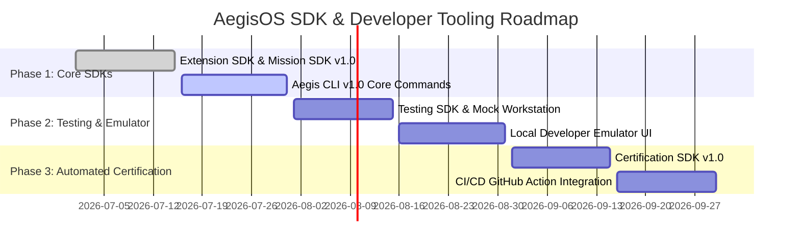

# AegisOS Developer SDK Roadmap & Tooling Specifications
## Developer Tools, SDK Suite, Aegis CLI, and Certification Engines

> **Status**: APPROVED & OPERATIONAL  
> **Target Version**: AegisOS Ecosystem 1.0  
> **Scope**: Extension SDK, Mission SDK, Testing SDK, Certification SDK, Aegis CLI  

---

## 1. Overview & Developer Ecosystem Architecture

The **AegisOS SDK & Developer Tooling Suite** provides developers with everything required to scaffold, build, test, package, and certify applications, extensions, and mission packs for AegisOS.

```
┌─────────────────────────────────────────────────────────────────────────────┐
│                      AEGISOS DEVELOPER ECOSYSTEM                            │
├─────────────────────────────────────────────────────────────────────────────┤
│ AegisOS CLI (`aegis-cli`): `init`, `dev`, `test`, `build`, `pack`, `publish` │
├─────────────────────────────────────────────────────────────────────────────┤
│ Extension SDK   │ Mission Pack SDK │ Testing SDK       │ Certification SDK │
│ `@aegisos/sdk`  │ `@aegisos/m-sdk` │ `@aegisos/test`   │ `@aegisos/cert`   │
├─────────────────┴──────────────────┴───────────────────┴───────────────────┤
│ Ecosystem APIs (Platform, Extension, Mission, Knowledge, Workspace, etc.)  │
└─────────────────────────────────────────────────────────────────────────────┘
```

---

## 2. Developer SDK Specifications

### 2.1 Extension SDK (`@aegisos/extension-sdk`)
The primary SDK for building UI extensions, widgets, and platform adapters.

```typescript
import { createExtension, Widget } from '@aegisos/extension-sdk';

export default createExtension({
  id: 'com.partner.custom-widget',
  version: '1.0.0',
  onInit(context) {
    context.workspace.registerWidget({
      id: 'custom-summary-card',
      title: 'Partner Analytics Summary',
      render: () => <Widget.Card title="Metrics" />
    });
  }
});
```

### 2.2 Mission Pack SDK (`@aegisos/mission-sdk`)
TypeScript framework for authoring mission packs, prompt chains, and automated verification gates.

```typescript
import { createMissionPack, defineMission } from '@aegisos/mission-sdk';

const testMission = defineMission({
  id: 'swe.quick_fix',
  description: 'Applies automated patch to failing test',
  async execute(input, context) {
    const plan = await context.execution.completePrompt({ prompt: input.issueDescription });
    return { status: 'SUCCESS', output: plan };
  }
});

export default createMissionPack({
  id: 'com.partner.swe-pack',
  missions: [testMission]
});
```

### 2.3 Testing SDK (`@aegisos/testing-sdk`)
Provides a mocked AegisOS workstation runtime environment for fast, isolated unit testing without requiring a live Ollama/LiteLLM instance.

```typescript
import { createMockEnvironment } from '@aegisos/testing-sdk';

describe('Partner Extension', () => {
  it('registers widget cleanly', async () => {
    const env = await createMockEnvironment();
    await env.loadExtension('./dist/index.js');
    expect(env.workspace.getWidgets()).toHaveLength(1);
  });
});
```

### 2.4 Certification SDK (`@aegisos/certification-sdk`)
Automates compliance, performance, security, and PVP readiness auditing for third-party submissions.

- **Security Verification**: Automated static code analysis for credential leaks and un-sandboxed I/O.
- **Performance Benchmarks**: Evaluates cold-start latency (< 200ms) and memory footprint (< 50MB).
- **Compatibility Testing**: Verifies API version compliance against current AegisOS kernel release.

---

## 3. AegisOS CLI (`aegis-cli`) Specification

The `aegis-cli` command-line utility serves as the main interface for ecosystem developers.

| Command | Subcommands / Flags | Description |
| :--- | :--- | :--- |
| `aegis init` | `--template=extension\|mission\|app` | Scaffolds a new AegisOS project directory. |
| `aegis dev` | `--port=3000 --mock-llm` | Launches local development emulator with live-reload. |
| `aegis test` | `--coverage --unit\|e2e` | Runs extension/mission test suite using Testing SDK. |
| `aegis build` | `--target=web\|node` | Compiles TypeScript source files into distribution bundle. |
| `aegis pack` | `--out=./dist` | Bundles project into signed `.aegispack` file. |
| `aegis certify` | `--strict` | Runs Certification SDK suite and outputs report. |
| `aegis publish` | `--registry=https://...` | Publishes signed `.aegispack` to marketplace registry. |

---

## 4. SDK Development & Release Roadmap


