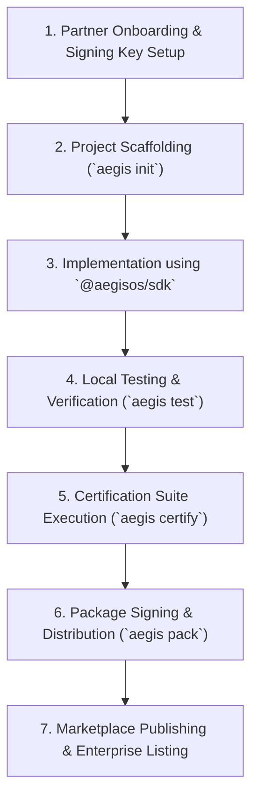

# AegisOS Partner Development Guide
## Handbook for ISVs, Enterprise Teams, and Solution Providers

> **Status**: APPROVED & OPERATIONAL  
> **Target Version**: AegisOS Ecosystem 1.0  
> **Audience**: Independent Software Vendors (ISVs), Enterprise Developers, System Integrators  

---

## 1. Welcome to the AegisOS Partner Ecosystem

The **AegisOS Partner Development Guide** provides enterprise partners and Independent Software Vendors (ISVs) with technical guidelines, architectural best practices, and integration patterns for building commercial products, extensions, and mission packs ON AegisOS.

### 1.1 Why Build on AegisOS?
- **Certified Enterprise Platform**: Zero platform engineering overhead. Leverage pre-certified local inference, zero-trust RBAC, and event bus infrastructure.
- **Local-First & Privacy Guarantee**: Enterprise customers retain complete control over data and local LLM execution.
- **Turnkey Marketplace Distribution**: Instantly distribute signed solutions through official or private enterprise marketplace mirrors.

---

## 2. Integration Patterns for Partners

Partners can integrate with AegisOS across four distinct integration tiers:

```
┌─────────────────────────────────────────────────────────────────────────────┐
│                      PARTNER INTEGRATION PATTERNS                           │
├─────────────────────────────────────────────────────────────────────────────┤
│ Pattern A: Declarative Mission Pack                                         │
│ Author domain-specific task pipelines & prompts (`.aegispack`)             │
├─────────────────────────────────────────────────────────────────────────────┤
│ Pattern B: UI Extension Widget                                              │
│ Build custom React UI panels embedded within Reference Apps                 │
├─────────────────────────────────────────────────────────────────────────────┤
│ Pattern C: Out-of-Process MCP Server / Sidecar                              │
│ Connect specialized database adapters or external tooling via MCP           │
├─────────────────────────────────────────────────────────────────────────────┤
│ Pattern D: Standalone Reference Application                                 │
│ Build a complete branded workstation product using `@aegisos/sdk`           │
└─────────────────────────────────────────────────────────────────────────────┘
```

### 2.1 Integration Pattern Comparison

| Pattern | Complexity | Execution Boundary | Recommended Use Case |
| :--- | :--- | :--- | :--- |
| **Declarative Mission Pack** | Low | Sandboxed Engine | Standard workflows, domain prompt templates |
| **UI Extension Widget** | Medium | Browser / Console UI | Interactive dashboards, specialized views |
| **MCP Server / Sidecar** | Medium | Isolated Process | Specialized databases, local CLI tool bindings |
| **Reference Application** | High | Full App Shell | Turnkey vertical products (e.g. MedTech AI Workstation) |

---

## 3. Security, RBAC & Privacy Compliance

Commercial partner solutions must strictly respect the AegisOS Zero Trust security boundary:

1. **Permission Scoping**: Request only minimal necessary permissions in `manifest.json`:
   ```json
   {
     "permissions": [
       "knowledge:read",
       "execution:complete",
       "workspace:widget"
     ]
   }
   ```
2. **Local-First Confidentiality**: Non-public customer workspace data or code snippets MUST NOT be transmitted over external network connections unless explicitly configured by the enterprise tenant administrator.
3. **Audit Trails**: All partner extension invocations are automatically audited by `@aegisos/api-platform` to maintain compliance.

---

## 4. End-to-End Partner Journey


