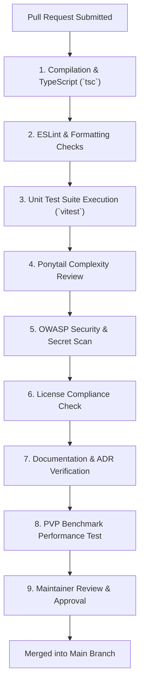

# AegisOS Community Contribution Guide
## Open Source Guidelines, Quality Gates, and Submission Workflows

> **Status**: APPROVED & OPERATIONAL  
> **Target Version**: AegisOS Ecosystem 1.0  
> **Audience**: Open-Source Contributors, Community Developers, Maintainers  

---

## 1. Open Source Community Governance

The **AegisOS Community Contribution Guide** establishes rules of engagement, code standards, review standards, and automated quality gates for community contributors building open-source extensions, mission packs, templates, and documentation for AegisOS.

### 1.1 Core Principles
- **Welcoming & Inclusive**: Adhere to the AegisOS [CODE_OF_CONDUCT.md](file:///d:/1_Projects/OpenClawOllamaLiteLLM_Transparency/CODE_OF_CONDUCT.md).
- **Quality Over Quantity**: Every contribution must include tests, type safety, and clear documentation.
- **Zero Core Bloat**: Community additions belong in `extensions/` or community mission packs, preserving the core platform kernel.

---

## 2. Contribution Pathways

Community members can contribute across five main areas:

```
┌─────────────────────────────────────────────────────────────────────────────┐
│                      COMMUNITY CONTRIBUTION PATHWAYS                        │
├─────────────────────────────────────────────────────────────────────────────┤
│ 1. Official Mission Packs    │ Enhance or submit new domain mission packs  │
│ 2. Open Source Extensions    │ Build reusable plugins & UI widgets         │
│ 3. Starter Templates         │ Create scaffolding templates & boilerplates │
│ 4. Documentation & Tutorials │ Improve API docs, handbooks, & guides       │
│ 5. Bug Fixes & Refactoring   │ Fix issues & optimize existing ecosystem code│
└─────────────────────────────────────────────────────────────────────────────┘
```

---

## 3. Automated Quality Gates & Review Standards

Every pull request submitted to the AegisOS repository or official community ecosystem registries must pass nine mandatory quality gates:



---

## 4. Code & Documentation Standards

1. **TypeScript Safety**:
   - Explicit type declarations required for all public interfaces.
   - Strict `noImplicitAny: true` enabled across all modules.
2. **Ponytail Minimalism Principles**:
   - Prefer standard library functions before introducing third-party dependencies.
   - Single responsibility functions (< 30 lines preferred).
3. **Documentation Integrity**:
   - Markdown documents must use standard GitHub Flavored Markdown (GFM).
   - Use standard relative file links (`file:///...`) for clickable file references.
