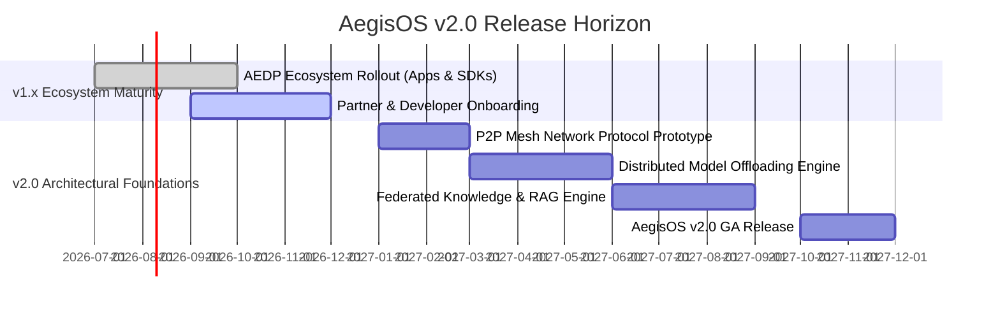

# AegisOS Version 2.0 Vision & Autonomous Mesh Architecture
## Strategic Vision, Multi-Node Mesh Network, and Distributed Intelligence

> **Status**: STRATEGIC VISION & ROADMAP  
> **Target Release**: AegisOS v2.0  
> **Horizon**: Next-Generation Distributed Workstation Ecosystem  

---

## 1. Executive Summary & Strategic Vision

While AegisOS v1.0 establishes a local-first AI Workstation platform with a product ecosystem, **AegisOS v2.0** expands this foundation into a **Distributed Autonomous Mesh Network**.

```
┌─────────────────────────────────────────────────────────────────────────────┐
│                      AEGISOS V2.0 DISTRIBUTED MESH                          │
├─────────────────────────────────────────────────────────────────────────────┤
│                                                                             │
│   ┌───────────────┐     P2P Event Mesh      ┌───────────────┐               │
│   │ Node A        │◀───────────────────────▶│ Node B        │               │
│   │ (Dev Workstn) │                         │ (GPU Server)  │               │
│   └───────┬───────┘                         └───────┬───────┘               │
│           │                                         │                       │
│           │            Federated Knowledge          │                       │
│           └────────────────────┬────────────────────┘                       │
│                                ▼                                            │
│                         ┌───────────────┐                                   │
│                         │ Node C        │                                   │
│                         │ (Ops Center)  │                                   │
│                         └───────────────┘                                   │
└─────────────────────────────────────────────────────────────────────────────┘
```

### Key Innovations of AegisOS v2.0
1. **Peer-to-Peer Agent Mesh**: Autonomous agent collaboration across multiple local nodes without reliance on centralized cloud orchestration servers.
2. **Distributed GPU & Inference Pool**: Dynamic task offloading between desktop workstations, edge servers, and local GPU clusters.
3. **Federated Knowledge Graphs**: Privacy-preserving, cross-node RAG search with differential privacy and encrypted index synchronization.
4. **Self-Healing Infrastructure**: Autonomous mission loops that detect, diagnose, patch, and verify system issues with human-in-the-loop oversight.

---

## 2. Core Architectural Pillars of AegisOS v2.0

### 2.1 Multi-Node Event Mesh (`aegis-mesh`)
Extends the current in-process EventBus into a zero-trust, cryptographically secured P2P event network powered by LibP2P and WebRTC datachannels.

### 2.2 Distributed Context & Vector Memory
Allows agents operating on Node A to query indexed documentation, code graphs, or knowledge bases located securely on Node B without copying underlying source files.

### 2.3 Decentralized Capability Registry
Replaces centralized marketplace mirrors with a decentralized, signed ledger for asset verification, version consensus, and license authorization.

---

## 3. AegisOS v2.0 Release Horizon & Roadmap


