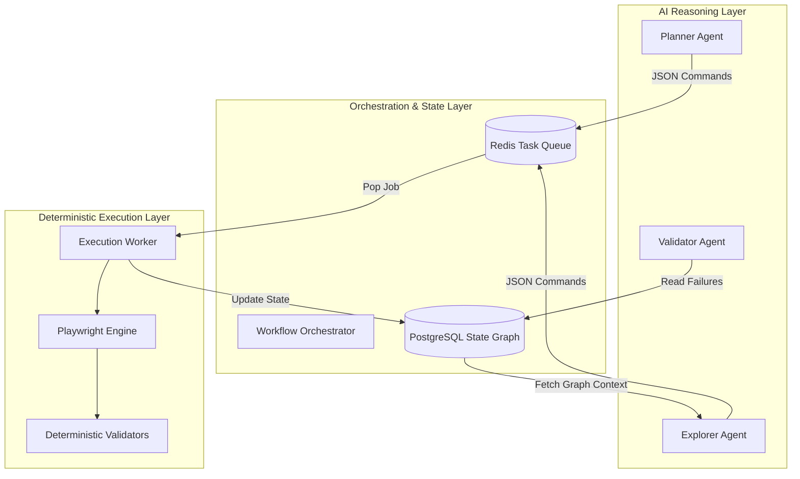

# PHASE 1 — SYSTEM ARCHITECTURE

## Executive Summary
This architecture blueprint defines a production-grade, AI-assisted autonomous exploratory testing platform. Adhering strictly to the philosophy of **LLM-directed, deterministic-tool-executed**, the system isolates non-deterministic LLM operations (planning, strategizing, reviewing) from concrete browser and API execution. By enforcing explicit state-machine transitions and leveraging highly optimized deterministic tools (Playwright, axe-core, k6) for all assertions, the platform achieves enterprise scalability, predictable reliability, and optimal token efficiency.

## Architecture Goals
- **Token Efficiency**: Minimize LLM calls by delegating all repetitive validations and state traversals to deterministic code.
- **Reliability**: Ensure zero flake caused by LLM hallucinations during execution.
- **Scalability**: Support highly parallel execution of isolated testing contexts.
- **Observability**: Maintain full traceability of both AI decisions and deterministic state changes.

## Design Principles
1. **Deterministic execution first**: If a rule can be coded, it must not be given to an LLM.
2. **AI reasoning only when valuable**: Use LLMs solely for navigating unknown state spaces and summarizing complex failures.
3. **Evidence-first validation**: Deterministic execution must gather DOM, HAR, and traces before the LLM reviews failures.
4. **State-aware exploration**: The LLM navigates a persisted mathematical graph, not raw browser frames.
5. **Business-workflow understanding**: Prioritize high-value user journeys over random chaos testing.
6. **Progressive implementation**: Build deterministic foundations before attaching AI orchestration.
7. **Cost-aware AI usage**: Caching LLM prompts and capping token expenditure per session.
8. **Modular architecture**: Strictly separated packages for agents, execution, and state.
9. **Explicit contracts**: JSON Schema definitions enforce boundaries between AI and code.
10. **Production readiness**: Built for CI/CD integration and stateless horizontal scaling.

---

## High-Level Architecture

### Data Flow
1. **Input**: Target URL & Authentication Context.
2. **State Construction**: Execution engine loads URL, captures DOM/HAR, parses into structural DOM hash, and stores in PostgreSQL.
3. **Agent Request**: Orchestrator queries PostgreSQL for current state and unvisited edges, passing this graph to the LLM.
4. **Agent Response**: LLM returns a deterministic Action Command (e.g., `CLICK #submit`).
5. **Execution**: Execution engine performs the action via Playwright.
6. **Validation**: Deterministic validators (axe-core, API checks) run against the new state.
7. **Storage**: Evidence (Screenshots, traces) is uploaded to MinIO/S3; State is updated in PostgreSQL.

### Control Flow
- The **Orchestrator** (Event Loop) dictates pace.
- **AI Invocation Points**: Occur *only* when the Orchestrator encounters an unexplored UI state (DOM Hash) requiring strategic decision-making, or when a validation fails and requires root-cause analysis.
- **Deterministic Execution Boundaries**: The `Worker` node. It receives a JSON command, drives Playwright, runs assertions, captures evidence, and returns a binary Success/Fail result payload. The LLM never touches the browser API directly.

### Layer Diagram


### Component Diagram & Details

#### 1. AI Orchestrator
- **Purpose**: Manage the lifecycle of an exploratory session.
- **Responsibilities**: Route state to appropriate agents, enforce rate limits, handle session timeouts.
- **Dependencies**: Redis (Queue), PostgreSQL (State).
- **Inputs**: Trigger events (Start Session, State Updated).
- **Outputs**: Agent prompts, Worker tasks.
- **Failure modes**: Infinite loop if agent repeats commands.
- **Recovery strategy**: Enforce maximum visits per node; fallback to heuristic fallback strategy.
- **Tradeoffs**: Centralized orchestration creates a bottleneck, but ensures strict state coherence.
- **Future evolution**: Decentralized choreographic orchestration.
- **Implementation notes**: Implemented as a stateful Node.js service using XState.

#### 2. Deterministic Worker
- **Purpose**: Execute precise browser/API commands.
- **Responsibilities**: Drive Playwright, capture Network idle, gather evidence.
- **Dependencies**: Playwright, Object Storage (S3).
- **Inputs**: JSON ActionCommand.
- **Outputs**: ExecutionResult (State + Evidence URLs).
- **Failure modes**: Browser crash, OOM.
- **Recovery strategy**: Worker process restart; job requeued in Redis.
- **Tradeoffs**: Heavy memory footprint per worker limits concurrency per node.
- **Future evolution**: Connect to remote browser grids (Selenium Grid / Browserless).
- **Implementation notes**: Run in isolated Docker containers to prevent zombie Chrome processes.

#### 3. State Database (PostgreSQL)
- **Purpose**: Persist the exploration graph.
- **Responsibilities**: Ensure ACID properties for state transitions.
- **Dependencies**: None.
- **Inputs**: Node discoveries, Edge transitions.
- **Outputs**: Sub-graphs for AI context.
- **Failure modes**: Connection pool exhaustion.
- **Recovery strategy**: PgBouncer for connection pooling; aggressive statement timeouts.
- **Tradeoffs**: Chosen over Graph DBs (Neo4j) to minimize infrastructure footprint; requires recursive CTEs for graph traversal.
- **Future evolution**: Materialized views for real-time coverage metrics.
- **Implementation notes**: Use `JSONB` for storing varying DOM node properties.

---

## MANDATORY SUBSECTIONS

### Overview
The system architecture separates nondeterministic AI reasoning from deterministic execution via a resilient orchestration layer, utilizing PostgreSQL for graph state and Redis for distributed task queues.

### Responsibilities
- **AI Layer**: Strategic planning, path selection, failure summarization.
- **Orchestration Layer**: State management, queuing, synchronization.
- **Execution Layer**: Browser automation, DOM parsing, evidence collection, validation.

### Interfaces
- `IAgentLayer`: Exposes `decideNextAction(graphContext)`
- `IExecutionLayer`: Exposes `executeCommand(actionCommand)`
- `IStateLayer`: Exposes `updateGraph(transition)`

### Data Structures
```typescript
interface SystemArchitectureModel {
  orchestratorId: string;
  maxWorkers: number;
  aiBackend: 'openai' | 'anthropic' | 'local';
  stateStorage: 'postgresql';
  queueStorage: 'redis';
}
```

### Failure Modes
- Queue backup if workers crash or slow down.
- Database locks during high-concurrency state updates.
- LLM API rate limits halting exploration.

### Recovery
- **Queue**: Auto-scaling worker nodes based on Redis queue depth.
- **Database**: Optimistic concurrency control (version vectors on nodes).
- **LLM**: Exponential backoff and jitter; failover to secondary LLM provider.

### Tradeoffs
- **Redis & PostgreSQL**: Requires maintaining two data stores. *Tradeoff justification*: Redis provides the necessary speed for high-throughput locking and queuing that PostgreSQL handles poorly at scale, while PostgreSQL provides the relational integrity required for the exploration graph.
- **Strict Separation**: Increases latency between AI decision and browser action (due to queueing). *Tradeoff justification*: Prevents the AI from hallucinating invalid browser states and enables retry logic without spending tokens.

### Implementation Notes
- The orchestrator must implement distributed locks (Redlock) when updating the Postgres navigation graph to prevent race conditions from parallel workers exploring the same page.
- Browser contexts must be strictly isolated per worker using Playwright's incognito contexts.

### Future Evolution
- Implementing a lightweight edge-computing worker model using WebAssembly for certain validation tasks to reduce Node.js worker load.
- Integrating Kafka only if inter-service event throughput exceeds 10,000 req/sec (currently unnecessary).
