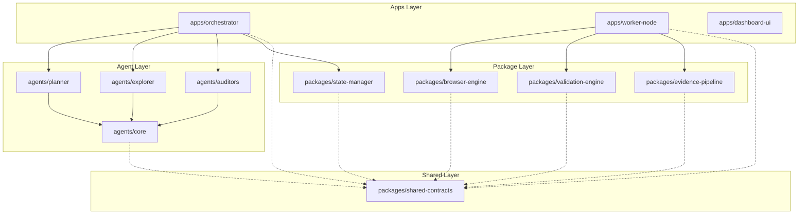

# PHASE 2 — REPOSITORY DESIGN

## Overview
The platform utilizes a Monorepo architecture managed via Turborepo and npm/yarn workspaces. This design ensures explicit boundary enforcement between AI reasoning and deterministic execution while allowing seamless sharing of strict JSON schemas and TypeScript interfaces across all layers. 

## Responsibilities
- **Code Organization**: logically group code by domain (agents, workers, shared).
- **Dependency Management**: prevent deterministic workers from importing heavy AI SDKs.
- **Build Orchestration**: enable caching and parallel builds via Turborepo.

## Interfaces
- Build interface: `turbo run build`
- Lint interface: `turbo run lint`
- Test interface: `turbo run test`

## Data Structures
```json
// turbo.json
{
  "$schema": "https://turbo.build/schema.json",
  "pipeline": {
    "build": {
      "dependsOn": ["^build"],
      "outputs": ["dist/**"]
    },
    "test": {
      "dependsOn": ["build"]
    },
    "lint": {
      "outputs": []
    }
  }
}
```

## Failure Modes
- **Circular Dependencies**: `packages/shared` importing from `apps/worker`.
- **Phantom Dependencies**: Packages using dependencies not explicitly declared in their local `package.json`.
- **Layer Bleed**: The `agents` package accidentally importing Playwright from `workers`.

## Recovery
- Enforce strict `eslint-plugin-boundaries` and `eslint-plugin-import` rules in CI.
- Turborepo graph validation during the `build` step fails the pipeline immediately if boundaries are breached.

## Tradeoffs
- **Monorepo vs. Polyrepo**: Monorepo chosen to ensure synchronized versioning of shared JSON schemas across AI and execution layers. *Tradeoff*: Increases repository size and requires sophisticated build tooling (Turborepo).
- **TypeScript for everything**: Chosen over a polyglot Python(AI)/JS(Browser) split to simplify the CI/CD pipeline and share types. *Tradeoff*: Python has a richer AI ecosystem, but calling LLM APIs via JS/TS is sufficient for this architecture.

## Implementation Notes
- Use `@` namespace for internal packages (e.g., `@platform/shared-contracts`).
- Every package must have an `index.ts` exporting explicit public APIs. Deep imports (e.g., `import { X } from '@platform/agents/src/internal/Y'`) are strictly banned via ESLint.

## Future Evolution
- If specialized Python-based ML models (e.g., local OCR or custom visual regression) are required, introduce a polyglot Bazel or Pants build system, or extract those specific components into isolated microservices.

---

## Repository Tree

```text
/
├── apps/
│   ├── orchestrator/         # Main event loop and queue manager
│   ├── worker-node/          # Deterministic Playwright execution engine
│   └── dashboard-ui/         # Observability & reporting web interface
├── packages/
│   ├── shared-contracts/     # TS Interfaces, JSON Schemas (NO dependencies)
│   ├── browser-engine/       # Playwright wrappers and DOM hashing logic
│   ├── validation-engine/    # axe-core, pixelmatch, schemathesis wrappers
│   ├── evidence-pipeline/    # S3/MinIO uploaders, HAR compression
│   └── state-manager/        # PostgreSQL Prisma/Drizzle schemas and clients
├── agents/
│   ├── core/                 # Base Agent abstract classes and LLM SDK wrappers
│   ├── planner/              # Strategic planning agent
│   ├── explorer/             # Navigation graph traversal agent
│   ├── validator/            # Validation review agent
│   └── auditors/             # Specialized agents (Security, A11y, Visual)
├── infrastructure/
│   ├── docker/               # Dockerfiles for apps
│   ├── terraform/            # IaC for Postgres, Redis, ECS
│   └── kubernetes/           # (Optional) Helm charts for deployment
├── scripts/
│   ├── seed-db.ts            # Local development DB seeding
│   └── generate-schemas.ts   # TS -> JSON Schema generators
├── docs/
│   ├── architecture/         # ADRs, Blueprints
│   └── runbooks/             # Operational runbooks
├── ci/
│   └── .github/workflows/    # CI/CD pipelines
├── turbo.json                # Turborepo configuration
├── package.json              # Root workspace definition
└── tsconfig.base.json        # Base TypeScript config
```

## Dependency Graph & Layer Boundaries



## Module Ownership & Import Rules

| Module | Owner Domain | Permitted Imports | Banned Imports |
|--------|--------------|-------------------|----------------|
| `shared-contracts` | Core Platform | None (zero deps) | Any other workspace package |
| `state-manager` | Data Platform | `shared-contracts` | `browser-engine`, `agents/*` |
| `browser-engine` | Execution | `shared-contracts` | `agents/*`, `state-manager` |
| `agents/*` | AI Team | `agents/core`, `shared-contracts` | `browser-engine`, `workers` |
| `apps/worker-node` | Execution | `packages/*` | `agents/*`, `apps/orchestrator` |
| `apps/orchestrator`| Core Platform | `agents/*`, `state-manager`, `shared-contracts` | `browser-engine` |

## Package Responsibilities

1. **`shared-contracts`**: Defines the absolute truth for communication. Contains Zod schemas and TypeScript types.
2. **`browser-engine`**: Hides Playwright complexity. Exposes simple functions like `click(selector)`, `extractDomHash()`.
3. **`validation-engine`**: Hides validation tool complexity. Exposes `runA11y(dom)`, `runVisualDiff(img1, img2)`.
4. **`evidence-pipeline`**: Handles chunking, compression, and S3 uploads of massive files (HAR/Video) asynchronously.
5. **`state-manager`**: Hides PostgreSQL complexity. Exposes `addNode()`, `addEdge()`, `getUnvisitedEdges()`.
6. **`agents/core`**: Wraps OpenAI/Anthropic SDKs. Handles token counting, backoff retries, and prompt formatting.
7. **`apps/worker-node`**: Listens to Redis queue. Executes commands using `browser-engine`.
8. **`apps/orchestrator`**: The brain. Listens to DB changes, invokes `agents`, pushes tasks to Redis.
