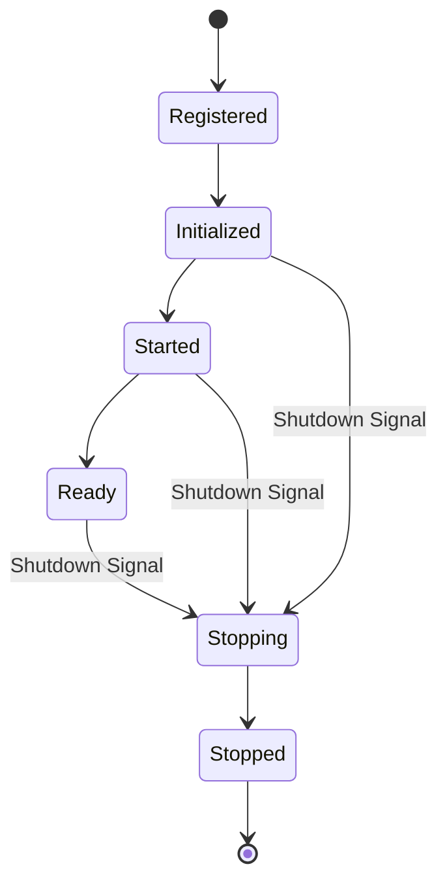

# Platform Lifecycle & Health Model

## Overview
AegisOS replaces the brittle, monolithic 12-state state machine with a strict separation of concerns. **Lifecycle** describes what a module is doing, while **Health** describes how well it is operating. **Recovery** is an operational concern handled independently by infrastructure, not a lifecycle state.

This guarantees determinism, graceful startup/shutdown, and uniform observability without the accidental complexity of managing recovery workflows inside the Kernel.

## Platform Lifecycle
Every platform module implements exactly six lifecycle states. The Platform Kernel coordinates these transitions.

- **Registered**: The module manifest has been registered with the Platform Service Registry. No resources are allocated, and no dependencies are resolved.
- **Initialized**: The module has run its internal setup routines (e.g., establishing database connections, loading initial cache) and the `CompositionRoot` has resolved its dependencies.
- **Started**: The module integrates with the platform, connects to the Event/Workflow engines, and begins accepting requests.
- **Ready**: The module and all of its required dependencies are fully operational.
- **Stopping**: The module has received a shutdown signal. It stops accepting new requests, actively severs connections, flushes buffers, and releases resources.
- **Stopped**: The module has safely halted all operations and is ready for disposal.

No additional lifecycle states exist.

### Transition Graph (Mermaid)

## Health Model
Health is completely orthogonal to lifecycle. Health changes never trigger lifecycle transitions automatically.

Every module exposes one of the following health statuses:
- **Healthy**: Operating normally within SLA.
- **Warning**: Nearing thresholds or experiencing minor, non-blocking issues.
- **Degraded**: Experiencing high latency, resource starvation, or partial failures.
- **Unhealthy**: Failing to process requests or critical dependencies are down.
- **Unknown**: Health status cannot be determined.

## Recovery
Recovery is handled independently from the lifecycle. The Platform Kernel does not manage recovery workflows. 

Possible recovery actions include:
- Retry
- Restart Module
- Restart Dependency
- Disable Module
- Fallback Provider
- Safe Mode
- Escalate Error

Recovery does not change the lifecycle state unless the module is actually instructed to stop.

## Dependency Rules
- A module may only transition to `Ready` after all required dependencies are `Ready`.
- Shutdown occurs in reverse dependency order.

## Infrastructure Integration
Platform lifecycle governs in-process modules. Infrastructure-level health and recovery remain the responsibility of external systems when present (e.g., Windows Service Control Manager, systemd, Docker, Kubernetes, Nomad).
