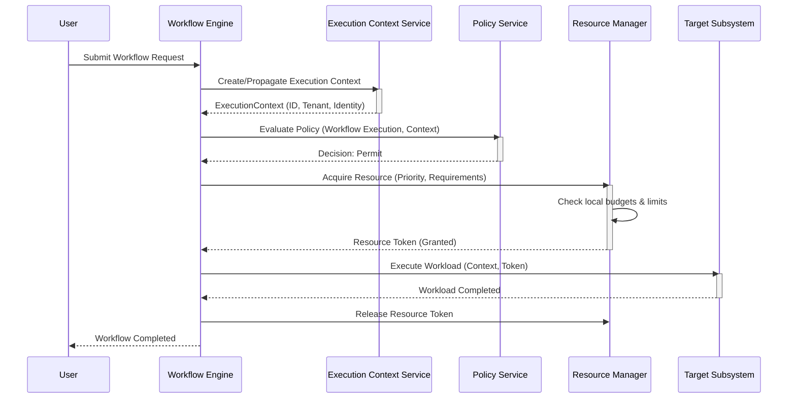
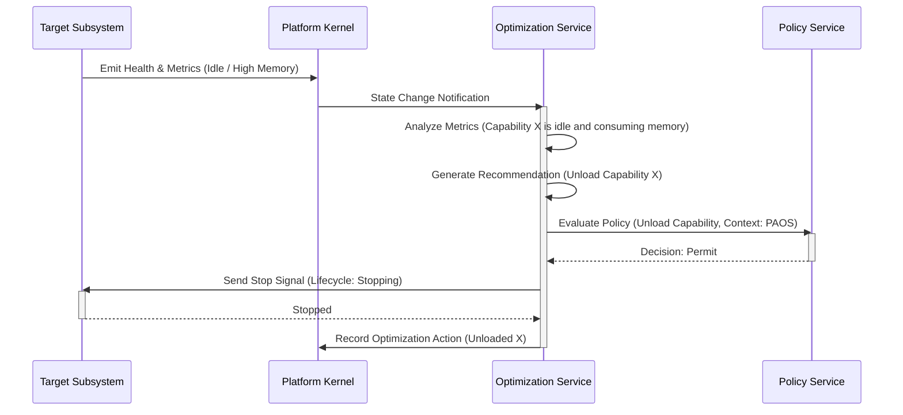

# Sequence Diagrams

## Workflow Initiation and Resource Admission

This sequence diagram illustrates a subsystem (e.g., an Agent) executing a workload via the Platform Workflow Engine, highlighting synchronous interactions with Kernel Services.

## Local Optimization Loop (Housekeeping)

This sequence diagram illustrates the Platform Advisor & Optimization Service (PAOS) actively observing local state and performing bounded, safe housekeeping without migrating workloads or acting as a cluster orchestrator.

