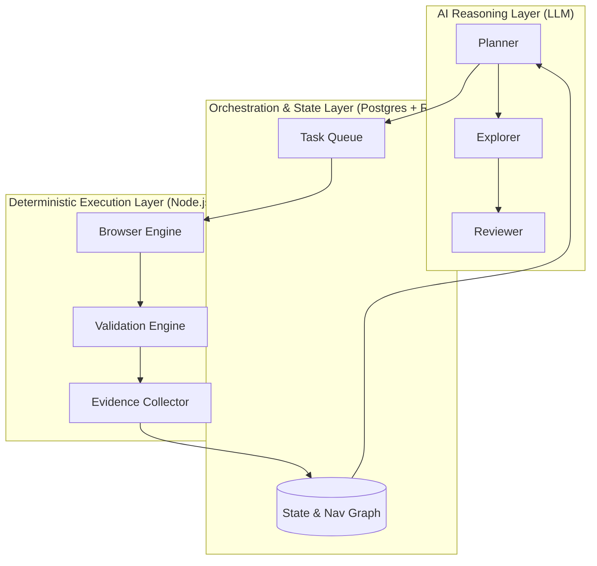

# Autonomous Exploratory Testing Platform Blueprint

> **Philosophy: LLM-directed. Deterministic-tool-executed.**

## Executive Summary
This blueprint defines a production-grade, AI-assisted autonomous exploratory testing platform. The architecture restricts the LLM to high-level strategic reasoning (planning, exploration, review) while delegating all repetitive execution, validation, and assertion tasks to deterministic, highly reliable tools (e.g., Playwright, axe-core, Schemathesis). This minimizes token usage, maximizes execution reliability, and produces a highly scalable testing infrastructure.

---

## PHASE 1 — SYSTEM ARCHITECTURE

### Overview
A layered, modular system where an orchestration layer manages state and queues tasks, an AI reasoning layer decides *what* to do next based on state, and a deterministic execution layer executes those decisions, validates state, and collects evidence.

### Responsibilities
- Decouple AI reasoning from browser/API execution.
- Maintain immutable execution state.
- Ensure deterministic validation and evidence gathering.

### Interfaces
- `IAIOrchestrator`: Entry point for LLM interactions.
- `IExecutionEngine`: Interface for dispatching deterministic tasks.

### Data Structures
```typescript
interface SystemArchitectureConfig {
  aiReasoningEnabled: boolean;
  maxConcurrentExecutions: number;
  evidenceStorageLevel: 'all' | 'failures_only';
}
```

### Failure Modes
- LLM API timeouts or rate limits.
- Browser crash during execution.

### Recovery
- Fallback to predefined heuristic-based exploration if LLM fails.
- Automatic browser context recreation on crash.

### Tradeoffs
- **PostgreSQL**: Used for State/Navigation Graph. *Tradeoff*: simpler than a Graph DB, but requires recursive CTEs for graph traversal.
- **Redis**: Used for job queues and distributed locking. *Tradeoff*: adds infrastructure, but necessary for scalable parallel execution.
- *Rejected*: Kafka, K8s, Vector DBs (unnecessary complexity for deterministic state models).

### Implementation Notes
- Use Docker Compose for local execution; ECS/Fargate for scalable execution workers.

### Future Evolution
- Pluggable AI backends (e.g., local models for sensitive data).

#### Layer & Component Diagram (Mermaid)


---

## PHASE 2 — REPOSITORY DESIGN

### Overview
A monolithic TypeScript repository using Turborepo or Nx for explicit package boundaries, maximizing code sharing while strictly separating AI reasoning from deterministic execution.

### Responsibilities
- Define strict module boundaries.
- Isolate deterministic packages from AI packages.

### Interfaces
- Shared contracts package providing `interface` boundaries for all components.

### Data Structures
```json
// package.json snippet for workspace structure
{
  "workspaces": [
    "apps/*",
    "packages/*",
    "agents/*"
  ]
}
```

### Failure Modes
- Circular dependencies between layers.
- Leakage of LLM SDKs into the deterministic execution packages.

### Recovery
- Strict ESLint dependency rules (`eslint-plugin-boundaries`).

### Tradeoffs
- Monorepo vs Polyrepo: Monorepo selected for unified typings, single versioning, and atomic cross-layer commits.

### Implementation Notes
```text
/apps
  /orchestrator         # Main service
  /worker               # Deterministic execution node
/packages
  /shared-contracts     # TypeScript interfaces & schemas
  /browser-engine       # Playwright wrappers
  /validation-engine    # axe-core, pixelmatch, etc.
  /evidence-pipeline    # S3/MinIO uploaders
/agents
  /planner
  /explorer
  /validator
/docs
/ci
```

### Future Evolution
- Splitting workers into separate repos if polyglot architecture is needed (e.g., Python ML tools).

---

## PHASE 3 — AGENT ARCHITECTURE

### Overview
Agents are decoupled, stateless reasoning functions that consume state and emit deterministic commands. 
*Agents defined*: Planner, Navigator, Explorer, Validator, Evidence Collector, API Auditor, Accessibility Auditor, Performance Auditor, Visual Auditor, Security Auditor, Regression Generator, Report Writer.

### Responsibilities
- **Planner**: Determines high-level workflow goals.
- **Explorer**: Decides next optimal navigational edge.
- **Validator**: Reviews deterministic validation results to explain failures.

### Interfaces
```typescript
interface IAgent<TInput, TOutput> {
  execute(state: TInput, context: AgentContext): Promise<TOutput>;
}
```

### Data Structures
```typescript
interface AgentContext {
  sessionId: string;
  history: ExecutionEvent[];
}
```

### Failure Modes
- Hallucination of non-existent UI elements.
- Infinite exploration loops.

### Recovery
- Deterministic engine rejects invalid selectors.
- State model enforces depth limits and loop detection.

### Tradeoffs
- Stateless agents require passing context per request, increasing token usage, but ensuring idempotent, reproducible reasoning.

### Implementation Notes
- All LLM interactions must be constrained by JSON schema outputs (Structured Outputs).

### Future Evolution
- Continual learning through embedding previous failures into the agent prompt context.

---

## PHASE 4 — COMMUNICATION CONTRACTS

### Overview
Communication between layers occurs via asynchronous message queues (Redis) using strict JSON schemas.

### Responsibilities
- Guarantee message schema compatibility.
- Ensure cross-boundary type safety.

### Interfaces
- Command Contracts (AI -> Execution)
- Event Contracts (Execution -> AI)

### Data Structures
```json
// ActionCommand Schema
{
  "type": "object",
  "properties": {
    "commandType": { "type": "string", "enum": ["CLICK", "TYPE", "NAVIGATE"] },
    "selector": { "type": "string" },
    "value": { "type": "string" }
  },
  "required": ["commandType", "selector"]
}
```

### Failure Modes
- Schema evolution breaks consumer.

### Recovery
- Strict versioning of message envelopes (`v1`, `v2`). Dead Letter Queues (DLQ) for unparseable messages.

### Tradeoffs
- JSON over IPC adds serialization overhead, but allows language-agnostic workers.

### Implementation Notes
- Use `zod` to validate all incoming/outgoing messages at the boundaries.

### Future Evolution
- Migration to Protobuf or gRPC if throughput requirements exceed Redis JSON capabilities.

---

## PHASE 5 — STATE MODEL

### Overview
Immutable event-sourced state representation of the application under test, stored in PostgreSQL.

### Responsibilities
- Track visited nodes (URLs/Views).
- Track state transitions (Edges).
- Maintain evidence references.

### Interfaces
- `IStateRepository` for querying and mutating the navigation graph.

### Data Structures
```typescript
interface INavigationNode {
  nodeId: string;
  url: string;
  domHash: string;
  discoveredAt: Date;
}
interface IEdge {
  fromNode: string;
  toNode: string;
  actionTaken: ActionCommand;
}
```

### Failure Modes
- State explosion due to dynamic content (e.g., timestamps in DOM).

### Recovery
- DOM hashing ignores volatile attributes via deterministic normalization before hashing.

### Tradeoffs
- Storing full DOM per state is heavy. Storing only structural hashes + delta diffs saves space but increases compute on retrieval.

### Implementation Notes
- Use Postgres `JSONB` for flexible UI state properties, and standard relational tables for Nodes/Edges.

### Future Evolution
- Abstracting state to handle mobile app states (Appium) alongside web.

---

## PHASE 6 — EXECUTION ENGINE

### Overview
The deterministic worker that processes `ActionCommands`, interfaces with Playwright, and handles low-level retries and timeouts.

### Responsibilities
- Execute actions reliably.
- Handle element staleness and network idleness.

### Interfaces
- `IActionExecutor`

### Data Structures
```typescript
interface ExecutionResult {
  success: boolean;
  error?: string;
  resultingDomSnapshot: string;
  networkIdle: boolean;
}
```

### Failure Modes
- Playwright context crashes.
- Network timeouts.

### Recovery
- Idempotent action execution. Automatic page reload and state restoral via cookies/localstorage if the browser crashes.

### Tradeoffs
- Always waiting for network idle slows execution but drastically reduces flakiness.

### Implementation Notes
```typescript
// Pseudocode
async function executeCommand(cmd: ActionCommand, page: Page): Promise<ExecutionResult> {
  try {
    if (cmd.type === 'CLICK') await page.click(cmd.selector, { timeout: 5000 });
    await page.waitForLoadState('networkidle');
    return { success: true, resultingDomSnapshot: await page.content(), networkIdle: true };
  } catch (e) {
    return { success: false, error: e.message, resultingDomSnapshot: '', networkIdle: false };
  }
}
```

### Future Evolution
- Distributed browser grids (e.g., Browserless or Playwright Grid).

---

## PHASE 7 — AUTONOMOUS EXPLORATION

### Overview
Graph-based exploration algorithm ensuring comprehensive coverage without redundant LLM calls.

### Responsibilities
- Calculate coverage.
- Prioritize unvisited edges.

### Interfaces
- `IExplorationStrategy`

### Data Structures
```typescript
interface ExplorationPriority {
  nodeId: string;
  priorityScore: number;
  reason: string;
}
```

### Failure Modes
- infinite loops in pagination or calendar widgets.

### Recovery
- State engine limits visits per structural DOM hash to `MAX_VISITS_PER_NODE = 3`.

### Tradeoffs
- Breadth-first vs Depth-first. Adaptive priority queue used instead based on business value heuristics.

### Implementation Notes
```typescript
// Pseudocode for prioritization
function getNextTarget(graph: Graph): Node {
  return graph.unvisitedEdges.sort((a, b) => b.businessWeight - a.businessWeight)[0];
}
```

### Future Evolution
- Reinforcement learning to prioritize paths that historically contain more bugs.

---

## PHASE 8 — VALIDATION ENGINE

### Overview
Deterministic pipeline for asserting correctness (Accessibility, Visual, Performance, API).

### Responsibilities
- Run `axe-core`, `Lighthouse`, and strict JSON schema validations on API intercepts.

### Interfaces
- `IValidator` (implementations: `A11yValidator`, `VisualValidator`)

### Data Structures
```typescript
interface ValidationReport {
  validatorName: string;
  passed: boolean;
  violations: any[];
}
```

### Failure Modes
- False positives in visual regression due to dynamic content.

### Recovery
- Masking dynamic areas before pixelmatch comparison.

### Tradeoffs
- Running all validations on every node slows down exploration. Validation is scheduled asynchronously.

### Implementation Notes
- LLM only reads `ValidationReport` to summarize bugs; it NEVER performs the actual assertion.

### Future Evolution
- Auto-generating masking configurations via LLM based on DOM structure.

---

## PHASE 9 — EVIDENCE PIPELINE

### Overview
Robust artifact collection and storage mechanism.

### Responsibilities
- Capture HAR, Traces, Screenshots, and Videos.
- Upload to Object Storage (S3).

### Interfaces
- `IArtifactStorage`

### Data Structures
```typescript
interface ArtifactMeta {
  sessionId: string;
  nodeId: string;
  type: 'HAR' | 'TRACE' | 'SCREENSHOT';
  s3Url: string;
}
```

### Failure Modes
- Disk space exhaustion on execution node.

### Recovery
- Streaming uploads to S3 and aggressive local cleanup post-upload.

### Tradeoffs
- Capturing video for every session requires massive storage. Videos are only saved if a validation failure occurs.

### Implementation Notes
- Compress HAR files via gzip before upload.

### Future Evolution
- Centralized trace viewer portal.

---

## PHASE 10 — SYNTHETIC DATA

### Overview
Deterministic generation of test data using JSON Schema Faker and business rules.

### Responsibilities
- Seed application state.
- Generate valid/invalid input payloads.

### Interfaces
- `IDataGenerator`

### Data Structures
```typescript
interface DataRequirement {
  schema: JSONSchema;
  type: 'boundary' | 'valid' | 'invalid';
}
```

### Failure Modes
- Schema mismatch with application API.

### Recovery
- Sync schemas directly from OpenAPI specs in CI.

### Tradeoffs
- Dynamic generation vs Static fixtures. Dynamic generation reveals more edge cases but requires robust teardown logic.

### Implementation Notes
- Use `@faker-js/faker` wrapped with deterministic seeds (seed based on Session ID) for reproducible test data.

### Future Evolution
- Stateful data generators that reserve inventory or setup complex multi-step backend states.

---

## PHASE 11 — OBSERVABILITY

### Overview
Full telemetry across LLM operations, execution queues, and validation pipelines using OpenTelemetry.

### Responsibilities
- Track AI token costs, latency, and error rates.

### Interfaces
- `ITelemetryProvider`

### Data Structures
```typescript
interface TokenUsageMetrics {
  agentName: string;
  promptTokens: number;
  completionTokens: number;
  costEstimateUsd: number;
}
```

### Failure Modes
- Telemetry endpoint unreachable.

### Recovery
- In-memory buffering and batch flushing.

### Tradeoffs
- High cardinality metrics for every UI interaction can overwhelm Prometheus. Granularity is restricted to Agent/Workflow level.

### Implementation Notes
- Export via OTLP to Datadog/Grafana.

### Future Evolution
- Automated anomaly detection on test execution times.

---

## PHASE 12 — CI/CD

### Overview
Integration into standard enterprise pipelines.

### Responsibilities
- Deploy architecture.
- Execute test suites on PRs.

### Interfaces
- GitHub Actions / GitLab CI YAMLs.

### Data Structures
```yaml
# CI pseudo-config
jobs:
  autonomous_test:
    runs-on: ubuntu-latest
    steps:
      - run: docker-compose up -d
      - run: npm run test:autonomous -- --target=staging
```

### Failure Modes
- Test environments taking too long to spin up.

### Recovery
- Maintain a pool of warm environments.

### Tradeoffs
- Running autonomous tests on every PR is expensive. Run deterministic regressions on PRs, and autonomous exploratory tests on nightly builds.

### Implementation Notes
- Cache Playwright binaries to speed up pipeline initialization.

### Future Evolution
- Ephemeral namespace generation per PR.

---

## PHASE 13 — IMPLEMENTATION ROADMAP

### Overview
Incremental rollout strategy.

### Responsibilities
- Define MVP to Production path.

### Interfaces
- N/A

### Data Structures
- N/A

### Failure Modes
- Attempting to build everything at once (Big Bang).

### Recovery
- Stick to phases.

### Tradeoffs
- Delaying AI exploration to phase 2 means initial MVP is just a robust deterministic engine. This is a feature, not a bug.

### Implementation Notes
- **MVP (Weeks 1-4)**: Deterministic Execution Engine + State Model.
- **Phase 2 (Weeks 5-8)**: AI Planner integration and basic Graph Exploration.
- **Phase 3 (Weeks 9-12)**: Observability, Evidence Pipeline, and Validation integrations.

### Future Evolution
- Cross-platform exploration (Mobile + API combined workflows).

---

## REQUIRED ARTIFACTS

### Architecture Decision Records (ADR)
**ADR 001: Postgres over Graph DB**
- **Problem**: Need to store navigation graph.
- **Solution**: PostgreSQL with relational tables.
- **Tradeoffs**: Requires recursive queries, but prevents adding another infrastructure dependency.
- **Alternatives Rejected**: Neo4j (overkill for simple state trees).

**ADR 002: Redis for Queueing**
- **Problem**: Parallel deterministic executions need coordination.
- **Solution**: Redis lists/pubsub.
- **Alternatives Rejected**: Kafka (too complex, high operational overhead for basic task queueing).

### Traceability Matrix
| Requirement | Architecture Component | Agent | Module | Validation Method |
|---|---|---|---|---|
| Token Efficiency | Orchestrator | Explorer | `planner/` | Measure Token Cost |
| Deterministic A11y | Validation Engine | A11y Auditor | `validation/` | axe-core assertions |

### Risk Register
| Risk | Likelihood | Impact | Mitigation | Fallback |
|---|---|---|---|---|
| LLM API Outage | Medium | High | Decoupled queues | Execute saved deterministic regressions |
| State Explosion | High | Medium | Max depth limits | Heuristic pruning |

### Acceptance Criteria
- **Token Consumption**: < $0.50 per exploratory session.
- **Latency**: Deterministic actions execute in < 200ms overhead.
- **Reliability**: 99.9% crash recovery rate on browser failure.

---

## Implementation Readiness Review
- **Known Assumptions**: Target application is accessible via web and has a staging environment.
- **Unknowns**: Exact DOM structure volatility (requires pilot run).
- **External Dependencies**: OpenAI/Anthropic API, S3, PostgreSQL, Redis.
- **Open Questions**: Do we require VPN access for the workers?
- **Potential Blockers**: Rate limits on target staging environment.
- **Recommended Implementation Order**: Infrastructure (DB/Redis) -> Deterministic Worker -> State Manager -> AI Planner.
- **Risk Hotspots**: DOM hashing algorithm stability.
- **Implementation Confidence Score**: 9/10.

*This blueprint provides the definitive, implementation-ready foundation for the autonomous platform.*
