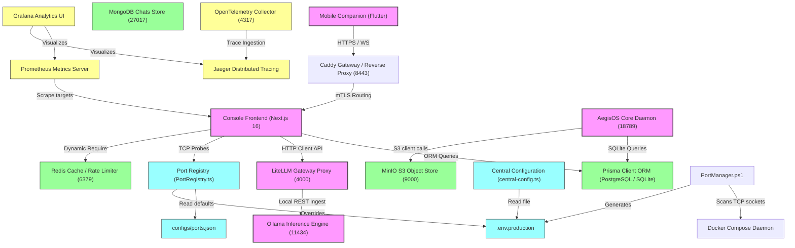

# Architecture Dependency Graph

This document details the architectural topology, service connections, and structural dependency paths of the AegisOS ecosystem.

---

## 1. Complete System Dependency Topology

The diagram below maps all applications, packages, registries, databases, configuration files, and observation channels.

---

## 2. Upstream and Downstream Remediation Impact Matrices

Every structural change must be cross-checked against this impact ledger before execution to mitigate side effects and service failures.

### Matrix 1: Database Migration (SQLite &rarr; PostgreSQL)
* **Upstream Dependencies**:
  * Environment variables (`DATABASE_URL`).
  * Prisma schema engine definitions (`schema.prisma`).
  * Relational table schemas generated by migrations.
* **Downstream Dependencies**:
  * API endpoints querying sessions, roles, audit events, and workflows.
  * Integration tests relying on SQLite database mock fixtures.
* **Potential Side Effects**:
  * Database lock delays in PostgreSQL under heavy read/write concurrency.
  * Prisma compilation failure if database drivers/binaries are missing in runtime environments.
* **Failure Modes**:
  * PostgreSQL connection failure: Platform halts boot sequence due to fatal ORM client errors.
  * Schema migration out-of-sync: Prisma throws invalid model exceptions when executing queries.

### Matrix 2: Adding `ioredis` Package
* **Upstream Dependencies**:
  * Docker Compose Redis container status.
  * Environment configuration variables (`REDIS_URL`, `REDIS_HOST`, `REDIS_PORT`).
* **Downstream Dependencies**:
  * `RedisPlatform` providers (Session cache, locks, rate limit enforcer, event buffers).
* **Potential Side Effects**:
  * Increase in runtime memory consumption of Next.js daemon if connection pools leak sockets.
* **Failure Modes**:
  * Socket timeout during Redis bootstrap: Platform falls back to in-memory mocks, creating split-brain sessions across nodes.

### Matrix 3: Jaeger OTLP Port Remapping
* **Upstream Dependencies**:
  * `docker-compose.yml` image definitions.
* **Downstream Dependencies**:
  * Application OpenTelemetry configuration routing spans to OTEL endpoints.
* **Potential Side Effects**:
  * Dropped trace spans if application exporter continues targeting old port.
* **Failure Modes**:
  * Host port `4319` occupied: Jaeger container halts boot.
