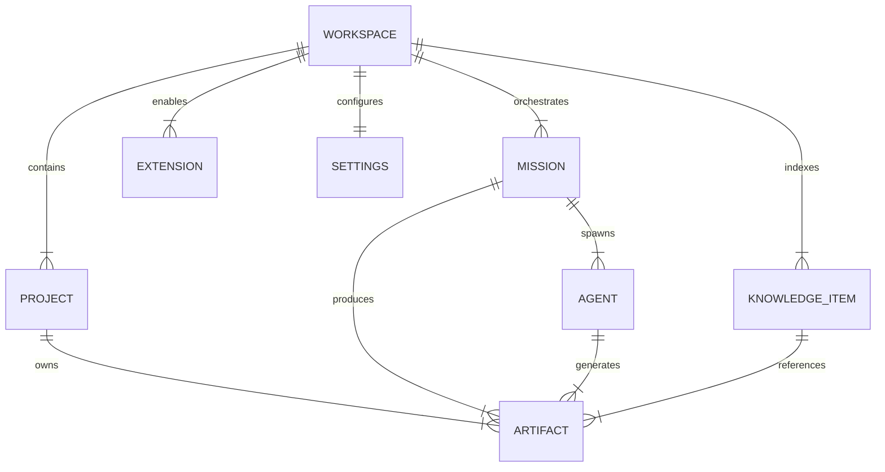

# AegisOS Studio Program (ASP)
## Module 02: Information Architecture & Domain Model

> **Status**: APPROVED  
> **Authority**: AegisOS Technical Steering Committee & Information Architecture Team  
> **Reference Document**: [00_Master_ASP_Framework.md](file:///d:/1_Projects/OpenClawOllamaLiteLLM_Transparency/docs/asp/00_Master_ASP_Framework.md)  

---

## 1. Unified Domain Taxonomy

AegisOS Studio encapsulates platform complexity behind nine unified domain entities:



---

## 2. Entity Definitions & Attribute Specifications

| Entity | Definition | Key Attributes | Studio Representation |
| :--- | :--- | :--- | :--- |
| **Workspace** | Top-level container binding projects, missions, knowledge, and settings. | `id`, `name`, `path`, `activePerspective`, `createdAt` | Root sidebar switcher, workspace header |
| **Project** | A codebase, repository, or document collection within a workspace. | `id`, `workspaceId`, `name`, `type` (code/docs), `rootUri` | Project Explorer file tree |
| **Mission** | Goal-driven multi-step agent execution package. | `id`, `title`, `status` (pending/running/paused/done), `steps[]` | Mission Center execution card |
| **Agent** | Autonomous worker spawned to execute mission steps. | `id`, `name`, `role`, `status`, `tools[]`, `parentAgentId` | Agent Console node in tree |
| **Knowledge** | Unified vector/graph indexed facts, docs, and past decisions. | `id`, `title`, `type`, `tags[]`, `embeddingRef`, `content` | Knowledge Graph node |
| **Artifact** | Tangible outputs generated by agents or users (PDF, MD, Code, Images). | `id`, `title`, `format`, `uri`, `version`, `authorAgentId` | Artifact Library tile/preview |
| **Extension** | Installed modular plugin expanding capability or perspective views. | `id`, `name`, `version`, `enabled`, `permissions[]` | Extension Marketplace card |
| **Settings** | Configuration preferences (theme, keybindings, model routing presets). | `theme`, `shortcuts`, `modelDefaults`, `telemetryConsent` | Settings Panel modal/view |
| **Search** | Global indexing engine searching across all entities. | `query`, `filters`, `matches[]`, `score` | Global Search overlay (`Cmd+K`) |

---

## 3. Client-Side State Topology

Studio maintains a reactive, local-first state topology using an in-memory client state store (Zustand/Redux patterns) backed by IndexedDB persistence:

```
┌─────────────────────────────────────────────────────────────────────────┐
│                       AEGISOS STUDIO CLIENT STORE                       │
├─────────────────────────────────────────────────────────────────────────┤
│  WorkspaceStore      │ Active workspace ID, opened projects, perspectives│
│  MissionStore        │ Active missions, step statuses, HITL approval queue│
│  AgentStore          │ Live active agents, reasoning buffers, tool metrics │
│  KnowledgeStore      │ Graph nodes, search caches, bi-directional links    │
│  ArtifactStore       │ Preview cache, tab history, file watch handles      │
│  ExtensionStore      │ Active plugins, custom perspective layout schemas   │
├─────────────────────────────────────────────────────────────────────────┤
│                        WEBSOCKET TELEMETRY SYNC                         │
│  Live Agent Steps  │  HITL Prompt Gate  │  Artifact Mutations  │ Status │
└─────────────────────────────────────────────────────────────────────────┘
```

---

## 4. State Flow & Synchronization Contract

1. **Optimistic UI Updates**: User actions (e.g. creating a mission step or toggling an extension) immediately update the local store and re-render components in <16ms.
2. **REST Sync**: Asynchronous REST API requests transmit mutations to the AegisOS Gateway (`POST /api/v1/missions`).
3. **WebSocket Event Stream**: Real-time events (`AGENT_REASONING_UPDATE`, `HITL_APPROVAL_REQUIRED`, `ARTIFACT_CREATED`) stream into the store via WebSocket, triggering targeted component invalidations.
