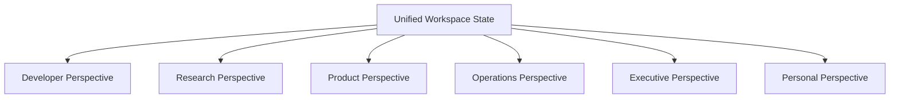

# AegisOS Studio Program (ASP)
## Module 03: Navigation System & Multi-Perspective Engine

> **Status**: APPROVED  
> **Authority**: AegisOS Technical Steering Committee & User Experience Design Team  
> **Reference Document**: [00_Master_ASP_Framework.md](file:///d:/1_Projects/OpenClawOllamaLiteLLM_Transparency/docs/asp/00_Master_ASP_Framework.md)  

---

## 1. Studio Navigation Shell Hierarchy

AegisOS Studio utilizes a flexible, 6-region navigation shell layout:

```
┌───┬─────────────────────────────────────────────────────────────┬───┐
│(P)│ Top Bar: Workspace Switcher ── Perspective Selector ── Cmd+K │[X]│
├───┼──────────────┬──────────────────────────────┬───────────────┼───┤
│   │ Secondary    │ Main Stage                   │ Contextual    │   │
│ N │ Activity     │                              │ Inspector /   │ H │
│ A │ Panel        │ (Primary Focus Area:         │ Agent Trace   │ E │
│ V │              │  Code / Document / Canvas /  │               │ L │
│   │ (Tree /      │  Graph / Dashboard)          │ (Artifacts /  │ P │
│ B │  Explorer /  │                              │  Properties / │   │
│ A │  Missions)   │                              │  Reasoning)   │   │
│ R │              │                              │               │   │
├───┴──────────────┴──────────────────────────────┴───────────────┴───┤
│ Status Bar: Active Model │ Agent Count │ Mission Status │ Memory Meter │
└─────────────────────────────────────────────────────────────────────┘
```

---

## 2. Multi-Perspective Engine

Rather than forcing different users into separate products, Studio allows instant switching between six specialized **Persona Perspectives**. Switching perspective changes panel layouts, visible activity bars, and default tool palettes without altering workspace state.



---

## 3. Persona Perspective Specifications

### 1. Developer Perspective
- **Target Persona**: Software engineers, systems architects, DevOps engineers.
- **Default Layout**: Split Code Editor (Left/Center), Live Terminal & Agent Console (Bottom), File Tree (Far Left), Agent Reasoning Inspector (Right).
- **Primary Tools**: Code Graph, Diff Viewer, Terminal, Debugger, Test Runner.

### 2. Research Perspective
- **Target Persona**: AI researchers, domain experts, technical writers.
- **Default Layout**: Bi-directional Knowledge Graph (Center), Literature Explorer (Left), Markdown Canvas (Center Split), Reference/Citation Panel (Right).
- **Primary Tools**: Vector Search, Paper Summarizer, Claim Validator, Citation Manager.

### 3. Product Perspective
- **Target Persona**: Product managers, technical leads, Scrum masters.
- **Default Layout**: Mission Kanban Board (Center), Feature Spec Canvas (Right), Project Explorer (Left), Dependency Roadmap (Bottom).
- **Primary Tools**: Mission Pack Launcher, User Story Generator, Feature Matrix, HITL Approver.

### 4. Operations Perspective
- **Target Persona**: SREs, system admins, platform operations.
- **Default Layout**: System Health Gauges & Telemetry Stream (Center), Active Agent Resource Table (Top Right), Live Log Console (Bottom), Capability Explorer (Left).
- **Primary Tools**: Resource Limiter, Log Streamer, Container Auditor, Model Router Profiler.

### 5. Executive Perspective
- **Target Persona**: VPs, CTOs, Founders, Strategic Leaders.
- **Default Layout**: Mission Summary Scorecard (Top), Decision Log (Center Left), Value Deliverable Canvas (Center Right), Cost/Token Meter (Bottom).
- **Primary Tools**: High-Level Mission Brief, Executive Summary Generator, ROI Tracker.

### 6. Personal Perspective
- **Target Persona**: Individual knowledge workers, note-takers, creators.
- **Default Layout**: Distraction-Free Markdown Canvas (Center), Daily Scratchpad (Right), Simple Task List (Left).
- **Primary Tools**: Quick Note, Personal Mission Runner, Voice Dictation, Clean Reader.
