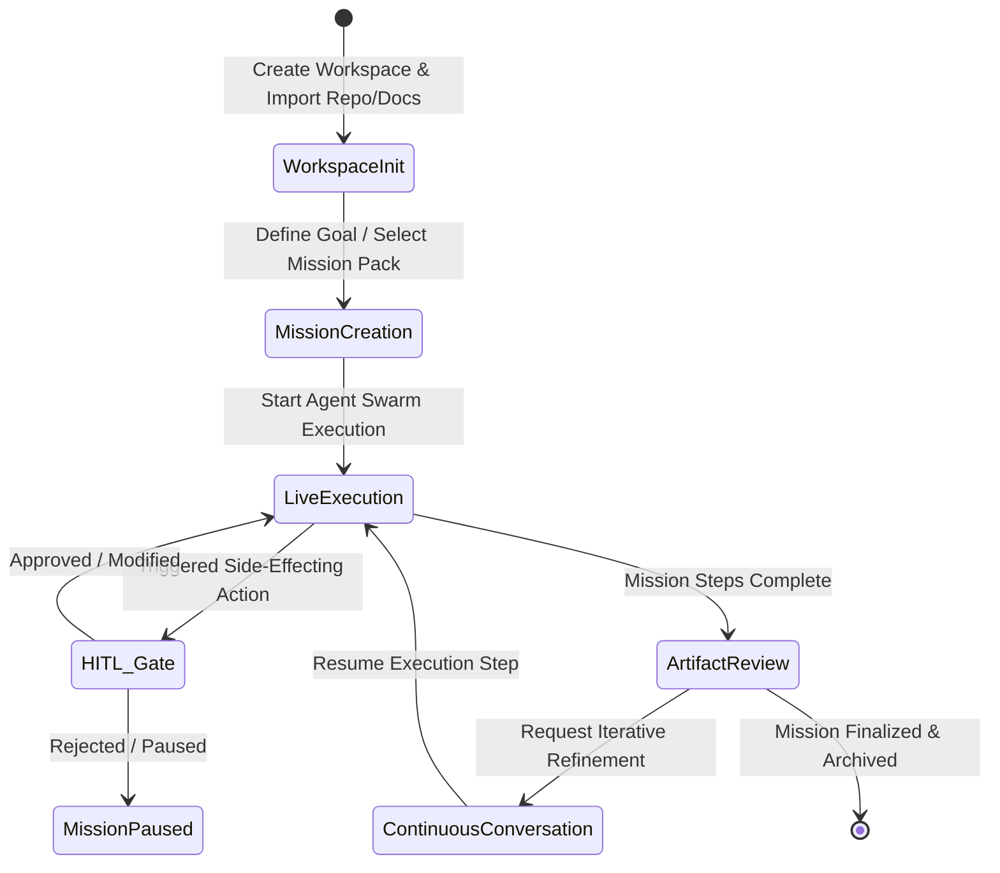

# AegisOS Studio Program (ASP)
## Module 04: UX Flows & Interactive State Model

> **Status**: APPROVED  
> **Authority**: AegisOS Technical Steering Committee & Interaction Design Group  
> **Reference Document**: [00_Master_ASP_Framework.md](file:///d:/1_Projects/OpenClawOllamaLiteLLM_Transparency/docs/asp/00_Master_ASP_Framework.md)  

---

## 1. End-to-End Mission Lifecycle UX Flow

AegisOS Studio handles mission lifecycles through six continuous, friction-free interaction stages:

---

## 2. Exhaustive Step-by-Step UX Flow Specifications

### Flow 1: Workspace Setup & Ingestion
1. **Trigger**: User opens AegisOS Studio for the first time or clicks `+ New Workspace`.
2. **Step 1**: User inputs Workspace Name (`"AegisOS E-Commerce Redesign"`) and selects local root folder.
3. **Step 2**: User drags and drops git repositories, Markdown files, or PDFs into the Ingestion Dropzone.
4. **Step 3**: Studio triggers local background vector/CodeGraph ingestion via `POST /api/v1/knowledge/index`.
5. **Outcome**: Workspace Home renders with populated Project Explorer and Knowledge Graph.

### Flow 2: Mission Creation & Specification
1. **Trigger**: User clicks `+ New Mission` or types `/mission` in Global Search.
2. **Step 1**: Studio presents Mission Pack selector (e.g. *Software Engineering*, *Architecture Audit*, *Research Review*).
3. **Step 2**: User enters Goal Statement (*"Refactor auth service to use JWT RS256 keys and add unit tests"*).
4. **Step 3**: User sets HITL Security Threshold (*Strict: Approve all file writes & shell commands*).
5. **Step 4**: User clicks `Launch Mission`.

### Flow 3: Live Execution Watching
1. **Trigger**: Mission starts; WebSocket connection opens (`/ws/missions/{id}/telemetry`).
2. **UI State**:
   - Main Stage switches to **Live Execution Graph**.
   - Agent Console shows spawning subagent nodes (*Lead Architect*, *Coder*, *Test Runner*).
   - Reasoning trace streams line-by-line with glowing execution pulses.
   - Active tool usage cards display current command (`git status`, `npm test`).

### Flow 4: Human-in-the-Loop (HITL) Gate Approval
1. **Trigger**: Agent requests execution of a restricted tool (`write_file` or `run_command`).
2. **UI State**:
   - Execution graph pauses with a amber glow indicator.
   - An interactive **HITL Gate Modal** slides in from top-right.
   - Side-by-side **Unified Diff Viewer** highlights proposed file changes.
3. **User Action**:
   - Click `Approve [Enter]` &rarr; Mission resumes instantly.
   - Click `Modify Intent` &rarr; User adds inline edit instruction before approving.
   - Click `Reject [Esc]` &rarr; Agent receives rejection signal and chooses alternative strategy.

### Flow 5: Artifact Review & Continuous Chat Iteration
1. **Trigger**: Mission completes step batching; generated artifacts appear in **Artifact Library**.
2. **UI State**:
   - Split-screen preview displays formatted Markdown, rendered PDF, or Code Diffs.
   - Integrated **Conversational Refinement Bar** docks at the bottom of the artifact canvas.
3. **User Action**:
   - User types: *"Add edge-case error handling for expired tokens on line 42"*.
   - Studio dispatches incremental instruction to Lead Agent; execution resumes seamlessly.
