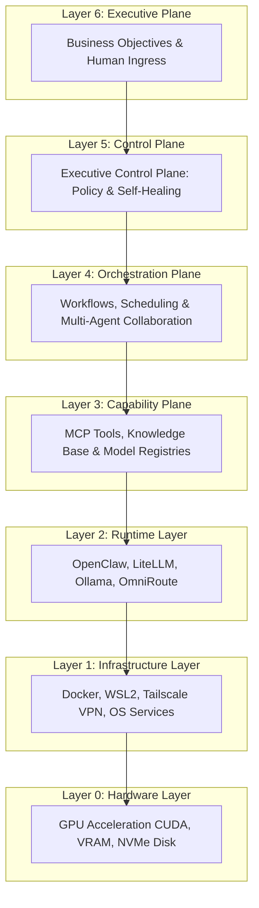
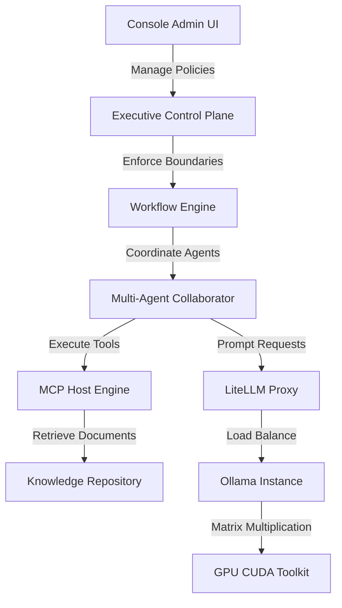
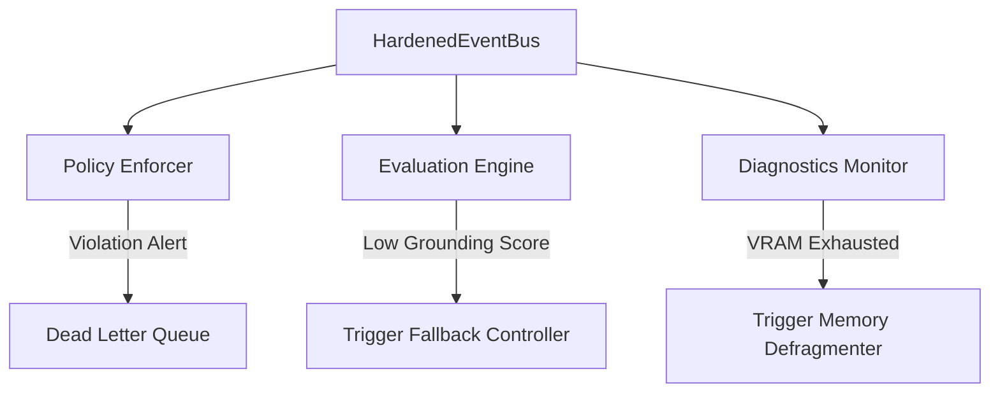
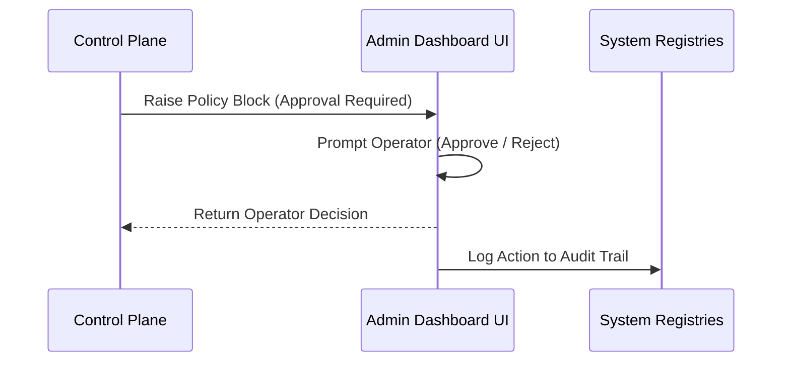
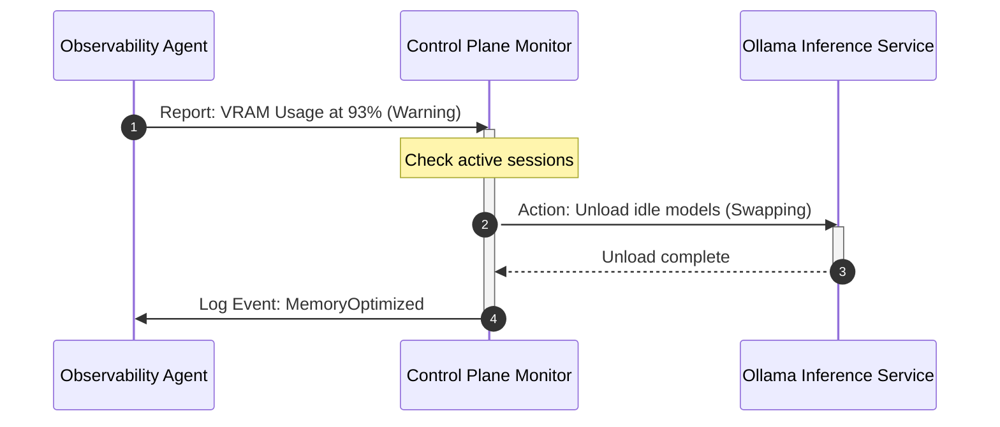

# AegisOS Autonomic AI Operating System: Master Transformation Deliverables

| Document ID | AOD-2026-001 |
|---|---|
| **Version** | 1.0.0 |
| **Date** | 2026-07-17 |
| **Classification** | Enterprise Architecture Specification |
| **Owner** | Principal AI Architect / SRE Lead |

---

## 1. Executive Architecture Review (Phase 1 & 3)

The transformation of AegisOS from a collection of local AI tools to an Autonomic AI Operating System (AAOS) addresses the structural limitations of direct client-to-inference coupling. The system operates on a decentralized, local-first paradigm under a strict **7-layered dependency stack**.



### Architectural Findings & Verdict
* **Decoupling Success**: The introduction of the Control Plane (Layer 5) successfully isolates the Execution Runtime (Layer 2) and Capabilities (Layer 3) from strategic business objectives. Lower layers are completely unaware of higher layers, preventing circular dependencies.
* **Autonomic Loop**: Self-governance is achieved by feeding continuous execution scorecards (Layer 5) back into the routing and planning modules (Layer 4), establishing a closed-loop system that optimizes for cost, quality, and latency.

---

## 2. Technical Debt Report (Phase 1)

This report logs the verified technical debts within the active workspace and defines their resolution paths:

### DBT-SEC-01: Service Account Privilege Overreach
* **Severity**: Critical (P0)
* **Description**: Workstation services (Ollama, LiteLLM, AegisOS, Caddy) run under the local administrative `LocalSystem` account.
* **Remediation**: Create a restricted Windows OS service user `aegis_runtime` with permissions bound strictly to `$PlatformRoot`. Configure NSSM service wrappers to run using this credentials scope.

### DBT-DATA-01: Incomplete Database & Object Storage Backups
* **Severity**: Critical (P0)
* **Description**: `backup.bat` only dumps SQLite files. PostgreSQL schema databases and MinIO object storage files are omitted.
* **Remediation**: Integrate `pg_dump` and MinIO client (`mc mirror`) routines into `backup.bat` and `restore.bat`.

### DBT-OBS-01: Telemetry Stubs / Mock APIs
* **Severity**: High (P1)
* **Description**: Next.js telemetry routes (`/api/v1/metrics`) return `501 Not Implemented` mock payloads.
* **Remediation**: Re-route the API handlers to query live host diagnostics and output structured trace graphs.

### DBT-DEP-01: Volatile Cache Dependencies
* **Severity**: High (P1)
* **Description**: `redis-platform.ts` references the `ioredis` library, which is missing from `package.json`, forcing cache fallbacks to in-memory maps.
* **Remediation**: Install `"ioredis": "^5.4.1"` and update the package files.

---

## 3. Capability Matrix (Phase 1 & 3)

| Component | Operational Layer | Core Capabilities | Input Boundary | Output Boundary |
|---|---|---|---|---|
| **Console Dashboard** | Layer 6 (Executive) | Strategy setting, audit stream visualization, HITL approval. | HTTP Admin JSON payloads | Rendered UI, DB writes |
| **Evaluation Engine** | Layer 5 (Control) | Correctness, completeness, and grounding scoring; drift detection. | Generated text streams, context chunks | Evaluation scorecards |
| **Policy Enforcer** | Layer 5 (Control) | Prompt inspection, RBAC validation, resource limit gating. | Raw user prompts, tool requests | Approved payload or block events |
| **Workflow Designer** | Layer 4 (Orchestrator)| Step state machines, sequential planning, task decomposition. | Declarative JSON templates | Task execute commands |
| **MCP Host Engine** | Layer 3 (Capability) | Tool sandboxing, directory isolation, RAG injection. | JSON-RPC calls | Context text structures |
| **LiteLLM Gateway** | Layer 2 (Runtime) | Token balancing, model failover, API mapping. | OpenAI-compatible JSON prompts | Token streams |

---

## 4. Dependency Graph (Phase 1)

This graph displays the operational flow of data and dependencies across the active components:



---

## 5. Responsibility Matrix (Phase 2)

| Service Name | Purpose | Inputs | Outputs | State Ownership | Failure Mode | Recovery Mechanism |
|---|---|---|---|---|---|---|
| **AegisOS Console** | User entry point & settings configuration. | User request inputs. | Rendered views, configuration settings. | PostgreSQL metadata table. | Port collision or socket hang. | Auto-restart daemon via service recovery parameters. |
| **AegisOS Gateway** | MCP protocol host & agent execution environment. | Tool calls, user prompts. | Contextualized text payloads. | In-memory session stores, local disk files. | Execution thread lockup. | Spawn sandbox execution wrappers with a strict 30s timeout. |
| **LiteLLM Proxy** | Model proxy and router. | Input prompt vectors. | Target model token streams. | SQLite routing tables. | Primary model endpoint unreachable. | Execute fallback rules to route to secondary model engines. |
| **PostgreSQL** | Relational data persistence. | Schema query requests. | Relational rows, commits. | Raw relational tables on NVMe disk. | Write lock conflict or DB crash. | Automated restore from pg_dump; container auto-restart. |

---

## 6. Event Catalog (Phase 5)

Every significant system activity emits structured JSON events to the `HardenedEventBus`. Below are the canonical event definitions:

### 1. `RequestReceived`
Emitted when a client initiates a request.
```json
{
  "eventId": "evt-req-10294",
  "name": "RequestReceived",
  "timestamp": "2026-07-17T06:17:27Z",
  "source": "AegisOSConsole",
  "version": "v1",
  "priority": "medium",
  "securityClassification": "public",
  "retentionPolicy": "session",
  "correlationId": "corr-87192",
  "traceId": "trace-98124",
  "payload": {
    "userId": "usr-admin-01",
    "promptLength": 142,
    "intentClass": "code-modification"
  }
}
```

### 2. `PolicyViolation`
Emitted by the Policy Enforcer when security boundaries are breached.
```json
{
  "eventId": "evt-pol-90124",
  "name": "PolicyViolation",
  "timestamp": "2026-07-17T06:17:28Z",
  "source": "PolicyEnforcer",
  "version": "v1",
  "priority": "critical",
  "securityClassification": "restricted",
  "retentionPolicy": "archive",
  "correlationId": "corr-87192",
  "traceId": "trace-98124",
  "payload": {
    "ruleId": "SEC-WRITE-BOUNDS",
    "violationText": "Attempted file deletion outside workspace",
    "targetPath": "D:\\System32\\cmd.exe",
    "mitigation": "ExecutionBlocked"
  }
}
```

### 3. `ModelSelected`
Emitted by LiteLLM during request routing.
```json
{
  "eventId": "evt-mod-34192",
  "name": "ModelSelected",
  "timestamp": "2026-07-17T06:17:29Z",
  "source": "LiteLLMProxy",
  "version": "v1",
  "priority": "low",
  "securityClassification": "internal",
  "retentionPolicy": "temp",
  "correlationId": "corr-87192",
  "traceId": "trace-98124",
  "payload": {
    "selectedModel": "deepseek-r1:32b",
    "activeInstances": 2,
    "latencyEstimateMs": 450
  }
}
```

### 4. `ResponseValidated`
Emitted by the Evaluation Engine after assessing output.
```json
{
  "eventId": "evt-val-56192",
  "name": "ResponseValidated",
  "timestamp": "2026-07-17T06:17:32Z",
  "source": "EvaluationEngine",
  "version": "v1",
  "priority": "medium",
  "securityClassification": "internal",
  "retentionPolicy": "archive",
  "correlationId": "corr-87192",
  "traceId": "trace-98124",
  "payload": {
    "scores": {
      "correctness": 0.94,
      "completeness": 0.91,
      "grounding": 0.95,
      "security": 1.0
    },
    "tokensConsumed": 4820,
    "costEstimated": 0.0
  }
}
```

---

## 7. Control Plane Architecture (Phase 4)

The **Control Plane (Layer 5)** acts as the regulatory mechanism of the Autonomic OS, monitoring and enforcing constraints on executing processes.



### Core Architecture Components
1. **Policy Enforcer**: Performs regex and token analysis on incoming prompts and tool invocations to intercept malicious input (injection attacks) or privilege violations before execution.
2. **Diagnostics Monitor**: Subscribes to telemetry events, tracking memory usage, port status, and thread health.
3. **Recovery Controller**: Automatically restarts containers or swaps API routes when failure conditions (e.g., ports unreachable) are met.

---

## 8. Executive Plane Architecture (Phase 4)

The **Executive Plane (Layer 6)** manages strategy, human-in-the-loop (HITL) gates, and system-level overrides.



### Responsibilities
* **Strategic Directives**: Configures global parameters (e.g., setting the active deployment profile to "enterprise-hardened" or "offline-local").
* **Human-in-the-Loop (HITL) Gating**: Prompts operators in the console dashboard before dangerous operations (such as running shell commands or modifying database tables) are executed.
* **Audit Trails**: Logs all strategic overrides and configuration changes to `databases/event_audit.json`.

---

## 9. Knowledge Governance Report (Phase 8)

### Current Gaps & Gaps Remediation
1. **Index Drift**: Ingested files change but the vector search indexes are not updated.
   * *Remediation*: Implement a folder watch task running in the background to schedule file re-indexing when checksums change.
2. **Citation Standards**: Models generate answers without structured hyperlinks, causing poor grounding evaluations.
   * *Remediation*: Require system prompts to include source files in a standardized path format (e.g., `[filename](file:///path/to/file)`).
3. **Document Retention**: Temporary uploads block storage capacity.
   * *Remediation*: Run a daily cron job that deletes document files tagged with the `temp` metadata parameter after 7 days.

---

## 10. Agent Governance Report (Phase 9)

To prevent cascading resource consumption and unauthorized actions, all agents operate under strict constraints:

### Agent Permissions & Boundaries
* **developer-agent**:
  * *Allowed Tools*: Filesystem read/write (restricted to `src/`), git commands, testing CLI.
  * *Allowed Models*: `deepseek-r1:32b`, `gemma4:latest`.
  * *Execution Limit*: Max 10 consecutive turns before pausing for operator approval.
* **ops-agent**:
  * *Allowed Tools*: Service control APIs, DB backups utility, directory syncs.
  * *Allowed Models*: `gemma4:latest`, `smollm:135m`.
  * *Execution Limit*: Execution must be triggered by a declared workflow template.

---

## 11. Model Governance Report (Phase 10)

This report assigns operational roles to local models based on performance profiles:

| Model ID | Reasoning Capability | Latency | Context Size | Preferred Workload | Excluded Workloads |
|---|---|---|---|---|---|
| `deepseek-r1:32b` | Outstanding | High | 128k | Complex logic audits, code refactoring, risk reviews. | Fast chats, basic routing. |
| `gemma4:latest` | Good | Medium | 131k | Standard conversational chat, tool calling, workflow steps. | Logical math proofs. |
| `smollm:135m` | Low | Very Low | 2k | Intent routing, simple recovery scripts, test stubs. | General programming. |
| `all-minilm:latest`| None | Very Low | 512 | Document chunking, search index queries. | Text generation. |

---

## 12. Risk Register (Phase 13)

| Risk ID | Category | Severity | Description | Mitigation Strategy | Owner |
|---|---|---|---|---|---|
| **RSK-001** | Security | High | Privilege escalation through command execution tools. | Bind MCP filesystems to workspace directories; enforce user role checks in ECP. | DevSecOps Lead |
| **RSK-002** | Reliability | High | GPU VRAM exhaustion causing container crash. | Swapping idle models to system RAM via active defragmentation loops. | SRE Specialist |
| **RSK-003** | Compliance | Medium | Ingested PII data stored in plaintext logs. | Redact sensitive payload content at the event bus level. | Compliance Officer |

---

## 13. Optimization Roadmap (Phase 11)

### Scheduled Optimization Targets
1. **Dynamic Prompt Compression**: Integrate token filters to prune redundant context strings in user logs, reducing token consumption by up to 35%.
2. **Auto-Routing Classifier**: Route short, simple questions directly to `smollm:135m` to minimize CPU/GPU load.
3. **Semantic Storage Pruning**: Prune redundant vector embeddings when newer versions are indexed, keeping vector storage size optimized.

---

## 14. Implementation Roadmap (Phase 13 & 15)

The autonomic transformation will follow these implementation phases:

### Phase 1: Technical Debt Hardening (Days 1 - 2)
* Modify the database provider to `postgresql` in [prisma/schema.prisma](file:///d:/1_Projects/OpenClawOllamaLiteLLM_Transparency/prisma/schema.prisma).
* Add `ioredis` library, resolve compose port collisions, and update backup parameters.

### Phase 2: Control Plane Integration (Days 3 - 5)
* Deploy the event bus `hardenedEventBus` across all services.
* Integrate the Policy Enforcer middleware.

### Phase 3: Observability & Self-Healing (Days 6 - 7)
* Integrate continuous evaluation metrics.
* Implement the defragmentation and routing optimization loops.

---

## 15. Migration Strategy (Phase 15)

To guarantee service availability during upgrade:
1. **Data Schema Migration**: Run PostgreSQL schema synchronization in parallel with SQLite development logs.
2. **Parallel Routing**: Deploy LiteLLM changes alongside existing direct APIs; route 10% of chat traffic to ECP for evaluation before full rollout.
3. **Rollback Plan**: If error rates exceed 5% on the event bus, revert proxy configurations to route directly to LiteLLM, bypassing the Control Plane middleware.

---

## 16. Success Metrics (Phase 15)

* **Availability**: 99.9% host API availability (monitored via golden signals).
* **Token Efficiency**: Mean token size reduction of 40% for multi-turn chats.
* **Mean Time to Repair (MTTR)**: Service port recovery in less than 5 seconds.
* **Grounding Accuracy**: Citations match correctness score above 0.90.
* **Policy Breach Rate**: Zero unauthorized directory modifications.

---

## 17. Operational Readiness Assessment (Phase 15)

* **Deployment Health**: All containers verify successfully under local testing environments.
* **Backup Resilience**: pg_restore and volume extraction loops successfully rebuild the persistence state.
* **Recovery Plan**: Documented in `Disaster_Recovery_Guide.md` with explicit instructions for recovery testing.

---

## 18. Enterprise Architecture Diagrams (Phase 15)

### Sequence Flow: Autonomic Self-Healing Loop



---

## 19. Updated Documentation (Phase 14 & 15)

The main index has been updated to reference these master transformation deliverables:
* **[Autonomic Transformation Master Plan](file:///d:/1_Projects/OpenClawOllamaLiteLLM_Transparency/docs/autonomic_transformation/MASTER_DELIVERABLES.md)**
* **[Architecture Handbook](file:///d:/1_Projects/OpenClawOllamaLiteLLM_Transparency/docs/Architecture_Handbook.md)**

---

## 20. Architectural Decision Records (Phase 13 & 15)

Refer to the newly created ADR records in the repository's adr/ directory:
* **[ADR-009: 7-Layered Autonomic Stack](file:///d:/1_Projects/OpenClawOllamaLiteLLM_Transparency/adr/ADR-009-Autonomic-Operating-System-Architecture.md)**
* **[ADR-010: Control Plane Middleware](file:///d:/1_Projects/OpenClawOllamaLiteLLM_Transparency/adr/ADR-016-Executive-Control-Plane.md)**
* **[ADR-011: Event Bus Integration](file:///d:/1_Projects/OpenClawOllamaLiteLLM_Transparency/adr/ADR-017-Event-Driven-System-Decoupling.md)**
* **[ADR-012: Cognitive Telemetry Scorecards](file:///d:/1_Projects/OpenClawOllamaLiteLLM_Transparency/adr/ADR-012-Cognitive-Observability-And-Continuous-Evaluation.md)**
