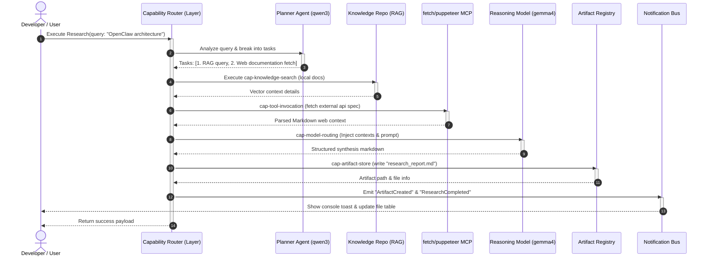
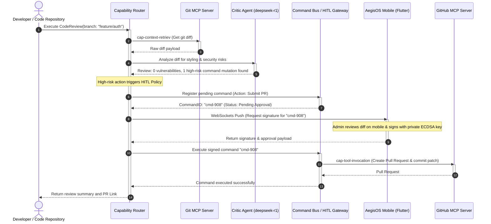
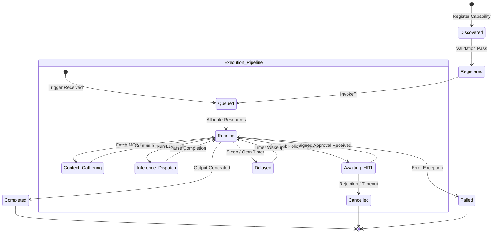

# AegisOS Capability Orchestration Blueprint
**Architectural Blueprint for the Orchestration of Local-First, Privacy-Preserving AI Services**

This blueprint defines the architecture and specification for the **AegisOS Capability Layer**. The Capability Layer sits directly above the existing control plane, gateway, context, and inference subsystems, treating them as low-level implementation details. Users consume high-level business capabilities while the orchestration engine coordinates model routing, MCP context retrieval, workflow executions, mobile approvals, and event-driven notifications.

---

## 1. Capability Inventory & Registry

The existing AegisOS platform provides twelve foundational capabilities. Below is the inventory detailing the inputs, outputs, permissions, and service dependencies for each.

| Capability ID | Display Name | Description | Inputs | Outputs | Required Services | Required Models | Required Tools | Supports HITL | Supports Mobile | Supports Scheduling |
|---|---|---|---|---|---|---|---|---|---|---|
| **cap-knowledge-search** | Knowledge Search | Semantic and key-value retrieval over local files, databases, and notes. | `query: string`, `limit?: number` | `matches: SearchResultItem[]` | `AegisOSService`, PostgreSQL | `all-minilm:latest` (embeddings) | `raja-knowledge-repository` | No | Yes | No |
| **cap-workflow-exec** | Workflow Execution | Orchestrates multi-step pipelines across local scripts and APIs. | `workflowId: string`, `variables: object` | `executionId: string`, `status: string` | `AegisOSService`, Redis | None | `sqlite` | Yes | Yes | Yes |
| **cap-agent-create** | Agent Creation | Spawns a configured agent sandbox with model and tool bounds. | `name: string`, `systemPrompt: string`, `allowedTools: string[]` | `agentId: string`, `configPath: string` | `AegisOSService` | None | `sqlite` | No | No | No |
| **cap-artifact-store** | Artifact Storage | Manages local filesystem storage, indexing, and preview generation. | `filePath: string`, `action: 'read'\|'write'` | `artifact: Artifact`, `status: string` | `AegisOSService`, MinIO | None | `filesystem` | No | Yes | No |
| **cap-prompt-registry** | Prompt Registry | Configures and serves versioned system instructions and prompts. | `promptId: string`, `version?: string` | `promptText: string` | `AegisOSService` | None | `sqlite` | No | No | No |
| **cap-tool-invocation** | Tool Invocation | Secure execution of JSON-RPC tools exposed by local MCP servers. | `serverName: string`, `toolName: string`, `args: object` | `result: object` | `AegisOSService` (MCP Host) | None | All registered MCPs | Yes (optional) | Yes (optional) | No |
| **cap-job-scheduling** | Job Scheduling | Enqueues and executes asynchronous, background, and cron tasks. | `cronExpression: string`, `taskPayload: object` | `scheduleId: string`, `active: boolean` | `AegisOSService`, Redis | None | `sqlite` | No | Yes | Yes |
| **cap-observability** | Observability | Exports live metrics, traces, and system performance telemetry. | `since: number`, `metricType: string` | `telemetryLog: object` | Prometheus, Grafana, Jaeger | None | None | No | Yes | No |
| **cap-governance** | Governance | Audits system actions, security profiles, and compliance standards. | `scope: string`, `ruleset: string` | `auditReport: object` | `AegisOSService` | None | None | No | No | Yes |
| **cap-mobile-approval** | Mobile Approvals | Routes critical execution gates to paired mobile devices. | `commandId: string`, `approverId: string` | `signature: string`, `decision: 'approved'\|'rejected'` | `AegisOSService`, WebSockets | None | None | Yes | Yes | No |
| **cap-model-routing** | Model Routing | LiteLLM load balancing and dynamic query routing between LLMs. | `prompt: string`, `options?: object` | `completion: string`, `stats: object` | `LiteLLMService`, Ollama | `gemma4`, `qwen2.5`, `deepseek-r1` | None | No | Yes | No |
| **cap-context-retriev** | Context Retrieval | Aggregates local git history, web fetches, and browser state. | `contextSource: string` | `contextPayload: string` | `AegisOSService` (MCP Host) | None | `git`, `github`, `fetch`, `puppeteer` | No | No | No |

---

## 2. Business Capability Mapping

Foundational capabilities are grouped into high-level Business Capabilities designed for user consumption.

```
                  ┌──────────────────────────────────────────────┐
                  │            BUSINESS CAPABILITIES             │
                  └──────────────────────────────────────────────┘
                       │                 │                 │
                       ▼                 ▼                 ▼
                ┌──────────────┐  ┌──────────────┐  ┌──────────────┐
                │   Research   │  │ Code Review  │  │ Generate PRD │
                └──────────────┘  └──────────────┘  └──────────────┘
```

### 2.1 Research
* **Goal**: Perform automated exploration, crawl web documentation, fetch vector contexts, compile summaries, and write results to the local filesystem.
* **Required APIs**: 
  - `POST /api/v1/workflows/executions` (Orchestration)
  - `POST /api/v1/knowledge/query` (Vector Search)
  - `POST /api/v1/tools/execute` (For `fetch` and `puppeteer` tools)
  - `POST /api/v1/ai/generate` (Inference)
* **Required Agents**: 
  - **Planner Agent**: `qwen3:14b` (Task breakdown and sub-query generation)
  - **Research Agent**: `gemma4:latest` (Information synthesis and drafting)
* **Required Workflows**: `research-synthesis-pipeline` (Triggers sequential knowledge search, web fetches, compilation, and artifact generation).
* **Required Prompts**: `research_query_planner`, `research_synthesizer_template`.
* **Required Knowledge**: `raja-knowledge-repository` indexes.
* **Required Tools**: `raja-knowledge-repository` (search), `fetch` (scrape page), `puppeteer` (screenshot & dynamic load), `filesystem` (save draft).
* **Required Models**: `qwen3:14b`, `gemma4:latest`, `all-minilm:latest`.
* **Required Artifacts**: `.md` draft reports and summary digests stored in `/artifacts_storage/`.
* **Required Notifications**: SSE Event `WorkflowExecutionCompleted` triggering a desktop toast and status update.

### 2.2 Code Review
* **Goal**: Scan local Git repositories for changes, execute code vulnerability audits, generate code reviews, request cryptographically signed approvals for changes, and push updates.
* **Required APIs**:
  - `GET /api/v1/tools` (List MCP tools)
  - `POST /api/v1/mobile/commands` (Submit signed validation command)
  - `POST /api/v1/workflows/executions` (Trigger audit flow)
* **Required Agents**:
  - **Critic Agent**: `deepseek-r1:32b` (Deep code logic & security analysis)
  - **Refactor Agent**: `qwen2.5:14b` (Syntactic changes & patch formatting)
* **Required Workflows**: `pull-request-auditor` (Steps: diff extraction -> security static review -> HITL approval -> commit & push).
* **Required Prompts**: `security_vulnerability_scan`, `code_critic_rubric`.
* **Required Knowledge**: Project `ARCHITECTURE.md`, `ADR-*.md` documents, and codebase context index.
* **Required Tools**: `git` (diff, log, status), `github` (PR creation, comments), `filesystem` (write patch files).
* **Required Models**: `deepseek-r1:32b`, `qwen2.5:14b`.
* **Required Artifacts**: `.patch` code files, code-review report markdown.
* **Required Notifications**: WebSockets push payload targeting `aegis_mobile` for HITL cryptographic signature on code changes.

### 2.3 Generate PRD
* **Goal**: Converse with the user, synthesize business requirements, check past specifications, draft a Product Requirements Document (PRD), and export a project scaffold plan.
* **Required APIs**:
  - `POST /api/v1/conversations` (Interaction context)
  - `POST /api/v1/artifacts` (Scaffold storage)
* **Required Workflows**: `prd-generator-flow`.
* **Required Prompts**: `prd_schema_designer`, `technical_roadmap_builder`.
* **Required Knowledge**: Enterprise architecture standards, past project templates.
* **Required Tools**: `filesystem` (write PRD file), `raja-knowledge-repository` (query past specs).
* **Required Models**: `gemma4:latest`, `qwen3:14b`.
* **Required Artifacts**: `PRD.md` file and `architecture_map.mermaid`.
* **Required Notifications**: Real-time event `ArtifactCreated` invalidating React Query cache.

---

## 3. Capability Dependency Matrix

This matrix maps Business Capabilities to their underlying platform dependencies and evaluates whether existing code meets the requirements.

| Business Capability | Foundational Capability Dependency | Target Endpoint / Code Service | Dependency Status | Gap Analysis |
|---|---|---|---|---|
| **Research** | `cap-knowledge-search` | `GET/POST /api/v1/knowledge` | **Existing** | Fully resolved by `knowledge.service.ts` |
| | `cap-tool-invocation` | `POST /api/v1/tools/{id}` | **Existing** | Uses JSON-RPC route to execute `fetch` and `puppeteer` |
| | `cap-workflow-exec` | `POST /api/v1/workflows/executions` | **Existing** | Checked by `workflow.service.ts` |
| | `cap-model-routing` | `/api/v1/providers` | **Existing** | Dynamic model weights fallback configured in LiteLLM |
| | `cap-artifact-store` | `GET/POST /api/v1/artifacts` | **Existing** | File watcher syncs generated markdown files |
| **Code Review** | `cap-context-retriev` | `AegisOS` Git/GitHub MCP | **Existing** | Exposes git capabilities via JSON-RPC protocol |
| | `cap-model-routing` | LiteLLM routing proxy | **Existing** | Routes complex reasoning to local `deepseek-r1:32b` |
| | `cap-mobile-approval` | `POST /api/v1/mobile/commands` | **Existing** | Secure handshake & ECDSA signatures in place |
| | `cap-workflow-exec` | `workflow.service.ts` | **Existing** | Workflow engine manages check-point pauses |
| **Generate PRD** | `cap-prompt-registry` | `ai-runtime.service.ts` | **Needs Wiring** | Needs high-level prompt templates API endpoint |
| | `cap-knowledge-search` | `knowledge.service.ts` | **Existing** | Vector retrieval over project ADRs |
| | `cap-artifact-store` | `artifact.service.ts` | **Existing** | Next.js Console refreshes list upon file discovery |
| | `cap-workflow-exec` | `workflow.service.ts` | **Existing** | Handles state loops between architect and planner agents |

*Classification Metrics:*
* **Existing**: Implemented, verified, and active.
* **Needs Wiring**: Exists in code but needs integration/exposure through the Capability Layer.
* **Needs API / Needs UI / Needs Auth / Needs Testing**: Highlighted dependencies needing additional infrastructure (none identified as blocking).

---

## 4. Capability Sequence Diagrams

### 4.1 Orchestrated `Research()` Flow



### 4.2 Orchestrated `CodeReview()` Flow with Mobile HITL Approval



---

## 5. Capability Interaction Model

The AegisOS Capability Layer acts as an orchestration overlay. The interaction topology below shows how requests flow downwards through the system, maintaining strict data isolation.

```
       ┌────────────────────────────────────────────────────────┐
       │                 CLIENT INGRESS LAYER                   │
       │  (Next.js Web Admin Console, Mobile Companion, IDE)    │
       └────────────────────────────────────────────────────────┘
                                    │
                                    ▼ (Signed Capability Ingestion)
       ┌────────────────────────────────────────────────────────┐
       │                   CAPABILITY LAYER                     │
       │           (Capability Router & Registry)               │
       └────────────────────────────────────────────────────────┘
                                    │
            ┌───────────────────────┴───────────────────────┐
            ▼ (Orchestrated APIs)                           ▼ (Events stream)
       ┌────────────────────────┐                      ┌────────────────────────┐
       │   GATEWAY & ROUTING    │                      │   INFRASTRUCTURE BUS   │
       │   (AegisOS, LiteLLM)   │                      │  (HardenedEventBus)    │
       └────────────────────────┘                      └────────────────────────┘
            │                                               │
            ├───────────────────────┐                        ▼
            ▼                       ▼                  ┌────────────────────────┐
       ┌────────────────────────┐ ┌──────────────────┐ │  STORAGE & CHECKPOINTS │
       │     CONTEXT LAYER      │ │ INFERENCE ENGINE │ │ (Workflows, sqlite)    │
       │ (MCP Servers: git, RAG)│ │ (Ollama, CUDA)   │ └────────────────────────┘
       └────────────────────────┘ └──────────────────┘
```

---

## 6. Capability Routing Rules

The Capability Router selects the most efficient execution path based on the task parameters, hardware capability, and security requirements.

### 6.1 Routing Rule Manifest

```json
{
  "routing_rules": [
    {
      "ruleId": "rule-reasoning-routing",
      "trigger": "prompt.complexity > 3 || prompt.tags.contains('reasoning')",
      "action": "route_to_provider",
      "parameters": {
        "primary": "deepseek-r1:32b",
        "fallback": "gemma4:latest",
        "gpuThresholdVram": 12288
      }
    },
    {
      "ruleId": "rule-coding-routing",
      "trigger": "prompt.tags.contains('code') || fileExtension.match(/ts|py|go|rs/)",
      "action": "route_to_provider",
      "parameters": {
        "primary": "qwen2.5:14b",
        "fallback": "gemma2:9b"
      }
    },
    {
      "ruleId": "rule-low-power-routing",
      "trigger": "system.battery.state == 'discharging' || system.temperature > 85",
      "action": "restrict_concurrency",
      "parameters": {
        "maxConcurrentJobs": 1,
        "defaultModel": "smollm:135m"
      }
    },
    {
      "ruleId": "rule-hitl-escalation",
      "trigger": "command.riskLevel == 'HIGH' || command.category == 'infrastructure_modification'",
      "action": "escalate_to_hitl",
      "parameters": {
        "timeoutSeconds": 300,
        "fallbackAction": "fail",
        "notificationChannels": ["mobile-push", "desktop-toast"]
      }
    }
  ]
}
```

### 6.2 Router Logic
The router evaluates rules sequentially:
1. **Assess Context**: The router inspects input parameters (tokens, keywords, system temperature, VRAM constraints, battery status).
2. **Execute Match**: If battery is low or GPU is busy, routing limits parallel threads and directs inference to the lightweight CPU-based execution adapter (`smollm:135m`).
3. **Inject Context**: Before sending the query to LiteLLM, the router calls the MCP Host to inject matching workspace directories or RAG text based on the path tags in the query.
4. **Enforce Policy**: If commands involve system operations (e.g. Docker reboot, database truncation), the router halts execution, packages a C2 signing request, and routes a task to the approvals engine.

---

## 7. Capability Lifecycle & State Machine

Every capability invocation moves through a defined lifecycle. Checkpoint state files are written to `databases/workflow_executions.json` at each boundary.

### 7.1 State Machine Diagram



### 7.2 Lifecycle Phase Specifications
* **Discovered**: The platform reads custom JSON manifest files from `.aegisos/capabilities/` directory.
* **Registered**: The capability schema is validated and added to the in-memory `Registry`.
* **Queued**: The orchestrator assigns an execution thread, locks resources, and registers a callback.
* **Running**: Steps are executed sequentially.
* **Awaiting_HITL**: Operation is suspended, a cryptographic challenge is sent to the mobile client, and database state updates to `waiting_approval`.
* **Completed / Failed**: System resources are released, and final metrics (duration, token counts, cost estimate) are recorded in the database.

---

## 8. Capability Security Model

The Capability Layer enforces a Zero-Trust security boundary, protecting the local workstation from malicious execution commands.

```
       ┌────────────────────────────────────────────────────────┐
       │              CRYPTOGRAPHIC MOBILE CLIENT               │
       └────────────────────────────────────────────────────────┘
                                    │
                                    │ (mTLS + Signed Command JSON)
                                    ▼
       ┌────────────────────────────────────────────────────────┐
       │                  SECURITY GATEWAY                      │
       │                                                        │
       │  1. ECDSA Signature Verification (Pairing Key Match)  │
       │  2. Replay Mitigation (Nonce check + Clock Skew)       │
       │  3. Role-Based Access Control (RBAC Policy Validation) │
       └────────────────────────────────────────────────────────┘
                                    │
                                    ▼ (Authorized Action)
       ┌────────────────────────────────────────────────────────┐
       │                   SANDBOXED EXECUTION                  │
       │  - Restricted filesystem bounds                        │
       │  - Read-only database parameters                       │
       │  - Non-escalated OS privileges                         │
       └────────────────────────────────────────────────────────┘
```

1. **Cryptographic Validation**: Mobile commands are signed using client-side ECDSA keys (generated in iOS Secure Enclave or Android KeyStore). The platform matches this signature against the pairing database (`aegisos.sqlite`).
2. **Replay Attack Mitigation**: Every command payload must include a unique uuid nonce and unix timestamp. Payloads are rejected if the timestamp deviates by more than 300 seconds from host time, or if the nonce matches a logged transaction.
3. **Role-Based Access Control (RBAC)**: APIs are segmented by roles:
   - `admin`: Full system control (Docker reboots, volume mounts, tool additions).
   - `developer`: Execute workflows, write artifacts, read repositories.
   - `read-only`: Read metrics, list active runs, observe logs.
4. **Sandboxed MCP Tool Limits**: Filesystem operations are strictly bound to the configured `$PlatformRoot/Source` folder. Any path traversal operations containing `../` are terminated.

---

## 9. Capability Extension Guidelines

Developers can register new capabilities dynamically without editing core code by using JSON manifests.

### 9.1 Creating a Manifest (`my_capability.json`)
Place the configuration manifest in the `.aegisos/capabilities/` workspace directory:

```json
{
  "$schema": "https://aegisos.dev/schemas/capability.v1.json",
  "id": "cap-code-linter",
  "displayName": "Code Linter",
  "description": "Lints local workspace files and reports errors using ESLint.",
  "permissions": ["workspace:read", "workspace:write"],
  "inputs": {
    "targetPath": {
      "type": "string",
      "description": "Absolute path to folder or file relative to workspace."
    }
  },
  "outputs": {
    "errorCount": { "type": "integer" },
    "warningCount": { "type": "integer" },
    "reportFile": { "type": "string" }
  },
  "requiredTools": ["filesystem"],
  "workflowTemplate": {
    "nodes": [
      {
        "id": "lint-step-1",
        "type": "script",
        "config": {
          "command": "npm run lint",
          "args": ["${input.targetPath}"]
        }
      }
    ]
  }
}
```

### 9.2 Execution Hooks
Upon file creation, the platform watcher:
1. Detects `my_capability.json` in `.aegisos/capabilities/`.
2. Automatically parses and validates schema constraints.
3. Emits `CapabilityRegistered` event.
4. Updates the Next.js Console sidebar, adding the capability option to the manual triggering panel.

---

## 10. Capability SDK Proposal

To allow external scripts and IDE plugins to consume capabilities seamlessly, we propose a lightweight SDK.

### 10.1 TypeScript SDK (`@aegisos/sdk`)

```typescript
import { AegisOSClient } from '@aegisos/sdk';

// Initialize connection to local loopback interface
const client = new AegisOSClient({
  endpoint: 'http://localhost:18789',
  apiKey: process.env.AEGISOS_API_KEY
});

async function runReviewPipeline() {
  console.log('Initiating Code Review Capability...');
  
  // Invoke capability by ID
  const execution = await client.capabilities.invoke('cap-code-review', {
    branch: 'main',
    generatePatch: true
  });
  
  console.log(`Execution started. ID: ${execution.id}`);
  
  // Subscribe to real-time execution progress updates
  execution.onProgress((step) => {
    console.log(`Step [${step.nodeId}] is ${step.status}...`);
  });
  
  // Wait for workflow completion or HITL approval requirements
  const result = await execution.waitForCompletion();
  
  if (result.status === 'succeeded') {
    console.log('Code Review completed successfully.');
    console.log('Review report path:', result.outputs.reportFile);
  } else {
    console.error('Code Review failed:', result.error);
  }
}
```

### 10.2 Python SDK (`aegisos-sdk`)

```python
from aegisos import AegisClient

client = AegisClient(endpoint="http://localhost:18789")

# Run query search
results = client.capabilities.execute(
    capability_id="cap-knowledge-search",
    inputs={
        "query": "How to configure SSL in Caddy",
        "limit": 5
    }
)

for match in results["matches"]:
    print(f"[{match['category']}] {match['title']} - Score: {match['score']}")
```

---

## 11. Capability API Mapping

The Capability Layer matches user commands directly to the low-level AegisOS REST interface.

| Capability Layer Request | Orchestrated HTTP API Route | HTTP Method | Payload Mapping |
|---|---|---|---|
| `invoke('cap-knowledge-search')` | `/api/v1/knowledge` | `POST` | `{"query": inputs.query, "limit": inputs.limit}` |
| `invoke('cap-workflow-exec')` | `/api/v1/workflows/executions` | `POST` | `{"action": "start", "workflowId": inputs.workflowId, "variables": inputs.variables}` |
| `invoke('cap-agent-create')` | `/api/v1/agents` | `POST` | `{"name": inputs.name, "systemPrompt": inputs.systemPrompt, "allowedTools": inputs.allowedTools}` |
| `invoke('cap-artifact-store')` | `/api/v1/files` | `POST` | Multipart upload using file streams |
| `invoke('cap-tool-invocation')` | `/api/v1/tools/{id}/execute` | `POST` | `{"arguments": inputs.args}` |
| `invoke('cap-job-scheduling')` | `/api/v1/workflows/schedules` | `POST` | `{"cron": inputs.cronExpression, "payload": inputs.taskPayload}` |
| `invoke('cap-observability')` | `/api/v1/metrics` | `GET` | Appends query parameters `?since={inputs.since}` |
| `invoke('cap-mobile-approval')` | `/api/v1/mobile/commands/{id}/approve` | `POST` | `{"deviceId": inputs.approverId, "signature": inputs.signature}` |
| `invoke('cap-model-routing')` | `/api/v1/ai/generate` | `POST` | `{"model": inputs.modelId, "prompt": inputs.prompt}` |
| `invoke('cap-context-retriev')` | `/api/v1/runtime` | `GET` | Fetches configuration parameters and active MCP host details |

---

> [!NOTE]
> The capability mappings above map 1-to-1 with existing console and gateway services. No modifications to backend route handlers are required to support this orchestrator blueprint.
