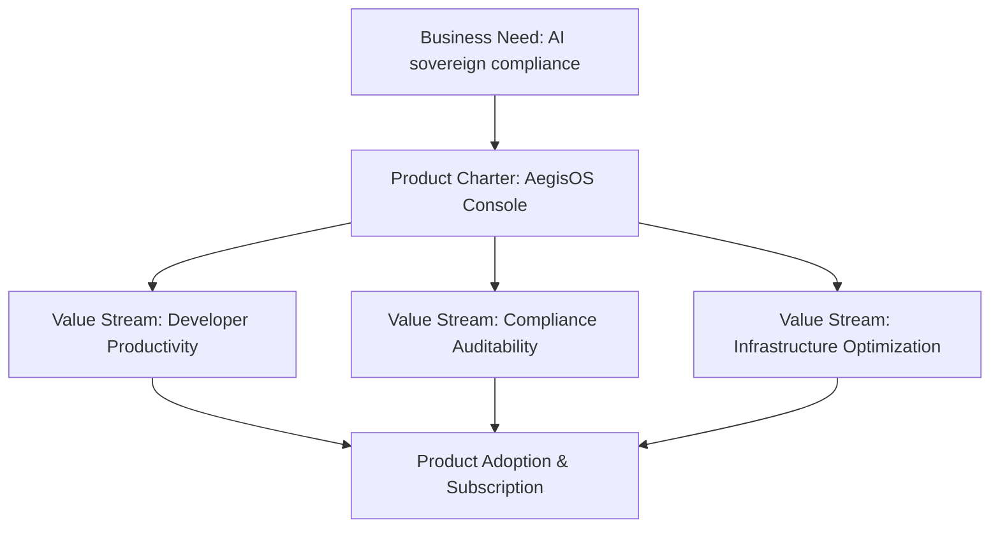
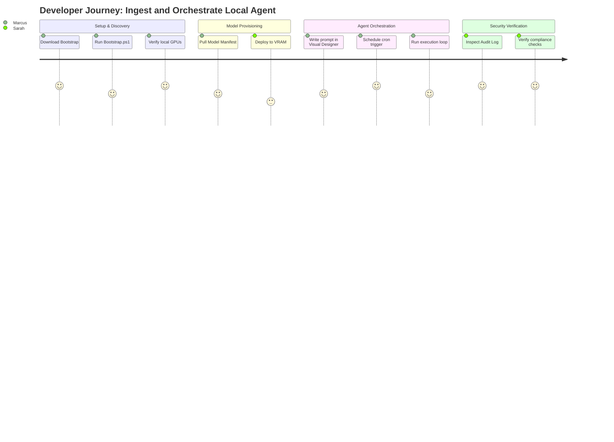

# Product Management Excellence — AegisOS Enterprise Strategy

| Field | Value |
|---|---|
| **Document ID** | PME-2026-001 |
| **Version** | 1.0.0 |
| **Date** | 2026-07-13 |
| **Classification** | Public / Corporate Strategy |
| **Owner** | Chief Product Officer (CPO) |

---

## 1. Product Vision & Philosophy

### 1.1 Vision Statement
To empower global enterprises to build, orchestrate, and govern AI-agent workflows on local hardware, ensuring absolute data privacy, compute sovereignty, and complete auditability without cloud vendor lock-in.

### 1.2 Mission
To provide engineering teams with a local-first, production-grade operations console that bridges the gap between hardware utilization (GPUs/VRAM), local model orchestrators (Ollama/LiteLLM), and workflow automation.

### 1.3 North Star
**"Active Local Agent Executions with Zero Data Leaks."**
We measure success by the volume of automated agent steps executed and verified locally within secure enterprise perimeters.

### 1.4 Value Proposition
* **Zero-Trust Security**: No data ever leaves the local workstation or private cloud boundary.
* **Cost Predictability**: Run agent execution loops on owned hardware, eliminating unpredictable token billing.
* **Auditability**: Complete audit trails of every LLM query, prompt revision, and tool invocation (mTLS, DB-backed logs).
* **Unified Interface**: Single glass pane managing local runners, model manifests, database syncs, and event logs.

### 1.5 Product Principles & Philosophy
1. **Local-First, Cloud-Optional**: Standard operations must execute entirely on-premise without external dependencies.
2. **Deterministic Governance**: Every AI prompt, weight file, and tool execution must be version-controlled and auditable.
3. **Decoupled Architecture**: Workstations act as autonomous nodes that communicate via secure mTLS events.
4. **Developer-Centric Usability**: Simple onboarding, robust SDKs, command palettes, and API-first interfaces.

---

## 2. Product Charter & Business Model



### 2.1 Product Canvas
* **Key Partners**: Local LLM providers (Ollama, HuggingFace, llama.cpp), hardware vendors (NVIDIA), IDE integrations.
* **Key Activities**: Event synchronization, workflow scheduling, security auditing, VRAM memory scheduling.
* **Value Propositions**: Cost-effective, private, auditable, and extensible workstation console.
* **Customer Relationships**: Developer community (Open Source) + Enterprise SLAs (Paid Support and Clustering).
* **Customer Segments**: FinTech, HealthTech, Defense, and highly regulated large enterprises.
* **Cost Structure**: Local engineering, hardware validation testing, and compliance certifications.
* **Revenue Streams**: Enterprise node licenses, premium clusters management plane, and developer support SLAs.

### 2.2 Market Positioning & SWOT Analysis
AegisOS is positioned between raw model providers (Ollama) and enterprise cloud agent platforms (LangChain, CoPilot). It targets the **Sovereign Local Execution** quadrant.

#### SWOT Analysis
* **Strengths**: Low latency, absolute privacy, robust event bus, built-in self-healing, SQLite replication.
* **Weaknesses**: High local GPU hardware requirements, restricted to local resources in v1.0.
* **Opportunities**: Regulatory mandates (GDPR, HIPAA, AI Act) forcing companies off public LLM APIs.
* **Threats**: Rapid reductions in public cloud LLM API costs or new secure cloud enclaves (Confidential Computing).

### 2.3 TAM / SAM / SOM
* **Total Addressable Market (TAM)**: $45B (Global Enterprise AI orchestration market by 2028).
* **Serviceable Addressable Market (SAM)**: $12B (Enterprises requiring strict data governance and sovereign hosting).
* **Serviceable Obtainable Market (SOM)**: $850M (On-premise developer workstation orchestration in FinTech, Healthcare, and Government sectors).

---

## 3. User Research & Personas

### 3.1 Personas & User Segments

#### Persona A: Sarah — DevSecOps Engineer (Enterprise Security)
* **Needs**: Audit logs of every prompt, validation of imported models, strict RBAC, and zero-leak compliance certificates.
* **JTBD**: "Verify that no proprietary source code or customer data is transmitted to third-party AI APIs."
* **Pain Points**: Hardcoded secrets, lack of visibility into developer local LLM endpoints, and unmonitored scripts.

#### Persona B: Marcus — Principal AI Engineer (Application Development)
* **Needs**: Low latency inference, API registry mapping, flexible workflow orchestrations, and visual node debugging.
* **JTBD**: "Build a reliable multi-agent support ticket router using local models."
* **Pain Points**: High API costs, API rate limits, model hallucinations, and unpredictable workflow breaks.

### 3.2 Customer Journey Map: Building a Local Agent



---

## 4. Product Requirements Document (PRD) — AegisOS Enterprise

### 4.1 Goals
* Allow operators to schedule, track, and monitor local agent executions with milliseconds precision.
* Secure LLM interactions behind enterprise RBAC and audit pipelines.
* Ensure local model performance metrics are visible to administrators.

### 4.2 Non-Goals
* We do not host models on AegisOS infrastructure (handled by Ollama, LiteLLM).
* We do not replace developer IDEs (AegisOS is an orchestration and operations console).

### 4.3 Functional Requirements

| ID | Feature | Description | Priority | Severity | User Segment |
|---|---|---|---|---|---|
| **FR-001** | Unified Search | Search users, workflows, audit logs, and artifacts from a single command palette. | High | Medium | All |
| **FR-002** | Workflow Engine | Orchestrate events and crons across agents and local tools. | Critical | High | Marcus |
| **FR-003** | Audit Forwarder | Streams audit trails using standard JSON/SSE protocols. | Critical | High | Sarah |
| **FR-004** | Self-Healer | Automatically recovers local ports and directories on system failures. | High | Medium | Sarah |
| **FR-005** | Approval Gates | Block workflow execution until authorized operators approve. | Critical | High | Sarah, Marcus |

### 4.4 Non-Functional Requirements (NFRs)

* **Security (NFR-S1)**: All API payloads must be validated against schema objects. Session cookies must be HttpOnly and SameSite=Strict.
* **Performance (NFR-P1)**: Console dashboard load times must be < 1.5 seconds. SSE event streaming latency must be < 50ms.
* **Reliability (NFR-R1)**: The Platform Kernel must recover execution states from databases after an unexpected system restart (Saga Checkpoints).
* **Accessibility (NFR-A1)**: UI templates must support WCAG 2.1 AA compliance (ARIA attributes, keyboard navigation).

---

## 5. Strategic Roadmaps

### 5.1 Technology & Capability Roadmap (Quarterly & Annual)

```
2026 Q3 (Release v1.1):
  - In-Memory Notification Database persistence
  - Enhanced API backward compatibility checks
  - Basic OpenTelemetry Tracing Integration

2026 Q4 (Release v1.2):
  - Advanced CUDA memory auto-balancer
  - visual workflow node debugger enhancements
  - SOC2 Type II audit readiness certification

2027 H1 (Release v2.0):
  - Multi-node Workstation Clustering (mTLS)
  - Iceberg REST Catalog federation (Databricks Unity / AWS Glue)
  - Firecracker microVM tool execution sandboxes
```

### 5.2 Investment Themes
* **Trust & Security (40%)**: STRIDE modeling resolutions, RBAC enhancements, and compliance certifications.
* **Developer Experience (30%)**: Visual workflow designer, command palette optimizations, and SDK releases.
* **Scalability & Scale (30%)**: Multi-node cluster design, remote execution handoff, and OpenTelemetry pipelines.
