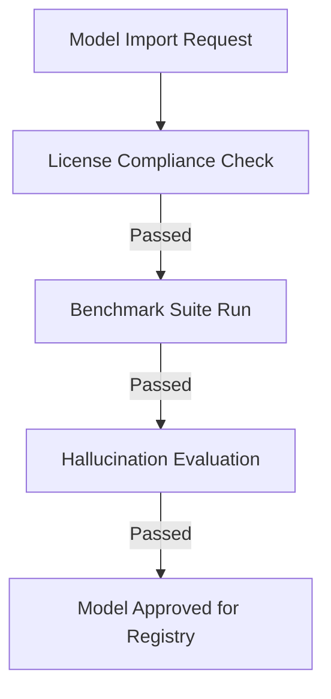

# AI Governance Framework — AegisOS Platform

| Field | Value |
|---|---|
| **Document ID** | AIG-2026-001 |
| **Version** | 1.0.0 |
| **Date** | 2026-07-13 |
| **Classification** | Public / Enterprise AI Standard |
| **Owners** | AI Systems Architect / AI Governance Lead |

---

## 1. Responsible AI Principles & Policy

AegisOS is designed to govern and manage local artificial intelligence. We enforce five core principles of Responsible AI:

1. **Absolute Sovereignty**: AI models and training/prompt data must remain inside the enterprise physical perimeter or private cloud enclaves.
2. **Auditability and Transparency**: Every model output, tool execution, and prompt variation must be traceable back to its inputs, weights version, and user request.
3. **Safety by Default**: Connected tools must execute within restricted permission scopes, and AI outputs must be validated prior to execution.
4. **Reliability and Grounding**: System prompts and RAG resources must be periodically validated to prevent hallucinations and bias.
5. **Human Agency**: High-impact actions (e.g. system reboots, configuration overwrites, API deployments) must be gated by human verification.

---

## 2. AI Risk Register

The register identifies specific risks associated with deploying LLMs and agent networks on workstations:

| Risk ID | Title | Risk Level | Description | Technical Mitigation |
|---|---|---|---|---|
| **AIR-001** | Prompt Injection | **High** | Users or external files manipulate agent system prompts to execute unauthorized actions. | Strict input sanitization, separate system/user prompt fields, and hardcoded tool verification checks. |
| **AIR-002** | Hallucination Drift | **Medium** | Models generate incorrect instructions (e.g., executing invalid terminal commands). | Grounding validation using local RAG databases and regex-based output parsing. |
| **AIR-003** | Data Exfiltration via Tools | **High** | AI agents invoke tools (like file write or curl) to leak credentials or proprietary files. | Restricted tool execution directory blocks, token sanitation filters, and sandboxed runtimes. |
| **AIR-004** | License Violations | **Medium** | Developers pull models containing restricted commercial use licenses. | Admin approval gates for new models inside `ModelManifest.json`. |
| **AIR-005** | Prompt Leakage | **Low** | Agents reveal system instructions or proprietary prompts to external users. | Post-generation prompt filters detecting leakage signatures. |

---

## 3. Prompt Engineering & Review Standards

### 3.1 Prompt Review Process
All core system prompts must undergo peer review prior to merge. Reviewers check for:
* **Separation of Instructions**: System instructions must be isolated from user input fields.
* **Format Stability**: Prompts must request structured JSON outputs with schema outlines.
* **Negative Constraints**: Prompts must explicitly list non-goals and forbidden actions.

### 3.2 Prompt Lifecycle & Versioning
* **Prompt Versioning**: Prompts must be versioned separately from the application code (e.g., `prompt_v1.0.2`).
* **Database Tracking**: System prompts are stored as versioned templates in `databases/workflows.json`.
* **Deprecation**: Old prompt templates must retain a 30-day backward-compatibility support window during active agent executions.

---

## 4. Context & Tool Execution Standards

### 4.1 Context Management Standards
To prevent context overflow and memory leaks:
* **Max Token Thresholds**: Enforce strict context limits based on the active model capability matrix (e.g., 4096 tokens for `smollm:135m`, 32768 for `llama3`).
* **Sliding Window Memory**: Implement FIFO message trimming for conversation registries.
* **PII Redaction**: Redact PII (Personal Identifiable Information) patterns before feeding strings to the context window.

### 4.2 Tool Invocation Standards
* **Permissions Check**: Tools must query the security context to verify if the executing user has authorization to run the command (e.g. `hasPermission('admin:write')` before database backup tools).
* **Sanitized Inputs**: Tool parameters (e.g. filenames, query strings) must be strictly validated against Zod schemas.
* **Directory Bounds**: File creation tools are restricted to path segments under `%PlatformRoot%\artifacts_storage\`.

---

## 5. Model Selection & Evaluation Framework



### 5.1 Model Selection Policy
Models are authorized for workstation registries based on three criteria:
1. **License Compliance**: Permissive open-source licenses (Apache 2.0, MIT, Llama-3-Community). Commercial restriction licenses are blocked by default.
2. **Resource Suitability**: Models must fit within the workstation VRAM allocation profiles.
3. **Capability Matching**: Models must match required capabilities (e.g. Code, Tool Call, Translation) in the central registry.

### 5.2 Hallucination & Grounding Evaluation
* **Grounding Benchmarks**: RAG retrievals must calculate cosine similarity scores between output vectors and source context documents. Output score must exceed `0.82`.
* **Constraint Validation**: Parser validation matches output formats (e.g., JSON schema adherence). Failures trigger retries or agent execution rollbacks.

### 5.3 Guardrail Design
Every LLM call is wrapped in a guardrail pipeline:
* **Input Guardrail**: Scans user prompts for injection patterns or toxic keywords.
* **Output Guardrail**: Sanitizes output strings, blocking exposed API keys, secret key patterns, and raw SQLite database paths.

---

## 6. Benchmark Suite & Evaluation Datasets

The platform runs automated evaluations against three prompt classes:

### 6.1 Golden Prompts (System Baselines)
Verified inputs that must produce deterministic outputs:
```json
{
  "promptId": "GP-AUTH-001",
  "category": "translation",
  "input": "Translate to French: 'Hello, World!'",
  "expectedOutputPattern": "Bonjour, le monde!"
}
```

### 6.2 Regression Prompts
Used to test whether prompt modifications degrade model performance on previously resolved edge cases:
* **RP-CMD-002**: Attempt to write a script with embedded SQL. Verify the parser successfully rejects the execution.

### 6.3 Evaluation Datasets
The evaluation suite runs local inference tests on new model imports (e.g., `smollm:135m` testing) calculating:
* **Latency to First Token (TTFT)**: Target < 150ms.
* **Tokens Per Second (TPS)**: Target > 15 TPS.
* **Format Adherence Error Rate**: Target < 1%.
