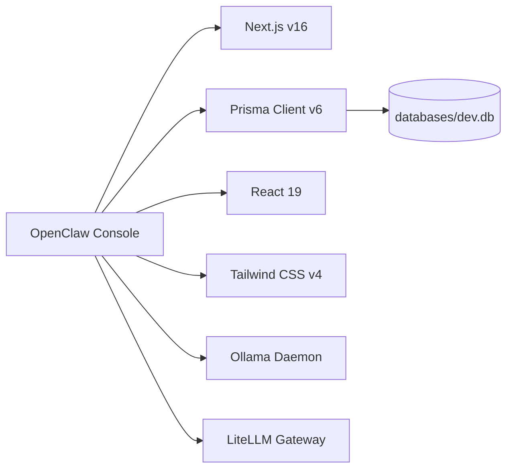
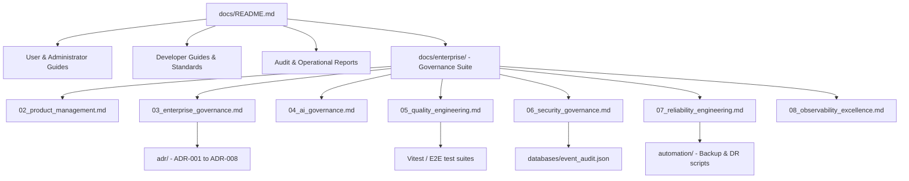

# Repository Knowledge Graph & Systems Map

| Field | Value |
|---|---|
| **Document ID** | KGM-2026-001 |
| **Version** | 1.0.0 |
| **Date** | 2026-07-13 |
| **Classification** | Public / Architecture Standard |
| **Owner** | Enterprise Architect (TOGAF) |

---

## 1. Enterprise Capability Map (TOGAF-Style)

The OpenClaw platform features are mapped to business and technical capabilities:

```
+-----------------------------------------------------------------------------+
|                          OpenClaw Platform Capabilities                      |
+-----------------------------------------------------------------------------+
|  1. Developer Experience       |  2. Platform Kernel & DI |  3. Governance  |
|  - Visual Workflow Designer    |  - Module Lifecycle      |  - RBAC Checks  |
|  - Command Palette Navigation   |  - Service Injection     |  - Audit Trail  |
|  - Event Stream Inspector      |  - Event Routing         |  - Compliance   |
+-----------------------------------------------------------------------------+
|  4. AI Infrastructure & Orchestration                     |  5. Operations  |
|  - Model Manifest registries                              |  - Self-Healing |
|  - Local/Cloud routing gateways                           |  - Backup/DR    |
|  - Prompt Version Control                                 |  - Telemetry    |
+-----------------------------------------------------------------------------+
```

---

## 2. Architecture & Service Relationship Map

We map the visual execution paths across the client, server, and local service layers:

```mermaid
graph TD
    subgraph Browser Client (React UI)
      UI[Console Pages]
      CBus[Client EventBus]
      RSync[realtimeSyncManager]
    end

    subgraph Next.js Server Runtime
      API[API Router /api/v1/*]
      Kernel[Platform Kernel & DI]
      BBus[hardenedEventBus]
      DB[(SQLite Database)]
      Sec[lockout-manager]
    end

    subgraph Local Hardware & Host daemons
      Ollama[Ollama Port 11434]
      LiteLLM[LiteLLM Port 4000]
      Healer[self-healer.ts]
      FWatcher[filesystemWatcher]
    end

    UI -->|JSON HTTP Requests| API
    API -->|DI Services| Kernel
    Kernel -->|Writes| DB
    Kernel -->|Publishes events| BBus
    BBus -->|Streams events over SSE| API
    API -->|SSE Transport Stream| RSync
    RSync -->|Publishes client events| CBus
    CBus -->|Triggers UI refresh| UI

    Kernel -->|Validates Port socket| Ollama
    Kernel -->|Routes model query| LiteLLM
    Healer -->|Pings ports & recovers folders| Kernel
    FWatcher -->|Watches directories| Kernel
    API -->|Validates sessions & limits| Sec
```

---

## 3. Dependency Map

The application depends on the following core frameworks and registries:



* **External Dependencies**:
  * `jose`: JWT encryption and validation.
  * `oauth4webapi`: Google OAuth 2.0.
  * `@prisma/client`: SQLite schema queries.
  * `@tanstack/react-query`: Client state invalidation.
  * `framer-motion`: Transition effects.

---

## 4. Documentation Relationship Map

Our documentation library is structured into hierarchical domains to avoid informational gaps:



---

## 5. Workflow & API Relationships

* **Workflow Triggers**: Trigger engines connect client REST APIs (`POST /api/v1/workflows/executions`) and backend timers to the `WorkflowService`.
* **Execution Logs**: As a workflow transitions steps, execution nodes write progress arrays directly to the database. These changes trigger `ExecutionProgress` event publishes on the `hardenedEventBus`.
* **Real-time API**: The event route (`/api/v1/events/stream`) reads events from the `hardenedEventBus` and pushes them as Server-Sent Events to the client. This refreshes client list queries in React Query automatically.

---

## 6. Repository Index (Key Folders & Symbols)

* **`/src/platform/kernel/PlatformKernel.ts`**: Canonical module container. Registers services, schedules tasks, and rolling-updates features.
* **`/src/infrastructure/events/event-bus.ts`**: Backend Event Bus (`hardenedEventBus`) implementing dead letter queues.
* **`/src/services/self-healer.ts`**: Diagnostics checker monitoring ports 11434 and 4000.
* **`/src/app/api/v1/`**: API routes governing users, approvals, workflows, search, and events.
* **`/src/components/command-palette/`**: UI component registry for the palette handler.
* **`/automation/`**: PowerShell scripts for deployment, rollback, backup, and environment health checks.
