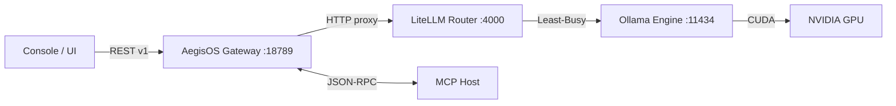

# AegisOS Platform Governance & Evolution Package (V1.0 GA)

| Metadata | Value |
|---|---|
| **Document ID | APGP-2026-01 |
| **Version | 1.0.0 (GA) |
| **Date | July 17, 2026 |
| **Classification | Public — Operations & Architecture Governance |
| **Authority | Platform Governance & Release Board |

---

## 1. Phase 1 — Architecture Baseline & Contracts

AegisOS v1.0 is established as a feature-complete local-first AI Workstation Control Plane. The architecture is locked as of Version 1.0.0. Any subsequent breaking change to contracts, schemas, or network bindings must follow the Architecture Decision Record (ADR) approval flow.

### 1.1 Core Boundaries & Systems
AegisOS decomposes into five decoupled system boundaries:
1. **Client Ingress Layer**: Standard web browser console (:3000), Open-WebUI (:8090), and IDE partner extensions.
2. **API & Gateway Control Layer**: AegisOS Gateway (:18789) and LiteLLM Proxy Router (:4000) managing local weight dispatching.
3. **Context Layer (MCP Host)**: Sandboxed JSON-RPC protocol engines executing local filesystem, Git, and RAG search actions.
4. **Inference & Hardware Layer**: Ollama daemon (:11434) binding weight scheduling to physical NVIDIA RTX GPU CUDA compute.
5. **Infrastructure Layer**: Relational SQLite state storage, priority event bus, and asynchronous task workers.



### 1.2 Digital Twin Schema Specification
The persistent digital twin state is saved in the local relational database (`databases/dev.db`). The database schema is defined as:

```prisma
model User {
  id        String   @id @default(uuid())
  email     String   @unique
  role      String   // Administrator, Operator, Developer, Reviewer
  status    String   // Enabled, Disabled
  sessions  Session[]
}

model Session {
  id         String   @id
  userId     String
  user       User     @relation(fields: [userId], references: [id])
  createdAt  DateTime @default(now())
  lastActive DateTime
}

model PlatformComponent {
  id             String   @id
  name           String
  category       String   // cpu, gpu, ram, database, service, etc.
  status         String   // healthy, warning, critical, offline
  lifecycleState String   // stopped, starting, running, healing, failed
  dependencies   String   // JSON string array of dependent IDs
  port           Int?
  pid            Int?
}

model WorkflowExecution {
  id           String   @id
  workflowName String
  status       String   // queued, running, succeeded, failed
  createdAt    DateTime @default(now())
  startedAt    DateTime?
  endedAt      DateTime?
  steps        WorkflowStep[]
}

model WorkflowStep {
  id          String   @id
  executionId String
  execution   WorkflowExecution @relation(fields: [executionId], references: [id])
  name        String
  status      String
  startedAt   DateTime?
  endedAt     DateTime?
  error       String?
}

model AuditEvent {
  id        Int      @id @default(autoincrement())
  timestamp String
  eventType String   // RequestReceived, PolicyViolationDetected, etc.
  userId    String?
  details   String   // JSON payload details
}
```

### 1.3 Unified Event Contracts
The event platform routes JSON structures validating against strict schemas:

```typescript
export interface AegisEvent {
  name: "RequestReceived" | "PolicyViolationDetected" | "ModelSelected" | "EvaluationCompleted" | "HealthChanged" | "ComponentRegistered";
  source: string;
  timestamp: number;
  correlationId: string;
  traceId: string;
  payload: Record<string, any>;
}
```

---

## 2. Phase 2 — Technical Debt Register

To prevent structural rot and maintain release predictability, all deferred items are logged and prioritized independently of production defects.

| Debt ID | Priority | Category | Rationale | Owner | Target Milestone | Effort (Est) |
|---|---|---|---|---|---|---|
| **TD-101** | High | Security | Windows SCM services run as Administrator; should run under restricted Service Accounts. | SRE Team | v1.1.0 | 5 days |
| **TD-102** | Medium | Architecture | Event Bus UI notification bridge uses HTTP polling. Needs Server-Sent Events (SSE) push. | Dev Team | v1.1.0 | 3 days |
| **TD-103** | Medium | Infrastructure | SQLite lacks database horizontal scaling constraints for multi-node deployments. | Architect | v1.2.0 | 8 days |
| **TD-104** | Low | Extensibility | Plugin loader uses commonjs dynamic `require()`. Transition to ESM imports. | Dev Team | v1.2.0 | 4 days |
| **TD-105** | Low | Observability | Prometheus exporter lacks TLS client authentication options. | DevSecOps | v1.1.0 | 2 days |

---

## 3. Phase 3 — Release Governance

All AegisOS components follow Semantic Versioning (`MAJOR.MINOR.PATCH`). 

### 3.1 Branching Model
```
  main (GA freezes) ──────────────────────────[ v1.0.0 ]──────────[ v1.0.1 ]──
     │                                            ▲                  ▲
     ├─► release/v1.0-RC ──► [v1.0.0-RC1] ────────┘                  │
     │                                                               │
     └─► hotfix/session-leak ────────────────────────────────────────┘
```
- **Release Branches (`release/vX.Y`)**: Forked from `main` to freeze features. Only bug fixes are committed here.
- **Hotfix Branches (`hotfix/name`)**: Forked directly from `main` to address critical production issues; merged back immediately upon validation.
- **Maintenance Branches (`support/vX.Y`)**: Long-term support lines for backporting security patches.

### 3.2 Signed Artifact & Checksum Procedure
Every release build compiles a release package checklist:
1. Generate checksums for production binaries: `sha256sum app.zip > checksums.sha256`.
2. Generate SBOM metadata using CycloneDX: `npm run sbom`.
3. Sign checksums file using the release signing private key.

---

## 4. Phase 4 — OpenAPI Specification & API Stability

### 4.1 OpenAPI 3.0 v1 Endpoints
The AegisOS administrative REST API is frozen for v1:

```json
{
  "openapi": "3.0.0",
  "info": {
    "title": "AegisOS Platform Console API",
    "version": "1.0.0"
  },
  "paths": {
    "/api/v1/runtime": {
      "get": {
        "summary": "Retrieve status, version, and active configurations of the AI gateway.",
        "responses": {
          "200": { "description": "Successful execution state returned." }
        }
      }
    },
    "/api/v1/conversations": {
      "get": {
        "summary": "Query message gateway threads from SQLite database.",
        "parameters": [
          { "name": "page", "in": "query", "schema": { "type": "integer", "default": 1 } }
        ],
        "responses": {
          "200": { "description": "Array of active conversation records." }
        }
      }
    },
    "/api/v1/executions": {
      "get": {
        "summary": "List historical agent execution steps and outputs.",
        "responses": {
          "200": { "description": "Array of execution summaries." }
        }
      }
    }
  }
}
```

### 4.2 Deprecation Policy
- APIs in v1 are guaranteed supported for the entire v1 life-cycle.
- Deprecated endpoints are marked in API responses with a warning header: `Warning: 299 - "This endpoint is deprecated and will be removed in v2.0"`.
- Deprecation periods must span a minimum of **6 months** or **2 minor version cycles**.

---

## 5. Phase 5 — Plugin SDK Guide

Plugin authors must never edit core files. All custom integrations occur via the isolated Plugin SDK.

### 5.1 Lifecycle Hooks
Plugins implement the following interface:

```typescript
export interface AegisPlugin {
  manifest: PluginManifest;
  onLoad(context: PluginContext): Promise<void>;
  onStart(): Promise<void>;
  onShutdown(): Promise<void>;
}

export interface PluginManifest {
  id: string;
  name: string;
  version: string;
  requiredAegisVersion: string;
  permissions: Array<"obs:read" | "event-publish" | "event-subscribe" | "fs:restricted">;
  capabilities: string[];
  dependencies: string[];
}
```

### 5.2 Example Plugin Manifest (`manifest.json`)
```json
{
  "id": "com.aegisos.plugin.slackalerts",
  "name": "Slack Alert Dispatcher",
  "version": "1.0.0",
  "requiredAegisVersion": "^1.0.0",
  "permissions": ["event-subscribe"],
  "capabilities": ["notification-provider"],
  "dependencies": ["service:aegisos-gateway"]
}
```

---

## 6. Phase 6 — Operations Handbook

This guide details SRE instructions for maintaining and running the AegisOS console control plane.

### 6.1 Service Control Commands (Windows Elevated PowerShell)
- **Start All Services**:
  ```powershell
  Start-Service -Name "Ollama", "Redis", "LiteLLMService", "MongoDB", "postgresql-x64-16"
  ```
- **Stop All Services**:
  ```powershell
  Stop-Service -Name "Ollama", "Redis", "LiteLLMService", "MongoDB", "postgresql-x64-16" -Force
  ```
- **Troubleshoot missed heartbeats**:
  ```powershell
  Get-Service | Where-Object { $_.Name -like "*Ollama*" -or $_.Name -like "*LiteLLM*" }
  Get-NetTCPConnection -State Listen | Where-Object { $_.LocalPort -in 11434, 4000, 18789 }
  ```

### 6.2 Pre-Migration Database Backups
Always snapshot data before upgrading database schemas:
```powershell
# Backup SQLite metadata db
Copy-Item "D:\AI-Operations\runtime\databases\aegisos.sqlite" "D:\AI-Operations\backups\aegisos_preupgrade.sqlite" -Force
# Run Prisma push migrations
npx prisma db push
```

---

## 7. Phase 7 — Engineering Standards Manual

All contributors must adhere to repository coding guidelines.

### 7.1 Coding Conventions & Standards
- **Strict TypeScript**: Every variable, parameter, and function return must declare an explicit type. `any` types are prohibited in application modules.
- **Single Responsibility (KISS)**: Keep file lengths under 250 lines. Large modules must be decomposed.
- **Logging Guidelines**: Log entries must never print secrets, tokens, or PII. Use `RuntimeContext.getTraceId()` to correlate logs.

### 7.2 Automated Compliance Gates (CI/CD)
- **Code Linter**: `npm run lint` blocks commits containing syntax issues.
- **Testing Targets**: Pull requests must possess at least **80% unit test coverage** to merge into the main branch.

---

## 8. Phase 8 — Backward Compatibility Policy

### 8.1 API & Plugin Compatibility
- **API Boundaries**: Minor version updates (`v1.1`, `v1.2`) are strictly backward-compatible. Under no circumstances may an active REST property be renamed or deleted.
- **Plugin Bindings**: Custom extensions compiled for `v1.0.0` will load and run on all subsequent minor releases.

### 8.2 Database Migration Tooling
- Schema evolutions must execute via incremental migration scripts (`scripts/db-migration.js`).
- Destructive edits (such as dropping tables) are prohibited. Columns being retired must stay in place as "deprecated" to avoid breaking old plugin queries.

---

## 9. Phase 9 — Operational Metrics & KPIs

Operational performance is monitored across releases using stable metric targets:

| Operational Metric | Stable KPI Target | Verification Method |
|---|---|---|
| **Service Availability** | `> 99.9%` uptime | Watchdog loop audit log records |
| **Platform Startup Time** | `< 2.0 seconds` | Time-to-bootstrap logging benchmark |
| **API Response Latency** | `< 25ms` (95th percentile) | OTel trace routing records |
| **AI Inference Throughput** | `> 180 tokens/sec` (RTX 5080) | CLI benchmark suite run |
| **Self-Healing Recovery** | `< 2.0 seconds` | Chaos injection timers |
| **VRAM Consumption Bounds** | `< 14 GB` (idle models) | GPU telemetry checks |

---

## 10. Phase 10 — Future Roadmap

Development beyond v1.0.0 is organized into disciplined roadmap targets:

### 10.1 Version 1.1 — Incremental Operational Improvements
- Replace event bus client HTTP polling with Server-Sent Events (SSE) push streams.
- Refine telemetry checks to reduce CPU load overhead to `< 0.5%`.
- Build native service accounts for SCM service wrappers.

### 10.2 Version 1.2 — Advanced Automation & Optimization
- Implement dynamic GPU memory paging and VRAM auto-clearing for inactive models.
- Support parallel execution steps inside the Workflow Engine.
- Establish filesystem file-watcher mechanisms for automatic RAG vector re-indexing.

### 10.3 Version 2.0 — Major Architectural Evolution (Redesign)
- Transition database store to fully distributed multi-master setups.
- Enforce strict cryptographically-isolated user workspaces.
- Support multi-node network cluster coordination using mutual TLS (mTLS) handshakes.
