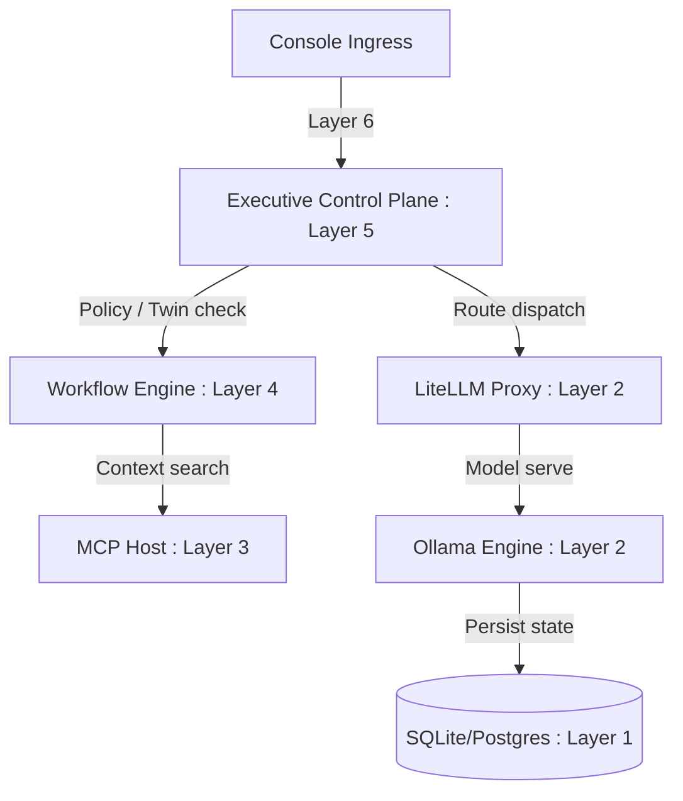

# AegisOS Platform Governance & Evolution Package (V1.0 GA)

| Metadata | Value |
|---|---|
| **Document ID** | APGP-2026-01 |
| **Version** | 1.2.0 (Active) |
| **Date** | July 20, 2026 |
| **Classification** | Public — Operations & Architecture Governance |
| **Authority** | Platform Governance & Release Board |

---

## 1. Phase 1 — Architecture Baseline & Contracts

AegisOS v1.2 is established as a self-managing local-first AI Workstation Control Plane. The architecture is locked as of Version 1.2.0. Any subsequent breaking change to contracts, schemas, or network bindings must follow the Architecture Decision Record (ADR) approval flow.

### 1.1 Core Boundaries & Systems
AegisOS decomposes into a strict 7-layered stack (ADR-009):
1. **Layer 6 (Executive Plane)**: Admin Web Console (:3000), Open-WebUI (:8090), Mobile Companion, and IDE partner extensions.
2. **Layer 5 (Control Plane)**: Executive Control Plane (ECP), Digital Twin Graph Kernel, and Convergence Engine.
3. **Layer 4 (Orchestration Plane)**: Workflows, Task Schedulers, and Command & Control (C2) rollback engines.
4. **Layer 3 (Capability Plane)**: MCP hosts, RAG pipelines, and model weight registries.
5. **Layer 2 (Runtime Layer)**: LiteLLM Router (:4000) and Ollama Engine (:11434).
6. **Layer 1 (Infrastructure Layer)**: SQLite/PostgreSQL, systems process daemons (NSSM), and Tailscale VPN.
7. **Layer 0 (Hardware Layer)**: Physical CPU, GPU VRAM, and CUDA compute acceleration.



### 1.2 Evolved Database Schema Specification (Prisma)
The database schema manages state, tenancy, qualification metrics, and digital twin mappings:

```prisma
datasource db {
  provider = "sqlite"
  url      = env("DATABASE_URL")
}

model User {
  id              String   @id @default(uuid())
  googleSubjectId String   @unique
  email           String   @unique
  displayName     String
  role            String   // "Administrator", "Operator", "Viewer", "Auditor"
  status          String   // "Enabled", "Disabled"
  createdDate     String
  lastLogin       String?
  createdBy       String
  permissions     String   // JSON string of permissions
  allowedNetworks String   // JSON string of IPs
  notes           String
  organizationId  String?
  tenantId        String?
}

model Artifact {
  id                 String   @id @default(uuid())
  name               String
  description        String
  type               String
  mimeType           String
  size               Int
  createdDate        String
  modifiedDate       String
  createdBy          String
  tags               String   // JSON string
  status             String   // "active", "deleted"
  location           String
  previewSupported   Boolean
  downloadSupported  Boolean
  deleteSupported    Boolean
  version            String
  conversationId     String
  workflowId         String
  metadata           String   // JSON string
  lifecycleState     String
  storage            String   // JSON string
  relationships      String   // JSON string
  preview            String   // JSON string
  processing         String   // JSON string
  search             String   // JSON string
}

model Command {
  id              String    @id @default(uuid())
  type            String    // e.g. "infrastructure:start_service", "ai:load_model", etc.
  status          String    // "QUEUED", "PENDING_APPROVAL", "RUNNING", "COMPLETED", "FAILED"
  priority        String    // "LOW", "MEDIUM", "HIGH", "CRITICAL"
  payload         String    // JSON string parameters
  riskLevel       String    // "LOW", "MEDIUM", "HIGH", "CRITICAL"
  userId          String?
  origin          String    // "mobile" | "console" | "system"
  signature       String?   // Cryptographic signature from secure enclave
  replayNonce     String?   
  expiresAt       DateTime? 
  approvalType    String    // "AUTO" | "MANUAL"
  approvalStatus  String    
  approvers       String    // JSON array
  scheduledAt     DateTime  @default(now())
  createdAt       DateTime  @default(now())
  startedAt       DateTime?
  completedAt     DateTime?
  errorMessage    String?
  result          String?   
  rollbackPayload String?   
  rolledBackAt    DateTime?
}

model DigitalTwinDriftLog {
  id               String   @id @default(uuid())
  timestamp        DateTime @default(now())
  expectedVersion  String
  detectedDrift    Boolean
  driftDetails     String   // JSON string of drift findings
  nodesDrifted     Int
  edgesDrifted     Int
  repaired         Boolean  @default(false)
  repairAction     String?
  reconciledAt     DateTime?
}

model DigitalTwinSnapshot {
  id             String   @id @default(uuid())
  graphVersionId String   @unique
  timestamp      DateTime @default(now())
  nodeCount      Int
  edgeCount      Int
  graphHash      String
  serializedData String   // JSON string of full structure
}

model SimulationSession {
  id               String   @id @default(uuid())
  snapshotVersion  String
  executionEngine  String   // "OVERLAY" | "BRANCH" | "SANDBOX"
  projectionScope  String   // JSON string array
  deltaPayload     String   // JSON string
  status           String   // "RUNNING" | "COMPLETED"
  createdAt        DateTime @default(now())
}

model QualificationHistory {
  id              String   @id @default(uuid())
  artifactId      String   // Links to Artifact scorecard
  timestamp       DateTime @default(now())
  triggerSource   String   
  decision        String   // "PASS" | "WARNING" | "FAIL"
  overallScore    Float
  durationMs      Int
  gitSha          String
  platformVersion String
  environment     String
}

model MaturityHistory {
  id                     String   @id @default(uuid())
  qualificationHistoryId String
  timestamp              DateTime @default(now())
  architecture           Float
  engineering            Float
  reliability            Float
  scalability            Float
  security               Float
  governance             Float
  observability          Float
  performance            Float
  overall                Float
}

model CapabilityCertification {
  id              String   @id @default(uuid())
  capabilityId    String   @unique
  name            String
  version         String
  status          String   // "CERTIFIED" | "DEGRADED" | "UNCERTIFIED"
  score           Float
  lastCertifiedAt DateTime @default(now())
}
```

### 1.3 Unified Event Contracts
All system-wide messaging conforms to standard interfaces routed via `EventPlatform`:

```typescript
export interface AegisEvent {
  name: "ComponentRegistered" | "ComponentRemoved" | "HealthChanged" | "AlertRaised" | "AlertResolved" | "MetricUpdated" | "ConfigurationChanged" | "DependencyChanged";
  source: string;
  timestamp: number;
  correlationId: string;
  traceId: string;
  payload: Record<string, any>;
}
```

---

## 2. Phase 2 — Technical Debt Register

Living registers are prioritized by impact and target release:

| Debt ID | Priority | Category | Rationale | Owner | Target Milestone | Effort (Est) |
|---|---|---|---|---|---|---|
| **TD-101** | High | Security | Windows SCM services run as Administrator; should run under restricted Service Accounts. | SRE Team | v1.3.0 | 5 days |
| **TD-102** | Medium | Architecture | Event Bus UI notification bridge uses HTTP polling. Needs Server-Sent Events (SSE) push. | Dev Team | v1.3.0 | 3 days |
| **TD-103** | Medium | Infrastructure | SQLite lacks database horizontal scaling constraints for multi-node deployments. | Architect | v2.0.0 | 8 days |
| **TD-104** | Low | Extensibility | Plugin loader uses commonjs dynamic `require()`. Transition to ESM imports. | Dev Team | v1.3.0 | 4 days |

---

## 3. Phase 3 — Release Governance

All AegisOS components follow Semantic Versioning (`MAJOR.MINOR.PATCH`).

### 3.1 Branching Model
- **Main Branch (`main`)**: Protected. Contains stable, Qualified release packages.
- **Release Branches (`release/vX.Y`)**: Stabilizes features; only bug fixes merged here.
- **Hotfix Branches (`hotfix/name`)**: Critical hotfixes branched off `main` and merged back.

### 3.2 Cryptographic Evidence Signing
Releases require certification signing:
1. Verify the `EvidenceGraph` Merkle root hash matches the manifest value.
2. Sign the `ExtendedReleaseManifest` via the `Sha256Signer` utilizing the private key salt.
3. Validate signed manifest using `ReleaseVerifier.verify(manifest, serializedGraph)`.
