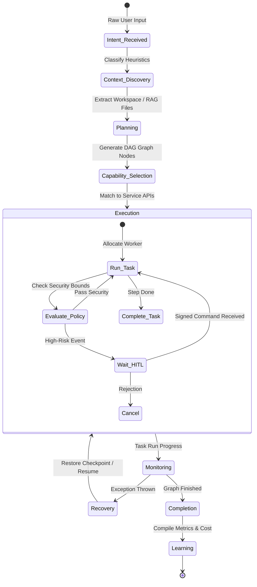
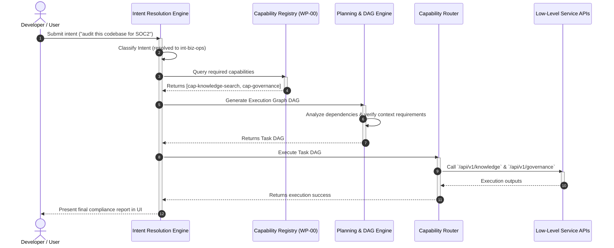

# AegisOS Intent Resolution & Execution Planning Engine
**Architectural Specification for Intent-Driven Automation & Execution Planning (WP-00A)**

This document defines the architecture and specification for the **AegisOS Intent Engine** and its integrated **Planning Engine**. Sitting directly above the Capability Layer, the Intent Engine abstracts the underlying APIs, workflows, models, agents, tools, prompts, and registries. Users express high-level intents in natural language, and the engine resolves, decomposes, plans, and schedules execution while dynamically allocating agents, routing models, managing memory levels, and updating a continuous learning loop.

---

## 1. Intent Registry

The Intent Engine classifies user requests into eighteen primary categories. Each entry defines the required context, expected outputs, confidence thresholds, and execution policies.

| Intent ID | Intent Name | Description | Required Context | Expected Outputs | Conf. Threshold | HITL Approval | Long-running | Streaming | Scheduling |
|---|---|---|---|---|---|---|---|---|---|
| **int-research** | Research | Information retrieval, web crawling, and synthesis. | Query terms, domain tags | Compiled markdown report | 0.80 | No | Yes | Yes | Yes |
| **int-analysis** | Analysis | Code or log telemetry parsing, trend discovery. | Telemetry logs, timeframe | Data summary, charts | 0.85 | No | No | Yes | No |
| **int-coding** | Coding | Syntax drafting, formatting, bug fixing, patching. | Diff, source code, task | `.patch` file, unit tests | 0.90 | Yes (High risk) | No | Yes | No |
| **int-architecture** | Architecture | Designing system boundaries and C4 diagrams. | Architectural context, ADRs | Mermaid graphs, spec file | 0.85 | Yes | No | No | No |
| **int-planning** | Planning | Decomposing goals into task lists and schedules. | High-level goal statement | `task.md`, dependency graph | 0.80 | Yes | No | No | No |
| **int-automation** | Automation | Script execution, orchestration, triggers, timers. | Event trigger, script payload| Job ID, run logs | 0.90 | Yes (High risk) | Yes | No | Yes |
| **int-operations** | Operations | Cluster management, service reboots, mounts. | Service state, container logs| Status verification | 0.95 | Yes | No | No | No |
| **int-monitoring** | Monitoring | Health status checking, latency, and throughput. | Metrics query duration | Prometheus/Grafana state | 0.80 | No | No | Yes | Yes |
| **int-troubleshoot**| Troubleshooting| Exception root cause analysis and stack traces. | Stack trace, recent changes | Remediation plan | 0.85 | Yes | No | Yes | No |
| **int-learning** | Learning | Recording user feedback, updates, and runbooks. | Correction diff, prompt ID | Model weight/prompt tuning | 0.80 | No | No | No | No |
| **int-content-gen**| Content Creation | Generating reports, PRD, docs, release logs. | Feature list, product files| Markdown document | 0.80 | No | No | Yes | No |
| **int-comm** | Communication | Sending Slack/email alerts, paging oncall. | Target channel, alert text | Delivery status | 0.90 | Yes (High risk) | No | No | Yes |
| **int-dec-support** | Decision Support| Evaluating trade-offs, architectures, or costs.| Options list, constraints | Structured comparison table | 0.85 | No | No | No | No |
| **int-admin** | Administration | Managing user permissions, device pairing. | User ID, device ID | Database state change | 0.95 | Yes | No | No | No |
| **int-infra** | Infrastructure | Kubernetes deployments, Helm charts, VPN. | Manifest files, cluster state | Deployment status | 0.95 | Yes | Yes | No | Yes |
| **int-knowledge** | Knowledge Mgmt | Adding documents to RAG, indexing notes. | Source file, target dir | Vector embedding status | 0.80 | No | Yes | No | Yes |
| **int-prod** | Dev Productivity | Local workspace scans, linting, code maps. | Path to directory | Linter report, code graph | 0.85 | No | No | Yes | No |
| **int-biz-ops** | Business Ops | Financial ROI analysis, compliance audits. | License files, usage logs | Audit report | 0.90 | Yes | Yes | No | Yes |

---

## 2. Intent Ontology

The AegisOS Intent Ontology groups intents into four core domain classes, enforcing clear hierarchy and inheritance.

```
                               ┌─────────────────────────┐
                               │     AEGISOS ONTOLOGY    │
                               └─────────────────────────┘
                                            │
       ┌───────────────────────┬────────────┴──────────┬───────────────────────┐
       ▼                       ▼                       ▼                       ▼
┌──────────────┐        ┌──────────────┐        ┌──────────────┐        ┌──────────────┐
│  Cognitive   │        │ Engineering  │        │ Operational  │        │ Governance   │
│  (Reasoning) │        │ (Development)│        │   (Runtime)  │        │ (Compliance) │
└──────────────┘        └──────────────┘        └──────────────┘        └──────────────┘
       │                       │                       │                       │
       ├─ int-research         ├─ int-coding           ├─ int-automation       ├─ int-governance
       ├─ int-analysis         ├─ int-architecture     ├─ int-operations       ├─ int-learning
       ├─ int-planning         ├─ int-prod             ├─ int-monitoring       ├─ int-admin
       ├─ int-dec-support      ├─ int-infra            ├─ int-troubleshoot     ├─ int-biz-ops
       └─ int-content-gen      └─ int-knowledge        └─ int-comm             └─ (Security Rules)
```

1. **Cognitive Domain**: Inherits context parsing and reasoning models (Gemma 4, DeepSeek-R1). Focuses on document synthesis, goal analysis, and information gathering.
2. **Engineering Domain**: Inherits workspace access permissions and coding expertise models (Qwen 2.5). Manages syntactic patches, repository updates, and local workspace formatting.
3. **Operational Domain**: Inherits C2 command dispatch rights and workflow execution handles. Controls background services, system alerts, job runners, and troubleshooting pipelines.
4. **Governance Domain**: Inherits audit trails, licensing checks, and user device pairing keys. Validates system actions against safety policies and compliance benchmarks.

---

## 3. Intent Classification Matrix

High-level user intents map directly to the foundational capabilities registered in WP-00.

| User Intent | Primary Capability | Secondary Capability | Context Requirements | Required Resource/API |
|---|---|---|---|---|
| `int-research` | `cap-knowledge-search` | `cap-tool-invocation` | RAG note files | `/api/v1/knowledge` |
| `int-analysis` | `cap-observability` | `cap-tool-invocation` | Prometheus logs | `/api/v1/metrics` |
| `int-coding` | `cap-context-retriev` | `cap-tool-invocation` | Local Git workspaces | `/api/v1/tools` |
| `int-architecture`| `cap-context-retriev` | `cap-artifact-store` | Codebase schemas | `/api/v1/runtime` |
| `int-planning` | `cap-workflow-exec` | `cap-prompt-registry` | Goal description | `/api/v1/workflows` |
| `int-automation`  | `cap-workflow-exec` | `cap-job-scheduling` | Orchestration JSON | `/api/v1/workflows/executions`|
| `int-operations`  | `cap-mobile-approval` | `cap-tool-invocation` | Process SCM status | `/api/v1/mobile/commands` |
| `int-monitoring`  | `cap-observability` | `cap-job-scheduling` | Port list configs | `/api/v1/runtime/health` |
| `int-troubleshoot`| `cap-observability` | `cap-tool-invocation` | Stack traces, logs | `/api/v1/events` |
| `int-learning` | `cap-prompt-registry` | `cap-knowledge-search` | Correction context | `/api/v1/knowledge` |
| `int-infra` | `cap-tool-invocation` | `cap-mobile-approval` | K8s/Docker YAMLs | `/api/v1/mobile/commands` |
| `int-knowledge` | `cap-knowledge-search` | `cap-artifact-store` | Text files, notes | `/api/v1/knowledge` |

---

## 4. Intent Resolution Rules

The Intent Engine resolves raw prompts into structured Intent classes using matching heuristics and classification routing.

### 4.1 Heuristic Resolution Engine
The engine parses raw strings sequentially to detect command tokens and keywords:
* **"review", "lint", "refactor", "patch", "git"** &rarr; Routes to `int-coding`.
* **"reboot", "stop docker", "scale", "restart"** &rarr; Routes to `int-operations`.
* **"alert", "slack", "oncall", "pagerduty"** &rarr; Routes to `int-comm`.
* **"audit", "soc2", "roi", "costs"** &rarr; Routes to `int-biz-ops`.

### 4.2 Semantic Classifier Model
If keywords do not match, the request is directed to the local semantic router using `smollm:135m` (fast CPU fallback):

```json
{
  "system_prompt": "You are the AegisOS Intent Classifier. Map the user prompt to exactly one Intent ID: int-research, int-analysis, int-coding, int-operations, int-infra, int-troubleshoot. Return JSON only.",
  "example_input": "Why is the Next.js console running slowly?",
  "example_output": {
    "intentId": "int-troubleshoot",
    "confidence": 0.94,
    "contextRequirements": ["system_metrics", "logs"]
  }
}
```

---

## 5. Planning Architecture

Once an intent is resolved, the **Planning Engine** decomposes it into a Directed Acyclic Graph (DAG) of executable capabilities.

```
                         ┌─────────────────────────────┐
                         │   1. Goal Decomposition     │
                         └─────────────────────────────┘
                                        │
                                        ▼
                         ┌─────────────────────────────┐
                         │  2. Task Graph Generation   │
                         └─────────────────────────────┘
                                        │
                                        ▼
                         ┌─────────────────────────────┐
                         │   3. Dependency Analysis    │
                         └─────────────────────────────┘
                                        │
                                        ▼
                         ┌─────────────────────────────┐
                         │    4. Parallel Execution    │
                         └─────────────────────────────┘
```

1. **Goal Decomposition**: Breaks the high-level intent into sequential sub-goals. For example, `int-troubleshoot` &rarr; `[Check logs, Isolate service, Propose patch]`.
2. **Task Graph Generation**: Instantiates a DAG where nodes represent foundational capabilities (from the Capability Registry) and edges represent data dependencies.
3. **Dependency Analysis**: Validates that all inputs for node $N_{i}$ are output by predecessor nodes $N_{i-1}$. Unconnected inputs prompt the user for clarification.
4. **Parallelism Planning**: Identifies branches with zero mutual dependencies and schedules them concurrently on distinct background threads using the platform's `JobQueue`.
5. **Saga Checkpointing & Recovery**: Saves the serialized task graph state to `databases/workflow_executions.json` at every step transition. If the host crashes, the engine reads the active checkpoint and resumes from the last incomplete node.

---

## 6. Execution Planner

The Execution Planner maps the generated task graph to the concrete systems, agents, workflows, models, and security policies available on the platform.

```json
{
  "execution_plan": {
    "planId": "plan-9087-abc",
    "intentId": "int-coding",
    "tasks": [
      {
        "taskId": "task-01-diff",
        "capability": "cap-context-retriev",
        "provider": "git-mcp",
        "inputs": { "action": "getDiff", "branch": "dev" },
        "outputs": ["diffText"]
      },
      {
        "taskId": "task-02-audit",
        "capability": "cap-model-routing",
        "inputs": {
          "promptTemplate": "security_vulnerability_scan",
          "variables": { "code": "${task-01-diff.diffText}" }
        },
        "model": "deepseek-r1:32b",
        "outputs": ["auditLogs"]
      },
      {
        "taskId": "task-03-approval",
        "capability": "cap-mobile-approval",
        "inputs": {
          "risk": "${task-02-audit.auditLogs.riskLevel}",
          "payload": "${task-01-diff.diffText}"
        },
        "policy": "policy-hitl-required",
        "outputs": ["signature"]
      }
    ],
    "fallbackStrategy": {
      "onFailure": "rollback",
      "compensatingAction": "git checkout dev"
    }
  }
}
```

---

## 7. Agent Allocation Rules

The Planning Engine dynamically allocates agents according to the complexity, scope, and security domain of the task graph:

```
                  ┌──────────────────────────────────────────────┐
                  │           TASK ALLOCATION BOUNDARY           │
                  └──────────────────────────────────────────────┘
                                         │
                 ┌───────────────────────┴───────────────────────┐
                 ▼ (Single domain)                               ▼ (Cross-domain)
      ┌─────────────────────┐                         ┌─────────────────────┐
      │  Reuse Active Agent │                         │ Spawn Parallel/Temp │
      │  (e.g., CodeAgent)  │                         │ (e.g., Multi-Agent) │
      └─────────────────────┘                         └─────────────────────┘
                 │                                               │
                 ▼                                               ▼
      ┌─────────────────────┐                         ┌─────────────────────┐
      │ Execute Task Graph  │                         │ Orchestrated by     │
      │                     │                         │ Planner Agent       │
      └─────────────────────┘                         └─────────────────────┘
```

1. **Agent Reuse**: If the task graph is confined to a single domain (e.g. workspace refactoring), the engine maps execution directly to the existing `CodeAgent` instance, preventing instantiation overhead.
2. **Spawn Parallel/Temporary Agents**: If the task requires cross-domain capabilities (e.g., fetching web specs and modifying code), the engine spawns parallel worker agents bound to local tools.
3. **HITL Escalation Policy**: High-risk tasks (such as database writes, shell executions, system reboots, and remote VPN modifications) trigger an automatic pause, generating a cryptographic signing request sent to the mobile device.
4. **Clarification Fallback**: If intent classification confidence falls below the threshold (e.g. $< 0.80$), execution halts, and the agent prompts the user with a multiple-choice question to clarify constraints.

---

## 8. Model Allocation Rules

The model router selects model targets using a multi-attribute routing rule. This rule evaluates the required capability, hardware constraints, VRAM footprint, and reasoning depth.

```
                                  ┌─────────────────────────┐
                                  │   MODEL ROUTER INPUT    │
                                  └─────────────────────────┘
                                               │
                   ┌───────────────────────────┼───────────────────────────┐
                   ▼                           ▼                           ▼
            [Reasoning Depth]           [VRAM Availability]           [Latency Target]
                   │                           │                           │
                   └───────────────────────────┼───────────────────────────┘
                                               │
                                               ▼
                                  ┌─────────────────────────┐
                                  │    ALLOCATION RULE      │
                                  └─────────────────────────┘
                                               │
                   ┌───────────────────────────┼───────────────────────────┐
                   ▼ (Complex Logic)           ▼ (Syntactic tasks)         ▼ (Fast Validation)
            ┌──────────────┐            ┌──────────────┐            ┌──────────────┐
            │ deepseek-r1  │            │  qwen2.5     │            │   smollm     │
            │  (VRAM >16G) │            │  (VRAM >8G)  │            │   (CPU run)  │
            └──────────────┘            └──────────────┘            └──────────────┘
```

* **Logic / Cryptographic Audit**: Uses `deepseek-r1:32b` (requiring $\ge 19$ GB VRAM). If VRAM is constrained, it falls back to `gemma4:latest`.
* **Coding Syntax / Multi-Language**: Uses `qwen2.5:14b` (optimized for code syntax).
* **Planning / Task Graph Decomposition**: Uses `qwen3:14b`.
* **Fast Validation / Heuristic Routing**: Uses `smollm:135m` (executed on CPU, bypassing VRAM allocation).

---

## 9. Memory Architecture

AegisOS maintains context isolation by segmenting memory into seven structured scopes, utilizing the platform's local database and filesystem:

```
┌────────────────────────────────────────────────────────────────────────┐
│                              MEMORY SCOPES                             │
├────────────────────────────────────────────────────────────────────────┤
│ 1. Conversation: Volatile memory tracking the current message history.│
├────────────────────────────────────────────────────────────────────────┤
│ 2. Workspace: Shared state of the files inside the active directory.   │
├────────────────────────────────────────────────────────────────────────┤
│ 3. Project: Persistent system configurations (ADRs, ARCHITECTURE.md).  │
├────────────────────────────────────────────────────────────────────────┤
│ 4. Capability: Cache tracking execution success rates of tool calls.   │
├────────────────────────────────────────────────────────────────────────┤
│ 5. Agent: System prompts, temperature limits, and allowed tools maps. │
├────────────────────────────────────────────────────────────────────────┤
│ 6. Execution: Saga checkpoint variables, task logs, and step duration. │
├────────────────────────────────────────────────────────────────────────┤
│ 7. Long-term: Indexed vector embeddings inside the Raja Knowledge Repo.│
└────────────────────────────────────────────────────────────────────────┘
```

* **Storage Engine**: Memory is persisted locally. Conversation, Agent, and Execution records reside in the SQLite database (`databases/aegisos.sqlite`), workspace files are monitored via the Filesystem Watcher, and long-term knowledge is retrieved using the RAG Vector DB.

---

## 10. Execution State Machine & Lifecycle

Each intent moves through nine lifecycle stages, checkpointing state changes to relational storage.



* **Checkpoint Recovery Protocol**: If execution fails at `Execution` stage (e.g. system power loss), on platform bootstrap, `onInit` reads the database state log, verifies the active step, and re-queues the execution from the last recorded checkpoint.

---

## 11. Learning Architecture

Execution feedback continuously optimizes the Planning and Routing parameters through a local reinforcement loop.

```
         ┌─────────────────────────────────────────────────────────┐
         │                    COMPLETED TASK                       │
         └─────────────────────────────────────────────────────────┘
                                      │
                                      ▼
         ┌─────────────────────────────────────────────────────────┐
         │                  COLLECT TELEMETRY                      │
         │          (Duration, Latency, Token Cost)                │
         └─────────────────────────────────────────────────────────┘
                                      │
                                      ▼
         ┌─────────────────────────────────────────────────────────┐
         │                   LEARNING HEURISTICS                   │
         │  1. Invalidate slow routing links                       │
         │  2. Prune low-performing prompts                        │
         │  3. Adjust weight bias parameters                       │
         └─────────────────────────────────────────────────────────┘
                                      │
                                      ▼
         ┌─────────────────────────────────────────────────────────┐
         │                PERSIST TO CONFIG SYSTEM                 │
         │        (console_config.json / SQLite Registry)          │
         └─────────────────────────────────────────────────────────┘
```

1. **Inference Latency Tuning**: When model inference takes longer than expected, the router penalizes the model's weight in `console_config.json` and updates routing rules.
2. **Workflow Pruning**: If a workflow path repeatedly fails or triggers rollbacks, the platform flags the definition as `degraded` and prompts the developer for graph modifications.
3. **User Feedback Capture**: If the user corrects agent actions, the diff is sent to the local prompt tuner, adjusting the instruction templates in the prompt registry.

---

## 12. Interaction & Sequence Diagrams

### 12.1 Intent Resolution Sequence Diagram



---

## 13. Extension Guidelines

Developers can register custom Intents by adding manifest files to the `.aegisos/intents/` workspace folder.

### 13.1 Intent Manifest Schema (`custom_intent.json`)

```json
{
  "$schema": "https://aegisos.dev/schemas/intent.v1.json",
  "id": "int-database-migration",
  "name": "Database Migration",
  "description": "Applies database schema migrations and validates indexes.",
  "confidenceThreshold": 0.85,
  "humanApprovalRequired": true,
  "requiredContext": ["database_schema", "migration_files"],
  "capabilities": ["cap-tool-invocation", "cap-workflow-exec"],
  "resolutionRules": {
    "keywords": ["migrate", "db update", "prisma db push", "run migration"],
    "semanticExamples": [
      "update the database schemas",
      "push migration steps to sqlite"
    ]
  }
}
```

### 13.2 Extension Integration Hooks
1. **Validation**: The watcher parses `custom_intent.json` and verifies that the defined `capabilities` exist in the Capability Registry.
2. **Heuristic Expansion**: The heuristic tokenizer registers the keywords, extending the raw input classifier.
3. **UI Integration**: The Next.js dashboard updates, exposing the database migration intent category on the planning monitor panel.

---

## 14. SDK Extensions

We extend the `@aegisos/sdk` to support high-level, intent-driven programmatic calls.

### 14.1 TypeScript SDK Integration

```typescript
import { AegisOSClient } from '@aegisos/sdk';

const client = new AegisOSClient({
  endpoint: 'http://localhost:18789'
});

async function triggerIntent() {
  console.log('Resolving Intent...');
  
  // Submit raw natural language query
  const resolution = await client.intents.resolve('Please audit my git history and check for leaked keys');
  
  console.log(`Intent Classified: ${resolution.intentId} (Confidence: ${resolution.confidence})`);
  console.log('Proposed Execution Graph Plan:');
  resolution.plan.tasks.forEach((task) => {
    console.log(`  - Task: ${task.taskId} calling ${task.capability}`);
  });
  
  // Launch execution
  const runner = await resolution.execute();
  
  runner.onStepChange((step) => {
    console.log(`Step ${step.id} state changed to ${step.status}`);
  });
  
  const result = await runner.waitForCompletion();
  console.log('Execution Finished. Status:', result.status);
}
```

### 14.2 Python SDK Integration

```python
from aegisos import AegisClient

client = AegisClient(endpoint="http://localhost:18789")

# Run intent resolving
resolution = client.intents.resolve(
    prompt="Generate a SOC2 compliance report for this project"
)

if resolution.confidence >= 0.85:
    print(f"Executing resolved intent: {resolution.intent_name}")
    result = resolution.execute()
    print(f"Plan finished. Outputs: {result.outputs}")
else:
    print("Confidence threshold not met. Requesting clarification...")
```

---

> [!NOTE]
> This Intent Resolution and Execution Planning Engine sits above the Capability Layer, utilizing existing APIs and system states. No modifications to low-level console components are required.
