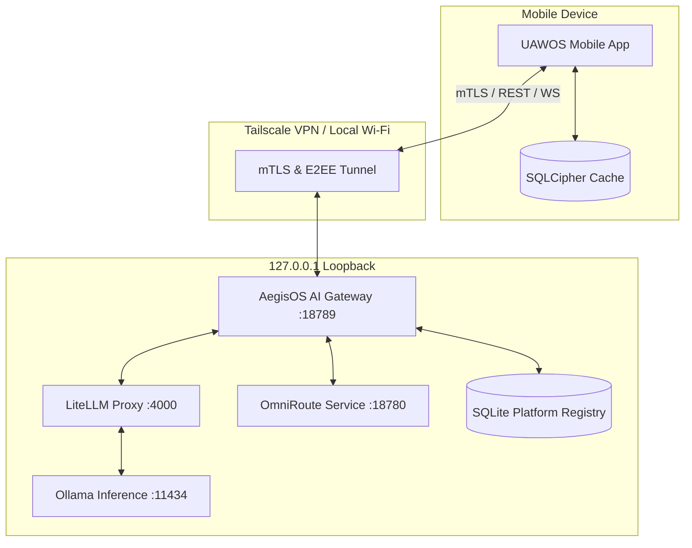
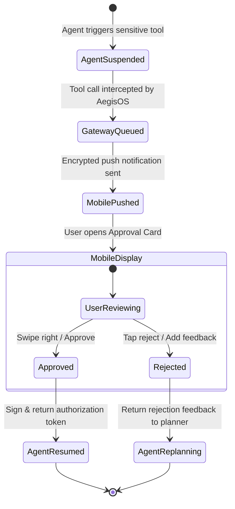

# UAWOS Mobile Command Center: Architecture Overview

This document details the System Integration, Client-Server Interaction Models, Human Approval Framework, Agent Interaction Model, and Observability architecture.

---

## 1. System Integration Topology

The mobile application acts as a secure, remote extension of the local UAWOS ecosystem.

---

## 2. Client-Server Interaction Models

To balance responsiveness, data usage, and battery consumption, UAWOS Mobile employs three communication protocols:

### A. Real-Time Telemetry: WebSocket (WS) / EventStream
*   **Use Case**: Live GPU VRAM metrics, queue latency graphs, and agent execution logs.
*   **Behavior**: When the dashboard is active in the foreground, a WebSocket connection is maintained. The host pushes metrics at a frequency of **5Hz** (or **10Hz** when connected to local Wi-Fi).

### B. Chat & Token Streaming: Server-Sent Events (SSE)
*   **Use Case**: Chat responses from Ollama/LiteLLM.
*   **Behavior**: SSE is used for unidirectional streaming of text tokens. This provides a lightweight connection that resumes cleanly if the cellular signal drops during text generation.

### C. System Commands & CRUD: REST (HTTPS / JSON)
*   **Use Case**: Model downloads, container restarts, setting modifications, and database lookups.
*   **Behavior**: Standard stateless REST API calls authenticated via client certificates.

---

## 3. Human Approval (HITL) Framework

The HITL system prevents agents from executing high-risk commands without direct mobile authorization.

### Authorization Signing
1.  **Workstation Handshake**: The workstation generates an approval payload containing the command hash, timestamp, and target resource.
2.  **Mobile Encryption**: The payload is signed with the user's private key stored inside the mobile Secure Enclave / KeyStore.
3.  **Validation**: AegisOS validates the cryptographic signature against the workstation's stored client certificate before executing the tool.

---

## 4. AI Agent Interaction Model

The mobile app interacts with agents through the **AegisOS Agent Protocol**:
*   **Agent Node Graph**: The app displays active agent runs as a dynamic node tree, highlighting which agent is executing, which node is active, and which tools are being utilized.
*   **Log Streaming**: Every step of the agent's chain-of-thought (reasoning, tool selection, observation, execution) is streamed to the mobile device.
*   **Manual Intervention (MINT)**: The operator can inject thoughts or prompts directly into the agent's memory stream mid-execution to redirect its reasoning path.

---

## 5. Observability & SRE Dashboard Hookups

UAWOS Mobile integrates directly with standard telemetry pipelines to verify cluster health:
*   **Prometheus Exporters**: Queries hardware statistics from NVIDIA System Management Interface (NVML) and Docker Engine daemon.
*   **LiteLLM Logs**: Logs latency per request, model fallback counts, cache hit percentages (Prompt Cache), and token cost calculations.
*   **OmniRoute Console**: Connects to the OmniRoute metrics collector to visually map routing paths and balance loads across auxiliary local machines.
