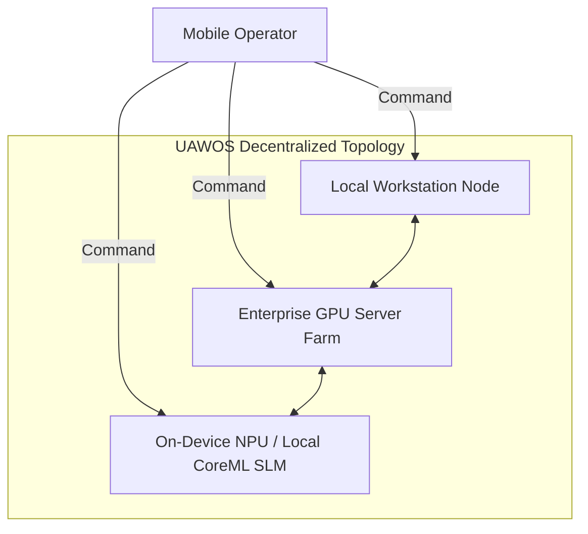

# UAWOS Mobile Command Center: Future Vision & Enterprise Expansion

This document outlines the Long-Term Strategic Direction, Enterprise Expansion capabilities, and the Decentralized Cognitive Mesh model for UAWOS Mobile.

---

## 1. Future Vision Overview

While the initial releases of UAWOS Mobile focus on personal command and control of a developer's workstation, the long-term vision positions the application as the coordinator for **Enterprise-Scale AI Clusters**. 

The app will transition from a *remote supervisor* into an *active edge node* that computes, orchestrates, and collaborates within a unified, decentralized mesh network:

---

## 2. Enterprise Expansion Roadmap

### A. Team Collaboration & Shared Agent Swarms
*   **Shared Workspaces**: Multiple users (e.g., a dev team) can monitor a shared pool of autonomous agents.
*   **Multi-Sig Approvals**: High-risk actions (such as pushing code to production or executing financial database migrations) will require cryptographic signatures from multiple designated team members via their mobile devices.
*   **Delegated Authority**: Managers can delegate specific approval rights to team members based on role-based access controls (RBAC).

### B. Enterprise Infrastructure Federation
*   **Multi-Region Cluster Dashboard**: SREs can switch between geographical data centers (US-East, EU-West, APAC) running thousands of LiteLLM proxies and Ollama servers.
*   **Auto-Scalers**: The mobile app will display alerts and allow trigger overrides when the orchestration layer requests dynamic spinning of auxiliary GPU nodes on AWS, GCP, or private clouds.
*   **SLA Compliance Auditing**: Real-time tracking of token response latencies, model uptime percentages, and resource cost metrics compiled into executive-level PDF reports.

---

## 3. On-Device Edge Compute (The Cognitive Mesh)

As mobile System-on-Chips (SoCs) include increasingly powerful Neural Processing Units (NPUs), UAWOS Mobile will shift processing weight to the edge:
*   **Federated RAG**: Small, private vector indexes reside entirely on the phone, syncing with the master knowledge base via differential updates.
*   **Direct Local Actions**: Simple tasks (email summaries, calendar sorting, notification pruning) run directly on-device using a 1B parameter model, completely avoiding network latency and host load.
*   **Federated Learning**: User corrections and feedback entered on the mobile screen will feed a secure, localized LoRA (Low-Rank Adaptation) training loop, letting the model specialize to the owner's habits without sending raw text to central servers.
