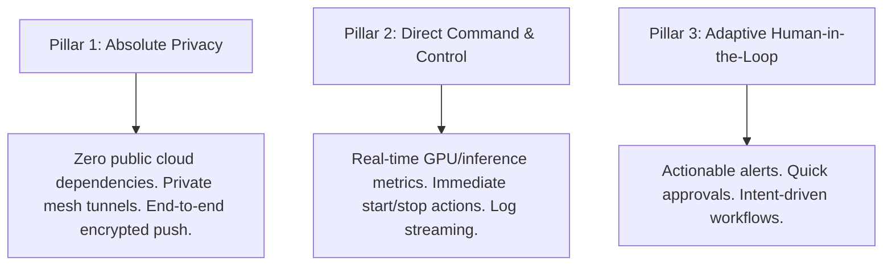

# UAWOS Mobile Command Center: Mission

This document outlines the core Mission Statement, Alignment Pillars, and Operational Commitments for the UAWOS Mobile Command Center.

---

## 1. Mission Statement

The mission of the **UAWOS Mobile Command Center** is:

> To deliver a secure, high-performance, and privacy-preserving mobile portal that enables operators to monitor, orchestrate, and collaborate with their local AI ecosystems from anywhere in the world.

We believe that the future of computing is local and agentic, but local systems must not be tethered to a physical desk. UAWOS Mobile bridges this gap by turning the smartphone or tablet into an authoritative control console for remote, private AI resources.

---

## 2. Core Pillars of Alignment

To achieve this mission, every design and engineering decision must align with the following three pillars:

### A. Absolute Privacy & Local-First Sovereignty
We respect the user's data sovereignty above all else. 
* We enforce local database encryption.
* We reject third-party telemetry that leaks prompts, model outputs, or file paths.
* We use cryptographically signed peer-to-peer networks to access host machines.

### B. Direct Command and Control (Not Just Chat)
We reject the notion that mobile AI is just a chat input box. 
* The mobile application provides direct administrative control over models (load, unload, pull, route).
* It exposes raw telemetry (VRAM usage, temperature, token throughput, routing latency).
* It gives operational visibility into active background agent swarms and database jobs.

### C. Adaptive Human-in-the-Loop (HITL) Interfacing
We believe autonomous agents require supervision to be safe and effective.
* The application translates complicated system execution states into simple, legible approval prompts.
* It ensures that sensitive operations (like code writing, file deletion, web browsing, database modification) are queued for explicit mobile authorization when configured.
