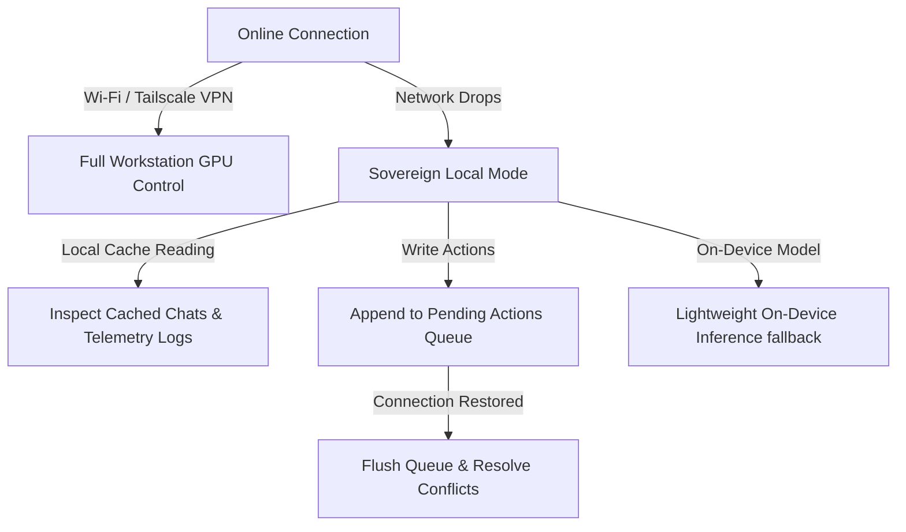

# UAWOS Mobile Command Center: Offline Strategy & Local Queueing

This document outlines the Offline Execution Strategy, local cache database structures, and queued command synchronization when disconnected.

---

## 1. Offline Philosophy

As a client-controller for a local AI ecosystem, UAWOS Mobile is designed to maintain operational capability even when disconnected from the primary workstation host. The app does not show a blank screen or a spinner when offline. Instead, it enters **Sovereign Local Mode**:



---

## 2. Capability Matrix: Online vs. Offline

| Capability | Online Mode | Offline Mode (Sovereign Local) |
|---|---|---|
| **Chat Assistant** | Query all workstation models (Ollama/LiteLLM). | Query on-device fallback model (e.g., Llama-1B) if compiled; otherwise read-only chat history. |
| **Telemetry Dashboard** | Live telemetry feed (5Hz WebSockets). | Displays static freeze-frame snapshot with timestamp of last successful sync. |
| **HITL Approvals** | Review and submit approvals instantly. | Queue approvals locally. The app blocks execution of the target task until online confirmation. |
| **Agent Controls** | Pause, resume, throttle, and kill agent tasks. | Queue action commands locally. Commands execute immediately upon host reconnection. |
| **Files & Documents** | Browse and edit workstation files. | Browse cached directory tree; editing writes file changes to the pending local sync queue. |

---

## 3. Local Cache Database Schema (SQLCipher)

The offline cache database structure manages conversation history, metrics snapshots, and queued commands:

```sql
-- Encrypted via SQLCipher AES-256
CREATE TABLE IF NOT EXISTS conversation_cache (
    session_id TEXT PRIMARY KEY,
    model_alias TEXT,
    system_prompt TEXT,
    last_message_timestamp INTEGER,
    messages_json TEXT -- Serialized list of prompt/response tokens
);

CREATE TABLE IF NOT EXISTS telemetry_snapshots (
    host_id TEXT PRIMARY KEY,
    timestamp INTEGER,
    gpu_metrics_json TEXT, -- GPU utilization, VRAM load, temperature
    service_status_json TEXT -- Docker container and service status
);

CREATE TABLE IF NOT EXISTS pending_actions_queue (
    action_id TEXT PRIMARY KEY,
    timestamp INTEGER,
    action_type TEXT, -- 'CHAT_PROMPT', 'APPROVE_TASK', 'REJECT_TASK', 'PAUSE_AGENT', 'EDIT_FILE'
    target_id TEXT, -- session_id, task_id, agent_id, or file_path
    payload_json TEXT, -- Arguments, message body, or diff modifications
    sync_status TEXT DEFAULT 'PENDING' -- 'PENDING', 'SYNCING', 'CONFLICT', 'COMPLETED'
);
```

---

## 4. Local Queueing & Execution Mechanism

When the client performs write actions while offline:
1.  **Queue Appending**: The app writes the operation to `pending_actions_queue` with a status of `'PENDING'` and updates the UI state immediately.
    *   *Example (Chat)*: Submitting a prompt inserts a chat bubble with a dotted border and a "Waiting to Sync" clock icon.
    *   *Example (Agent Pause)*: Pausing an agent changes the status indicator locally to "Pausing..." and queues the command.
2.  **Visual Indicators**: Active alerts inform the user: *"You are offline. Changes will sync once connection is restored."*

---

## 5. Reconnection & Synchronization Protocol

Upon network re-establishment:
1.  **Handshake**: The client validates connection integrity using the mTLS certificate.
2.  **Queue Flushing**: The app retrieves all `'PENDING'` items ordered chronologically.
3.  **Conflict Resolution**:
    *   *Chat prompts*: Appended sequentially. The host processes prompts and returns stream tokens.
    *   *Agent Pauses / Kills*: Executed immediately. If the agent already finished or crashed, the command is discarded, and the UI updates.
    *   *HITL Approvals*: Checked against the host's active queue. If the workstation already auto-resolved or expired the approval, the mobile app marks the queue item as resolved and updates the interface.
