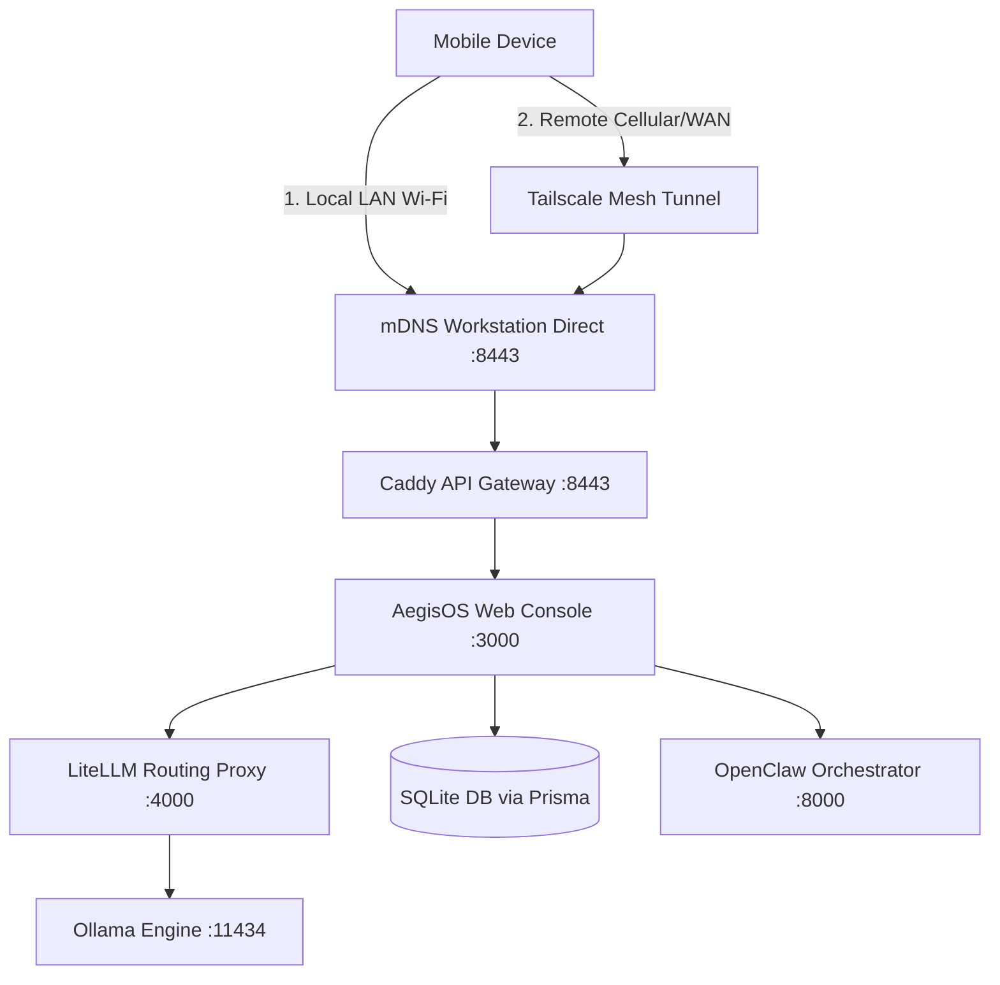

# AegisOS Mobile Command Center: Product Requirements Document (PRD)

* **Status**: Approved (Scope Reduction V1.0)
* **Target Version**: V1.0.0
* **Platform Support**: iOS (17+), Android (14+), iPadOS, Android Tablets, Foldables (Adaptive UI)
* **Author**: AegisOS Product & Architecture Team
* **Governing Directive**: `SCOPE_REDUCTION_DIRECTIVE_V1.md`

---

## 1. Introduction & Background

The **AegisOS Mobile Command Center** is a lightweight, secure thin-client that connects to an already-running AI infrastructure on a local workstation. The workstation runs **AegisOS** (Next.js server & API gateway), **LiteLLM** (multi-model routing), **Ollama** (local model execution), and custom databases (SQLite/PostgreSQL).

The mobile application does **not** duplicate any backend capabilities. It does not execute AI locally, perform orchestration, implement workflows, maintain memory, or run model routing. It is a remote command center that visualizes, controls, approves, monitors, uploads, and communicates.

---

## 2. In-Scope Modules

### 1. Executive Dashboard
**Purpose**: Display the current health of the connected AI infrastructure (read-only).

* Overall Health Score
* Running Services status
* GPU, CPU, RAM, Storage utilization
* Active Models and Active Agents count
* Running Jobs and Queue Status
* Critical Alerts summary
* Pending Approvals count

### 2. AI Executive Chat
**Purpose**: Conversational interface into the workstation.

* Every message is forwarded directly to the workstation
* Only stream responses back to the device
* No local memory, RAG, context, reasoning, or prompt engineering

### 3. Human Approval Center
**Purpose**: Display approval requests generated by the workstation.

* Approve, Reject, or Request Changes on pending items
* Biometric-gated cryptographic signatures for approvals
* No workflow logic exists on mobile

### 4. Infrastructure Monitoring
**Purpose**: Detailed operational telemetry from the workstation.

* GPU Usage, CPU Usage, RAM Usage, Disk Usage
* Active Models with VRAM allocation
* Active Agents with status
* Docker container status
* Ollama, LiteLLM, OpenClaw service health
* Queue Metrics and Error Logs
* All metrics originate from the workstation

### 5. Notifications
**Purpose**: Display notifications pushed from the workstation.

* Critical Infrastructure Alerts
* Completed Jobs
* Human Approval Requests
* Security Alerts
* Failures
* No notification generation occurs on mobile

### 6. Projects
**Purpose**: Display existing workstation projects.

* Selecting a project changes the active context
* No project indexing on mobile
* No local storage of project data

### 7. Upload Center
**Purpose**: Send files from the mobile device to the workstation.

* Support: Voice recordings, Images, PDFs, Documents, URLs
* Immediately upload to workstation
* Never process locally

### 8. Settings
**Purpose**: Device and connection configuration.

* Connected Workstations management
* QR Pairing
* Notification Preferences
* Theme (Dark/Light)
* Preferred Model selection
* VPN Status
* Settings are synchronized with the workstation

---

## 3. Out-of-Scope

All AI execution, orchestration, routing, reasoning, memory, RAG, workflows, prompt engineering, indexing, and automation remain on the workstation. See `SCOPE_REDUCTION_DIRECTIVE_V1.md` for the complete list of archived capabilities and `archive/ARCHIVE_MANIFEST.md` for the archived documentation.

---

## 4. High-Level Architecture & Connectivity

The mobile application establishes connection paths using the following hierarchy:

1.  **Local Connection**: The app automatically scans the local network via mDNS for the primary gateway node.
2.  **Remote Connection**: Handshake over the configured Tailscale/Wireguard VPN interface.
3.  **Authentication**: mTLS with custom client certificates generated during initial workstation pairing (QR Code scan), plus JWT-based session tokens.

---

## 5. Design Guidelines & Aesthetics

The application layout must feel extremely premium, combining density, readability, and modern aesthetics:
*   **Typography**: Clean sans-serif system fonts (Inter, SF Pro, Roboto) to maximize text density without sacrificing readability.
*   **Color Palette**: Sleek dark mode by default. Deep slate (#0B0F19), graphite (#1F2937), and obsidian (#030712) with electric indigo accents (#6366F1) for system telemetry and emerald (#10B981) for active statuses.
*   **Density & Layout**: High data density reminiscent of **Raycast** and **GitHub Mobile**. Minimal whitespace, borders of 1px, and clean visual separators.
*   **Telemetry**: Rich graphical telemetry mirroring the **Tesla Mobile App** (smooth battery-like bars for VRAM, circular gauges for GPU temperature, line graphs for request queue depth).
*   **Animations**: Smooth micro-interactions (e.g., subtle pulsing dot when an agent is running, springy toggle switches, and smooth drawer sweeps).

---

## 6. Multi-Platform & Adaptive Grid System

To support Android, iOS, tablets, and foldables, AegisOS Mobile implements an adaptive column-grid layout:

| Breakpoint | Width (dp) | Columns | Layout Architecture |
|---|---|---|---|
| **Compact (Phone)** | < 600 | 4 | Single-pane navigation. Bottom tabs, drawer menu for sub-features, detail pages push onto the stack. |
| **Medium (Foldable/Small Tablet)** | 600 - 840 | 8 | Split-pane navigation. Fixed left side navigation menu, primary content in center, secondary actions in sheet drawers. |
| **Expanded (Large Tablet/Desktop)** | > 840 | 12 | Multi-pane grid. Left navigation rail, center telemetry/chat pane, right-side inspector and metrics panel. |
