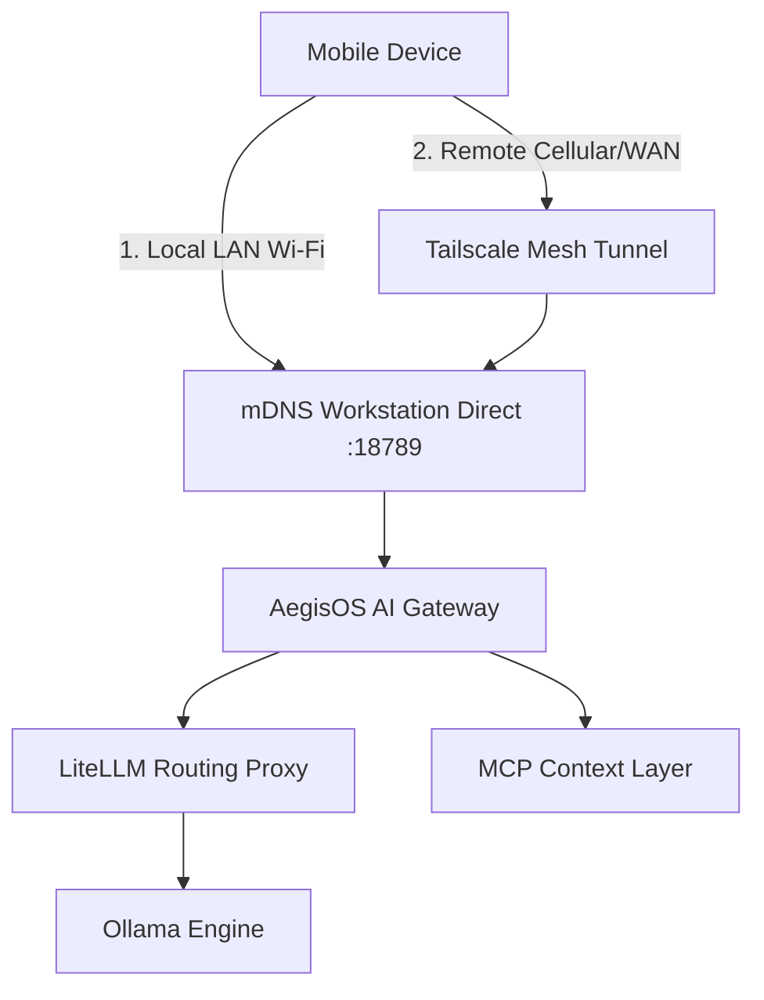

# UAWOS Mobile Command Center: Product Requirements Document (PRD)

* **Status**: Approved
* **Target Version**: V1.0.0
* **Platform Support**: iOS (17+), Android (14+), iPadOS, Android Tablets, Foldables (Adaptive UI)
* **Author**: UAWOS Elite Product & Architecture Team

---

## 1. Introduction & Background

The **UAWOS Mobile Command Center** is the definitive mobile interface for the Universal AI Work Operating System. Currently, the local AI ecosystem runs on local workstations utilizing **AegisOS** (agent gateway & MCP host), **LiteLLM** (multi-model routing), **Ollama** (local model execution), and custom databases (SQLite/PostgreSQL/MongoDB). 

While these services run securely on loopback interfaces, developers and administrators lack a unified, secure mobile interface to monitor these systems, interact with agents, and approve automated tasks when away from their physical workstation.

This PRD defines the requirements for a mobile client that connects securely (via Tailscale/Wireguard) to the local AI host, delivering real-time telemetry, conversational AI, agent orchestration, and human-in-the-loop task approvals.

---

## 2. In-Scope vs. Out-of-Scope

### In-Scope
*   **Secure Tunneling Connection**: VPN profile configuration and local LAN mDNS discovery.
*   **System Telemetry Dashboard**: Real-time monitoring of GPU, VRAM, RAM, temperature, request queues, and fallback logs.
*   **Conversational Assistant**: Chat client supporting streaming tokens, multi-model switching, and context-aware system prompting.
*   **Agent Control Room**: Orchestrating, pausing, and inspecting active background agent swarms and log streams.
*   **Human-in-the-Loop (HITL) Queue**: Interactive approval notifications for agent tool execution (e.g., executing code, accessing files).
*   **Encrypted Push Notifications**: Zero-knowledge push relay system for approvals and system events.
*   **Adaptive Design**: High-density layouts tailored to mobile, tablets, and foldables.

### Out-of-Scope
*   **Direct Local GPU Model Compilation**: Running heavy LLMs on the mobile GPU (except for a lightweight 1B model fallback). The primary engine is the remote local workstation.
*   **Public Cloud Hosting**: We do not provide a centralized SaaS hosting platform for UAWOS. The workspace remains self-hosted.

---

## 3. High-Level Architecture & Connectivity

The mobile application establishes connection paths using the following hierarchy:

1.  **Local Connection**: The app automatically scans the local network via mDNS for the primary UAWOS gateway node.
2.  **Remote Connection**: If the local gateway is unreachable, the app initiates a handshake over the configured Tailscale/Wireguard VPN interface.
3.  **Authentication**: Mutual TLS (mTLS) with custom client certificates generated during initial workstation pairing (QR Code scan).

---

## 4. Design Guidelines & Aesthetics

The application layout must feel extremely premium, combining density, readability, and modern aesthetics:
*   **Typography**: Clean sans-serif system fonts (Inter, SF Pro, Roboto) to maximize text density without sacrificing readability.
*   **Color Palette**: Sleek dark mode by default. Deep slate (#0B0F19), graphite (#1F2937), and obsidian (#030712) with electric indigo accents (#6366F1) for system telemetry and emerald (#10B981) for active statuses.
*   **Density & Layout**: High data density reminiscent of **Raycast** and **GitHub Mobile**. Minimal whitespace, borders of 1px, and clean visual separators.
*   **Telemetry**: Rich graphical telemetry mirroring the **Tesla Mobile App** (smooth battery-like bars for VRAM, circular gauges for GPU temperature, line graphs for request queue depth).
*   **Animations**: Smooth micro-interactions (e.g., subtle pulsing dot when an agent is running, springy toggle switches, and smooth drawer sweeps).

---

## 5. Multi-Platform & Adaptive Grid System

To support Android, iOS, tablets, and foldables, UAWOS Mobile implements an adaptive column-grid layout:

| Breakpoint | Width (dp) | Columns | Layout Architecture |
|---|---|---|---|
| **Compact (Phone)** | < 600 | 4 | Single-pane navigation. Bottom tabs, drawer menu for sub-features, detail pages push onto the stack. |
| **Medium (Foldable/Small Tablet)** | 600 - 840 | 8 | Split-pane navigation. Fixed left side navigation menu, primary content in center, secondary actions in sheet drawers. |
| **Expanded (Large Tablet/Desktop)** | > 840 | 12 | Multi-pane grid. Left navigation rail, center telemetry/chat pane, right-side agent execution inspector and metrics panel. |
