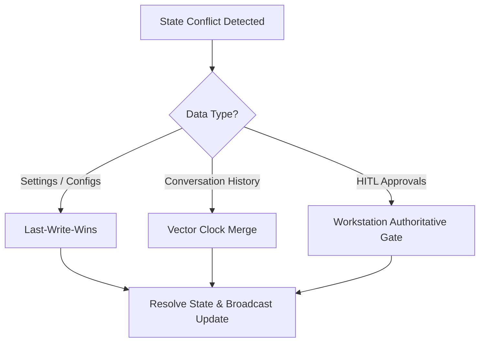

# UAWOS Mobile Command Center: Synchronization Strategy & Data Replication

This document details the Synchronization Protocols, Background Sync operations, Conflict Resolution strategies, and Bandwidth Optimization mechanisms for the UAWOS Mobile client.

---

## 1. Synchronization Framework

The synchronization engine manages state replication between the workstation host (SQLite/PostgreSQL database registry) and the mobile device client (SQLCipher local database):

```
┌────────────────────────────────────────────────────────────────────────┐
│                        DATA SYNC PROTOCOLS                             │
├───────────────────────────┬───────────────────────────┬────────────────┤
│ 1. WebSocket Replication  │ 2. Delta Synced REST      │ 3. Background  │
│ (Live metrics & logs)     │ (Chats, Logs, Knowledge)  │ (Scheduler)    │
└───────────────────────────┴───────────────────────────┴────────────────┘
```

---

## 2. Synchronization Protocols

### A. Real-Time State Replication (WebSocket)
For active, high-priority screens (Telemetry and active Agent logs):
*   **State Patching**: Instead of transmitting the entire system state, the host calculates JSON-diff patches and broadcasts them over the active WebSocket channel.
*   **Jitter Buffering**: The mobile client maintains a sliding ring-buffer of 100 frames to smooth out metric anomalies caused by network package jitter.

### B. Delta Synced REST (Chats, Logs, and Knowledge Catalogs)
For database records:
*   **Sync Anchor Timestamp**: The mobile client requests modifications made after its locally stored `last_synced_at` anchor timestamp.
*   **Delta Payloads**: The host returns only newly appended messages, modified configurations, or newly indexed files.

---

## 3. Background Sync & Scheduling

To keep the mobile client updated without draining device battery:
*   **Android WorkManager / iOS Background Tasks**: The app schedules background sync tasks executing at a default interval of **15 minutes** (or **60 minutes** on low battery).
*   **Execution Constraints**: Background sync only fires if:
    1.  The device is connected to a Wi-Fi network or active VPN mesh.
    2.  The device is charging or battery level is above 20%.
    3.  Data saver mode is disabled.
*   **Sync Execution Payload**: Checks for pending HITL approvals and high-severity system alerts, retrieving active log summaries using **Ponytail** summaries.

---

## 4. Conflict Resolution Strategies

When concurrent edits occur (e.g., modifying system prompts on the desktop web app and mobile app simultaneously), the app applies targeted resolution models:



### A. Last-Write-Wins (LWW)
*   *Application*: User settings, dashboard layouts, and model temperature sliders.
*   *Mechanism*: The record with the latest NTP-synchronized ISO timestamp overrides previous entries.

### B. Vector Clock Merge
*   *Application*: Chat conversation histories.
*   *Mechanism*: Every chat turn increments a version counter for the client and host. If a divergence is detected (e.g., offline chats on mobile while desktop chat was active), the system forks the thread or merges messages in chronological order, prompting the user if a fork occurs.

### C. Server-Authoritative Gate
*   *Application*: Human-in-the-Loop approval requests.
*   *Mechanism*: The workstation host is the ultimate authority. If a mobile device attempts to approve an action that the host has already canceled or auto-rejected, the mobile approval is declined, and the client state is synchronized to match the host status.

---

## 5. Bandwidth & Token Optimization (Ponytail/Headroom integration)

Before syncing database logs or conversational files, the workstation host applies **Ponytail** summarization and **Headroom** prompt compression to reduce payload size:
*   **Log Compaction**: Telemetry log streams are summarized by Ponytail, compressing thousands of lines of terminal output into a single key-value report before mobile transmission.
*   **Context Pruning**: The host trims historical chat sequences, syncing only active context buffers rather than the entire conversational tree, saving VRAM and data transfer costs.
