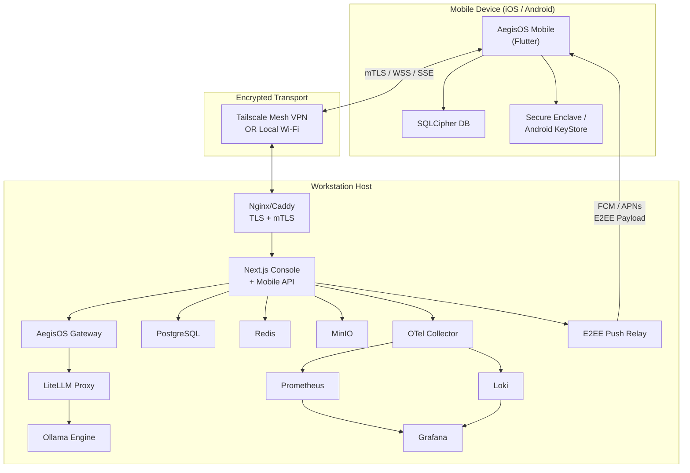

# §1 — Executive Architecture

> **Document**: AegisOS Mobile — Executive Architecture Blueprint
> **Status**: DRAFT — Requires Architecture Review Board Approval
> **Version**: 1.0.0
> **Last Updated**: 2026-07-13

---

## 1.1 System Context (C4 Level 1)

AegisOS Mobile is a secure companion application for the AegisOS local-first AI Workstation platform. It connects to one or more AegisOS workstation hosts over encrypted tunnels, providing real-time telemetry, conversational AI, agent orchestration, and human-in-the-loop approvals.

```
┌──────────────────────────────────────────────────────────────────────────┐
│                        EXTERNAL ACTORS                                    │
│  ┌──────────┐  ┌──────────┐  ┌───────────┐  ┌──────────────────────┐    │
│  │ Operator  │  │ Admin    │  │ Developer │  │ Enterprise IdP       │    │
│  │ (Mobile)  │  │ (Web)    │  │ (IDE)     │  │ (OIDC / SAML)        │    │
│  └─────┬────┘  └─────┬────┘  └─────┬─────┘  └──────────┬───────────┘    │
│        │              │             │                    │                │
└────────┼──────────────┼─────────────┼────────────────────┼───────────────┘
         │              │             │                    │
    ┌────▼──────────────▼─────────────▼────────────────────▼────────────┐
    │                  AEGIS GATEWAY LAYER                               │
    │  ┌────────────────────────────────────────────────────────────┐   │
    │  │  Nginx/Caddy TLS Termination (443)                         │   │
    │  │  ├── Rate Limiting (IP-based + Token-bucket)               │   │
    │  │  ├── mTLS Client Certificate Verification (Mobile)         │   │
    │  │  └── CORS / HSTS / CSP Policy Enforcement                 │   │
    │  └───────────────────────┬────────────────────────────────────┘   │
    │                          │                                        │
    │  ┌───────────────────────▼────────────────────────────────────┐   │
    │  │  API Gateway (Next.js Console + Mobile API Surface)        │   │
    │  │  ├── /api/v1/...       Web Console Endpoints               │   │
    │  │  ├── /api/v2/mobile/...Mobile-Optimized Endpoints          │   │
    │  │  ├── /ws/telemetry     WebSocket Telemetry Stream          │   │
    │  │  ├── /ws/agents        WebSocket Agent Log Stream          │   │
    │  │  ├── /sse/chat         Server-Sent Events Chat Stream      │   │
    │  │  └── /api/v2/sync      Delta Synchronization Endpoint      │   │
    │  └───────────────────────┬────────────────────────────────────┘   │
    │                          │                                        │
    ├──────────────────────────┼────────────────────────────────────────┤
    │              SERVICE LAYER                                        │
    │  ┌──────────┐ ┌──────────┐ ┌───────────┐ ┌────────────────────┐  │
    │  │Auth      │ │Sync      │ │Notification│ │HITL Approval      │  │
    │  │Service   │ │Engine    │ │Service     │ │Queue              │  │
    │  └──────────┘ └──────────┘ └───────────┘ └────────────────────┘  │
    │  ┌──────────┐ ┌──────────┐ ┌───────────┐ ┌────────────────────┐  │
    │  │Agent     │ │Model     │ │Knowledge  │ │Workflow            │  │
    │  │Runtime   │ │Registry  │ │Index      │ │Orchestrator        │  │
    │  └──────────┘ └──────────┘ └───────────┘ └────────────────────┘  │
    │                                                                   │
    ├───────────────────────────────────────────────────────────────────┤
    │              AI GATEWAY LAYER                                      │
    │  ┌────────────────────────────────────────────────────────────┐   │
    │  │  AegisOS AI Gateway (:18789)                              │   │
    │  │  ├── Prompt Enrichment (MCP Context Injection)             │   │
    │  │  ├── AI Safety (Prompt Injection Detection, PII Masking)   │   │
    │  │  ├── Tool Execution Sandbox                                │   │
    │  │  └── Agent Protocol Handler                                │   │
    │  └───────────────────────┬────────────────────────────────────┘   │
    │  ┌───────────────────────▼────────────────────────────────────┐   │
    │  │  LiteLLM Routing Proxy (:4000)                             │   │
    │  │  ├── Least-Busy Load Balancer                              │   │
    │  │  ├── Model Fallback Chain                                  │   │
    │  │  └── Token Usage Metering                                  │   │
    │  └───────────────────────┬────────────────────────────────────┘   │
    │  ┌───────────────────────▼────────────────────────────────────┐   │
    │  │  Ollama Inference Engine (:11434)                          │   │
    │  │  ├── GGUF Model Registry                                   │   │
    │  │  ├── VRAM Memory Allocator                                 │   │
    │  │  └── CUDA Kernel Dispatcher → NVIDIA GPU                   │   │
    │  └────────────────────────────────────────────────────────────┘   │
    │                                                                   │
    ├───────────────────────────────────────────────────────────────────┤
    │              INFRASTRUCTURE SERVICES                              │
    │  ┌──────────┐ ┌──────────┐ ┌───────────┐ ┌────────────────────┐  │
    │  │PostgreSQL│ │Redis     │ │MinIO      │ │Event Bus           │  │
    │  │(Data)    │ │(Cache/Q) │ │(Objects)  │ │(Pub/Sub)           │  │
    │  └──────────┘ └──────────┘ └───────────┘ └────────────────────┘  │
    │  ┌──────────┐ ┌──────────┐ ┌───────────┐                        │
    │  │Job Queue │ │MCP Host  │ │Push Relay │                        │
    │  │(Workers) │ │(Context) │ │(E2EE)     │                        │
    │  └──────────┘ └──────────┘ └───────────┘                        │
    │                                                                   │
    ├───────────────────────────────────────────────────────────────────┤
    │              OBSERVABILITY LAYER                                   │
    │  ┌──────────┐ ┌──────────┐ ┌───────────┐ ┌────────────────────┐  │
    │  │Prometheus│ │Loki      │ │Jaeger     │ │Grafana             │  │
    │  │(Metrics) │ │(Logs)    │ │(Traces)   │ │(Dashboards)        │  │
    │  └──────────┘ └──────────┘ └───────────┘ └────────────────────┘  │
    │  ┌──────────────────────────────────────────────────────────┐     │
    │  │  OpenTelemetry Collector (gRPC :4317 / HTTP :4318)       │     │
    │  └──────────────────────────────────────────────────────────┘     │
    └───────────────────────────────────────────────────────────────────┘

    ┌───────────────────────────────────────────────────────────────────┐
    │              MOBILE DEVICE LAYER                                   │
    │  ┌────────────────────────────────────────────────────────────┐   │
    │  │  AegisOS Mobile Application (Flutter)                      │   │
    │  │  ├── Presentation Layer (Adaptive UI)                      │   │
    │  │  ├── Application Layer (Use Cases)                         │   │
    │  │  ├── Domain Layer (Entities, Value Objects)                │   │
    │  │  ├── Infrastructure Layer (API, DB, Storage)               │   │
    │  │  └── Platform Layer (iOS/Android Native Bridges)           │   │
    │  └───────────────────────┬────────────────────────────────────┘   │
    │  ┌───────────────────────▼────────────────────────────────────┐   │
    │  │  On-Device Services                                        │   │
    │  │  ├── SQLCipher Encrypted Database                          │   │
    │  │  ├── Secure Enclave / KeyStore (Crypto Keys)               │   │
    │  │  ├── Biometric Authentication (FaceID/Fingerprint)         │   │
    │  │  ├── Background Workers (WorkManager/BGTaskScheduler)      │   │
    │  │  └── Optional On-Device SLM (Llama-1B via CoreML/NNAPI)   │   │
    │  └────────────────────────────────────────────────────────────┘   │
    └───────────────────────────────────────────────────────────────────┘
```

---

## 1.2 Communication Flow Matrix

| Source | Target | Protocol | Channel | Authentication | Purpose |
|--------|--------|----------|---------|----------------|---------|
| Mobile | Gateway | HTTPS | REST | mTLS + JWT | CRUD operations, commands |
| Mobile | Gateway | WSS | WebSocket | mTLS + JWT | Live telemetry, agent logs |
| Mobile | Gateway | HTTPS | SSE | mTLS + JWT | Chat token streaming |
| Mobile | Gateway | HTTPS | REST | mTLS + JWT | Delta sync (pull) |
| Gateway | Mobile | FCM/APNs | Push | E2EE payload | Alerts, HITL approvals |
| Gateway | AegisOS | HTTP | REST | Internal bearer | Prompt forwarding |
| AegisOS | LiteLLM | HTTP | REST | Internal bearer | Model routing |
| LiteLLM | Ollama | HTTP | REST | Internal network | Inference execution |
| Console | PostgreSQL | TCP | Prisma | Connection string | Data persistence |
| Console | Redis | TCP | ioredis | Password auth | Caching, pub/sub |

---

## 1.3 Network Security Zones

```
Zone 0: Public Internet
  │
  ├── Tailscale Mesh VPN (Wireguard, E2EE)
  │   └── OR: Local Wi-Fi (mDNS discovery)
  │
Zone 1: TLS Termination (Nginx/Caddy :443)
  │   ├── mTLS client certificate verification
  │   ├── Rate limiting (150 req/60s per IP)
  │   └── HSTS, CSP, CORS enforcement
  │
Zone 2: Application Layer (Console :3000)
  │   ├── JWT validation + session DB check
  │   ├── RBAC permission enforcement
  │   ├── Input validation (Zod schemas)
  │   └── CSRF protection (Origin/Referer)
  │
Zone 3: AI Services (AegisOS :18789, LiteLLM :4000, Ollama :11434)
  │   ├── Prompt injection detection
  │   ├── PII masking
  │   └── Internal network only
  │
Zone 4: Data Layer (PostgreSQL :5432, Redis :6379, MinIO :9000)
  │   ├── Encrypted at rest (AES-256-GCM)
  │   ├── Internal network only
  │   └── Authentication required
  │
Zone 5: Mobile Device
      ├── SQLCipher (AES-256-GCM)
      ├── Secure Enclave / KeyStore
      ├── Biometric gate
      └── Memory purging on background
```

---

## 1.4 Deployment Topology



---

## 1.5 Key Architecture Decisions (Summary)

| Decision | Choice | Rationale |
|----------|--------|-----------|
| Mobile Framework | Flutter | Single codebase, native performance, Secure Enclave access, strong ecosystem |
| Transport Security | mTLS + Tailscale | Zero-port-exposure, E2EE, peer-to-peer mesh |
| Local Database | SQLCipher (via Drift ORM) | AES-256 encryption at rest, strong Flutter bindings |
| State Management | Riverpod | Compile-time safety, testable, scalable |
| Push Notifications | E2EE via custom relay | Zero-knowledge relay preserves privacy |
| Sync Strategy | Delta sync + WebSocket | Bandwidth-efficient, real-time capable |
| Authentication | mTLS + JWT + Biometric | Defense in depth, hardware-backed keys |

> Each decision is justified with full rationale, alternatives, and trade-offs in the corresponding architecture section.
